### :globe_with_meridians: Choose Language (Translated by google)

-----
# How to install, wiring and debug the 3d touch
## Install the Bltouch to the print head of the 3d printer
Install the Bltouch module on the hotend housing, we make a print stl file, please print it and then install the Bltouch on the hotend.  
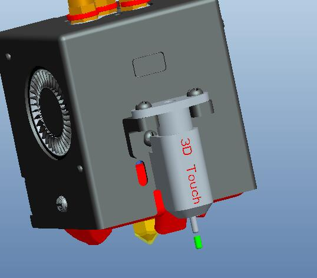    
:arrow_down:[Download stl file](./BLtouch_Bracket.zip)    
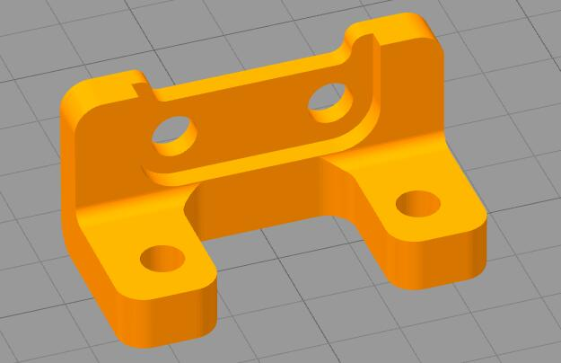    
Check the installation position of BLtouch, let its probe is lower than nozzle when it is deploy, and its probe is higher than nozzle when it is stow. 
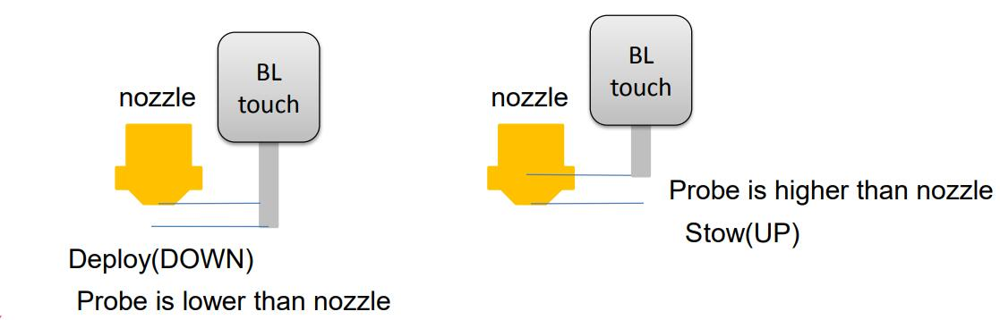    

## Wiring
### 1. Pin define of 3DTouch / BLTouch
|  Bltouch wire color | 3D touch wire color | 3D touchh(V3.1) wire color |   Signal name              |
|:-------------------:|:-------------------:|:--------------------------:|:--------------------------:|
|       Brown         |     Green           |    Brown                   |   GND                      |
|       Red           |     Red             |    Red                     |   +5V                      |
|       Yellow        |     Yellow          |    Yellow                  |   Drive (SERVO)            |
|       White         |     White           |    White                   |   Sensor                   |
|       Black         |     Black           |    Black                   |   GND                      |

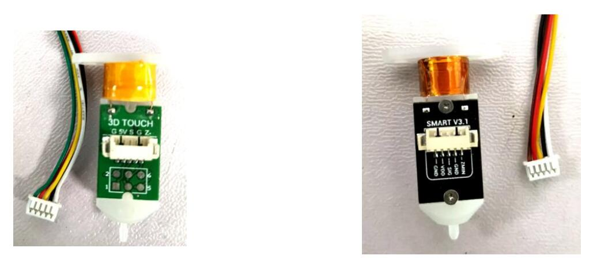   

### Wiring for ZRIB control board
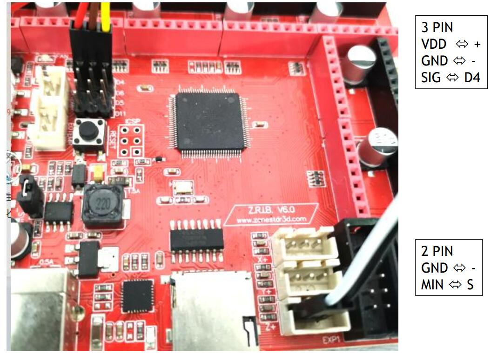   
### Wiring for ZM3E4 control board
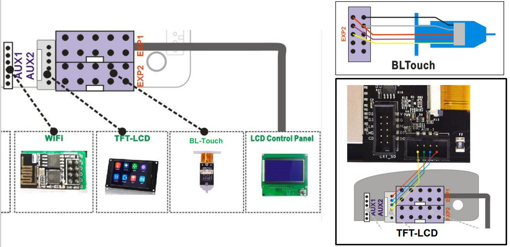      
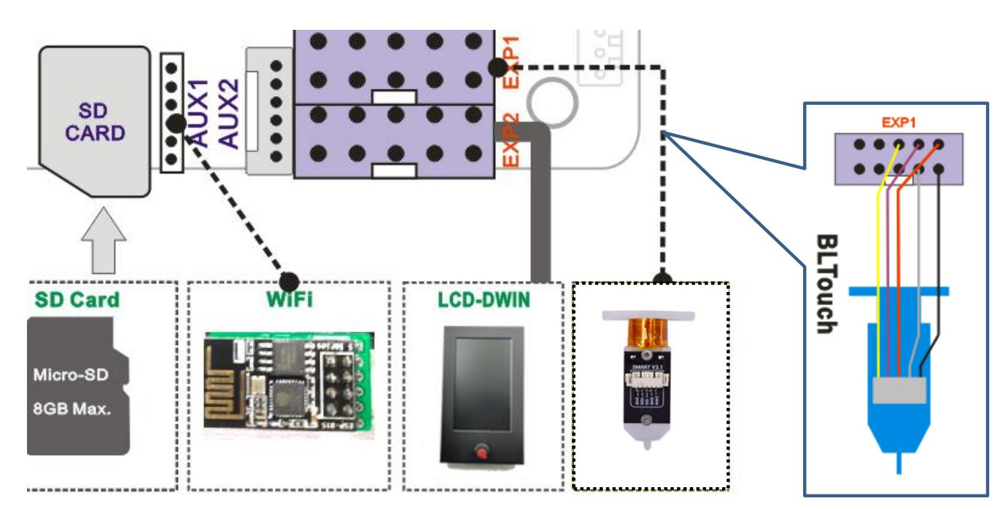      
### Wiring for ZM3E2 control board
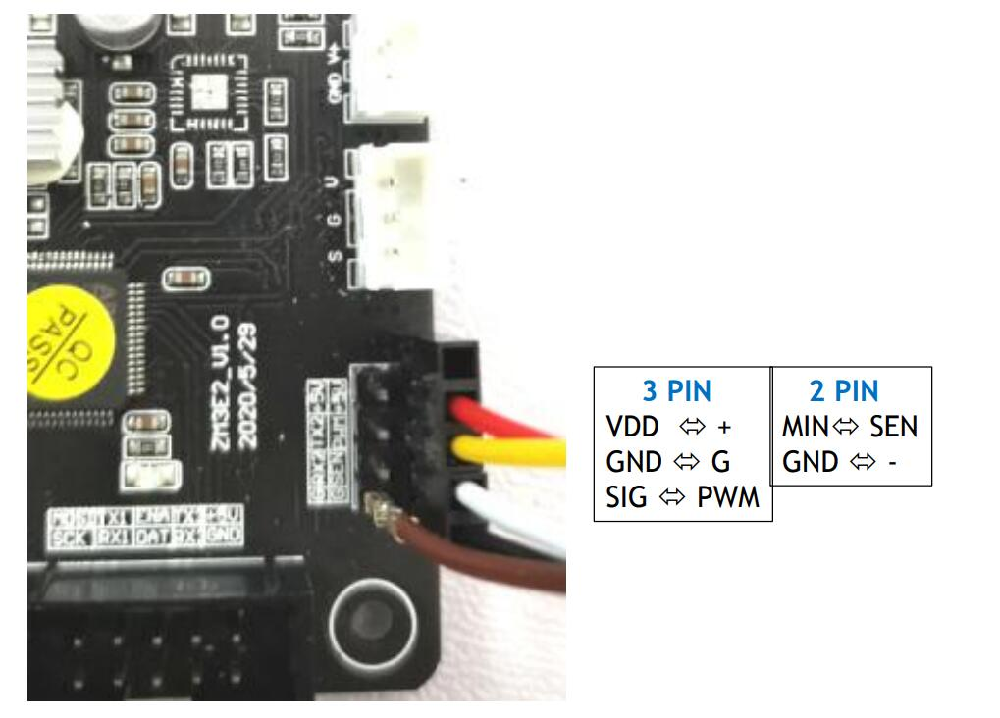  

## Verify installation and wiring
### For LCD12864 screen
1. Power on the printer, and watch the LED on the Bltouch, LED will light if wires is 
connected well and Power on. Red LED will light if the probe is triggered.
2. Operate the control panel, ***Configuration>>Bltouch>>Reset***.
3. Operate the control panel, ***Configuration >>Bltouch>>Self-test***, Probe will deploy and stow automatically, you can check if the installation height.
4. Operate the control panel, ***Configuration >>Bltouch>>Reset***.
5. Operate the control panel, ***Configuration >>Bltouch>>Deploy***, the probe will move up.
6. Operate the control panel, ***Configuration >>Bltouch>>Stow***, the probe will move down.
### For LCD-DWIN screen
1. Power on the printer, and watch the LED on the Bltouch, LED will light if wires is 
connected well and Power on. Red LED will light if the probe is triggered.
2. Operate the control panel, ***Control >>Bltouch>>Reset***.
3. Operate the control panel, ***Control >>Bltouch>>Self-test***, Bltouch will deploy and stow automatically, you can check if the installation height.
4. Operate the control panel, ***Control >>Bltouch>>Reset***.
5. Operate the control panel, ***Control >>Bltouch>>Deploy***, the probe will move up;
6. Operate the control panel,*** Control >>Bltouch>>Stow***, the probe will move down.

## Measuring the flatness error data of the hot bed
After installed the 3DTouch/BLTouch and completed the wiring, you need to do some steps to measure the flatness error data of the hot bed.
### 1. Level corners.
If leveling nuts and springs are installed between your printing platform and the bed bracket, you need to manually level the four corners of the hot bed to a basically same height. Please refer to the instructions for the 3D printer for the specific process.
### 2. Catch Prob Z offset
Since the installation position of the 3DTouch/Bltouch on the print head for each machine cannot be completely consistent, we need to first obtain a height deviation between the bottom of the nozzle and the bottom of the leveling probe, also known as the **Probe Z Offset**.    
:warning:NOTE: Due to the deformation of the hot bed under heating and unheated conditions, we suggest heating the hot bed to about 60 ° for this test.    
- **For LCD12864 screen**
  1. Do ***Montion>> Bed Leveling>> Auto HOME***
  2. Do ***Montion>> Bed Leveling>> Catch Z Offset***
  3. Wait for the end of the test to see the Z offset value. Do Montion>> Bed Leveling>> Probe Z Offset.
  4. Do ***Montion>> Bed Leveling>> Store Settings***, Save the Z offset value.
  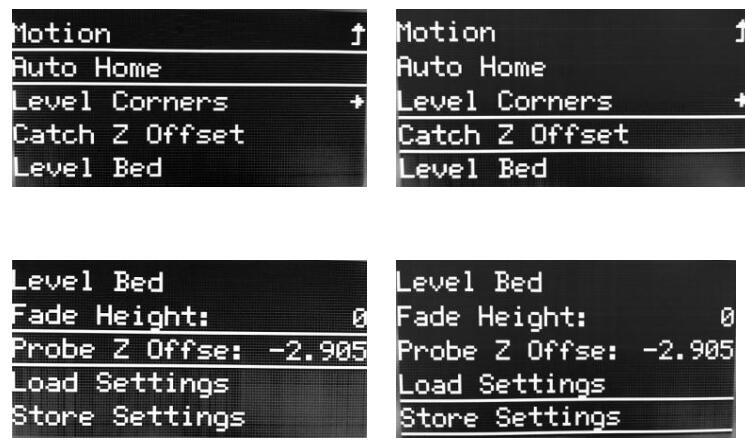  
- **For LCD-DWIN screen** 
  1. Set the HOME Z OFFSET to 0. Do ***Control>>Configure>>HOME Z Offset: 0.0*** and then  Do ***Control>>Store settings***.   
  2. Do ***Control>> Configure>> Auto Leveling(From OFF to ON)*** to turn on “Auto leveling” menu
  3. Do ***Prepare>> Bed Leveling>>Catch Z-Offset***
  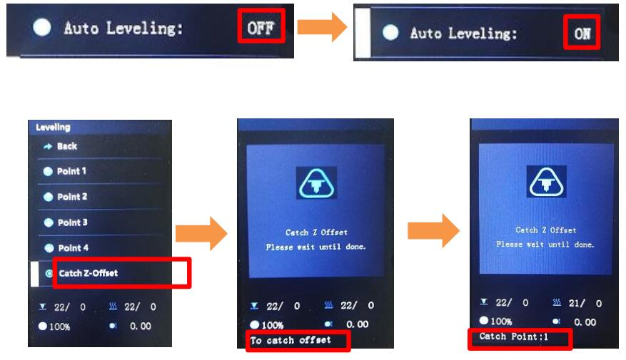  
### 3. Do leveling measure
Next, you need to run a hot bed height deviation measurement, and the measured deviation value will be saved in the machine's memory. When printing, the machine will perform height correction according to this deviation value.
- **For LCD12864 screen**     
  1. Do ***Montion>> Bed Leveling>> Auto HOME***
  2. Do ***Montion>> Bed Leveling>> Level Bed***
  3. Wait for the end of the test.Operate Auto Home again, the auto leveling will change from off to on. It indicates that the automatic leveling feature is actived.
  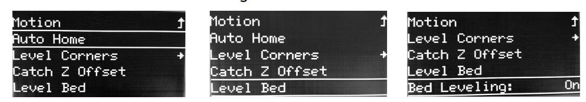  
- **For LCD-DWIN screen**     
  Do ***Prepare>> Bed Leveling>>Auto Leveling***    
  After measure done, the state of Auto leveling on Leveling menu will change from *Unactived* to *Actived*.     
  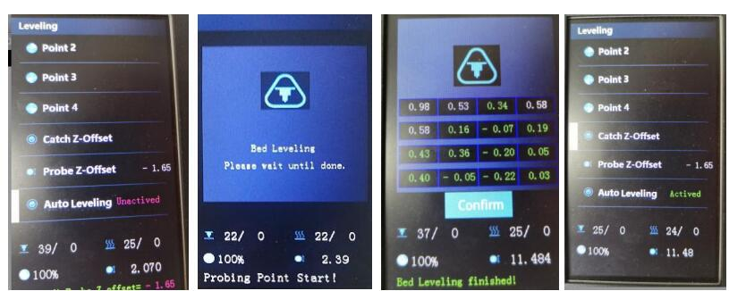  
### 4. Check the measuing data
During the measurement process, you can check the measured data and determine whether the deviation is too large to correct the hot bed, or there may be other issues.   
  NOTE: 
  1. The measurement result should be between -1.0 to 1.0 mm. If it exceeds, it is recommended that you try to fine tune the printer or improve the flatness of the 
    hotbed, because it may affect the printing quality.
  2. If you found that there is a large deviation in data arrangement between the Left/Right sides or the Front/Back sides, please adjust the bottom screw of the hotbed (when 
    the data is + turn down the hotbed, when the data is - turn up the hotbed).
  - **For LCD12864 screen**, the measuring data will show on the bottom of screen when probing.
  - **For LCD-DWIN screen**, the measuring data will show on the LCD screen when probing.
  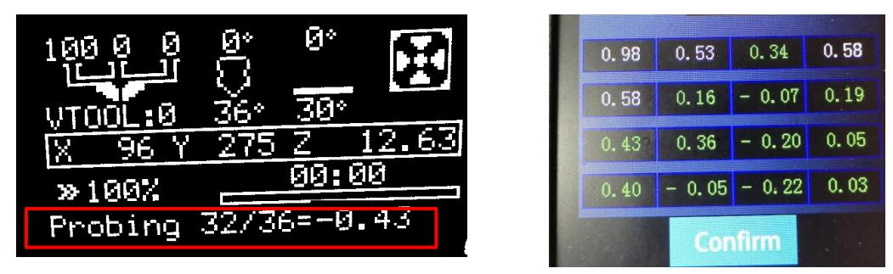  

## Apply bed auto leveling feature
Auto leveling feature will be disable automatically when the printer reset, you can turn it on manually or let it do automatically every time when printing from SD card.
### Active auto leveling feature by manually
- **For LCD12864 screen**
  1. Do ***Motion>> Bed Leveling>> Level Bed >>Auto Home***
  2. Do ***Motion>> Bed Leveling>> Level Bed >>bed leveling: OFF*** Change to ***ON***.
- **For LCD-DWIN screen**
  1. Do ***Prepare>> HOME>> Home All***
  2. Do ***Control>> Configure>> Active Autolevel: OFF*** Change to ***ON***
After do these 2 steps, the printer will apply stored leveling correction parameters in the last "bed leveling".
:warning: **Note: if you adjusted the bed screws or probe, you need to do "Measuring the flatness error data of the hot bed" again before activing auto leveling feature by manually**.
### :+1: Active bed auto leveling each printing from SD card.
It is recommended to add an automatic leveling measurement to the "start gcode" code of slicing software, so that a flatness measurement is performed before each printing.   
To add a G29 command following G28 command in the "start gcode" of slicing software.   
  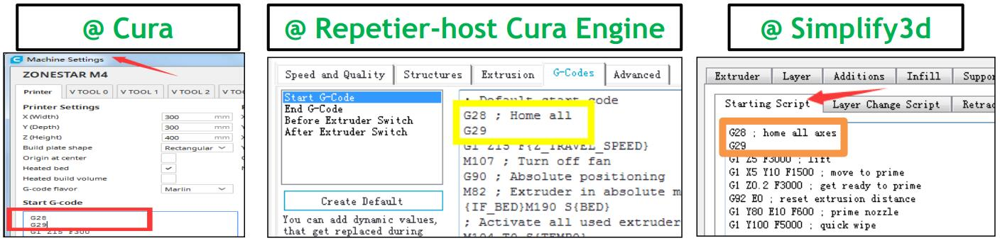  

## Appendix
### What is “Probe Z offset ”and “HOME Z offset”
**“probe Z offset”:** it means the distance from the nozzle to the the sensing plane while the probe is triggered. 
**“Catch Z Offset”** function will get an average of **“probe Z offset”** automatically. We MUST manual level the bed before doing **“Catch Z Offset”**, otherwise the printer can’t get **“probe Z offset”** correctly.
### How to correct “Probe Z offset ” and “HOME Z offset”
For various reasons, the settings of **“home Z offset”** and **“probe Z offset”** may not be accurate, so you can manually adjust them to be more accurate.
1. When doing **bed leveling > > auto leveling**:
- if most of the obtained data showed in the table are shifted to the Positive, you can decrease the **“Probe Z offset”** and do **"auto leveling/level bed"** again. 
- if most of the obtained data showed in the table are shifted to the Negative, you can increase the **“probe Z offset”** and do **"auto leveling/level bed"** again.
PS: Ignore the datas at the 4 corners, it will be optimized in the firmware.
2. If you find that the nozzle is too close/far away from the printing plane when printing the first layer, you can incease / decrease **home Z offset** then print it again.

