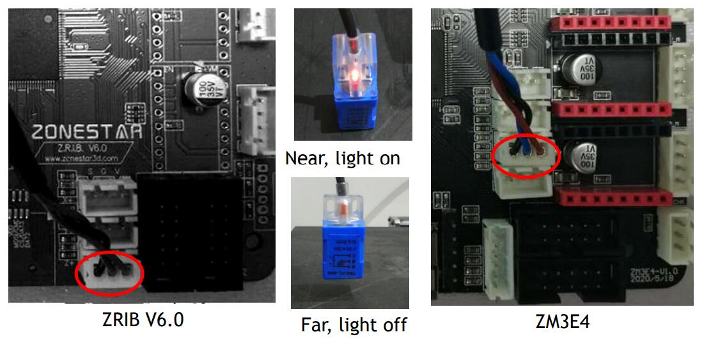
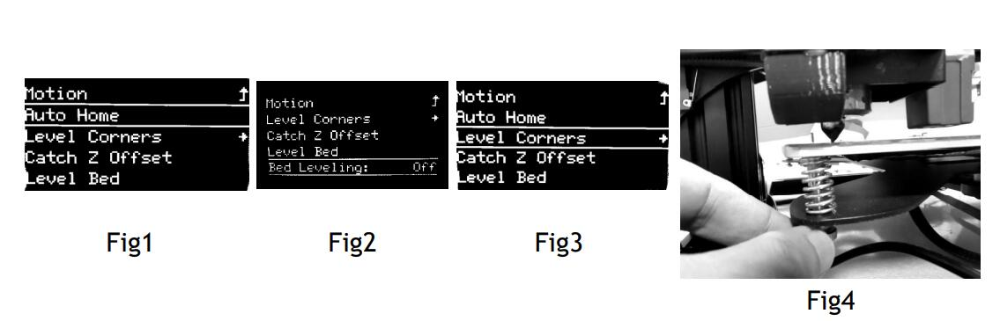
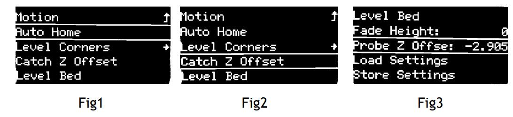
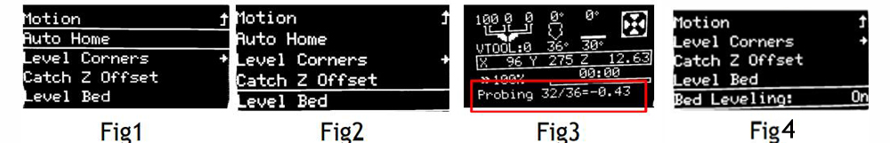
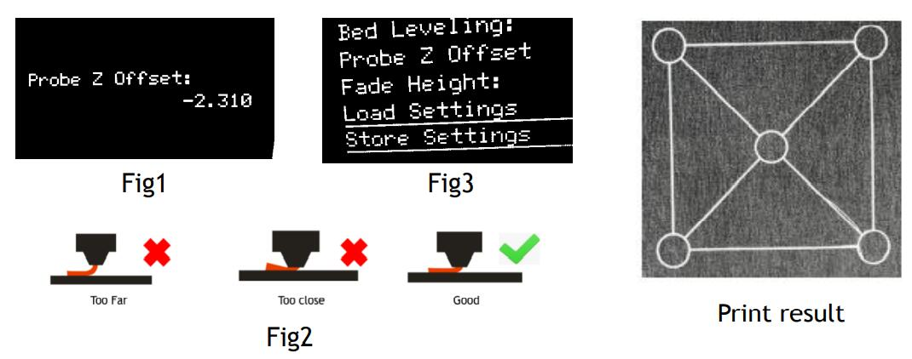
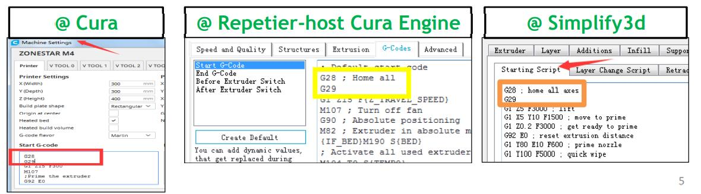

### :globe_with_meridians: Choose Language (Translated by google)

    

-----
## Bed Auto Leveling Feature Use and Debug Guide for PL-08N bed leveling sensor
### Wiring
1. Connect the PL-08N to the Z+(ZRIBV6) or Z1+(ZM3E4) connector on the control board.   
2. Power on the 3d printer (or control board).
3. The LED of PL-08N should light up When it is closed to the hot bed, the LED should turn off when it is far away from the hotbed.

### Install
1. Move HOTEND to the middle of hot bed and adjust height of HOTEND or print platform, let the nozzle almost touched hot bed.   
2. Install the Proximity sensor on the HOTEND. The bottom of the sensor should be approximately 2-4 mm above the nozzle.
   
:warning: The sensing distance of PL-08N to aluminum plate is about 3 ~ 5mm, and to stainless steel is 5 ~ 8mm. If you use a PEI stainless steel hot bed film, please raise the installation position to 4 ~ 6mm from the bottom of the nozzle.

----
**[:arrow_down:Download Video Tutorial]()**    
### Level Corners
**[:movie_camera: Auto Home](./video/AutoHome.gif)**    
**[:movie_camera: Level Corners](./video/Level_conrers.gif)**   
:loudspeaker: The automatic bed leveling function is used to correct the relative offset of different positions on the hot bed at the Z-axis height, not the absolute value. Before executing Bed Auto Leveling, you must perform **Level Corners** to make the machine obtain a correct absolute value of the starting point of Z axis (it is so called **Z axis absolute zero point** of the machine). Steps as below:    
1. Make sure the hotbed and nozzle are cool, clean the filament on the nozzle.
2. Turn on the 3d printer.
3. See ***Montion>> Bed Leveling>> Bed Leveling: OFF***, if it is **ON**, set to **OFF**.
4. Do ***Montion>> Bed Leveling>> Auto HOME*** on LCD screen. 
5. Do ***Montion>> Bed Leveling>> Level Corners(Fig3)*** on LCD screen. 
6. Adjust the screws under the hotend, let the nozzle almost to touch the hot bed(Fig4).
7. Following the wizard shown on LCD screen to adjust all the screws in the 4 corners of bed.
8. Perform at least 2 cycles to confirm that the screws at the bottom of the hot bed have been adjusted.
      
  
### Catch Probe Z offset
**[:movie_camera: Catch Probe Z offset](./video/CatchOffset.gif)**    
**"Probe Z Offset"** indicates that when the sensor sensed the hot bed, the distance between the nozzle and the Z axis absolute zero point.      
If the sensor is installed correctly, the nozzle is always above the hot bed when the sensor sensed the hot bed, so **Probe Z Offset** is always a negative value. Since the sensing distance of each PL-08N sensor is different, and the actual installation height of PL-08N is also different, the **Probe Z Offset** of each machine is different too.     
You need to do ***Catch Z offset*** to get the **Probe Z Offset** before doing bed auto leveling. Steps as below: 
1. Do ***Montion>> Bed Leveling>> Auto HOME(Fig1).***
2. Do ***Montion>> Bed Leveling>> Catch Z Offset(Fig2).***
3. Wait the catching done, and then check the Z Probe offset on menu ***Montion>> Bed Leveling>> Probe Z Offset(Fig3).***
     
:warning: The Probe Z offset value of your machine may be different from the above picture.      

### Level Bed
**[:movie_camera: Level Bed](./video/bed_level.gif)**    
After completing the above steps, we have a reliable sensor to measure the hotbed surface and already set all its parameters. Now we need the machine to make a comprehensive measurement of the surface of the hot bed, so as to get a data sheet of the hot bed height on the surface.   
Do the below steps: 
1. Do ***Montion>> Bed Leveling>> Auto HOME(Fig1)***
2. Do ***Montion>> Bed Leveling>> Level Bed(Fig2)***
3. Wait for the end of the measure(Fig3). 
4. Do ***Montion>> Bed Leveling>> Auto HOME(Fig1)*** the auto leveling will change from "off" to "on". It indicates that the automatic leveling feature is working(Fig4).
     

### Verification
**[:movie_camera: Verification](./video/Printing_test.gif)**       
Now you can try to print a test file to verfiy the bed auto leveling result. Steps as below:   
1. Copy **[level_test_310.gcode :arrow_down:](./level_test_310.zip)** to SD card and print it from SD card.
2. When printing started, double click (click twice in one second) the knob to open Probe Z offset menu (fig1).
3. Rotate the knob and watch the nozzle, let the nozzle is higher than the hotbed about 0.3mm (fig2).
4. Do on the MENU>>Configuration>>Store settings (fig3)
     

### Apply bed auto leveling
#### :one: Auto leveling feature will be disable automatically when the printer reset, you can turn it on manually:
1. Do **Motion>> Bed Leveling>> Level Bed >>Auto Home**
2. Do **Motion>> Bed Leveling>> Level Bed >>bed leveling: OFF Change to ON**
ATTENTION: After do these 2 steps, the printer will apply the hotbed auto leveling correction by using the stored parameters in the last time. 
#### :two: You can also add command to the "Start Gcode" of slicer, let the printer do bed auto leveling when printing from SD card.
You can also add a G29 command following the G28 commant to the “start gcode” of slicing software, it will execute "bed auto leveling" in the star of printing.   

### :warning: ATTETION PLEASE
If the following conditions occur, the parameters of the hot bed leveling table may change, you need to repeat all steps starting from **level Corners** to get the bed auto leveling data again.     
1. Adjust the screws at the bottom of the hot bed.
2. The print head was reinstalled causing the nozzle height to change.
3. The installation position of the sensor has changed.
4. Replace a hotend sticker.
5. Reset the NVRAM of the control board.
6. Other.

