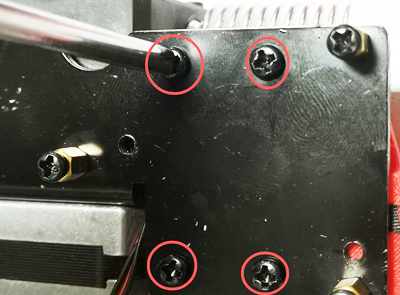
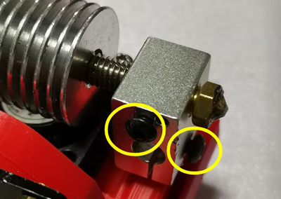
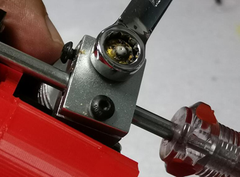
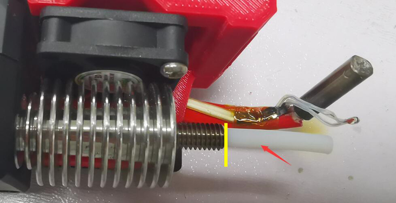
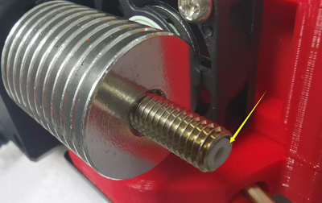
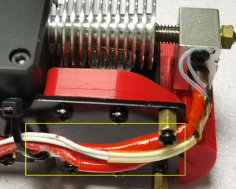

## How to replace the inner PTFE tube of the direct drive extruder
- Loosen the screws to fix the FAN bracket.   

- Loosen the screws to fix the heater and temperature sensor, and remove the cartridge heater and temperature sensor from the aluminum heat block.    
  

- Take down the nozzle and the heating block from the throat.       
  

- Repleace a new PTFE tube (length is about 60mm).   
  

- Insert PTFE into the bottom, and cut the PTFE tube, let it extend from the throat about 1mm.
  

- Install the nozzle, heating block and then install the cartridge heater and temperature sensor to the aluminum heat block.   
You can put the wires of cartridge heater and temperature sensor on the outside and fastened with a tie. This makes it easy to install the cartridge heater.    
  
