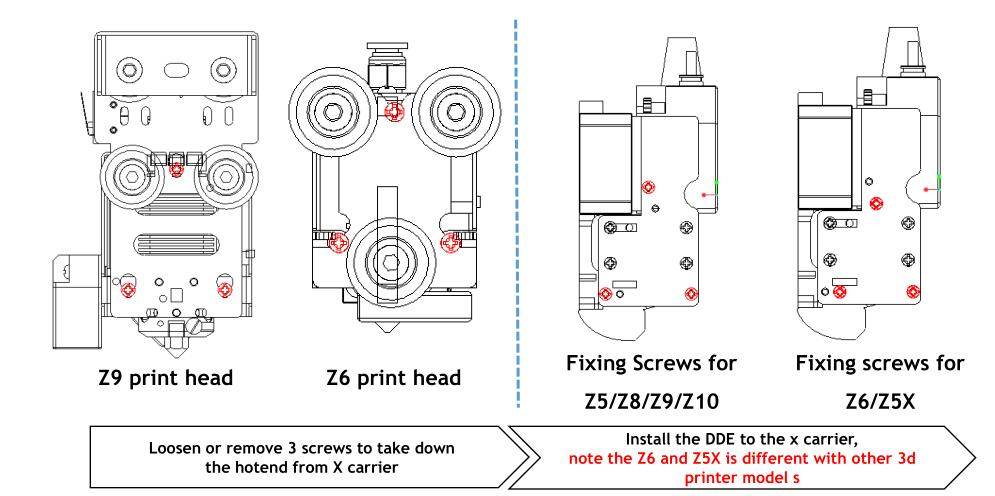
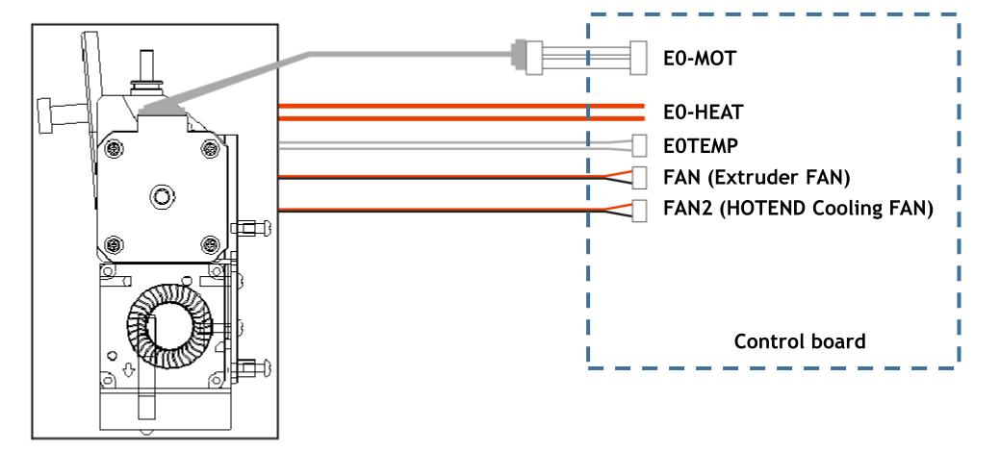
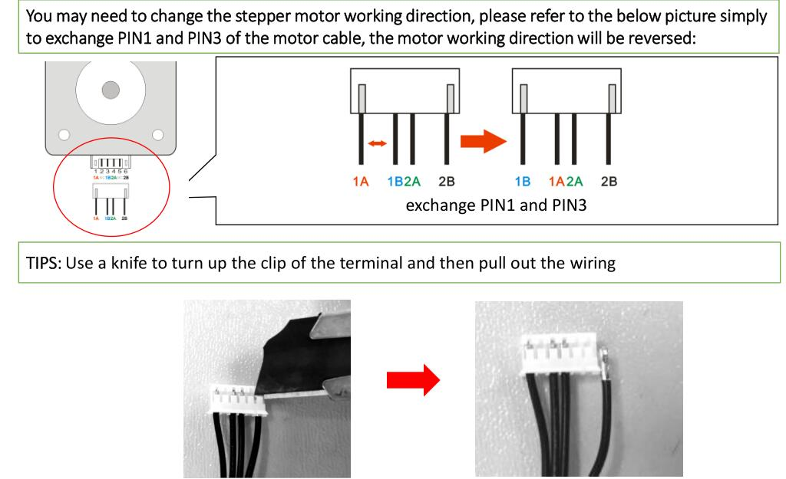
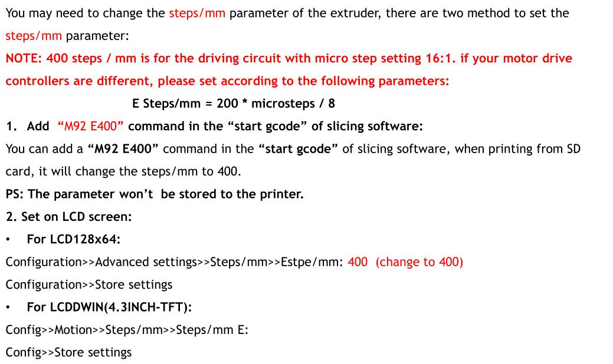
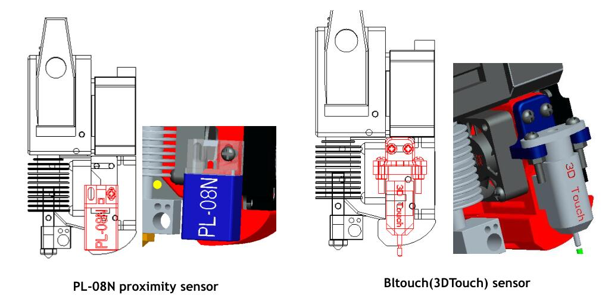
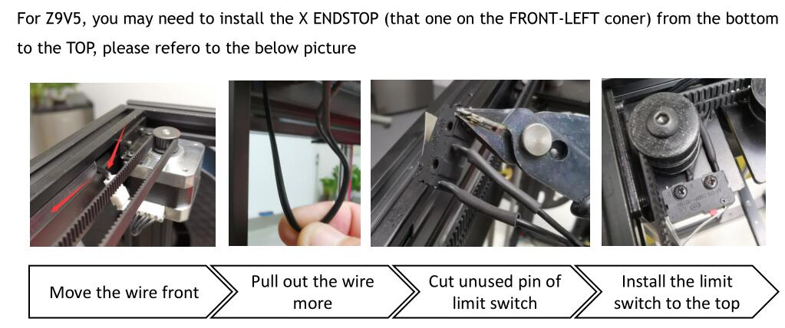
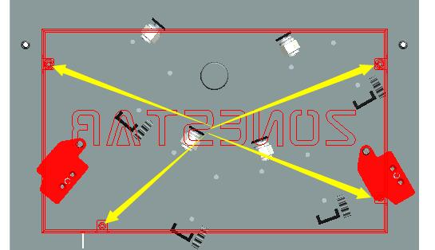

### :globe_with_meridians: Choose Language (Translated by google)

-----
## Direct Driver Extrude Installation, Wiring and Setup Guide
### 1. Installation
#### :movie_camera:[**Video tutorial**](https://youtu.be/_s9Yc3zy6vw) 
Note: This video tutorial is based on upgrading DDE from Z9V5Pro.
#### Installation steps
+ **Step 1**. Take down the orignal hotend from the x carrier.  
+ **Step 2**. Install the direct drive extruder (DDE ) to the same position of the carrier.  

### 2. Wiring

**if the stepper motor working direction is reserved, you can change change the stepping motor direction by modified the wire**  
  
### 3. Set the steps/mm parameter
**You may need to change the steps/mm parameter of the extruder, there are two method to set the steps/mm parameter**  

-----

-----
## Appendix
### Appendix 1: How to install bed leveling sensor

### Appendix 2: How to fix HOME X issue for Z9V5-MK1 and Z9V5-MK2

### Appendix 3: How to open the control box of Z9V5Pro
Loosen the four screws to open the upper control box and then you can find the wire for extrude motors, connect the wire to E1 motor connecotor.  

### Appendix 4: Print parts of DDE
- **[:book: About the print parts](./stl/readme.md)**  
- **[:arrow_down: Download print parts stl file](./stl/stl.zip)**
### Appendix 5: Correct X&Y offset
The hot bed center moves after replacing the extruder, you can set it on LCD screen if you care about it, please upload the newest firmware to your printer. About how to set the home offset, please refer to [:arrow_right:this guide](https://github.com/ZONESTAR3D/Document-and-User-Guide/blob/master/common/set_offset.md).   
Firmware Download link:    
- [**Z9V5**](https://github.com/ZONESTAR3D/Firmware/tree/master/Z9/Z9V5/bin)  
- [**Z8P**](https://github.com/ZONESTAR3D/Firmware/tree/master/Z8/Z8P/ZM3E4)  
