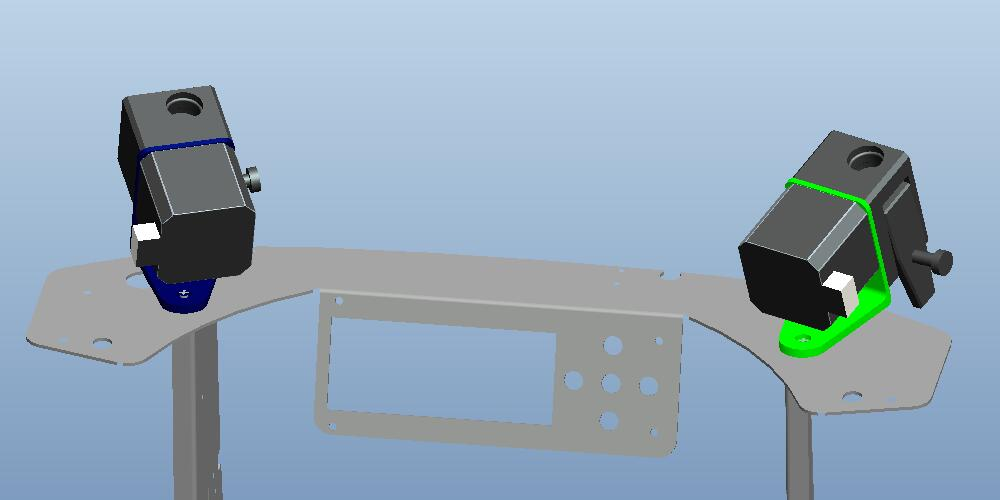
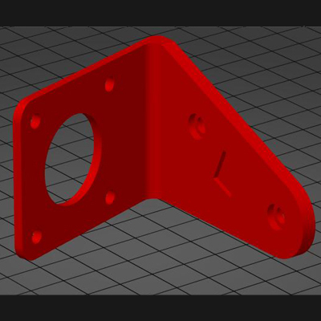
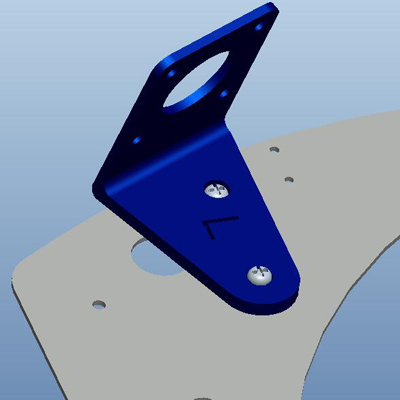
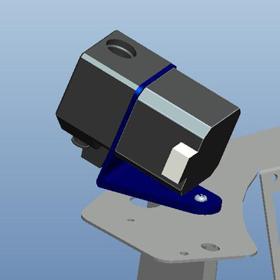
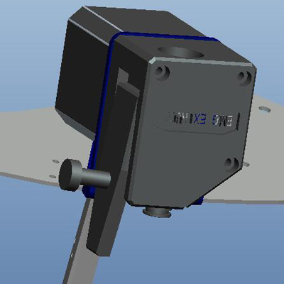
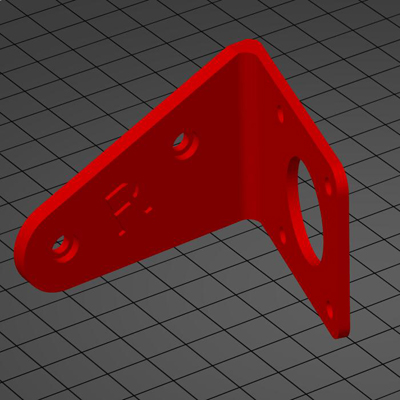
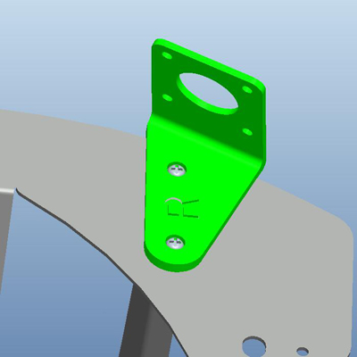
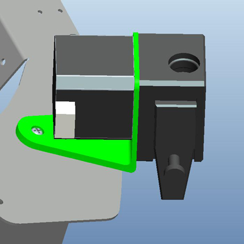
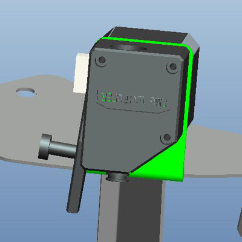

## Upgraded Dual Gear Extruder for P802Q 

### STEP:one:: Print a bracket and install the Dual Gear Extruder
#### [:arrow_down:Download the stl file of bracket- left](./P802Q/BMG_BR_L.zip)

#### [:arrow_down:Download the stl file of bracket - right](./P802Q/BMG_BR_R.zip)

### STEP:two:: Modify the motor wire to change the motor working direction
You may need to exchange the extruder stepping motor working direction after upgraded the dual gear extruder, you can simply modify the stepping motor wires to change it, for details, please refer to [:book:**this guide**](https://github.com/ZONESTAR3D/Upgrade-kit-guide/tree/main/Motor_Driver#how-to-change-working-direction-by-exchange-motor-wiring).
### STEP:three:: Change Esteps/mm parameters
Because the double gear extruder build in a reduction gear, you need to modify the steps/mm parameter of the control board. You can use the following methods to modify the steps/mm parameter:    
1. **[Only valid for Marlin firmware]** -If your machine is using the latest Marlin firmware, you can modify the E Steps/mm parameter on the LCD menu (***Configuration>>Advance Settings>>Steps/mm>>E Steps/mm:***), usually you can change the parameter to 400. Then execute (***Configuration>>Store Settings***) to save the parameters to the NVRAM on the control board.
2. **[Valid for both Marlin and Repeater firmware]** - You can also add a "M92 E400" command in the Start G-code of the slicing software to set the steps/mm parameter. If you need to save the parameters to the NVRAM of the control board, you need to add a "M500" command following the M92 command.