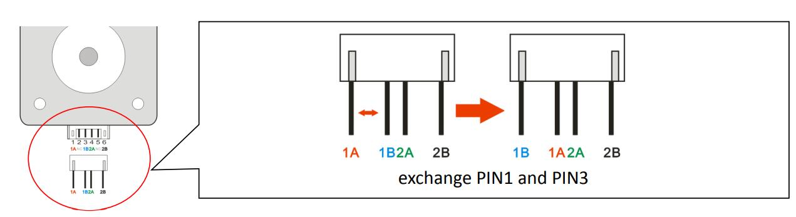
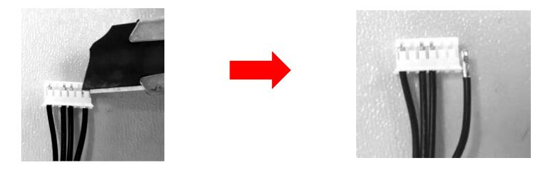

## Upgraded Dual Gear Extruder for Z8P 
[:clapper: Video Tutorial](https://youtu.be/f5ftI0Afmhg)
### Steps:
1. Take down PTFE tubes from extruders.
2. Take down the orignal extruders from top profile of Z8P machine.
3. Replace the orignal titan extruders to dual gear extruders.
4. Refer to [the guide below](#how-to-change-motor-work-direction) to modify the motor wire if need.

#### How to change motor work direction
If you used 4 right hand dual gear extruders, the extruder motor working direction will be reversed, please refer to the below steps to modify the motor wire.
- Simply exchange PIN1 and PIN3 of the motor cable, the stepping motor working direction will be reversed.

- TIPS: Use a knife to turn up the clip of the terminal and then pull out the wiring

