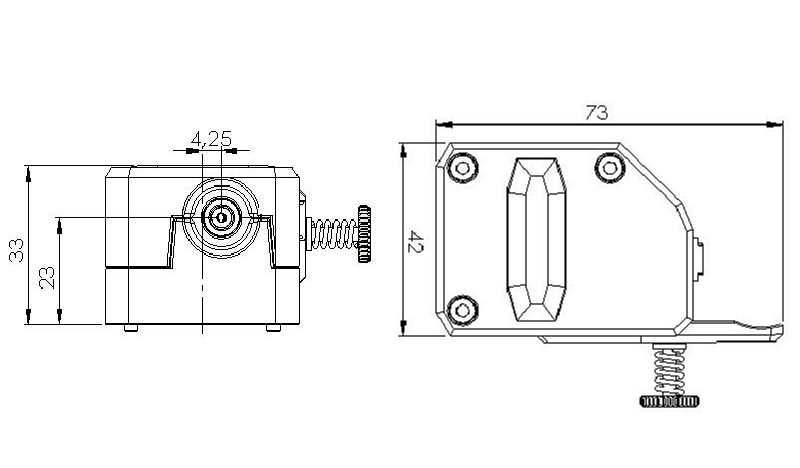

### :globe_with_meridians: Choose Language (Translated by google)

-----
# Dual Gear Extruder
### BMG Extruder
The BMG utilizes an internal gearing ratio of 3:1 together with precision CNC-machined hardened steel drive gears to give you a compact powerhouse for all your applications.
Whether you require high resolution prints with small nozzles or high-flow prints with big nozzles the optimized gearing ratio combined with our industry leading drive gears provides unparalleled pushing power and lightning fast retractions in a lightweight and compact package.
The extruder is sold without motor.
BMG is available in both left hand and right hand. 

### Technical Specification
- **Net weight:** 75g
- **Gross weight:** 139g
- **Package dimension:** 137×94×65mm
- **Gearing ratio:** 3:1
- **Filament diameter:** 1.75mm, Capable of supporting 2.85mm after simple modifications
- **Operating temperature:** 0–80°C

### Dimensions

### More information about BMG Extruder
- **[:clapper:Install BMG Extruder ](https://youtu.be/87OYybHhPFA)**
- **[:clapper:How a BMG extruder works and why it's so good](https://youtu.be/f2KTWnF3r1k)**

-----
# Manual for Upgraded Dual Gear Extruder 
## [:book: P802Q Upgraded Dual Gear Extruder Manual](./P802Q.md)
## [:book: Z9V5Pro Upgraded Dual Gear Extruder Manual](./Z9V5.md)
## [:book: Z8P Upgraded Dual Gear Extruder Manual](./Z8P.md)

