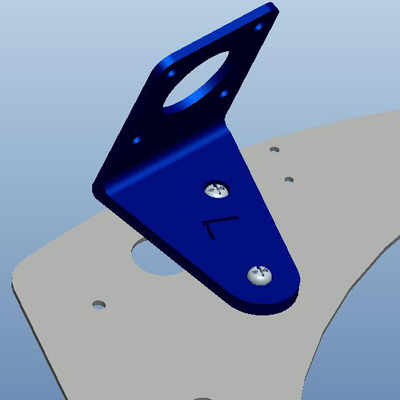
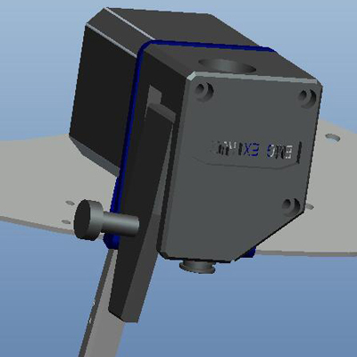
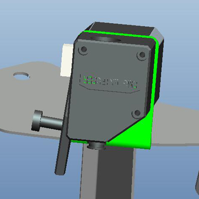

# Dual Gear Extruder
### BMG Extruder
The BMG utilizes an internal gearing ratio of 3:1 together with precision CNC-machined hardened steel drive gears to give you a compact powerhouse for all your applications.
Whether you require high resolution prints with small nozzles or high-flow prints with big nozzles the optimized gearing ratio combined with our industry leading drive gears provides unparalleled pushing power and lightning fast retractions in a lightweight and compact package.
The extruder is sold without motor.
BMG is available in both left hand and right hand. 
### Technical Specification
- **Net weight:** 75g
- **Gross weight:** 139g
- **Package dimension:** 137×94×65mm
- **Gearing ratio:** 3:1
- **Filament diameter:** 1.75mm, Capable of supporting 2.85mm after simple modifications
- **Operating temperature:** 0–80°C
- **E-steps value:** 415
### Dimensions

### More information about BMG Extruder
- **[:clapper:Install BMG Extruder ](https://youtu.be/87OYybHhPFA)**
- **[:clapper:How a BMG extruder works and why it's so good](https://youtu.be/f2KTWnF3r1k)**

-----
## P802Q upgrade to Dual Gear Extruder

### STEP:one: Print a bracket and install the Dual Gear Extruder
#### [:arrow_down:Download the stl file of bracket- left](./P802Q/BMG_BR_L.zip)

#### [:arrow_down:Download the stl file of bracket - right](./P802Q/BMG_BR_R.zip)

### STEP:two: Modify the motor wire to change the motor working direction
Refer to [this guide](https://github.com/ZONESTAR3D/Upgrade-kit-guide/tree/main/Motor_Driver#how-to-change-working-direction-by-exchange-motor-wiring) to modify the stepping motor wire.
### STEP:three: Change Esteps/mm settings on LCD screen

<!-- -----
## Z9V5Pro upgrade to Dual Gear Extruder
**[:clapper: Video turorial]()** -->

