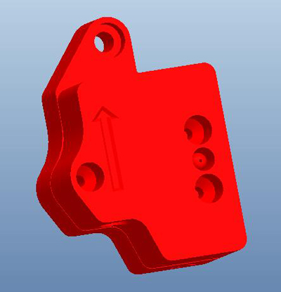
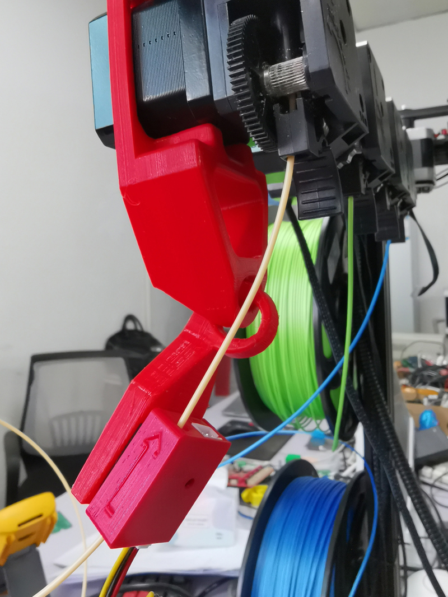

### :globe_with_meridians: Choose Language (Translated by google)

-----
## Filament Run Out Sensor User Guide
:warning: **NOTE: In the following document, we will use FROD to represent "Filament Run Out Sensor"**.
### 1. Introduction of FROD

- **LED:** Filament detection indicator light, it will light up when the filament is inserted.
- **"IN" Connector:** Connect to  the control board or the previous FROD.
- **"OUT" Connector:** Connect to the next FROD. Let it suspend if there is not the next one.   
:bulb:  The filament must be inserted in the direction indicated by the arrow.

### 2. Wiring
#### Wiring diagram of FROD
    
:warning: **Please pay attention to distinguishing between IN and OUT connectors of the FROD, as incorrect connections may cause the machine to fail to start up or even burn the control board.**    
:warning: **The "Filament Run Out Sensors" (there are 4 pieces for Z9V5Pro) are series connected , it means any one "filament run out" is detected, the printer will pause printing.**    
#### Wiring FROD to the machine
Connect the FROD to the corresponding port on the motherboard of the machine. For the motherboard port allocation diagram (wiring diagram), please refer to the installation and wiring manual of the machine.
- **:point_right:[Z8P Wiring Diagram](https://github.com/ZONESTAR3D/Z8P/blob/main/Z8P-MK2/1-Installation_Guide/Z8PM4-MK2_Wiring_Diagram.jpg)**.     
- **:point_right:[Z9V5 Wiring Diagram](https://github.com/ZONESTAR3D/Z9/blob/main/Z9V5/Z9V5-MK4/1.Installation_and_User_Guide/Wiring/Z9V5Pro_Wiring_Diagram.jpg)**.    

### 3. User Guide of FROD
:bulb: ***This document takes Z9V5Pro as an example.***    
[:clapper: Video tutorial(for Z9V5Pro)](https://youtu.be/QCJ-6L6ze1w)    
If there is not enough filaments left in the filament roll to complete the current printing, you can enable the ***"Runout Sensor"*** feature. The machine will pause the printing when detected the filament is run out, then you can load a new filament roll and resume the printing. What you need to do is:    
1. Pass the filament through the FROD.
2. Turn on the **run out** feature on LCD screen.      

### :warning: Notice
1. The printing pause may cause some obvious defects on the prints.    
2. If the filament was enough when printing the current gcode file, bypassed the filament from the FROD and load it into the extruders directly, and turn off the **run out** feature on LCD screen.         
      
3. If you need to use the Filament run out detect function, you should insert filaments on all 4 sensors. If you do not actually use 4 filaments when printing, please cut a little filament and insert it into the FROD of the unused extruders.   
     

### 4. Installation guide
- **[:clapper: Install filament run out sensor on Z8P 3D Printer](https://youtu.be/mLexZ0az_Ps)**

-----
## Case Stl File of FROD
- **FRODV6-new (for Z9V5-MK6 or Z9V5Pro upgrade Dual Gear Extruders) [:arrow_down: Download stl file](./FRODV6B.zip)**     
After Z9V5 upgraded to the Dual Gear Extruder, the position of the feed inlet of the new extruder was different from the original extruder, so the FRODV6 needed to be adjusted. We modified the bottom cover of the FRODV6 case.    
PS: The left and right extruders used different bottom covers.    
        

- **FRODV6 (for Z9V5-MK1/2/3/4/5 and Z8P) [:arrow_down: Download stl file](./FRODV6.zip)**    
    

- **FRODV4 (for P802, Z5, Z5X, Z6, Z8T, Z9M2, Z9M3, Z9M4) [:arrow_down: Download stl file](./frodv4.zip)**   
    

----
### Bracket for Z9M3/Z9M4 [:arrow_down: Download stl file](./z9_frod_br.zip)
The stl file of a bracket the FROD to the extruder motors of the Z9M3 and Z9M4 3d printer kit.    
    
