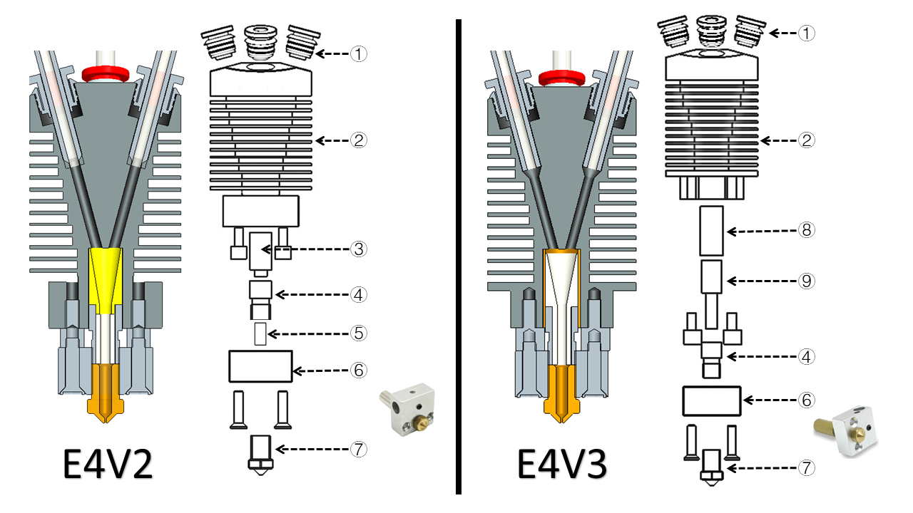
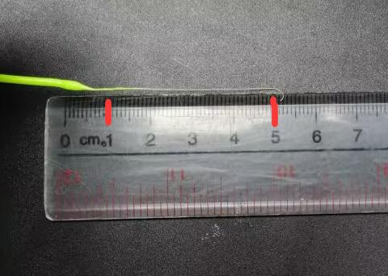
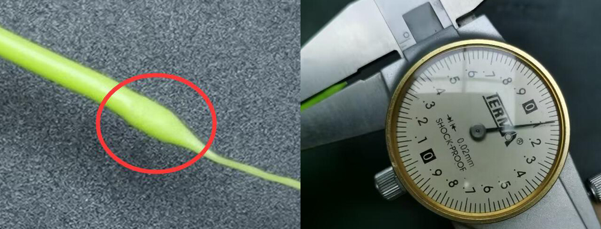

### :globe_with_meridians: Choose Language (Translated by google)

## Troubleshooting of E4 hotend
By understanding the [**working principle**][1] of E4 hotend, you should have known that when the printer switches the filament color, the extruder needs to load and unload the filament once. Therefore, only in the process of building one 3d print, the filaments needs to be loaded/unloaded at least hundreds of times, or even tens of thousands of times, depending on the size of the print and the color of the filament used in each layer.   
Ater made more than 1000 print tests, we summarized the possible problems at the E4 hotend, especially the causes of filament(s) clogged(blockage) and their solutions for your reference.  

------
### :memo: Some things must to know about E4 hotend
#### :one: [Woking principle of E4 hotend][1]
If you are not clear about the working principle of E4, please click [**here**][1] to view it, to understand how E4 works will help you to find understand the problem and the reason what caused.
#### :two: Brief of E4 hotend structure 
In order to better browse the following documents, please read this section to know the names and functions of each part of the E4 hotend.
There are two versions of the E4 hotend we are sold (E4_V2 and E4_V3), they are no many difference in using and print quality.    
**What E4_V3 improved:** 
- Modify the funnel structure to help the filament enter into the nozzle smoothly.   
- Add a cooper tube to improve heat dissipation of the throat (heat break part).  
    
:warning: If you need to replace the parts/accessories of the E4 hotend, please distinguish the version which you have.
#### Parts description:
>
    1. Fitting (Pneumatic Connector)      2. Heat sink        3. Funnel collector (E4V2)          4. Heat Break (throat)
    5. Inner PTFE tube (E4V2)             6. Heating block    7. Nozzle   8. Copper tube(E4V3)    9. Funnel collector (E4V3)

#### :three: Choose appropriate filament 
E4 hotend can be applied to a wide range of filaments such as ABS, PLA, PLA+, PETG, etc. But as you know, while switching extruder, a filament will be unload from the hotend and then re-load anthoer filament. Therefore, the following characteristics of filament may be not good to E4 hotend:
1. **Expands too much after heated**       -- can not enter the hotend when re-load.     
2. **Too soft**                            -- easy to be scratched by the gear of the extruder during multiple load/unload.    
3. **With a long strings after unloaded**  -- block the filament enter the hotend.     

In order to improve the tenacity, fluidity and appearance of the filament, the filament manufacturers will add some additives to the filament, it may cause the filament has these “unapproachable” characteristics to E4 hotend, so we suggest you do the below steps to check before using a new filament: **Heating the nozzle >> manually load the filament into the hotend >> purge a little filament(50mm or so) >>pull it out from the hotend slowly>> check the size  and strings length at the end of filament.**

------
### :bug: The filament is clogged in the hotend - serious blockage issue 
If you find a serious blockage issue in the hotend, such as the filament can not be pulled out from the hotend, the filament is twisted and deformed in the funnel collector of the hotend, please follow the following steps to check:    
:exclamation:**NOTE:exclamation: If your machine is equipped with filament run out sensors, it is recommended to bypass them first and let the filaments load to the extruders directly, please refer to [:point_right: here](./E4FAQ-4.jpg)** 

#### :one: Is the cooling fan work well of the hotend? 
The **[cooling FAN of the E4 hotend][6]** should work (it can work all the time or work when the nozzle temperature is higher than 60 °C). If the cooling FAN doesn't work, the hotend is easy to be blockage.

#### :two: Is the nozzle too close to the print plate? 
If the nozzle is too closed to the print plate (hotbed), the filament can't be extruded from the nozzle when printing, it may cause to block the hotend, in severe cases, it may cause the filament to be twisted in the funnel collector of hotend. This problem usually occurs when printing the first layer.     
##### :pill: Solution  
- When printing the first layer, use the **babysteps** menu to adjust the distance from the nozzle to the print plate.   
- When slicing, pay attention to setting the height of the first layer (150% of the layer thickness or 80% of the nozzle diameter).   

#### :three: Can the extruder push and pull the filaments well?  
If the extruder cann't push or pull the filament well, it may cause the filament stady in the hotend and block a new filament to enter, 
##### :pill: Solution  
please check and adjust the pressure of the extruder, refer to [:point_right: **here**](#HOW1)

#### :four: Are the slicing settings correct?  
If the hotend work well when printing the test gcode file which provided by us, but it is easily blocked when printing gcode file by your own sliced, please check the slicing settings, especially the following parameters:
1. The length and pull/push speed on ***"switching extruder"***, please refer to **[:point_right: here][2]**.    
2. The setting of ***"Retraction length"*** shall not be greater than 10mm, refer to **[:point_right: here][3]**.    
3. If the volume of filaments extruded by an extruder in the same layer is less than 10mm, there is a certain probability of clogging. so when you drawing a multi colors 3d prints or painting color on 3D model in PrusaSlicer, please pay attion to the minimus size at the same layer. 
<!-- As shown in [**this figure**](./small_parts.jpg). -->

#### :five: When the filament is pulled out from the hotend, will there be long strings? 
There will be a "strings" on end of the filaments which pulled out from the hotend, if the strings are too long (for default 80mm pull/push length, the strings length should be less than 45mm), it may block the filament enter the hotend.    
   
##### :pill: Solution  
- Modify the push/pull length on switching extruder in "tool change G-code". About details, please refer to **[:point_right: PrusaSlicer][4] [:point_right: Cura Silcer][5]**.
- Replace a new filament with shorter strings, usually the length of string are: **ABS <(*shorter than*) PLA+ < PLA < PLA-Slik.**
- Modify the nozzle temperature when printing/slicing.

#### :six: When the filament is pulled out from the hotend, will the front end become too thick? 
When switching the extruder, the end of the pulled out filament may become slightly thicker than the orignal, E4 hotend allowed the maximum filament diameter is 2.2mm. If the end becomes too thick and exceeds the allowable diameter, the filament may not enter the nozzle normally.    
    
##### :pill: Solution 
1. Replace filaments.
2. This issue maybe because the inner PTFE tube is deformed(for E4V2) too, please refer to [:point_right: **here**](#HOW3) to replace it.

------
### :bug: The filament is clogged in the hotend - Slight blockage problem
You may also encounter such a problem: Mostly, printing can be performed normally, but there are obvious defects when printing to certain layers, and the abnormal Kaka noise of the extruder is occasionally heard during printing.   
##### :pill: Solution  
This issue is usually caused by failure to load and unload filament when switching extruder, please following the below steps to check:
- [:point_up: **Check the extruder pressure**](#Q3)
- **Check or replace filament**[:point_up: 1](#Q5) [:point_up: 2](#Q6) [:point_up: 3](#choosefilament). 
- [**Add pull and push length by modifind the slicing settings**](#A5).
- [**Reinstall the heat part of the hotend**](#HOW2)
- [**Replace a new hotend.**](https://bit.ly/39qDtKp)

-----
### :key: How to adjust the extruder pressure to a proper value  
1. Load the filaments to the extruders but don't load in to the hotend, that is to say, do not connect the PTFE guide to the hotend, as shown in [:point_right: **this Fig**](./E4FAQ-5.jpg).
2. Try to hold the filament with your thumb and forefinger and then rotate the gear of extruder by hand, refer to this [:movie_camera: **video tutorial**](./pressure_test.gif), if you can't hold the filament by your fingers, the pressure of the extruder is sufficient. If not, refer to this [:movie_camera: **video tutorial**](./pressure_adjust.gif) to adjust the extruder pressure. 
:warning: **Please note that the pressure should be adjusted appropriately, but not the bigger the better**. Because the same position of the filament may be pushed back and forth by the gear during printing, which may cause the filament to be scratched. The scratched filament cannot be transmitted to the nozzle during printing, and even the filament cannot enter the hotend normally.

### :key: How to unassemble the E4 hotend 
If the filament is clogged inside the hotend and cannot be pulled out and pushed in, you need to unassemble the hotend and clean it, steps as follows:
:warning: Wait for the hotend to cool down before operation.:warning:   
 
1. Remove the hotend assembly from the X carrier of 3d printer, and take down the silicone insulation sleeve.
2. Remove the cable from the hotend housing.
3. Loosen the 2 screws fixing the hotend.
4. Pull the hotend out of the heats-sink.

### :key: How to replace the inner PTFE pipe (for E4V2 only) 
If the blockage is easy to occur, it is recommended that you replace the built-in PTFE pipe too, steps as follows:
 
1. Remove the scews which fixed the temperature sensor and heater and take down the temperature sensor and heater.
2. Use a wrench to remove the nozzle.
3. Remove the built-in PTFE pipe to be replaced.
4. Install a new PTFE pipe, and use a paper cutter to cut off.
5. the PTFE pipe should be about 0.5mm longer than the throat, or it can be directly flush.
6. Use a small metal thin rod to turn it inside, because when cutting the PTFE pipe, its inner diameter may become thinner.
7. Reinstall the hotend in reverse order.

[1]:https://github.com/ZONESTAR3D/Upgrade-kit-guide/blob/main/HOTEND/E4%204-IN-1-OUT%20Non-Mixing%20Color%20Hotend/User_guide/readme.md#5-working-principle
[2]:https://github.com/ZONESTAR3D/Slicing-Guide/blob/master/PrusaSlicer/Custom_Gcode.md
[3]:https://github.com/ZONESTAR3D/Slicing-Guide/blob/master/PrusaSlicer/PrusaSlicerGuide_E4.md#step-6-set-the-print-settings
[4]:https://github.com/ZONESTAR3D/Slicing-Guide/blob/master/PrusaSlicer/Custom_Gcode.md#tool-change-g-code
[5]:https://github.com/ZONESTAR3D/Slicing-Guide/blob/master/cura/E4_hotend/readme.md#exturder-startend-gcode-of-e4-hotend
[6]:https://github.com/ZONESTAR3D/Upgrade-kit-guide/blob/main/HOTEND/E4%204-IN-1-OUT%20Non-Mixing%20Color%20Hotend/User_guide/readme.md#2-components