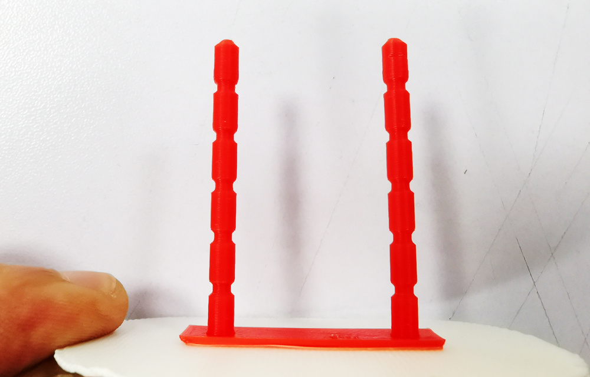
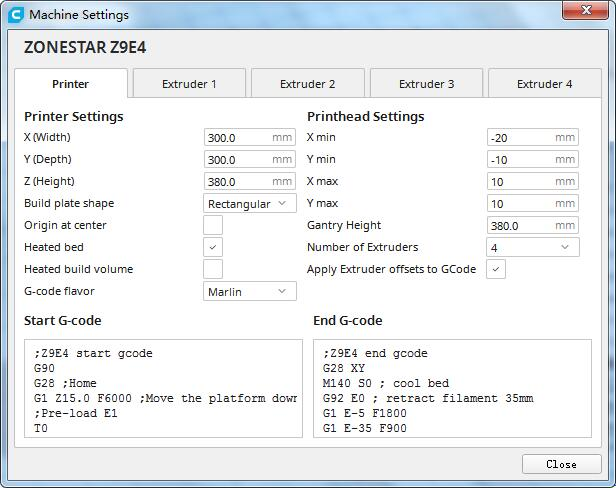
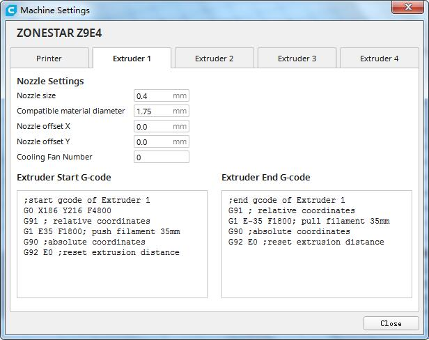

## ATTETION:
Please refer to the below pictures to load filaments every time you print by E4 hotend. To check whether the filaments are loaded to the initial position.

  
## Example 1. Retraction Testing
- **3D printer:** Z9V5pro
- **Hotend:** E4 (4-IN-1-OUT Non-mixing color hotend)
- **Slicing software:** Cura, silcing parameter please refer to the 3mf file  
- **Filament:**
	- **Extruder 1:** White PLA+ filament to print a raft to anti-warp.
	- **Extruder 2:** Red ABS filament to print the retaction testing tower.
- **3D printer:** Z9V5pro
- **Hotend:** E4 (4-IN-1-OUT Non-mixing color hotend)
- **Slicing software:** Cura, silcing parameter please refer to the 3mf file  
- **Filament:**
	- **Extruder 1:** White PLA+ filament to print a raft to anti-warp.
	- **Extruder 2:** Red ABS filament to print the retaction testing tower.

## Example 2. 4 Color test
- **3D printer:** Z9V5pro
- **Hotend:** E4 (4-IN-1-OUT Non-mixing color hotend)
- **Slicing software:** Cura, silcing parameter please refer to the 3mf file  
- **Filament:**
	- **Extruder 1:** White PLA
	- **Extruder 2:** Red PLA
	- **Extruder 3:** Green PLA
	- **Extruder 3:** Blue PLA   

## Example 3. 4 Color Dog
- **3D printer:** Z9V5pro
- **Hotend:** E4 (4-IN-1-OUT Non-mixing color hotend)
- **Slicing software:** Cura, silcing parameter, please download **E4-4Color-dog.3mf** and open it by Cura       
- **Filament:**
	- **Extruder 1:** White PLA
	- **Extruder 2:** Red PLA
	- **Extruder 3:** Green PLA
	- **Extruder 3:** Blue PLA  
    
### Start G-code
    

    ;**Z9E4 start gcode**
    G90 
    G28 ;Home
    G1 Z15.0 F6000 ;Move the platform down 15mm
    ;Pre-load E1
    T0 
    G92 E0
    G1 E20 F1200
    G1 E40 F180
    ;Pre-load E2
    T1 
    G92 E0
    G1 E40 F1200
    G1 E15 F600
    ;Pre-load E3
    T2 
    G92 E0
    G1 E40 F1200
    G1 E15 F600
    ;Pre-load E4
    T3
    G92 E0
    G1 E40 F1200
    G1 E15 F600
    G1 Z5 F240
    G1 X10 Y10 F1800
    G1 Z0.3 F240
    ;Prime the nozzle
    T0
    G92 E0 
### End G-code
    ;**Z9E4 end gcode**
    G28 XY
    M140 S0 ; cool bed
    G92 E0 ; pull out filament from the hotend
    G1 E-5 F1800
    G1 E-35 F900
    M104 S0 ; cool hotend
    M84 ; disable steppers

### Extruder gcode
Add the "extruder start gcode" and "extruder stop gcode" to all of extruders.  
   
#### Extrduer 2 start G-code
    ;start gcode of Extruder 1 
    G0 X186 Y186 F4800	; move to the center of the prime tower
    G91 ; relative coordinates
    G1 E35 F1800; push filament 35mm
    G90 ;absolute coordinates
    G92 E0 ;reset extrusion distance
#### Extrduer 2 start G-code
    ;start gcode of Extruder 2 
    G0 X180 Y186 F4800	; move to the center of the prime tower
    G91 ; relative coordinates
    G1 E35 F1800; push filament 35mm
    G90 ;absolute coordinates
    G92 E0 ;reset extrusion distance
#### Extrduer 3 start G-code
    ;start gcode of Extruder 3 
    G0 X186 Y180 F4800	; move to the center of the prime tower
    G91 ; relative coordinates
    G1 E35 F1800; push filament 35mm
    G90 ;absolute coordinates
    G92 E0 ;reset extrusion distance
#### Extrduer 4 start G-code
    ;start gcode of Extruder 4 
    G0 X180 Y180 F4800	; move to the center of the prime tower
    G91 ; relative coordinates
    G1 E35 F1800; push filament 35mm
    G90 ;absolute coordinates
    G92 E0 ;reset extrusion distance
#### Extrduer 1/2/3/4 End G-code
    ;end gcode of Extruder 1/2/3/4 
    G91 ; relative coordinates
    G1 E-35 F1800; pull filament 35mm
    G90 ;absolute coordinates
    G92 E0 ;reset extrusion distance  

### Slicing setting

## Example 5. 4 Color owl
### Note: The settings are the same with 4 Color dog
- **3D printer:** Z9V5pro  
- **Hotend:** E4 (4-IN-1-OUT Non-mixing color hotend)  
- **Slicing software:** Cura, silcing parameter, please download **E4-4Color-owl.3mf** and open it by Cura     
- **Filament:**  
	- **Extruder 1:** White PLA   
	- **Extruder 2:** Red PLA  
	- **Extruder 3:** Green PLA  
	- **Extruder 3:** Blue PLA      

