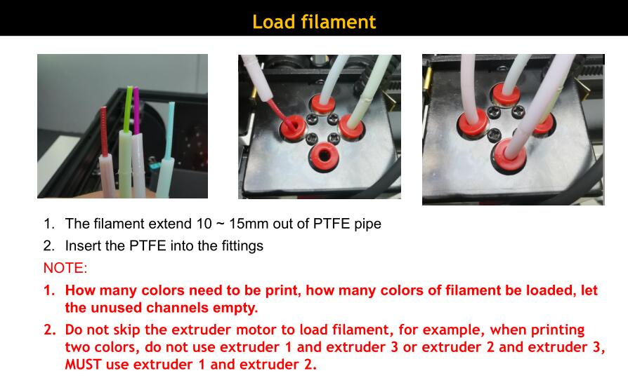
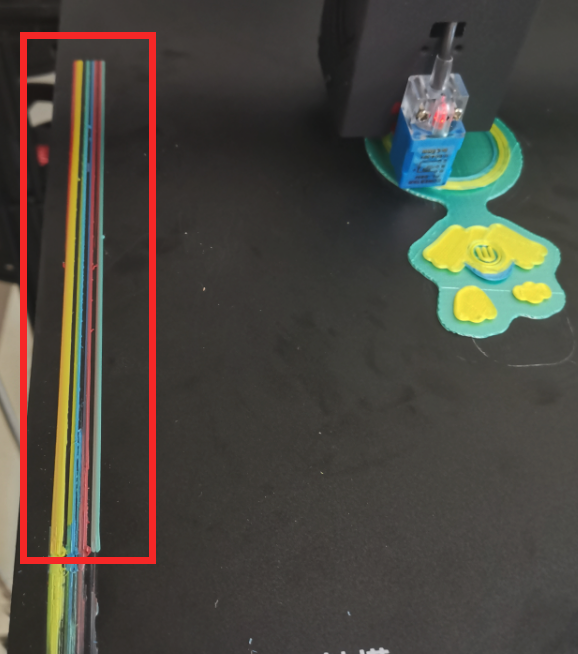
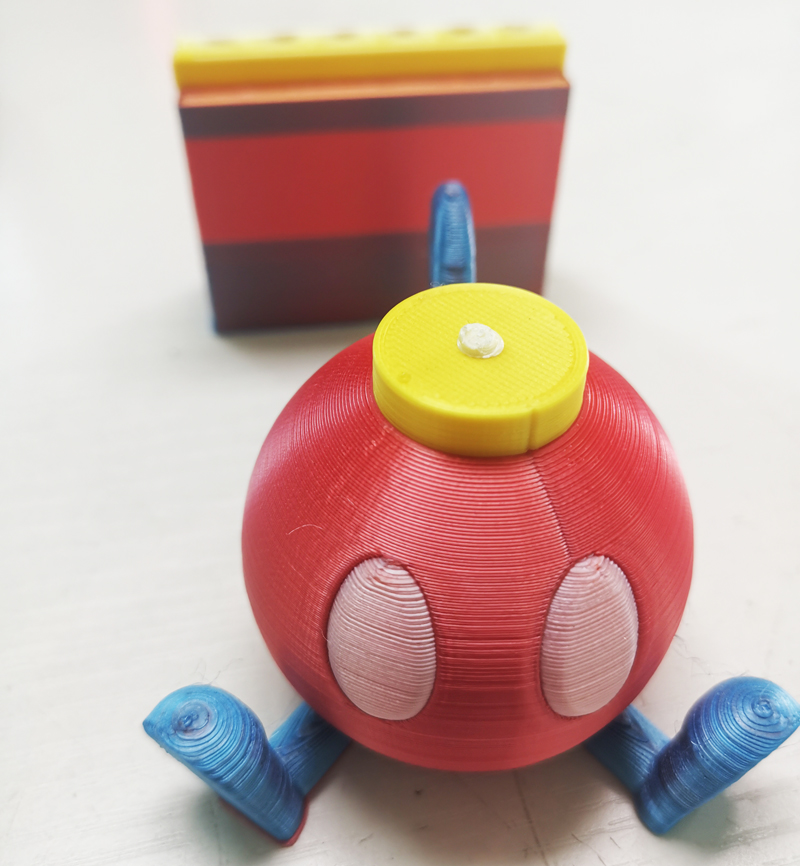
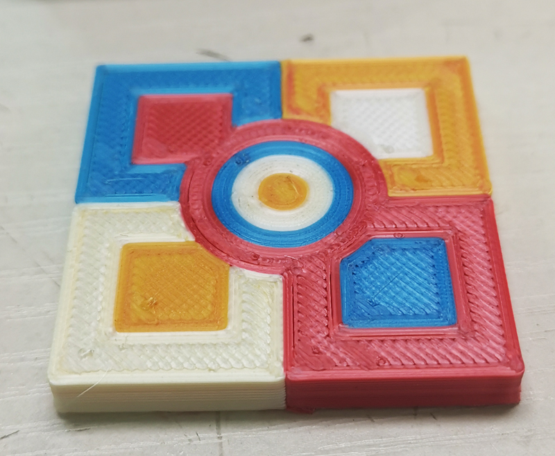

#### :warning: !!ATTETION PLEASE!!

1. Refer to the below pictures to load filaments every time you print by E4 hotend. To check whether the filaments are loaded to the initial position.    
   
:pushpin: If the last printing has been successfully completed, usually you can skip this step.
2. To confirm the "preload line" prints well before you leave the machine.    

---------
## Examples sliced by PrusaSlicer 
:arrow_down:[Download gcode files](https://downgit.github.io/#/home?url=https://github.com/ZONESTAR3D/Upgrade-kit-guide/tree/main/HOTEND/E4%204-IN-1-OUT%20Non-Mixing%20Color%20Hotend/example/PrusaSlicer)  

---------
## Examples sliced by Cura
:arrow_down: [Download gcode files](https://downgit.github.io/#/home?url=https://github.com/ZONESTAR3D/Upgrade-kit-guide/tree/main/HOTEND/E4%204-IN-1-OUT%20Non-Mixing%20Color%20Hotend/example/Cura)  
#### Example 1. Retraction Testing
- **3D printer:** Z9V5pro
- **Hotend:** E4 (4-IN-1-OUT Non-mixing color hotend)
- **Slicing software:** Cura, silcing parameter please refer to the 3mf file  
- **Filament:**
	- **Extruder 1:** White PLA+ filament to print a raft to anti-warp.
	- **Extruder 2:** Red ABS filament to print the retaction testing tower.
- **3D printer:** Z9V5pro
- **Hotend:** E4 (4-IN-1-OUT Non-mixing color hotend)
- **Slicing software:** Cura, silcing parameter please refer to the 3mf file  
- **Filament:**
	- **Extruder 1:** White PLA+ filament to print a raft to anti-warp.
	- **Extruder 2:** Red ABS filament to print the retaction testing tower.

#### Example 2. 4 Color test
- **3D printer:** Z9V5pro
- **Hotend:** E4 (4-IN-1-OUT Non-mixing color hotend)
- **Slicing software:** Cura, silcing parameter please refer to the 3mf file  
- **Filament:**
	- **Extruder 1:** White PLA
	- **Extruder 2:** Red PLA
	- **Extruder 3:** Green PLA
	- **Extruder 4:** Blue PLA   

#### Example 3. 4 Color Dog
- **3D printer:** Z9V5pro
- **Hotend:** E4 (4-IN-1-OUT Non-mixing color hotend)
- **Slicing software:** Cura, silcing parameter, please download **E4-4Color-dog.3mf** and open it by Cura       
- **Filament:**
	- **Extruder 1:** White PLA
	- **Extruder 2:** Red PLA
	- **Extruder 3:** Green PLA
	- **Extruder 4:** Blue PLA  
    

#### Example 5. 4 Color owl
### Note: The settings are the same with 4 Color dog
- **3D printer:** Z9V5pro  
- **Hotend:** E4 (4-IN-1-OUT Non-mixing color hotend)  
- **Slicing software:** Cura, silcing parameter, please download **E4-4Color-owl.3mf** and open it by Cura     
- **Filament:**  
	- **Extruder 1:** White PLA   
	- **Extruder 2:** Yellow PLA  
	- **Extruder 3:** Green PLA  
	- **Extruder 4:** Blue PLA      

##### Slicing settings

##### 1. Start G-code & End G-code
    

##### start G-code
>
    ;Z9E4 start G-code
    G28 ;Home
    G21 ; set units to millimeters
    G90 ; use absolute coordinates
    G1 Z5 F3000 ; lift nozzle
    G1 X5 Y10 F1500 ; move to prime start point
    G1 Z0.3 F3000 ; get ready to prime
    ;===Pre-load filament start
    M117 Preload Extruder #1
    T0
    G92 E0
    G0 X5 Y50 F3000
    G1 Y250 E15 F1200
    G0 X5.5 F3000
    G1 Y50 E30 F1200
    G0 X6 F3000
    G1 Y250 E45 F1200
    G0 X6.5 F3000
    G1 Y50 E60 F1200
    G0 X7 F3000
    G1 Y250 E75 F1200
    G0 X7.5 F3000
    G1 Y50 E90 F1200
    G0 X8 F3000
    G92 E0
    G1 E-10 F1800
    G1 E-80 F2400
    M400
    M117 Preload Extruder #2
    T1
    G92 E0
    G0 X8 Y50 F3000
    G1 Y250 E15 F1200
    G0 X8.5 F3000
    G1 Y50 E30 F1200
    G0 X9 F3000
    G1 Y250 E45 F1200
    G0 X9.5 F3000
    G1 Y50 E60 F1200
    G0 X10 F3000
    G1 Y250 E75 F1200
    G0 X10.5 F3000
    G1 Y50 E90 F1200
    G0 X11 F3000
    G92 E0
    G1 E-10 F1800
    G1 E-80 F2400
    M400
    M117 Preload Extruder #3
    T2
    G92 E0
    G0 X11 Y50 F3000
    G1 Y250 E15 F1200
    G0 X11.5 F3000
    G1 Y50 E30 F1200
    G0 X12 F3000
    G1 Y250 E45 F1200
    G0 X12.5 F3000
    G1 Y50 E60 F600
    G0 X13 F3000
    G1 Y250 E75 F1200
    G0 X13.5 F3000
    G1 Y50 E90 F1200
    G0 X14 F3000
    G92 E0
    G1 E-10 F1800
    G1 E-80 F2400
    M400
    M117 Preload Extruder #4
    T3
    G92 E0
    G0 X14 Y10 F3000
    G1 Y250 E15 F1200
    G0 X14.5 F3000
    G1 Y50 E30 F1200
    G0 X15 F3000
    G1 Y250 E45 F1200
    G0 X15.5 F3000
    G1 Y50 E60 F1200
    G0 X16 F3000
    G1 Y250 E75 F1200
    G0 X16.5 F3000
    G1 Y50 E90 F1200
    G0 X17 F3000
    G0 Y155 F4800
    G92 E0    
    G1 E-10 F1800
    G1 E-80 F2400
    G92 E0
    ;===Pre-load filament end
    
    ;The below commands will beeps and pause printing afer filaments pre-load done,
    ;and wait for click the knob to continute
    M300 S5000 P100
    G4 P200
    M300 S5000 P100
    G4 P200
    M300 S5000 P100
    G4 P200
    M0

##### End G-code
>
    ;Z9E4 end gcode
    G28 XY
    M140 S0 ; cool bed
    G92 E0 
    G1 E-10 F1800   ; unload filament-1
    G1 E-45 F2400   ; unload filament-2
    M104 S0 ; cool hotend
    M84 ; disable steppers

##### 3. Extruder gcode
Add the "extruder start gcode" and "extruder end gcode" to all of extruders.  
   
   
   
   
###### Extrduer start G-code
>
    ;start gcode of Extruders   
    G91 
    G1 Z1 F600
    G90
    G0 X155 Y300 F5000 
    G91 
    G1 Z-1 F600
    G90  
    G92 E0
    G1 E25 F2400; reload filament-1
    G1 E45 F1200; reload filament-2
    G1 E70 F2400; reload filament-3
    G1 E79 F900; reload filament-4
    G92 E0

###### Extrduer End G-code
>
    ;end gcode of Extruder 1/2/3/4 
    G92 E0
    G1 E-10 F1800; unload filament-1
    G1 E-80 F2400; unload filament-2
    G92 E0 ;reset extrusion distance  

##### 4. Slicing configuration

