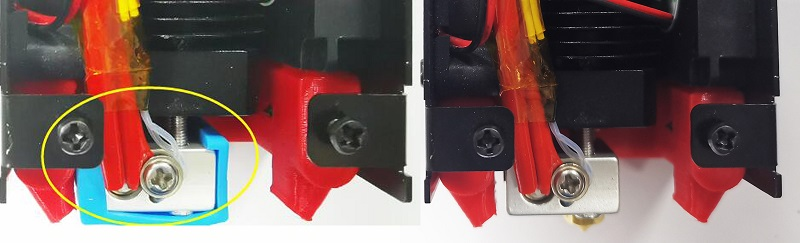
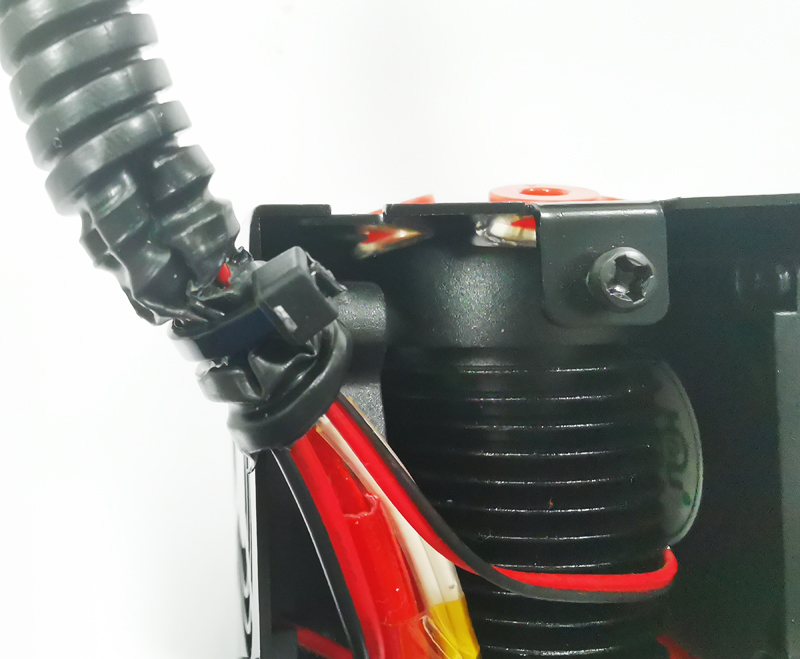
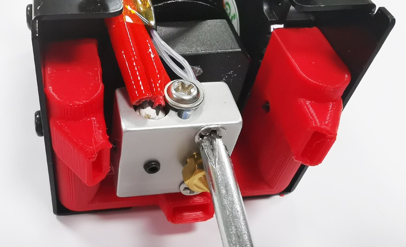
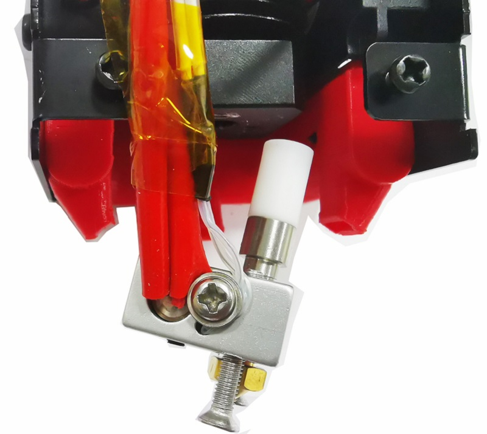

## How to disassemble E4 hot end
You may need to disassemble the E4 hot end while the filament be clogged in the hotend,  steps as below :  
### 1. Remove the silicone insulation sleeve 

### 2. Remove the cable from the housing

### 3. Remove the heating block
#### NOTE: If the screws glue by the filament, heating the hot end  to about 100℃ first.  

### 4. Pull out the heating and throat, then you can remove the filament in the hot end.
