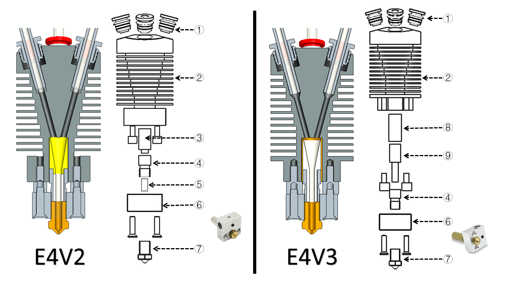

[E4FAQ1]:https://github.com/ZONESTAR3D/Upgrade-kit-guide/blob/main/HOTEND/E4/User_guide/readme.md#5-working-principle
[E4FAQ2]:https://github.com/ZONESTAR3D/Slicing-Guide/blob/master/PrusaSlicer/Custom_Gcode.md
[E4FAQ3]:https://github.com/ZONESTAR3D/Slicing-Guide/blob/master/PrusaSlicer/PrusaSlicerGuide_E4.md#step-6-set-the-print-settings
[E4FAQ4]:https://github.com/ZONESTAR3D/Slicing-Guide/blob/master/PrusaSlicer/Custom_Gcode.md#tool-change-g-code
[E4FAQ5]:https://github.com/ZONESTAR3D/Slicing-Guide/blob/master/cura/E4_hotend/readme.md#exturder-startend-gcode-of-e4-hotend
[E4FAQ6]:https://github.com/ZONESTAR3D/Upgrade-kit-guide/blob/main/HOTEND/E4/User_guide/readme.md#2-components
[BMG]: https://github.com/ZONESTAR3D/Upgrade-kit-guide/tree/main/Dual_Gear_Extruder#manual-for-upgraded-dual-gear-extruder

----
## <a id="choose-language">:globe_with_meridians: Choose language </a>

<!--  -->

-----
## Dépannage du hotend E4
Après avoir effectué plus de 1000 tests d'impression, nous avons résumé les problèmes possibles au niveau du hotend E4, notamment les causes de filament(s) bouché(s) et leurs solutions pour votre référence.
- Si vous ne connaissez pas le principe de fonctionnement du hot end E4 (4-IN-1-OUT Non mix color), nous vous suggérons de lire ce document ([**:point_down: E4 hotend workprincipe**](#F0)) d'abord.
- La raison pour laquelle le hotend E4 ne peut pas être utilisé pour l'impression ne peut pas provenir du hotend lui-même. Par conséquent, avant de porter un jugement, il est préférable de se référer à [**:point_down: Test if the hot end peut fonctionner normalement**](#F1) pour simplement tester si le hot end E4 peut fonctionner normalement.
- Si votre hot end E4 peut terminer l'impression, mais qu'il y a des défauts sur la partie imprimée, veuillez vous référer à [**:point_down: Problème de défaut d'impression**](#F2).
- Si votre hot end E4 présente souvent un blocage sérieux, veuillez vous référer à [**:point_down: serious obstrué problème**](#F3).

-----
###  Certaines choses à savoir sur le hotend E4
#### :one: [Principe de fonctionnement du hotend E4][E4FAQ1]
Si vous n'êtes pas clair sur le principe de fonctionnement d'E4, veuillez cliquer sur [**ici**][E4FAQ1] pour le visualiser. Comprendre le fonctionnement d'E4 vous aidera à comprendre le problème et la raison qui l'a causé.
#### :two: Présentation de la structure du hotend E4
Afin de mieux parcourir les documents suivants, veuillez lire cette section pour connaître les noms et fonctions de chaque partie du hotend E4.
Il existe deux versions du hotend E4 que nous vendons (E4_V2 et E4_V3), il n'y a pas beaucoup de différence en termes d'utilisation et de qualité d'impression.
**Ce que E4_V3 a amélioré:**
-Modifiez la structure de l'entonnoir pour aider le filament à entrer en douceur dans la buse.
- Ajouter un tube en cuivre pour améliorer la dissipation thermique de la gorge (partie anti-chaleur).

:warning: Si vous devez remplacer les pièces/accessoires du hotend E4, veuillez distinguer la version que vous possédez.
#### Description des pièces:
>
     1. Raccord (joint trachéal PC4) 2. Dissipateur thermique 3. Collecteur à entonnoir (E4V2) 4. Coupe-chaleur (gorge)
     5. Tube intérieur en PTFE (E4V2) 6. Bloc chauffant 7. Buse 8. Tube en cuivre (E4V3) 9. Collecteur à entonnoir (E4V3)
:pushpin: Nous avons mis à jour la taille du bloc chauffant en aluminium, et le nouveau bloc chauffant en aluminium est symétrique à gauche et à droite, il ne bloquera donc pas la sortie d'air du ventilateur de l'extrudeuse. De plus, des vis ont été ajoutées pour fixer la thermistance.
:pushpin: Nous avons lancé un kit chauffant V3H, il est adapté à l'impression de filaments haute température tels que PC, PET, PA, etc.

#### :three: Choisissez le filament approprié 
Le hotend E4 peut être appliqué à une large gamme de filaments tels que l'ABS, le PLA, le PLA+, le PETG, etc. Mais comme vous le savez, lors du changement d'extrudeuse, un filament sera déchargé du hotend puis rechargera un autre filament. Par conséquent, les caractéristiques suivantes du filament peuvent ne pas être bonnes pour le hotend E4 :
1. **Se dilate trop après avoir chauffé** -- ne peut pas entrer dans le hotend lors du rechargement.
2. **Trop mou** -- facile à rayer par l'engrenage de l'extrudeuse lors de plusieurs chargements/déchargements.
3. **Avec de longues cordes après le déchargement** - bloquez le filament qui entre dans la hotend.

Afin d'améliorer la ténacité, la fluidité et l'apparence du filament, les fabricants de filaments ajouteront des additifs au filament, cela peut faire en sorte que le filament ait ces caractéristiques « inaccessibles » au hotend E4, nous vous suggérons donc de suivre les étapes ci-dessous pour vérifier avant d'utiliser un nouveau filament : **Chauffer la buse >> charger manuellement le filament dans le hotend >> purger un peu de filament (environ 50 mm) >> retirez-le lentement du hotend >> vérifiez la taille et la longueur des cordes à la fin du filament.**

-----
###  Testez si la hot end peut fonctionner normalement

#### 1. Chauffez l'extrémité chaude (buse) à 200 ℃.
#### 2. Chargez les filaments dans chaque canal de l'extrémité chaude un par un et regardez si le filament peut s'écouler de la buse.
:warning: **Veuillez noter :**
- **Coupez l'extrémité avant à plat avant de charger le filament**
- **Poussez lentement (<2 mm/s) le filament lorsqu'il atteint la buse.**
- **Utilisez une vitesse plus rapide (>10 mm/s) lorsque vous retirez les filaments.**

-----
###  L'impression peut se terminer normalement, mais il y a des défauts sur les objets imprimés
Vous pouvez également rencontrer un tel problème : la plupart du temps, l'impression peut être effectuée normalement, mais il existe des défauts évidents lors de l'impression sur certaines couches, et le bruit Kaka anormal de l'extrudeuse est parfois entendu pendant l'impression.
##### :pill: Solution 
Ce problème est généralement dû à un échec de chargement et de déchargement du filament lors du changement d'extrudeuse. Veuillez suivre les étapes ci-dessous pour vérifier :
- [:point_up: **Vérifiez la pression de l'extrudeuse**](#HOW1)
- **Vérifiez ou remplacez le filament**[:point_up: 1](#Q5) [:point_up: 2](#Q6) [:point_up: 3](#choosefilament).
- [**Ajoutez la longueur de traction et de poussée en modifiant les paramètres de découpage**](#A5).
- [**Réinstallez la partie chauffante du hotend**](#HOW2)
- **Vérifiez les guides PTFE connectés à l'extrudeuse et au hotend.** Après une période d'utilisation, le tube PTFE peut se déformer (en particulier la partie reliant les raccords), ce qui augmente considérablement la résistance du filament à se déplacer à l'intérieur du PTFE. tubes.
- **:+1: Mise à niveau vers des extrudeuses à double engrenage.** L'extrudeuse à double engrenage peut augmenter considérablement la force de poussée et de traction du fil fin, réduisant ainsi le risque de blocage causé par un retrait difficile du fil fin de l'extrémité chaude.
- [**Remplacer un nouveau hotend.**](https://bit.ly/39qDtKp)

-----
###  La partie chaude E4 est souvent sérieusement bloquée et complètement incapable d'imprimer
Si vous constatez un problème de blocage grave dans le hotend, tel que le filament ne peut pas être retiré du hotend, le filament est tordu et déformé dans l'entonnoir collecteur du hotend, veuillez suivre les étapes suivantes pour vérifier :
:warning:**REMARQUE:warning: Si votre machine est équipée de capteurs d'épuisement de filament, il est recommandé de les contourner d'abord et de laisser les filaments se charger directement vers les extrudeuses, veuillez vous référer à [:point_right: ici](./E4FAQ-4.jpg)**.

#### :one: Le ventilateur de refroidissement du hotend fonctionne-t-il bien ? 
Le **[VENTILATEUR de refroidissement du hotend E4][E4FAQ6]** devrait fonctionner (il peut fonctionner tout le temps ou fonctionner lorsque la température de la buse est supérieure à 60 °C). Si le ventilateur de refroidissement ne fonctionne pas, la hotend est facile à bloquer.

#### :two: La buse est-elle trop proche de la plaque d'impression ? 
Si la buse est trop proche de la plaque d'impression (hotbed), le filament ne peut pas être extrudé de la buse lors de l'impression, cela peut bloquer la hotend, dans les cas graves, cela peut provoquer une torsion du filament dans l'entonnoir. collecteur de hotend. Ce problème se produit généralement lors de l'impression de la première couche.
##### :pill: Solution 
- Lors de l'impression de la première couche, utilisez le menu **babysteps** pour régler la distance entre la buse et la plaque d'impression.
- Lors du tranchage, faites attention au réglage de la hauteur de la première couche (150 % de l'épaisseur de la couche ou 80 % du diamètre de la buse).

#### :three: L'extrudeuse peut-elle bien pousser et tirer les filaments ? 
Si l'extrudeuse ne parvient pas à bien pousser ou tirer le filament, le filament risque de rester dans la hotend et de bloquer l'entrée d'un nouveau filament.
##### :pill: Solution 
1. Vérifiez et ajustez la pression de l'extrudeuse, reportez-vous à [:point_right: **ici**](#HOW1).
2. **Mise à niveau vers les extrudeuses à double engrenage, cela peut résoudre efficacement le problème du glissement des fils fins, reportez-vous à [:point_right : ici][BMG]**.

#### :four: Les paramètres de découpage sont-ils corrects ? 
Si le hotend fonctionne bien lors de l'impression du fichier gcode de test que nous avons fourni, mais qu'il est facilement bloqué lors de l'impression du fichier gcode par votre propre tranche, veuillez vérifier les paramètres de découpage, en particulier les paramètres suivants :
1. La longueur et la vitesse de traction/poussée sur ***« extrudeuse de commutation »***, veuillez vous référer à **[:point_right : ici][E4FAQ2]**.
2. Le réglage de ***« Longueur de rétraction »*** ne doit pas être supérieur à 10 mm, reportez-vous à **[:point_right : ici][E4FAQ3]**.
3. Si le volume de filaments extrudés par une extrudeuse dans la même couche est inférieur à 10 mm, il existe une certaine probabilité de colmatage. Ainsi, lorsque vous dessinez des impressions 3D multicolores ou que vous peignez des couleurs sur un modèle 3D dans PrusaSlicer, veuillez faire attention à la taille minimale sur le même calque.
<!-- Comme indiqué dans [**cette figure**](./small_parts.jpg). -->

#### :five: Lorsque le filament est retiré de la hotend, y aura-t-il de longues cordes ? 
Il y aura des « ficelles » à l'extrémité des filaments qui sont sortis de la hotend, si les ficelles sont trop longues (pour une longueur de traction/poussée par défaut de 80 mm, la longueur des ficelles doit être inférieure à 45 mm), cela peut bloquer l'entrée du filament. le hotend.
##### 
##### :pill: Solution 
- Modifier la longueur push/pull lors du changement d'extrudeuse dans "tool change G-code". Pour plus de détails, veuillez vous référer à **[:point_right: PrusaSlicer][E4FAQ4] [:point_right: Cura Silcer][E4FAQ5]**.
- Remplacez un nouveau filament par des cordes plus courtes, généralement la longueur des cordes est : **ABS <(*plus court que*) PLA+ < PLA < PLA-Slik.**
- Modifier la température de la buse lors de l'impression/tranchage.

#### :six: Lorsque le filament est retiré du hotend, l'extrémité avant deviendra-t-elle trop épaisse ? 
Lors du changement d'extrudeuse, l'extrémité du filament retiré peut devenir légèrement plus épaisse que l'original, le hotend E4 autorisé, le diamètre maximum du filament est de 2,2 mm. Si l'extrémité devient trop épaisse et dépasse le diamètre autorisé, le filament risque de ne pas entrer normalement dans la buse.
##### 
##### :pill: Solution 
1. Remplacez les filaments.
2. Ce problème peut être dû au fait que le tube intérieur en PTFE est également déformé (pour E4V2), veuillez vous référer à [:point_right: **ici**](#HOW3) pour le remplacer.

-----
## Manuel d'installation et de maintenance
### :hammer: Comment remplacer le raccord du E4 Hotend

#### [:gift: **Lien de vente de raccords**](https://www.aliexpress.com/item/3256801261619202.html)

### :hammer: Comment ajuster la pression de l'extrudeuse à une valeur appropriée 
1. Chargez les filaments dans les extrudeuses mais ne les chargez pas dans la hotend, c'est-à-dire ne connectez pas le guide PTFE à la hotend, comme indiqué dans [:point_right: **this Fig**](./E4FAQ-5.jpg).
2. Essayez de tenir le filament avec votre pouce et votre index, puis faites tourner l'engrenage de l'extrudeuse à la main.
#### 
si vous n'arrivez pas à tenir le filament par les doigts, la pression de l'extrudeur est suffisante. Sinon, ajustez la pression de l'extrudeuse.
#### 
:warning: **Veuillez noter que la pression doit être ajustée de manière appropriée, mais pas plus elle est forte, mieux c'est**. Parce que la même position du filament peut être poussée d'avant en arrière par l'engrenage pendant l'impression, ce qui peut rayer le filament. Le filament rayé ne peut pas être transmis à la buse pendant l'impression, et même le filament ne peut pas entrer normalement dans la hotend.

###  [:hammer: Comment démonter le hotend E4](./How_to_disassemble_E4_hotend/readme.md)
Si le filament est obstrué à l'intérieur du hotend et ne peut pas être retiré et poussé, vous devez démonter le hotend et le nettoyer, en procédant comme suit :
#### :warning: Attendez que le hotend refroidisse avant de l'utiliser. :warning:

1. Retirez l'ensemble hotend du support X de l'imprimante 3D et retirez le manchon isolant en silicone.
2. Retirez le câble du boîtier du hotend.
3. Desserrez les 2 vis fixant la hotend.
4. Retirez la hotend du dissipateur thermique.

### :hammer: Comment remplacer le tuyau interne en PTFE (pour E4V2 uniquement) 
Si le blocage est facile à se produire, il est recommandé de remplacer également le tuyau en PTFE intégré, en procédant comme suit :
#### 
1. Retirez les vis qui fixent le capteur de température et le chauffage et démontez le capteur de température et le chauffage.
2. Utilisez une clé pour retirer la buse.
3. Retirez le tuyau PTFE intégré à remplacer.
4. Installez un nouveau tuyau en PTFE et utilisez un coupe-papier pour le couper.
5. Le tuyau en PTFE doit être environ 0,5 mm plus long que la gorge, ou il peut être directement affleuré.
6. Utilisez une petite tige métallique fine pour la tourner vers l'intérieur, car lors de la coupe du tuyau en PTFE, son diamètre intérieur peut devenir plus fin.
7. Réinstallez le hotend dans l'ordre inverse.

-----