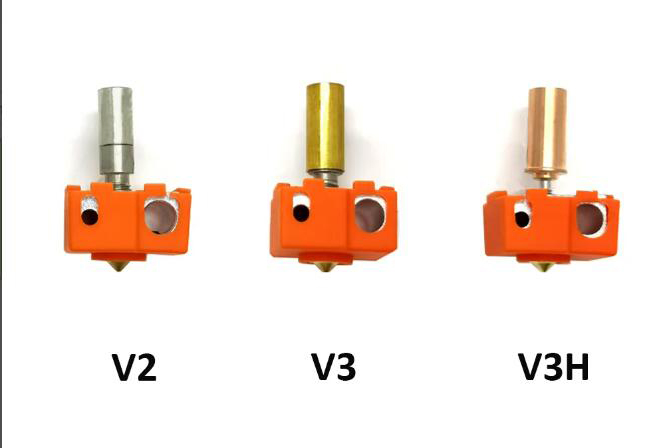
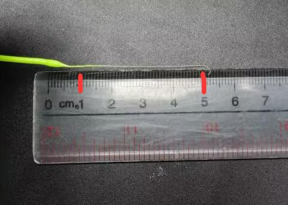
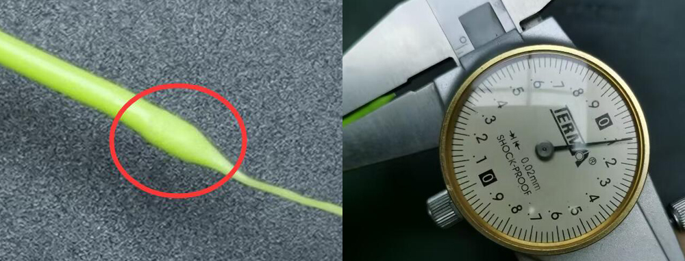
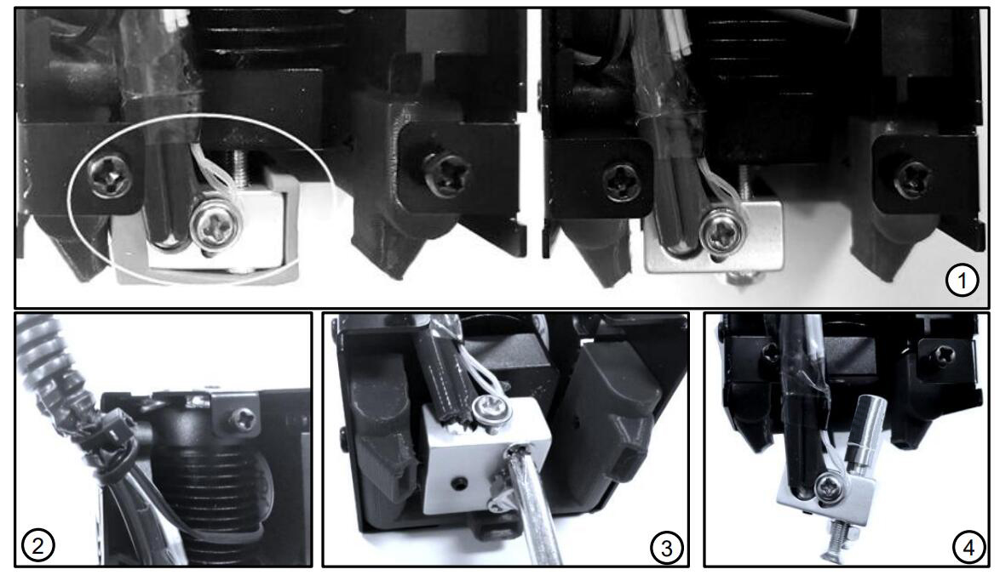
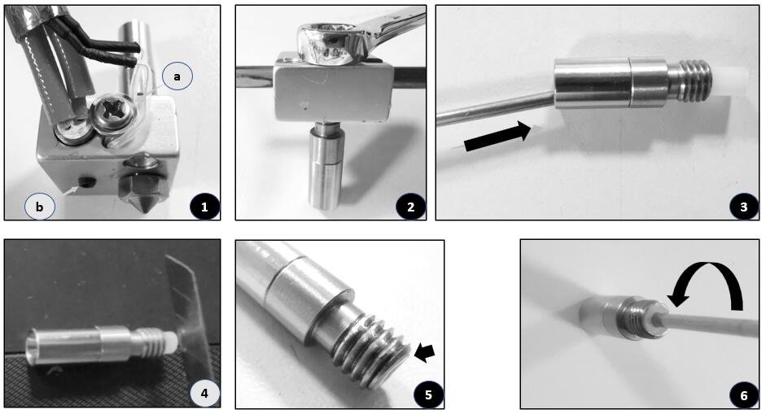

[E4FAQ1]:https://github.com/ZONESTAR3D/Upgrade-kit-guide/blob/main/HOTEND/E4/User_guide/readme.md#5-working-principle
[E4FAQ2]:https://github.com/ZONESTAR3D/Slicing-Guide/blob/master/PrusaSlicer/Custom_Gcode.md
[E4FAQ3]:https://github.com/ZONESTAR3D/Slicing-Guide/blob/master/PrusaSlicer/PrusaSlicerGuide_E4.md#step-6-set-the-print-settings
[E4FAQ4]:https://github.com/ZONESTAR3D/Slicing-Guide/blob/master/PrusaSlicer/Custom_Gcode.md#tool-change-g-code
[E4FAQ5]:https://github.com/ZONESTAR3D/Slicing-Guide/blob/master/cura/E4_hotend/readme.md#exturder-startend-gcode-of-e4-hotend
[E4FAQ6]:https://github.com/ZONESTAR3D/Upgrade-kit-guide/blob/main/HOTEND/E4/User_guide/readme.md#2-components
[BMG]: https://github.com/ZONESTAR3D/Upgrade-kit-guide/tree/main/Dual_Gear_Extruder#manual-for-upgraded-dual-gear-extruder

----
## <a id="choose-language">:globe_with_meridians: Choose language </a>

<!--  -->

-----
## Risoluzione dei problemi dell'hotend E4
Dopo aver effettuato più di 1000 test di stampa, abbiamo riepilogato i possibili problemi dell'hotend E4, in particolare le cause dell'ostruzione dei filamenti e le relative soluzioni come riferimento.
- Se non conosci il principio di funzionamento dell'hotend E4 (4-IN-1-OUT colore non mixato), ti consigliamo di leggere questo documento ([**:point_down: Principio di lavoro dell'hotend E4**](#F0 )) Primo.
- Il motivo per cui l'hotend E4 non può essere utilizzato per la stampa potrebbe non dipendere dall'hotend stesso. Pertanto, prima di esprimere un giudizio, è meglio fare riferimento a [**:point_down: Test if the hot end can work normal**](#F1) per verificare semplicemente se l'hot end E4 può funzionare normalmente.
- Se l'hotend E4 riesce sostanzialmente a completare la stampa, ma sono presenti difetti sulla parte stampata, fare riferimento a [**:point_down: Problema di difetti di stampa**](#F2).
- Se il tuo hotend E4 presenta spesso blocchi gravi, fai riferimento a [**:point_down: serious clogged issue**](#F3).

-----
###  Alcune cose da sapere sull'hotend E4
#### :one: [Principio di funzionamento dell'hotend E4][E4FAQ1]
Se non ti è chiaro il principio di funzionamento di E4, fai clic su [**qui**][E4FAQ1] per visualizzarlo, per capire come funziona E4 ti aiuterà a capire il problema e il motivo che lo ha causato.
#### :two: Breve descrizione della struttura dell'hotend E4
Per navigare meglio tra i seguenti documenti, leggi questa sezione per conoscere i nomi e le funzioni di ciascuna parte dell'hotend E4.
Ci sono due versioni dell'hotend E4 che vendiamo (E4_V2 ed E4_V3), non ci sono molte differenze nell'uso e nella qualità di stampa.
**Cosa ha migliorato E4_V3:**
- Modificare la struttura dell'imbuto per aiutare il filamento a entrare senza problemi nell'ugello.
- Aggiungere un tubo in rame per migliorare la dissipazione del calore della gola (parte di rottura del calore).

:warning: Se è necessario sostituire parti/accessori dell'hotend E4, distinguere la versione in uso.
#### Descrizione delle parti:
>
     1. Raccordo (articolazione tracheale PC4) 2. Dissipatore di calore 3. Collettore a imbuto (E4V2) 4. Interruzione di calore (gola)
     5. Tubo interno in PTFE (E4V2) 6. Blocco riscaldante 7. Ugello 8. Tubo in rame (E4V3) 9. Collettore a imbuto (E4V3)
- :pushpin: Abbiamo aggiornato le dimensioni del blocco di alluminio riscaldante e il nuovo blocco di alluminio riscaldante è simmetrico a sinistra e a destra, quindi non bloccherà l'uscita dell'aria della ventola dell'estrusore. Inoltre, sono state aggiunte delle viti per fissare il termistore.
- :pushpin: Abbiamo lanciato un kit di riscaldamento V3H, è adatto per la stampa di filamenti ad alta temperatura come PC, PET, PA, ecc..

#### :three: Scegli il filamento appropriato 
L'hotend E4 può essere applicato a un'ampia gamma di filamenti come ABS, PLA, PLA+, PETG, ecc. Ma come sai, quando si cambia l'estrusore, un filamento verrà scaricato dall'hotend e quindi ricaricato un altro filamento. Pertanto, le seguenti caratteristiche del filamento potrebbero non essere adatte all'hotend E4:
1. **Si espande troppo dopo il riscaldamento** -- non può entrare nell'hotend quando viene ricaricato.
2. **Troppo morbido** -- è facile che venga graffiato dall'ingranaggio dell'estrusore durante operazioni di carico/scarico multiplo.
3. **Con un lungo cordoncino dopo averlo scaricato** -- blocca il filamento e entra nell'hotend.

Al fine di migliorare la tenacia, la fluidità e l'aspetto del filamento, i produttori del filamento aggiungeranno alcuni additivi al filamento, ciò potrebbe far sì che il filamento abbia queste caratteristiche "inavvicinabili" all'hotend E4, quindi ti suggeriamo di eseguire i passaggi seguenti per verificare prima di utilizzare un nuovo filamento: **Riscaldare l'ugello >> caricare manualmente il filamento nell'hotend >> spurgare un piccolo filamento (50 mm circa) >> estrarlo lentamente dall'hotend >> controllare le dimensioni e la lunghezza delle corde sul fine del filamento.**

-----
###  Verifica se l'hot-end può funzionare normalmente

#### 1. Riscaldare l'hotend (ugello) a 200 ℃.
#### 2. Caricare i filamenti uno per uno in ciascun canale dell'hot end e osservare se il filamento riesce a fuoriuscire dall'ugello.
:warning: **Nota:**
- **Tagliare l'estremità anteriore piatta prima di caricare il filamento**
- **Spingere lentamente (<2mm/s) il filamento quando raggiunge l'ugello.**
- **Utilizzare una velocità maggiore (>10mm/s) quando si estraggono i filamenti.**

-----
###  La stampa può essere completata normalmente, ma sono presenti difetti sugli oggetti stampati
Potresti anche riscontrare un problema del genere: nella maggior parte dei casi, la stampa può essere eseguita normalmente, ma ci sono difetti evidenti quando si stampa su determinati strati e occasionalmente si sente il rumore Kaka anomalo dell'estrusore durante la stampa.
##### :pill: Soluzione 
Questo problema è solitamente causato dal mancato caricamento e scaricamento del filamento quando si cambia estrusore, seguire i passaggi seguenti per verificare:
- [:point_up: **Controllare la pressione dell'estrusore**](#HOW1)
- **Controllare o sostituire il filamento**[:point_up: 1](#Q5) [:point_up: 2](#Q6) [:point_up: 3](#scegli filamento).
- [**Aggiungi la lunghezza di trazione e spinta modificando le impostazioni di slicing**](#A5).
- [**Reinstallare la parte termica dell'hotend**](#HOW2)
- **Controllare le guide in PTFE collegate all'estrusore e all'hotend.** Dopo un periodo di utilizzo, il tubo in PTFE potrebbe deformarsi (in particolare la parte che collega i raccordi), il che aumenta notevolmente la resistenza del filamento a muoversi all'interno del PTFE tubi.
- **:+1: Aggiornamento agli estrusori a doppia marcia.** L'estrusore a doppia marcia può aumentare notevolmente la forza di spinta e trazione del filo sottile, riducendo la possibilità di blocco causato dalla rimozione non fluida del filo sottile dall'estremità calda.
- [**Sostituisci un nuovo hotend.**](https://bit.ly/39qDtKp)

-----
###  L'hot end E4 è spesso seriamente bloccato e completamente incapace di stampare
Se riscontri un grave problema di blocco nell'hotend, ad esempio il filamento non può essere estratto dall'hotend, il filamento è attorcigliato e deformato nel collettore a imbuto dell'hotend, segui i seguenti passaggi per verificare:
:avviso:**NOTA:avviso: Se la tua macchina è dotata di sensori di esaurimento del filamento, si consiglia di bypassarli prima e lasciare che i filamenti si carichino direttamente negli estrusori, fare riferimento a [:point_right: qui](./E4FAQ -4.jpg)**.

#### :one: La ventola di raffreddamento dell'hotend funziona bene? 
La **[VENTOLA di raffreddamento dell'hotend E4][E4FAQ6]** dovrebbe funzionare (può funzionare sempre o funzionare quando la temperatura dell'ugello è superiore a 60 °C). Se la VENTOLA di raffreddamento non funziona, è facile che l'hotend si blocchi.

#### :two: L'ugello è troppo vicino alla piastra di stampa? 
Se l'ugello è troppo vicino alla piastra di stampa (piano caldo), il filamento non può essere estruso dall'ugello durante la stampa, ciò potrebbe causare il blocco dell'hotend, nei casi più gravi, potrebbe causare la torsione del filamento nell'imbuto collezionista di hotend. Questo problema si verifica solitamente durante la stampa del primo strato.
##### :pill: Soluzione 
- Quando si stampa il primo strato, utilizzare il menu **piccoli passi** per regolare la distanza dall'ugello alla piastra di stampa.
- Durante il taglio prestare attenzione alla regolazione dell'altezza del primo strato (150% dello spessore dello strato o 80% del diametro dell'ugello).

#### :three: l'estrusore riesce a spingere e tirare bene i filamenti? 
Se l'estrusore non riesce a spingere o tirare bene il filamento, potrebbe bloccarlo nell'hotend e bloccare l'ingresso di un nuovo filamento,
##### :pill: Soluzione 
1. Controllare e regolare la pressione dell'estrusore, fare riferimento a [:point_right: **qui**](#HOW1).
2. **L'aggiornamento agli estrusori a doppia marcia può risolvere efficacemente il problema dello scivolamento delle filettature sottili, fare riferimento a [:point_right: qui][BMG]**.

#### :four: Le impostazioni di slicing sono corrette? 
Se l'hotend funziona bene durante la stampa del file gcode di prova fornito da noi, ma si blocca facilmente quando si stampa il file gcode con il tuo affettamento, controlla le impostazioni di affettamento, in particolare i seguenti parametri:
1. Per la lunghezza e la velocità di trazione/spinta su ***"cambio estrusore"***, fare riferimento a **[:point_right: qui][E4FAQ2]**.
2. L'impostazione di ***"Lunghezza di retrazione"*** non deve essere maggiore di 10 mm, fare riferimento a **[:point_right: qui][E4FAQ3]**.
3. Se il volume dei filamenti estrusi da un estrusore nello stesso strato è inferiore a 10 mm, esiste una certa probabilità di intasamento. quindi quando disegni stampe 3D multicolori o dipingi colori su un modello 3D in PrusaSlicer, presta attenzione alla dimensione minima sullo stesso livello.

#### :five: Quando il filamento viene estratto dall'hotend, ci saranno dei fili lunghi? 
Ci saranno delle "stringhe" all'estremità dei filamenti estratti dall'hotend, se le stringhe sono troppo lunghe (per la lunghezza di trazione/spinta predefinita di 80 mm, la lunghezza delle stringhe deve essere inferiore a 45 mm), potrebbe bloccare l'ingresso del filamento l'hotend.
##### 
##### :pill: Soluzione 
- Modificare la lunghezza push/pull quando si cambia estrusore nel "codice G cambio utensile". Per i dettagli, fare riferimento a **[:point_right: PrusaSlicer][E4FAQ4] [:point_right: Cura Silcer][E4FAQ5]**.
- Sostituisci un nuovo filamento con corde più corte, solitamente la lunghezza della corda è: **ABS <(*più corto di*) PLA+ < PLA < PLA-Slik.**
- Modificare la temperatura dell'ugello durante la stampa/slicing.

#### :six: Quando il filamento viene estratto dall'hotend, la parte anteriore diventerà troppo spessa? 
Quando si cambia l'estrusore, l'estremità del filamento estratto potrebbe diventare leggermente più spessa dell'originale, l'hotend E4 consente che il diametro massimo del filamento sia 2,2 mm. Se l'estremità diventa troppo spessa e supera il diametro consentito, il filamento potrebbe non entrare normalmente nell'ugello.
##### 
##### :pill: Soluzione 
1. Sostituire i filamenti.
2. Questo problema potrebbe essere dovuto al fatto che anche il tubo interno in PTFE è deformato (per E4V2), fare riferimento a [:point_right: **qui**](#HOW3) per sostituirlo.

-----
## Manuale di installazione e manutenzione
### :hammer: Come sostituire il raccordo dell'hotend E4

#### [:gift: **Link vendita raccordi**](https://www.aliexpress.com/item/3256801261619202.html)

### :hammer: Come regolare la pressione dell'estrusore su un valore corretto 
1. Caricare i filamenti negli estrusori ma non caricarli nell'hotend, vale a dire, non collegare la guida PTFE all'hotend, come mostrato in [:point_right: **questa Fig**](./E4FAQ-5.jpg).
2. Prova a tenere il filamento con il pollice e l'indice, quindi ruota manualmente l'ingranaggio dell'estrusore.
#### 
se non riesci a tenere il filamento con le dita, la pressione dell'estrusore è sufficiente. In caso contrario, regolare la pressione dell'estrusore.
#### 
:warning: **Si prega di notare che la pressione deve essere regolata in modo appropriato, ma non più grande è, meglio è**. Perché la stessa posizione del filamento potrebbe essere spinta avanti e indietro dall'ingranaggio durante la stampa, il che potrebbe causare graffi al filamento. Il filamento graffiato non può essere trasmesso all'ugello durante la stampa e anche il filamento non può entrare normalmente nell'hotend.

###  [:hammer: come smontare l'hotend E4](./How_to_disassemble_E4_hotend/readme.md)
Se il filamento è ostruito all'interno dell'hotend e non può essere estratto e inserito, è necessario smontare l'hotend e pulirlo, procedendo come segue:
#### :warning: Attendi che l'hotend si raffreddi prima di utilizzarlo. :warning:

1. Rimuovere il gruppo hotend dal supporto X della stampante 3D e rimuovere il manicotto isolante in silicone.
2. Rimuovi il cavo dall'alloggiamento dell'hotend.
3. Allentare le 2 viti che fissano l'hotend.
4. Estrarre l'hotend dal dissipatore di calore.

### :hammer: Come sostituire il tubo interno in PTFE (solo per E4V2) 
Se il blocco è facile, si consiglia di sostituire anche il tubo in PTFE integrato, procedendo come segue:
#### 
1. Rimuovere le viti che fissavano il sensore di temperatura e il riscaldatore e smontare il sensore di temperatura e il riscaldatore.
2. Utilizzare una chiave per rimuovere l'ugello.
3. Rimuovere il tubo in PTFE incorporato da sostituire.
4. Installare un nuovo tubo in PTFE e utilizzare un taglierino per tagliarlo.
5. Il tubo in PTFE deve essere circa 0,5 mm più lungo della gola oppure può essere direttamente a filo.
6. Utilizzare una piccola bacchetta metallica per girarlo all'interno, perché quando si taglia il tubo in PTFE, il suo diametro interno potrebbe assottigliarsi.
7. Reinstallare l'hotend in ordine inverso.

-----