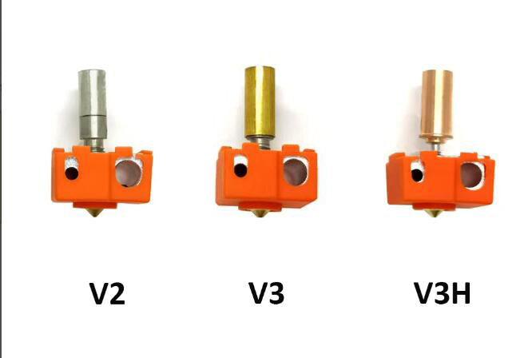
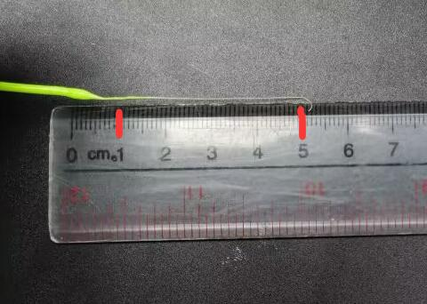
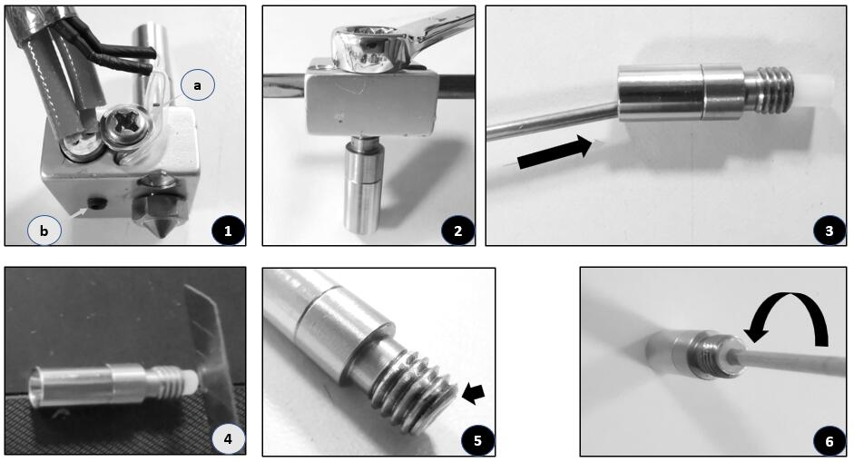

[E4FAQ1]:https://github.com/ZONESTAR3D/Upgrade-kit-guide/blob/main/HOTEND/E4/User_guide/readme.md#5-working-principle
[E4FAQ2]:https://github.com/ZONESTAR3D/Slicing-Guide/blob/master/PrusaSlicer/Custom_Gcode.md
[E4FAQ3]:https://github.com/ZONESTAR3D/Slicing-Guide/blob/master/PrusaSlicer/PrusaSlicerGuide_E4.md#step-6-set-the-print-settings
[E4FAQ4]:https://github.com/ZONESTAR3D/Slicing-Guide/blob/master/PrusaSlicer/Custom_Gcode.md#tool-change-g-code
[E4FAQ5]:https://github.com/ZONESTAR3D/Slicing-Guide/blob/master/cura/E4_hotend/readme.md#exturder-startend-gcode-of-e4-hotend
[E4FAQ6]:https://github.com/ZONESTAR3D/Upgrade-kit-guide/blob/main/HOTEND/E4/User_guide/readme.md#2-components
[BMG]: https://github.com/ZONESTAR3D/Upgrade-kit-guide/tree/main/Dual_Gear_Extruder#manual-for-upgraded-dual-gear-extruder

----
## <a id="choose-language">:globe_with_meridians: Choose language </a>

<!--  -->

-----
## E4 ホットエンドのトラブルシューティング
1000 回以上の印刷テストを行った結果、E4 ホットエンドで考えられる問題、特にフィラメントの詰まり (詰まり) の原因とその解決策をまとめましたので、ご参照ください。
- E4 (4-IN-1-OUT 非混合色) ホットエンドの動作原理がわからない場合は、このドキュメントを読むことをお勧めします ([**:point_down:E4 ホットエンドの動作原理**](#F0) ）） 初め。
- E4 ホット エンドを印刷に使用できない理由は、ホット エンド自体にあるわけではない可能性があります。 したがって、判断する前に、[**:point_down:ホット エンドが正常に動作するかどうかをテストする**](#F1) を参照して、E4 ホット エンドが正常に動作するかどうかを簡単にテストすることをお勧めします。
- E4 ホットエンドは基本的に印刷を完了できるが、印刷部分に欠陥がある場合は、[**:point_down:印刷欠陥の問題**](#F2) を参照してください。
- E4 ホットエンドに深刻な詰まりが頻繁に発生する場合は、[**:point_down:深刻な詰まりの問題**](#F3) を参照してください。

-----
###  E4 ホットエンドについて知っておくべきこと
#### :one: [E4 ホットエンドの動作原理][E4FAQ1]
E4 の動作原理がよくわからない場合は、[**ここ**][E4FAQ1] をクリックして参照してください。E4 の動作原理を理解すると、問題とその原因を理解するのに役立ちます。
#### :two: E4 ホットエンド構造の概要
次のドキュメントをよりよく参照するには、このセクションを読んで、E4 ホットエンドの各部分の名前と機能を理解してください。
当社が販売している E4 ホットエンドには 2 つのバージョン (E4_V2 と E4_V3) がありますが、使用方法や印刷品質に大きな違いはありません。
**E4_V3 の改善点:**
- フィラメントがノズルにスムーズに入るようにファンネル構造を変更しました。
・スロート(ヒートブレイク部)の放熱性を高めるクーパーチューブを追加。

:warning: E4 ホットエンドの部品/付属品を交換する必要がある場合は、お持ちのバージョンを区別してください。
#### 部品の説明:
>
     1. フィッティング (PC4 気管ジョイント) 2. ヒートシンク 3. ファンネルコレクター (E4V2) 4. ヒートブレーク (スロート)
     5. インナー PTFE チューブ (E4V2) 6. 加熱ブロック 7. ノズル 8. 銅管 (E4V3) 9. ファンネルコレクター (E4V3)
- :pushpin: 加熱アルミニウムブロックのサイズを更新し、新しい加熱アルミニウムブロックは左右対称であるため、押出機ファンの空気出口を妨げません。 さらに、サーミスタを固定するためのネジが追加されました。
- :pushpin: PC、PET、PAなどの高温フィラメントの印刷に適したV3H加熱キットを発売しました。

#### :three: 適切なフィラメントを選択してください
E4 ホットエンドは、ABS、PLA、PLA+、PETG などの幅広いフィラメントに適用できます。ただし、ご存知のとおり、押出機を切り替える際、フィラメントがホットエンドからアンロードされ、別のフィラメントが再ロードされます。 したがって、フィラメントの次の特性は E4 ホットエンドには適さない可能性があります。
1. **加熱後に膨張しすぎる** -- 再ロード時にホットエンドに入ることができません。
2. **柔らかすぎる** -- 複数回のロード/アンロード中に押出機のギアによって傷がつきやすくなります。
3. **アンロード後の長い文字列** -- フィラメントがホットエンドに入るのをブロックします。

フィラメントの粘り、流動性、外観を改善するために、フィラメントメーカーはフィラメントにいくつかの添加剤を追加します。これにより、フィラメントが E4 ホットエンドにとって「近づきがたい」特性を持つ可能性があります。そのため、以下の手順を実行して確認することをお勧めします。 新しいフィラメントを使用する前に: **ノズルを加熱します >> 手動でフィラメントをホットエンドにロードします >> フィラメントを少し (50mm 程度) パージします >> ホットエンドからゆっくりと引き出します >> サイズと弦の長さを確認してください フィラメントの端。**

-----
###  ホットエンドが正常に動作するかどうかをテストします。

#### 1. ホットエンド(ノズル)を200℃に加熱します。
#### 2. ホットエンドの各チャネルにフィラメントを 1 本ずつ装填し、フィラメントがノズルから流れ出るかどうかを確認します。
:warning: **注意してください:**
- **フィラメントをロードする前に前端を平らに切ります**
- **フィラメントがノズルに到達したら、ゆっくりと押し込みます (<2mm/s)。**
- **フィラメントを引き出すときは、より速い速度 (>10mm/s) を使用してください。**

-----
###  印刷は正常に完了しましたが、印刷物に欠陥がありました
また、ほとんどの場合は正常に印刷できるが、特定の層に印刷する際に明らかな不具合が発生したり、印刷中にエクストルーダーの「カカッ」という異音が聞こえることがあります。
##### :pill: 解決策 
この問題は通常、エクストルーダーを切り替えるときにフィラメントのロードおよびアンロードに失敗することが原因で発生します。以下の手順に従って確認してください。
- [:point_up: **押出機の圧力を確認してください**](#HOW1)
- **フィラメントを確認または交換**[:point_up: 1](#Q5) [:point_up: 2](#Q6) [:point_up: 3](#choosefilament)。
- [**スライス設定を変更してプルとプッシュの長さを追加します**](#A5)。
- [**ホットエンドのヒート部分を再取り付けします**](#HOW2)
- **エクストルーダーとホットエンドに接続されている PTFE ガイドを確認してください。** 一定期間使用すると、PTFE チューブが変形する可能性があり (特にフィッティングを接続する部分)、PTFE 内でのフィラメントの移動に対する抵抗が大幅に増加します。 チューブ。
- **:+1: デュアルギア押出機へのアップグレード。** ダブルギア押出機は細線を押したり引いたりする力を大幅に増加させることができ、ホットエンドから細線がスムーズに取り外せないことによる詰まりの可能性を減らします。
- [**新しいホットエンドを交換します。**](https://bit.ly/39qDtKp)

-----
###  E4 ホットエンドが深刻にブロックされ、完全に印刷できないことがよくあります
ホットエンドからフィラメントが引き出せない、ホットエンドのファンネルコレクター内でフィラメントがねじれて変形しているなど、ホットエンドに重大な詰まりの問題が見つかった場合は、次の手順に従って確認してください。
:warning: 注 :warning: **お使いのマシンにフィラメント切れセンサーが装備されている場合は、最初にそれらをバイパスし、フィラメントを押出機に直接ロードすることをお勧めします。[:point_right: here](./E4FAQ) を参照してください。 -4.jpg)**。

#### :one: ホットエンドの冷却ファンはうまく機能していますか? 
**[E4 ホットエンドの冷却 FAN][E4FAQ6]** が動作するはずです (常時動作することも、ノズル温度が 60 °C を超える場合にも動作することもできます)。 冷却ファンが機能しない場合、ホットエンドが詰まりやすくなります。

#### :two: ノズルが印刷版に近すぎませんか? 
ノズルが印刷版 (ホットベッド) に近すぎると、印刷時にフィラメントをノズルから押し出すことができず、ホットエンドが詰まる可能性があり、ひどい場合には、ファンネル内でフィラメントがねじれる可能性があります。 ホットエンドのコレクター。 この問題は通常、最初のレイヤーを印刷するときに発生します。
##### :pill: 解決策 
- 最初のレイヤーを印刷するときは、**ベイビーステップ** メニューを使用して、ノズルから印刷版までの距離を調整します。
・スライスする際は、1層目の高さ（層厚の150％またはノズル径の80％）の設定に注意してください。

#### :three: エクストルーダーはフィラメントをうまく押したり引いたりできますか? 
エクストルーダーがフィラメントをうまく押したり引いたりできない場合、フィラメントがホットエンド内で停滞し、新しいフィラメントの挿入が妨げられる可能性があります。
##### :pill: ソリューション 
1. エクストルーダーの圧力を確認して調整します。[:point_right: **ここ**](#HOW1) を参照してください。
2. **デュアル ギア エクストルーダーにアップグレードすると、細かい糸が滑る問題を効果的に解決できます。[:point_right: here][BMG]** を参照してください。

#### :four: スライスの設定は正しいですか? 
弊社が提供したテスト gcode ファイルを印刷するときはホットエンドがうまく動作するのに、独自のスライスで gcode ファイルを印刷すると簡単にブロックされる場合は、スライス設定、特に次のパラメータを確認してください。
1. ***「スイッチング押出機」*** の長さとプル/プッシュ速度については、**[:point_right: here][E4FAQ2]** を参照してください。
2. ***「後退長」*** の設定は 10mm を超えてはなりません。**[:point_right: here][E4FAQ3]** を参照してください。
3. 押出機で同層に押し出されるフィラメントの体積が10mm未満の場合、一定の確率で目詰まりが発生します。 そのため、PrusaSlicer で複数色の 3D プリントを描画したり、3D モデルに色をペイントしたりする場合は、同じレイヤーの最小サイズに注意してください。
<!-- [**この図**](./small_parts.jpg) に示すとおり。 -->

#### :five: ホットエンドからフィラメントを引き抜くと、長い糸が出てきますか? 
ホットエンドから引き出されたフィラメントの端には「糸」があり、糸が長すぎると (デフォルトの 80 mm のプル/プッシュ長の場合、糸の長さは 45 mm 未満である必要があります)、フィラメントの挿入をブロックする可能性があります。 ホットエンド。
##### 
##### :pill: 解決策 
- 「ツール交換 G コード」で押出機切り替え時のプッシュ/プル長さを変更します。 詳細については**[:point_right: PrusaSlicer][E4FAQ4] [:point_right: Cura Silcer][E4FAQ5]**を参照してください。
- 新しいフィラメントを短い弦に交換します。通常、弦の長さは次のとおりです: **ABS <(*より短い*) PLA+ < PLA < PLA-Slik.**
- 印刷/スライス時のノズル温度を変更します。

#### :six: ホットエンドからフィラメントを引き抜くと、先端部分が太くなりすぎませんか？ 
エクストルーダーを切り替えると、引き出されたフィラメントの端が元のフィラメントよりわずかに太くなる場合がありますが、E4 ホットエンドでは最大フィラメント直径が 2.2 mm まで許容されます。 先端が太くなりすぎて許容径を超えると、フィラメントが正常にノズルに入らなくなる場合があります。
##### 
##### :pill: 解決策 
1. フィラメントを交換します。
2. この問題は、内側の PTFE チューブも変形していることが原因である可能性があります (E4V2 の場合)。[:point_right: **こちら**](#HOW3) を参照して交換してください。

-----
## セットアップおよびメンテナンスマニュアル
### :hammer: E4ホットエンドのフィッティングを交換する方法

#### [:gift: **フィッティング販売リンク**](https://www.aliexpress.com/item/3256801261619202.html)

### :hammer: エクストルーダーの圧力を適切な値に調整する方法 
1. フィラメントを押出機にロードしますが、ホットエンドにはロードしません。つまり、図に示すように、PTFE ガイドをホットエンドに接続しません。[:point_right: **この図**](./E4FAQ-5.jpg) に示すように。
2. 親指と人差し指でフィラメントを持ち、エクストルーダーのギアを手で回してみてください。
#### 
指でフィラメントを保持できない場合は、エクストルーダーの圧力で十分です。 そうでない場合は、エクストルーダーの圧力を調整します。
#### 
:warning: **圧力は適切に調整する必要がありますが、大きければ大きいほど良いというわけではないことに注意してください**。 印刷中にフィラメントの同じ位置がギアによって前後に押される可能性があり、フィラメントに傷が付く可能性があるためです。 傷ついたフィラメントは印刷中にノズルに伝わらず、フィラメントさえも正常にホットエンドに入ることができません。

###  [:hammer: E4 ホットエンドを逆アセンブルする方法](./How_to_disassemble_E4_hotend/readme.md)
フィラメントがホットエンド内で詰まり、抜き差しできない場合は、次の手順でホットエンドを分解して掃除する必要があります。
#### :warning: ホットエンドが冷えるまで待ってから操作してください。:warning:

1. 3D プリンターの X キャリアからホットエンド アセンブリを取り外し、シリコン絶縁スリーブを取り外します。
2. ホットエンドのハウジングからケーブルを取り外します。
3. ホットエンドを固定している 2 本のネジを緩めます。
4. ホットエンドをヒートシンクから引き出します。

### :hammer: 内側の PTFE パイプの交換方法 (E4V2 のみ) 
詰まりが発生しやすい場合は、以下の手順で内蔵PTFEパイプも交換することをお勧めします。
#### 
1. 温度センサーとヒーターを固定しているネジを外し、温度センサーとヒーターを取り外します。
2. レンチを使用してノズルを取り外します。
3. 交換する内蔵PTFEパイプを取り外します。
4. 新しい PTFE パイプを取り付け、ペーパー カッターを使用して切断します。
5. PTFE パイプはスロートより約 0.5 mm 長くするか、直接面一にすることもできます。
6. PTFEパイプを切断すると内径が細くなるため、小さな金属の細い棒を使って内側に回してください。
7. 逆の順序でホットエンドを再度取り付けます。

-----

