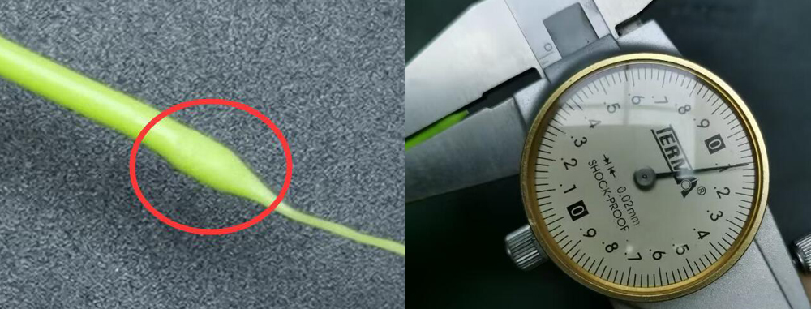

[E4FAQ1]:https://github.com/ZONESTAR3D/Upgrade-kit-guide/blob/main/HOTEND/E4/User_guide/readme.md#5-working-principle
[E4FAQ2]:https://github.com/ZONESTAR3D/Slicing-Guide/blob/master/PrusaSlicer/Custom_Gcode.md
[E4FAQ3]:https://github.com/ZONESTAR3D/Slicing-Guide/blob/master/PrusaSlicer/PrusaSlicerGuide_E4.md#step-6-set-the-print-settings
[E4FAQ4]:https://github.com/ZONESTAR3D/Slicing-Guide/blob/master/PrusaSlicer/Custom_Gcode.md#tool-change-g-code
[E4FAQ5]:https://github.com/ZONESTAR3D/Slicing-Guide/blob/master/cura/E4_hotend/readme.md#exturder-startend-gcode-of-e4-hotend
[E4FAQ6]:https://github.com/ZONESTAR3D/Upgrade-kit-guide/blob/main/HOTEND/E4/User_guide/readme.md#2-components
[BMG]: https://github.com/ZONESTAR3D/Upgrade-kit-guide/tree/main/Dual_Gear_Extruder#manual-for-upgraded-dual-gear-extruder

----
## <a id="choose-language">:globe_with_meridians: Choose language </a>

<!--  -->

-----
## Solução de problemas do hotend E4
Após realizar mais de 1000 testes de impressão, resumimos os possíveis problemas no hotend E4, especialmente as causas do(s) filamento(s) entupido(s) e suas soluções para sua referência.
- Se você não conhece o princípio de funcionamento do hot end E4 (4-IN-1-OUT Non mix color), sugerimos que você leia este documento ([**:point_down:E4 hotend work Principle**](#F0 )) primeiro.
- O motivo pelo qual o hot end E4 não pode ser usado para impressão pode não ser o próprio hot end. Portanto, antes de fazer um julgamento, é melhor consultar [**:point_down:Test if the hot end can work normalmente**](#F1) para simplesmente testar se o hot end E4 pode funcionar normalmente.
- Se o seu hot end E4 puder basicamente concluir a impressão, mas houver defeitos na parte impressa, consulte [**:point_down:Problema de defeito de impressão**](#F2).
- Se o seu hot end E4 costuma apresentar bloqueios graves, consulte [**:point_down:problema sério de obstrução**](#F3).

-----
###  Algumas coisas que você deve saber sobre o hotend E4
#### :one: [Princípio de ativação do hotend E4][E4FAQ1]
Se você não tiver certeza sobre o princípio de funcionamento do E4, clique [**aqui**][E4FAQ1] para visualizá-lo, entender como o E4 funciona o ajudará a entender o problema e o motivo que o causou.
#### :two: Resumo da estrutura do hotend E4
Para melhor navegar nos documentos a seguir, leia esta seção para conhecer os nomes e funções de cada parte do hotend E4.
Existem duas versões do hotend E4 que vendemos (E4_V2 e E4_V3), não há muita diferença no uso e na qualidade de impressão.
**O que o E4_V3 melhorou:**
- Modifique a estrutura do funil para ajudar o filamento a entrar suavemente no bico.
- Adicione um tubo de cobre para melhorar a dissipação de calor da garganta (parte de quebra de calor).

:warning: Se você precisar substituir peças/acessórios do hotend E4, diferencie a versão que você possui.
#### Descrição das peças:
>
     1. Encaixe (junta traqueal PC4) 2. Dissipador de calor 3. Coletor de funil (E4V2) 4. Quebra de calor (garganta)
     5. Tubo interno de PTFE (E4V2) 6. Bloco de aquecimento 7. Bico 8. Tubo de cobre (E4V3) 9. Coletor de funil (E4V3)
:pushpin: Atualizamos o tamanho do bloco de alumínio de aquecimento, e o novo bloco de alumínio de aquecimento é simétrico à esquerda e à direita, por isso não bloqueará a saída de ar do ventilador da extrusora. Além disso, foram adicionados parafusos para fixar o termistor.
:pushpin: Lançamos um kit de aquecimento V3H, é adequado para imprimir filamentos de alta temperatura como PC, PET, PA, etc..

#### :three: Escolha o filamento apropriado 
O hotend E4 pode ser aplicado a uma ampla gama de filamentos, como ABS, PLA, PLA+, PETG, etc. Mas como você sabe, ao trocar a extrusora, um filamento será descarregado do hotend e então recarregará o filamento anthoer. Portanto, as seguintes características do filamento podem não ser boas para o hotend E4:
1. **Expande muito depois de aquecido** - não pode entrar no hotend ao recarregar.
2. **Muito macio** - fácil de ser arranhado pela engrenagem da extrusora durante múltiplas cargas/descargas.
3. **Com cordas longas depois de descarregadas** - bloqueie o filamento entre no hotend.

Para melhorar a tenacidade, fluidez e aparência do filamento, os fabricantes do filamento adicionarão alguns aditivos ao filamento, isso pode fazer com que o filamento tenha essas características “inacessíveis” ao hotend E4, por isso sugerimos que você execute os passos abaixo para verificar antes de usar um novo filamento: **Aquecer o bocal >> carregar manualmente o filamento no hotend >> purgar um pouco do filamento (50mm ou mais) >>puxe-o para fora do hotend lentamente>> verifique o tamanho e o comprimento das cordas no fim do filamento.**

-----
###  Teste se o hot end pode funcionar normalmente

#### 1. Aqueça a extremidade quente (bocal) a 200 ℃.
#### 2. Carregue os filamentos em cada canal do hot end, um por um, e observe se o filamento pode fluir para fora do bocal.
:warning: **Atenção:**
- **Corte a extremidade frontal plana antes de carregar o filamento**
- **Empurre lentamente (<2 mm/s) o filamento quando ele atingir o bico.**
- **Use uma velocidade mais rápida (>10 mm/s) ao retirar os filamentos.**

-----
###  A impressão pode ser concluída normalmente, mas há defeitos nos objetos impressos
Você também pode encontrar esse problema: geralmente, a impressão pode ser realizada normalmente, mas há defeitos óbvios ao imprimir em certas camadas, e o ruído Kaká anormal da extrusora é ocasionalmente ouvido durante a impressão.
##### :pill: Solução 
Este problema geralmente é causado por falha ao carregar e descarregar o filamento ao trocar a extrusora. Siga as etapas abaixo para verificar:
- [:point_up: **Verifique a pressão da extrusora**](#HOW1)
- **Verifique ou substitua o filamento**[:point_up: 1](#Q5) [:point_up: 2](#Q6) [:point_up: 3](#choosefilament).
- [**Adicione comprimento de puxar e empurrar modificando as configurações de corte**](#A5).
- [**Reinstale a parte de aquecimento do hotend**](#HOW2)
- **Verifique as guias de PTFE que estão conectadas à extrusora e ao hotend.** Após um período de uso, o tubo de PTFE pode deformar-se (especialmente a parte que conecta as conexões), o que aumenta muito a resistência do filamento para se mover dentro do PTFE tubos.
- **:+1: Atualize para extrusoras de engrenagem dupla. ** A extrusora de engrenagem dupla pode aumentar muito a força de empurrar e puxar o fio fino, reduzindo a possibilidade de bloqueio causado por não remover suavemente o fio fino da extremidade quente.
- [**Substitua um novo hotend.**](https://bit.ly/39qDtKp)

-----
###  O hot end E4 geralmente fica seriamente bloqueado e completamente incapaz de imprimir
Se você encontrar um problema sério de bloqueio no hotend, como o filamento não pode ser retirado do hotend, o filamento está torcido e deformado no coletor de funil do hotend, siga as seguintes etapas para verificar:
:warning:**NOTA:warning: Se sua máquina estiver equipada com sensores de esgotamento de filamento, é recomendado contorná-los primeiro e deixar os filamentos carregarem diretamente nas extrusoras, consulte [:point_right: aqui](./E4FAQ-4.jpg)**.

#### :one: A ventoinha de resfriamento funciona bem no hotend? 
O **[VENTILADOR de resfriamento do hotend E4][E4FAQ6]** deve funcionar (pode funcionar o tempo todo ou funcionar quando a temperatura do bico for superior a 60 °C). Se o ventilador de resfriamento não funcionar, é fácil bloquear o hotend.

#### :two: O bocal está muito próximo da placa de impressão? 
Se o bico estiver muito próximo da placa de impressão (hotbed), o filamento não pode ser extrudado do bico durante a impressão, pode causar o bloqueio do hotend, em casos graves, pode fazer com que o filamento seja torcido no funil colecionador de hotend. Esse problema geralmente ocorre ao imprimir a primeira camada.
##### :pill: Solução 
- Ao imprimir a primeira camada, use o menu **babysteps** para ajustar a distância do bico à placa de impressão.
- Ao fatiar preste atenção ao ajuste da altura da primeira camada (150% da espessura da camada ou 80% do diâmetro do bico).

#### :three: A extrusora consegue empurrar e puxar bem os filamentos? 
Se a extrusora não conseguir empurrar ou puxar bem o filamento, isso pode fazer com que o filamento fique preso no hotend e bloqueie a entrada de um novo filamento,
##### :pill: Solução 
1. Verifique e ajuste a pressão da extrusora, consulte [:point_right: **aqui**](#HOW1).
2. **Atualize para extrusoras de engrenagem dupla, ele pode resolver efetivamente o problema de deslizamento de fios finos, consulte [:point_right: aqui][BMG]**.

#### :four: As configurações de fatiamento estão corretas? 
Se o hotend funcionar bem ao imprimir o arquivo gcode de teste fornecido por nós, mas for facilmente bloqueado ao imprimir o arquivo gcode por seu próprio fatiado, verifique as configurações de fatiamento, especialmente os seguintes parâmetros:
1. O comprimento e a velocidade de puxar/empurrar em ***"extrusora de comutação"***, consulte **[:point_right: aqui][E4FAQ2]**.
2. A configuração de ***"Comprimento de retração"*** não deve ser superior a 10 mm, consulte **[:point_right: aqui][E4FAQ3]**.
3. Se o volume dos filamentos extrudados por uma extrusora na mesma camada for inferior a 10 mm, existe uma certa probabilidade de entupimento. portanto, ao desenhar impressões 3D multicoloridas ou pintar cores no modelo 3D no PrusaSlicer, preste atenção ao tamanho mínimo na mesma camada.
<!-- Conforme mostrado em [**esta figura**](./small_parts.jpg). -->

#### :five: Quando o filamento for retirado do hotend, haverá fios longos? 
Haverá "cordas" na extremidade dos filamentos que foram puxados para fora do hotend, se as cordas forem muito longas (para o comprimento padrão de puxar/empurrar de 80 mm, o comprimento das cordas deve ser inferior a 45 mm), isso pode bloquear a entrada do filamento o hotend.      
#####     
##### :pill: Solução 
- Modifique o comprimento push/pull na troca da extrusora em "código G de troca de ferramenta". Sobre detalhes, consulte **[:point_right: PrusaSlicer][E4FAQ4] [:point_right: Cura Silcer][E4FAQ5]**.
- Substitua um novo filamento por cordas mais curtas, geralmente o comprimento da corda é: **ABS <(*menor que*) PLA+ < PLA < PLA-Slik.**
- Modifique a temperatura do bico ao imprimir/cortar.

#### :six: Quando o filamento é puxado para fora do hotend, a extremidade frontal ficará muito grossa? 
Ao trocar a extrusora, a extremidade do filamento puxado pode ficar um pouco mais espessa do que o original, o hotend E4 permitiu que o diâmetro máximo do filamento seja de 2,2 mm. Se a extremidade ficar muito grossa e exceder o diâmetro permitido, o filamento pode não entrar normalmente no bocal.     
##### 
##### :pill: Solução 
1. Substitua os filamentos.
2. Este problema pode ser porque o tubo interno de PTFE também está deformado (para E4V2), consulte [:point_right: **aqui**](#HOW3) para substituí-lo.

-----
## Manual de configuração e manutenção
### :hammer: Como substituir a conexão do E4 Hotend

[:presente: **Link de venda de acessórios**](https://www.aliexpress.com/item/3256801261619202.html)

### :hammer: Como ajustar a pressão da extrusora para um valor adequado 
1. Carregue os filamentos nas extrusoras mas não carregue no hotend, ou seja, não conecte a guia de PTFE ao hotend, conforme mostrado em 
[:point_right: **this Fig**](./E4FAQ-5.jpg).
2. Tente segurar o filamento com o polegar e o indicador e depois gire a engrenagem da extrusora com a mão.
#### 
se não conseguir segurar o filamento com os dedos, a pressão da extrusora é suficiente. Caso contrário, ajuste a pressão da extrusora.
#### 
:warning: **Observe que a pressão deve ser ajustada adequadamente, mas não quanto maior, melhor**. Porque a mesma posição do filamento pode ser empurrada para frente e para trás pela engrenagem durante a impressão, o que pode causar arranhões no filamento. O filamento arranhado não pode ser transmitido ao bocal durante a impressão, e mesmo o filamento não pode entrar normalmente no hotend.

###  [:hammer: Como desmontar o hotend E4](./How_to_disassemble_E4_hotend/readme.md)
Se o filamento estiver entupido dentro do hotend e não puder ser puxado e empurrado, será necessário desmontar o hotend e limpá-lo, seguindo os passos a seguir:     
##### :warning: Aguarde o hotend esfriar antes da operação.:warning:

1. Remova o conjunto hotend do transportador X da impressora 3D e retire a luva de isolamento de silicone.
2. Remova o cabo do invólucro do hotend.
3. Afrouxe os 2 parafusos que fixam o hotend.
4. Retire o hotend do dissipador de calor.

### :hammer: Como substituir o tubo interno de PTFE (somente para E4V2) 
Se o bloqueio for fácil de ocorrer, é recomendável substituir também o tubo de PTFE embutido, seguindo as etapas a seguir:
#### 
1. Remova os parafusos que fixam o sensor de temperatura e o aquecedor e retire o sensor de temperatura e o aquecedor.
2. Use uma chave inglesa para remover o bico.
3. Remova o tubo de PTFE incorporado a ser substituído.
4. Instale um novo tubo de PTFE e use um cortador de papel para cortá-lo.
5. o tubo de PTFE deve ser cerca de 0,5 mm mais longo que a garganta ou pode ser nivelado diretamente.
6. Use uma pequena haste de metal fina para girá-lo para dentro, pois ao cortar o tubo de PTFE, seu diâmetro interno pode ficar mais fino.
7. Reinstale o hotend na ordem inversa.

-----