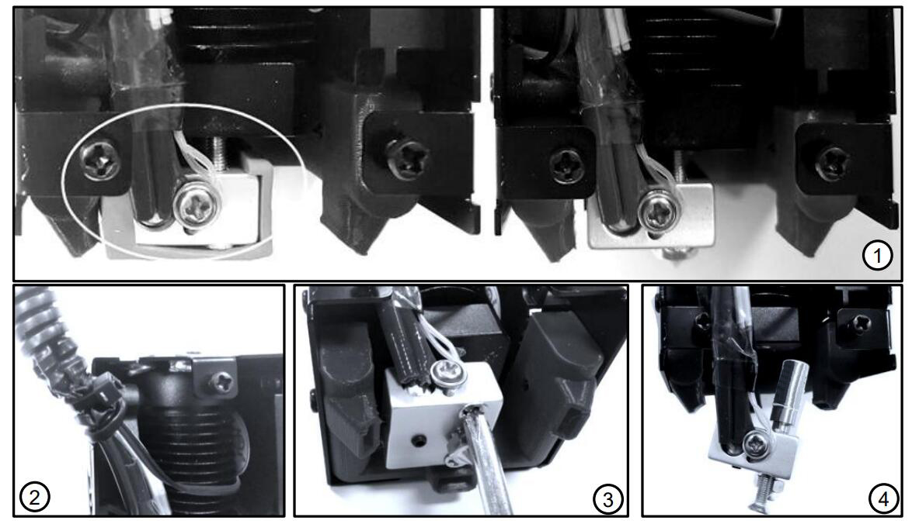

[E4FAQ1]:https://github.com/ZONESTAR3D/Upgrade-kit-guide/blob/main/HOTEND/E4/User_guide/readme.md#5-working-principle
[E4FAQ2]:https://github.com/ZONESTAR3D/Slicing-Guide/blob/master/PrusaSlicer/Custom_Gcode.md
[E4FAQ3]:https://github.com/ZONESTAR3D/Slicing-Guide/blob/master/PrusaSlicer/PrusaSlicerGuide_E4.md#step-6-set-the-print-settings
[E4FAQ4]:https://github.com/ZONESTAR3D/Slicing-Guide/blob/master/PrusaSlicer/Custom_Gcode.md#tool-change-g-code
[E4FAQ5]:https://github.com/ZONESTAR3D/Slicing-Guide/blob/master/cura/E4_hotend/readme.md#exturder-startend-gcode-of-e4-hotend
[E4FAQ6]:https://github.com/ZONESTAR3D/Upgrade-kit-guide/blob/main/HOTEND/E4/User_guide/readme.md#2-components
[BMG]: https://github.com/ZONESTAR3D/Upgrade-kit-guide/tree/main/Dual_Gear_Extruder#manual-for-upgraded-dual-gear-extruder

----
## <a id="choose-language">:globe_with_meridians: Choose language </a>

<!--  -->

-----
## Устранение неполадок хотэнда E4
После проведения более 1000 тестов печати мы обобщили возможные проблемы на хотэнде E4, особенно причины засорения (блокировки) нитей накаливания и их решения для вашей справки.
- Если вы не знаете принцип работы горячего конца E4 (4-IN-1-OUT, несмешанные цвета), мы предлагаем вам прочитать этот документ ([**:point_down: Принцип работы горячего конца E4**](#F0 )) первый.
- Причина, по которой горячий конец E4 нельзя использовать для печати, может заключаться не в самом хотэнде. Поэтому, прежде чем выносить решение, лучше всего обратиться к [**:point_down: Проверить, может ли горячий конец работать нормально**](#F1), чтобы просто проверить, может ли горячий конец E4 работать нормально.
- Если ваш горячий конец E4 в основном может завершить печать, но на напечатанной детали есть дефекты, обратитесь к [**:point_down:Проблема с дефектами печати**](#F2).
- Если на вашем хотэнде E4 часто возникают серьезные блокировки, обратитесь к [**:point_down: серьезная проблема с засорением**](#F3).

-----
###  Некоторые вещи, которые нужно знать о хотэнде E4
#### :one: [Принцип пробуждения хотенда E4][E4FAQ1]
Если вам не совсем понятен принцип работы E4, нажмите [**здесь**][E4FAQ1], чтобы просмотреть его. Чтобы понять, как работает E4, это поможет вам понять проблему и ее причину.
#### :two: Краткое описание структуры хотэнда E4
Чтобы лучше просматривать следующие документы, прочтите этот раздел, чтобы узнать названия и функции каждой части хотэнда E4.
У нас продаются две версии хотэнда E4 (E4_V2 и E4_V3), они не имеют большой разницы в использовании и качестве печати.
**Что улучшилось в E4_V3:**
- Измените конструкцию воронки, чтобы нить плавно входила в сопло.
- Добавьте медную трубку для улучшения отвода тепла от горловины (теплоразрывная часть).

:warning: Если вам необходимо заменить детали/аксессуары хотэнда E4, укажите, какая у вас версия.
#### Описание деталей:
>
     1. Фитинг (трахеальное соединение PC4) 2. Радиатор 3. Воронкообразный коллектор (E4V2) 4. Тепловой разрыв (горло)
     5. Внутренняя трубка из ПТФЭ (E4V2) 6. Нагревательный блок 7. Сопло 8. Медная трубка (E4V3) 9. Воронка-коллектор (E4V3)
- :pushpin: Мы обновили размер нагревательного алюминиевого блока, новый нагревательный алюминиевый блок симметричен слева и справа, поэтому он не блокирует выходное отверстие для воздуха вентилятора экструдера. Кроме того, были добавлены винты для фиксации термистора.
- :pushpin: Мы выпустили комплект для нагрева V3H, он подходит для печати высокотемпературными нитями, такими как ПК, ПЭТ, ПА и т. д..

#### :three: Выберите подходящую нить 
Хотенд E4 можно применять для широкого спектра нитей, таких как ABS, PLA, PLA+, PETG и т. д. Но, как вы знаете, при переключении экструдера нить будет выгружаться из хотэнда, а затем повторно загружать другую нить. Таким образом, следующие характеристики нити накаливания могут быть неподходящими для хотенда E4:
1. **Слишком сильно расширяется после нагрева** — при повторной загрузке невозможно войти в хотэнд.
2. **Слишком мягкий** — его легко поцарапать шестерней экструдера при многократной загрузке/выгрузке.
3. **С длинными струнами после разгрузки** - заблокируйте нить на входе в хотенд.

Чтобы улучшить прочность, текучесть и внешний вид нити, производители нити добавляют в нее некоторые добавки. Это может привести к тому, что нить будет иметь «недоступные» характеристики для хотэнда E4, поэтому мы предлагаем вам выполнить следующие шаги для проверки: перед использованием новой нити: **Нагрейте сопло >> вручную загрузите нить в хотэнд >> очистите немного нити (50 мм или около того) >>медленно вытащите ее из хотэнда >> проверьте размер и длину нити на конец нити.**

-----
###  Проверьте, может ли горячий конец работать нормально

#### 1. Нагрейте горячий конец (сопло) до 200 ℃.
#### 2. Поочередно загружайте нити в каждый канал хотэнда и наблюдайте, может ли нить вытечь из сопла.
:warning: **Обратите внимание:**
- **Перед загрузкой нити обрежьте переднюю часть**
- **Медленно (<2 мм/с) протолкните нить, когда она достигнет сопла.**
- **При вытягивании нитей используйте более высокую скорость (>10 мм/с).**

-----
###  Печать может быть завершена нормально, но на напечатанных объектах имеются дефекты
Вы также можете столкнуться с такой проблемой: В основном печать может выполняться нормально, но при печати на определенные слои возникают явные дефекты, а во время печати иногда слышен ненормальный кака-шум экструдера.
##### :pill: Решение 
Эта проблема обычно возникает из-за невозможности загрузки и выгрузки нити при переключении экструдера. Для проверки выполните следующие действия:
- [:point_up: **Проверьте давление экструдера**](#HOW1)
- **Проверьте или замените нить**[:point_up: 1](#Q5) [:point_up: 2](#Q6) [:point_up: 3](#choosefilament).
- [**Добавьте длину тяги и толчка, изменив настройки нарезки**](#A5).
- [**Переустановите нагревательную часть хотэнда**](#HOW2)
- **Проверьте направляющие из ПТФЭ, которые подсоединены к экструдеру и хотэнду.** После некоторого периода использования трубка из ПТФЭ может деформироваться (особенно часть, соединяющая фитинги), что значительно увеличивает сопротивление нити движению внутри ПТФЭ. трубки.
- **:+1: Обновление до экструдеров с двумя шестернями.** Экструдер с двумя шестернями может значительно увеличить силу толкания и вытягивания тонкой проволоки, уменьшая вероятность засорения, вызванного неравномерным удалением тонкой проволоки из горячего конца.
- [**Заменить новый хотэнд.**](https://bit.ly/39qDtKp)

-----
###  Hot End E4 часто серьезно блокируется и совершенно не может печатать
Если вы обнаружили серьезную проблему с засорением хотэнда, например, нить не вытягивается из хотэнда, нить перекручена и деформирована в воронкообразном коллекторе хотэнда, выполните следующие действия для проверки:
:warning: ПРИМЕЧАНИЕ :warning: **Если ваша машина оснащена датчиками окончания нити, рекомендуется сначала обойти их и позволить нитям загружаться непосредственно в экструдеры, см. [:point_right: здесь](./E4FAQ -4.jpg)**.

#### :one: Хорошо ли работает охлаждающий вентилятор хотэнда? 
**[ВЕНТИЛЯТОР охлаждения хотэнда E4][E4FAQ6]** должен работать (он может работать постоянно или работать, когда температура сопла превышает 60 °C). Если охлаждающий вентилятор не работает, хотэнд может легко засориться.

#### :two: Сопло расположено слишком близко к печатной пластине? 
Если сопло слишком близко расположено к печатной пластине (тепловой платформе), нить не может быть вытянута из сопла при печати, это может привести к блокировке хотэнда, в тяжелых случаях это может привести к перекручиванию нити в воронке. коллекционер хотендов. Эта проблема обычно возникает при печати первого слоя.
##### :pill: Решение 
- При печати первого слоя используйте меню **babysteps**, чтобы отрегулировать расстояние от сопла до печатной формы.
- При нарезке обратите внимание на настройку высоты первого слоя (150% толщины слоя или 80% диаметра сопла).

#### :three: Может ли экструдер хорошо толкать и тянуть нити? 
Если экструдер не может хорошо толкать или тянуть нить, это может привести к тому, что нить застрянет в хотэнде и заблокирует вход новой нити.
##### :pill: Решение 
1. Проверьте и отрегулируйте давление экструдера, см. [:point_right: **здесь**](#HOW1).
2. **Обновление до двухшнекового экструдера позволяет эффективно решить проблему проскальзывания тонкой нити, см. [:point_right: здесь][BMG]**.

#### :four: Правильны ли настройки нарезки? 
Если хотэнд работает хорошо при печати предоставленного нами тестового файла gcode, но легко блокируется при печати файла gcode по вашим собственным нарезкам, проверьте настройки нарезки, особенно следующие параметры:
1. Длина и скорость вытягивания/толкания на ***"переключающемся экструдере"*** указаны в **[:point_right: здесь][E4FAQ2]**.
2. Настройка ***"Длина втягивания"*** не должна превышать 10 мм, см. **[:point_right: здесь][E4FAQ3]**.
3. Если объем нитей, выдавливаемых экструдером в одном слое, менее 10 мм, существует определенная вероятность засорения. поэтому, когда вы рисуете многоцветные 3D-отпечатки или рисуете цвет на 3D-модели в PrusaSlicer, обратите внимание на минимальный размер на том же слое.
<!-- Как показано на [**этом рисунке**](./small_parts.jpg). -->

#### :five: Когда нить накаливания вытащена из хотэнда, останутся ли длинные нити? 
На концах нитей, вытянутых из хотэнда, будут «нити». Если нити слишком длинные (по умолчанию длина вытягивания/толкания 80 мм, длина нитей должна быть менее 45 мм), это может заблокировать вход нити. хотэнд.
##### 
##### :pill: Решение 
- Измените длину выталкивания/вытягивания при переключении экструдера в «G-коде смены инструмента». Подробности см. в **[:point_right: PrusaSlicer][E4FAQ4] [:point_right: Cura Silcer][E4FAQ5]**.
- Замените новую нить более короткой нитью, обычно длина нити составляет: **ABS <(*короче*) PLA+ < PLA < PLA-Slik.**
- Измените температуру сопла при печати/нарезке.

#### :six: Когда нить накаливания вытащена из хотэнда, не станет ли передняя часть слишком толстой? 
При переключении экструдера конец вытянутой нити может стать немного толще оригинальной, хотэнд E4 допускает максимальный диаметр нити 2,2 мм. Если конец станет слишком толстым и превысит допустимый диаметр, нить может не войти в сопло нормально.
##### 
##### :pill: Решение 
1. Замените нити.
2. Эта проблема может быть связана с тем, что внутренняя трубка из ПТФЭ также деформирована (для E4V2). Чтобы заменить ее, обратитесь к [:point_right: **здесь**](#HOW3).

-----
## Руководство по настройке и обслуживанию
### :hammer: Как заменить фитинг Е4 Хотенда

#### [:gift: **Ссылка на продажу фитингов**](https://www.aliexpress.com/item/3256801261619202.html)

### :hammer: Как отрегулировать давление экструдера до правильного значения 
1. Загрузите нити в экструдеры, но не загружайте их в хотэнд, то есть не подключайте направляющую из ПТФЭ к хотэнду, как показано на [:point_right: **на этом рисунке**](./ E4FAQ-5.jpg).
2. Попробуйте удержать нить большим и указательным пальцами, а затем вручную повернуть шестерню экструдера.
#### 
если вы не можете удержать нить пальцами, давления экструдера достаточно. Если нет, отрегулируйте давление экструдера.
#### 
:warning: **Обратите внимание, что давление должно быть отрегулировано соответствующим образом, но не чем больше, тем лучше**. Потому что в одном и том же положении нить может перемещаться вперед и назад с помощью шестерни во время печати, что может привести к появлению царапин на нити. Поцарапанная нить не может попасть в сопло во время печати, и даже нить не может нормально войти в хотэнд.

###  [:hammer: Как разобрать хотэнд E4](./How_to_disassemble_E4_hotend/readme.md)
Если нить накаливания засорилась внутри хотэнда и ее невозможно вытащить и вставить, необходимо разобрать хотэнд и почистить его, действуя следующим образом:
#### :warning: Перед работой подождите, пока хотенд остынет.:warning:

1. Снимите узел горячего наконечника с X-образного держателя 3D-принтера и снимите силиконовую изоляционную втулку.
2. Снимите кабель с корпуса хотэнда.
3. Ослабьте 2 винта, крепящие хотенд.
4. Вытащите хотэнд из радиатора.

### :hammer: Как заменить внутреннюю трубку из ПТФЭ (только для E4V2) 
Если засорение легко возникает, рекомендуется также заменить встроенную трубку из ПТФЭ, выполнив следующие действия:
#### 
1. Снимите винты, крепящие датчик температуры и нагреватель, и снимите датчик температуры и нагреватель.
2. Снимите форсунку с помощью гаечного ключа.
3. Снимите встроенную трубку из ПТФЭ, которую необходимо заменить.
4. Установите новую трубку из ПТФЭ и отрежьте ее резаком для бумаги.
5. Труба из ПТФЭ должна быть примерно на 0,5 мм длиннее горловины или может быть расположена непосредственно заподлицо.
6. С помощью небольшого тонкого металлического стержня выверните ее внутрь, так как при разрезании трубы из ПТФЭ ее внутренний диаметр может стать тоньше.
7. Установите хотэнд в обратном порядке.

-----