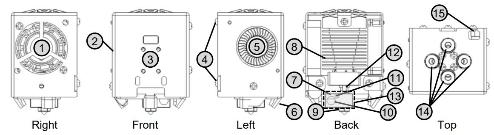

[PRUSA]: https://github.com/ZONESTAR3D/Slicing-Guide/tree/master/PrusaSlicer#6-slicing-muti-color-for-e4-hotend
[CURA]: https://github.com/ZONESTAR3D/Slicing-Guide/tree/master/cura
[S3D]: https://github.com/ZONESTAR3D/Slicing-Guide/tree/master/Simplify3D#slicing-video-toturial-for-z9v5-with-e4-hotend
[ENDGCODE]: https://github.com/ZONESTAR3D/Slicing-Guide/blob/master/PrusaSlicer/Custom_Gcode.md#end-g-code
[STARTGCODE]: https://github.com/ZONESTAR3D/Slicing-Guide/blob/master/PrusaSlicer/Custom_Gcode.md#start-gcode
[FIRMWARE]: https://github.com/ZONESTAR3D/Firmware

----
## <a id="choose-language">:globe_with_meridians: Choose language </a>

<!--  -->

----
## E4 Hotend-Benutzerhandbuch
Das ZONESTAR 4-IN-1-OUT **Nicht-Mischfarbe**-Hot-End (bezeichnet als **E4-Hot-End**) verfügt über 4 Eingangskanäle und 1 Düse. Beim Wechseln der Farbe muss das vorherige Farbfilament entladen werden ( Ziehen Sie das Filament aus dem heißen Ende heraus und laden Sie dann das nächste Farbfilament.

### <a id="A1"> 1. Spezifikationen </a>
| Artikel | Parameter | Artikel | Parameter |
|:--------------------------:|:--------------------------:|:------------:|:--------------------------:|
| Nennspannung | DC24V/60W Max | Düsendurchmesser | Standard 0,4 mm1 |
| Eingangskanal | 4 | Düsenmodell | E3D V6 |
| Düsenanzahl | 1 | Filamentdurchmesser | 1,75 mm |
| Heizung | 24V/60W ⌀6x25mm | Temperatursensor | NTC-Thermistor 100K B3950 |
| Lüfter | 4010/5000 U/min/24 V 0,15 A | Extruder-Lüfter | 4010/5000 U/min/24 V 0,15 A |
| Stützfilamente | PLA/PLA+/PETG/ABS/ASA usw. | Arbeitstemperatur | 260℃ Maximus |
| Kabellänge | 1 Meter | Außenmaße | 50x60x75mm |
| Nettogewicht | 220g | Bruttogewicht | 350g |

### <a id="A2"> 2. Komponenten </a>
Die E4-Hot-End-Baugruppe umfasst die folgenden Teile/Zubehörteile:

>
     1. Kühlgebläse 2. Gehäuse 3. Installationsloch für den Bettnivellierungssensor 4. Befestigte Schrauben
     5. Extruder-Lüfter 6. Lüfter-„Enten“-Drucke 7. Heizblock 8. Kühlkörper
     9. Düse 10. Heizpatrone 11. Temperatursensor 12. Hals
     13. Silikonhülle 14. Anschlüsse (Pneumatikanschlüsse) 15. Kabel

### <a id="A3"> 3. Draht </a>

### <a id="A4"> 4. Installation und Verkabelung </a>
Die Montageposition des E4-Hot-Ends entspricht dem „ZONESTAR Hot-End-Montagestandard“, der auf fast allen ZONESTAR 3D-Druckern installiert werden kann, einschließlich der Produktserien P802, M8, D805S, Z8, Z9, Z10 usw.
#### 4.1 Installation
Entfernen Sie einfach die 3 Schrauben hinter der Hot-End-Baugruppe und installieren Sie die E4-Hotend-Baugruppe auf dem X-Träger der Maschine.

#### 4.2 Verkabelung
##### :loudspeaker: Achtung
- **Bitte achten Sie darauf, die Klemmen 3 und 4 zu unterscheiden**, da die Farben der Klemmen gleich sind, die Farben der Drähte jedoch unterschiedlich sind.
Wenn die Drähte 3 und 4 umgekehrt angeschlossen sind, können Sie sehen, dass die auf dem LCD-Bildschirm angezeigte Düsentemperatur nach dem Einschalten der Maschine viel höher ist als die Raumtemperatur.
- Achten Sie beim Einstecken des Anschlusses darauf, dass Sie den Metallanschluss nicht aus dem Kunststoffgehäuse drücken.**
##### :loudspeaker: Hinweis
- **Der Kühlventilator muss eingeschaltet sein** (wenn die Temperatur des heißen Endes höher als 60 °C ist), sonst kann das heiße Ende blockiert oder sogar beschädigt werden.
  - Standardmäßig beträgt die **Arbeitsspannung** des Lüfters und der Heizung am heißen Ende **DC 24V**.
#### Bitte befolgen Sie die Definition der Anschlüsse, um das Hotend an Ihre Steuerplatine anzuschließen.
- **Ohne Verlängerungskabel**

- **Mit Verlängerungskabel**

#### 4.3 Hot-End-Typ auf dem LCD einstellen MENÜ: Steuerung>>Konfigurieren>>Hotend-Typ: Nicht mischend
- :warning: Wenn Ihr Drucker keinen 4,3-Zoll-TFT-LCD-Bildschirm hat, ignorieren Sie diesen Schritt.
- :warning: Wenn Sie das Menü auf dem LCD-Bildschirm Ihres Druckers nicht sehen können, aktualisieren Sie bitte auf die neueste Version. [:link: **Firmware-Download-Link**][FIRMWARE]
##### 

### <a id="A5"> 5. Funktionsprinzip </a>
Das E4-Hot-End (4-IN-1-OUT Non-Mix Color) besteht aus einem Kühlkörper, einem Trichterkollektor, einem Heizblock, einer Düse usw. Während des Druckens darf nur ein Filament in das Hot-End geladen werden. Beim Wechsel zu einem anderen Farbfilament zieht der Extruder das vorherige Farbfilament aus dem E4-Hot-End und lädt dann ein anderes Filament in das E4-Hot-End. Das folgende Bild (von links nach rechts) veranschaulicht diesen Vorgang kurz.
##### 
#### Sie können sich auch eine Animation ansehen, um das Funktionsprinzip des E4-Hot-Ends gut zu verstehen.
.
##### :book: Über „Wipe Tower“
Da sich nach dem Laden eines neuen Farbfilaments immer noch geschmolzene Filamente der vorherigen Farbe in der Düse befinden, müssen wir die Düse „reinigen“, bevor wir mit dem Drucken des neuen Farbfilaments beginnen. Andernfalls hat der gedruckte Anfangsteil die vorherige Farbe, aber nicht wie erwartet die neue Farbe. Die Lösung besteht darin, **„Wischturm“** hinzuzufügen, nachdem in der Schneidesoftware auf einen neuen Extruder umgestellt wurde.
Einzelheiten finden Sie unter [**:point_right: Slicing**](#A9).
:bulb: Wipe Tower wird im Cura Slicer „Prime Tower“ und im Simplify3d Slicer „Prime Pillar“ genannt.

### <a id="A6"> 6. Abmessungen </a>

### <a id="A7"> 7. Filamente vorladen </a>
#### 7.1 Für einfarbigen Druck

#### 7.2 Für mehrfarbigen Druck
     
Bitte laden Sie vor dem Drucken die Filamente in die entsprechende Position des heißen Endes vor, damit der Extruder die Filamente reibungslos in das heiße Ende hinein und aus diesem heraus laden kann.
- **Schritt 1:** Laden Sie Filamente aus dem Extruder und lassen Sie die Filamente etwa 10 mm aus den PTFE-Schläuchen herausragen.
- **Schritt 2:** Stecken Sie die PTFE-Schläuche (mit Filamenten) in das HOTEND.
  - :pushpin: **Wenn sich im heißen Ende ein Filament befindet, erhitzen und düsen Sie es und ziehen Sie es dann zuerst heraus. Weitere Informationen hierzu finden Sie unter [Filamente entladen] (#A8).**
  - :pushpin: Schneiden Sie die Vorderseite der Filamente in eine scharfe Form, bevor Sie das Filament laden.
  - :pushpin: Wenn der Extruder während des Druckens nicht verwendet wurde, muss das Filament nicht in das heiße Ende geladen werden.
     
  - :pushpin: Fügen Sie einige Gcodes im **"Start-Gcode"** ([:point_right: View][STARTGCODE]) der zu druckenden Slicing-Software hinzu.
     
  - :pushpin: Fügen Sie einige Gcodes im **"End-Gcode"** ([:point_right: View][ENDGCODE]) der Slicing-Software hinzu, um das zuletzt gedruckte Filament aus dem Hotend herauszuziehen.

### <a id="A8"> 8. Filamente entladen </a>
Bitte befolgen Sie die folgenden Schritte, um das Filament aus dem Hotend zu entladen:
- **Schritt 1:** Erhitzen der Düse (190 Grad für PLA und 230 Grad für ABS).
- **Schritt 2:** Drehen Sie das Zahnrad des Extruders, um das Filament zu entladen.
:star2: Einige 3D-Drucker (z. B. Z9V5Pro) verfügen über ein „Filament“-Menü auf dem LCD-Bildschirm. Bitte bedienen Sie den LCD-Bildschirm und verwenden Sie das Menü „Vorbereiten>>Filament“***, um die Düse vorzuheizen, den Extruder auszuwählen und zu entladen Filamente.

### <a id="A9"> 9. Schneiden </a>
Benutzerhandbuch (Video-Tutorial) für die Slicing-Software PrusaSlicer/Cura/Simplify3d.
- **:+1: PrusaSlicer**, siehe :point_right: [**hier**][PRUSA].
- **Cura-Slicer**, siehe :point_right: [**hier**][CURA].
- **Simplify3d Slicer**, siehe :point_right: [**hier**][S3D].

### <a id="A10"> 10. Gcode testen </a>
Wir haben einige Testdateien auf unsere Github-Seite hochgeladen. Sie können sie [**hier**](../example/readme.md) herunterladen.

### <a id="A11"> 11. Fehlerbehebung </a>
Wenn bei der Verwendung des E4-Hot-Ends Probleme auftreten, lesen Sie bitte zuerst die [**Anleitung zur Fehlerbehebung**](../FAQ/readme.md), um eine Lösung zu finden. Wenn das Problem immer noch nicht gelöst werden kann, wenden Sie sich bitte per E-Mail an unseren technischen Support: :email: support@zonestar3d.com.

----
### Link verkaufen
[:gift: **ZONESTAR Offical Store**](https://bit.ly/39qDtKp)     
[:gift: **Aliexpress**](https://www.aliexpress.com/item/1005002951777699.html)

----