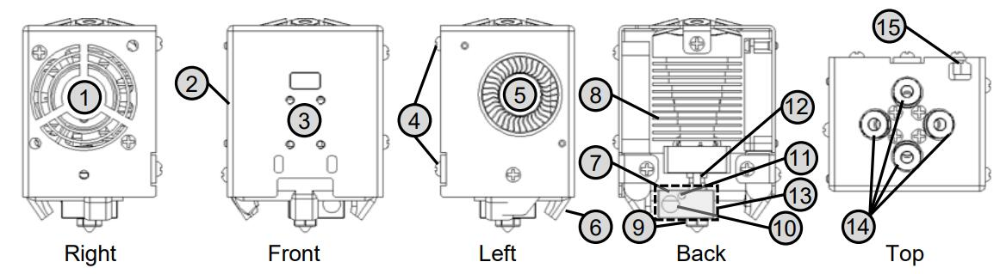
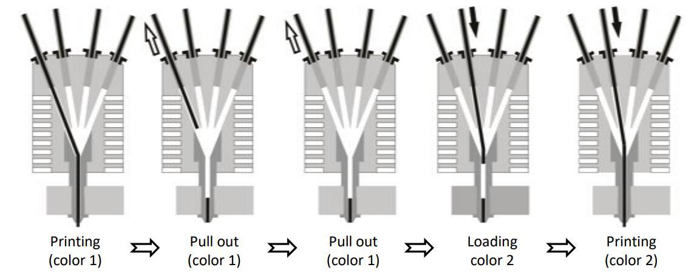
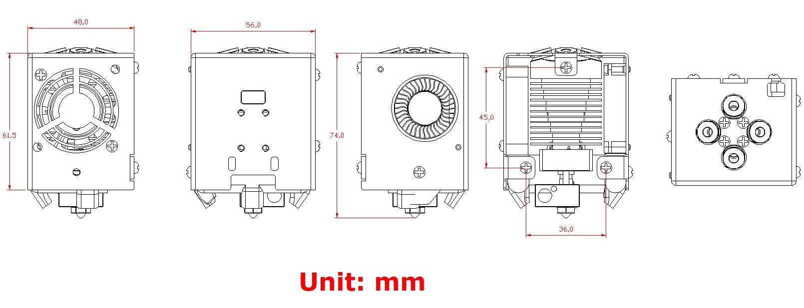
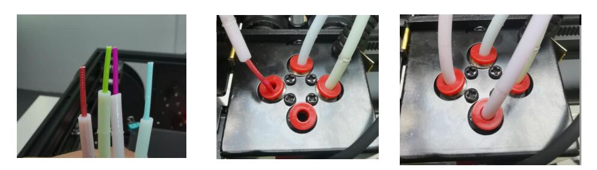
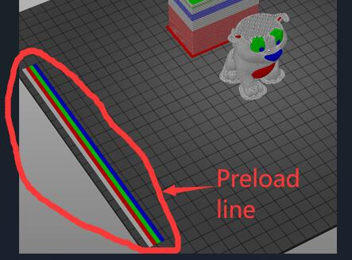

[PRUSA]: https://github.com/ZONESTAR3D/Slicing-Guide/tree/master/PrusaSlicer#6-slicing-muti-color-for-e4-hotend
[CURA]: https://github.com/ZONESTAR3D/Slicing-Guide/tree/master/cura
[S3D]: https://github.com/ZONESTAR3D/Slicing-Guide/tree/master/Simplify3D#slicing-video-toturial-for-z9v5-with-e4-hotend
[ENDGCODE]: https://github.com/ZONESTAR3D/Slicing-Guide/blob/master/PrusaSlicer/Custom_Gcode.md#end-g-code
[STARTGCODE]: https://github.com/ZONESTAR3D/Slicing-Guide/blob/master/PrusaSlicer/Custom_Gcode.md#start-gcode
[FIRMWARE]: https://github.com/ZONESTAR3D/Firmware

----
## <a id="choose-language">:globe_with_meridians: Choose language </a>

<!--  -->

----
## Manuale utente dell'hotend E4
L'hot end ZONESTAR 4-IN-1-OUT **Colori non miscelati** (indicato come **E4 Hot end**) ha 4 canali di ingresso e 1 ugello, quando si cambia colore, è necessario scaricare il filamento del colore precedente ( estratto) dall'hot end, quindi caricare il filamento colorato successivo.

### <a id="A1"> 1. Specifiche </a>
| Articolo | Parametri | Articolo | Parametri |
|:--------------------:|:---------------------------:|:--------------------:|:--------------------------:|
| Tensione nominale | DC24V/60W massimo | Diametro ugello | Predefinito 0,4 mm1 |
| Canale di ingresso | 4| Modello ugello | E3D V6 |
| Numero ugelli | 1| Diametro del filamento | 1,75 mm|
| Riscaldatore | 24V/60W ⌀6x25mm | Sensore di temperatura | Termistore NTC 100K B3950 |
| Ventola di raffreddamento | 4010/5000 giri/min/24 V 0,15 A | Ventola dell'estrusore | 4010/5000 giri/min/24 V 0,15 A |
| Filamenti di supporto | PLA/PLA+/PETG/ABS/ASA ecc. | Temperatura di lavoro | 260℃ Massimo |
| Lunghezza filo | 1 metro | Dimensioni esterne | 50x60x75mm |
| Peso netto | 220g| Peso lordo | 350 g|

### <a id="A2"> 2. Componenti </a>
Il gruppo hotend E4 comprende le seguenti parti/accessori:

>
     1. Ventola di raffreddamento 2. Alloggiamento 3. Foro di installazione del sensore di livellamento del piano 4. Viti montate
     5. Ventola dell'estrusore 6. Ventola per stampe "anatra" 7. Blocco riscaldante 8. Dissipatore di calore
     9. Ugello 10. Riscaldatore a cartuccia 11.Sensore di temperatura 12. Gola
     13. Manicotto in silicone 14. Raccordi (connettori pneumatici) 15. Cavo

### <a id="A3"> 3. Filo </a>

### <a id="A4"> 4. Installazione e cablaggio </a>
La posizione di montaggio dell'hot end E4 è conforme allo "standard di montaggio dell'hot end ZONESTAR", che può essere installato su quasi tutte le stampanti 3D ZONESTAR, incluse le serie di prodotti P802, M8, D805S, Z8, Z9, Z10 ecc.
#### 4.1 Installazione
È sufficiente rimuovere le 3 viti dietro il gruppo hotend e installare il gruppo hotend E4 sul supporto X della macchina.

#### 4.2 Cablaggio
##### :loudspeaker: Attenzione
- **Fare attenzione a distinguere i terminali 3 e 4**, perché il colore dei terminali è lo stesso, ma il colore dei fili è diverso.
Se i fili 3 e 4 sono collegati in modo inverso, è possibile vedere che la temperatura dell'ugello visualizzata sullo schermo LCD sarà molto più alta della temperatura ambiente dopo aver acceso la macchina.
- Quando si collega il terminale, **fare attenzione a non spingere il terminale metallico fuori dalla custodia in plastica**.
##### :loudspeaker: Nota
- **La ventola di raffreddamento deve essere accesa** (quando la temperatura dell'hot end è superiore a 60°C), altrimenti l'hot end potrebbe bloccarsi o addirittura danneggiarsi.
- Per impostazione predefinita, la **tensione di funzionamento** della ventola e del riscaldatore sull'hot-end è **24 V CC**.
#### Seguire la definizione dei terminali per collegare l'hotend alla scheda di controllo.
- **Senza cavo di prolunga**

- **Con cavo di estensione**

#### 4.3 Imposta il tipo di hotend sul display LCD MENU: Controllo >>Configura>>Tipo hotend: Non miscelato
- :warning: Se la tua stampante non ha uno schermo TFT-LCD da 4,3", ignora questo passaggio.
- :warning: se non riesci a visualizzare il menu sullo schermo LCD della stampante, esegui l'aggiornamento alla versione più recente. [:link: **Link per il download del firmware**][FIRMWARE]
##### 

### <a id="A5"> 5. Principio di funzionamento </a>
L'hot end E4 (4-IN-1-OUT Non-Mix Color) è composto da dissipatore di calore, collettore a imbuto, blocco riscaldante, ugello, ecc. Durante la stampa, è consentito caricare un solo filamento nell'hot end. Mentre si passa a un altro filamento di colore, l'estrusore estrae il filamento di colore precedente dall'hot end E4 e quindi carica un altro filamento nell'hot end E4. L'immagine seguente (da sinistra a destra) mostra brevemente questo processo.
##### 
#### Puoi anche fare riferimento ad un'animazione per comprendere bene il principio di funzionamento dell'hot end E4.
.
##### :book: Informazioni su "Wipe Tower"
Perché ci sono ancora filamenti fusi del colore precedente nell'ugello dopo aver caricato un nuovo filamento di colore, quindi dobbiamo "pulire" l'ugello prima di iniziare a stampare il nuovo filamento di colore. Altrimenti la parte iniziale stampata sarà del colore precedente ma non del nuovo colore come ci aspettiamo. La soluzione è aggiungere **"wipe tower"** dopo essere passati a un nuovo estrusore nel software di slicing.
Per i dettagli, fare riferimento a [**:point_right: Slicing**](#A9).
:bulb: La torre di pulizia è chiamata "torre Prime" in Cura Slicer e "Prime Pillar" in Simplify3d Slicer.

### <a id="A6"> 6. Dimensioni </a>

### <a id="A7"> 7. Precaricare i filamenti </a>
#### 7.1 Per la stampa a un colore

#### 7.2 Per la stampa a più colori
     
Prima della stampa, precaricare i filamenti nella posizione appropriata dell'hot end in modo che l'estrusore possa caricare senza problemi i filamenti dentro e fuori dall'hot end.
- **Passaggio 1:** Caricare i filamenti dall'estrusore e lasciare che i filamenti si estendano per circa 10 mm fuori dai tubi in PTFE.
- **Passaggio 2:** Collega i tubi in PTFE (con filamenti) all'HOTEND.
  - :pushpin: **Se è presente un filamento nell'hot end, nel riscaldamento e nell'ugello, quindi estrarlo prima. Fare riferimento a [Scarica filamenti](#A8) per farlo.**
  - :pushpin: tagliare la parte anteriore dei filamenti in una forma affilata prima di caricare il filamento.
  - :pushpin: Se l'estrusore non è stato utilizzato durante la stampa, non è necessario caricare il filamento sull'hot end.
     
  - :pushpin: Aggiungi alcuni gcode nel **"Start gcode"** ([:point_right: View][STARTGCODE]) del software di slicing per stampare.
     
  - :pushpin: Aggiungi alcuni gcode nel **"End gcode"** ([:point_right: View][ENDGCODE]) del software di slicing per estrarre l'ultimo filamento stampato dall'hotend.

### <a id="A8"> 8. Scaricare i filamenti </a>
Seguire i passaggi seguenti per scaricare il filamento dall'hotend:
- **Passaggio 1:** Riscaldamento dell'ugello (190 gradi per PLA e 230 gradi per ABS).
- **Passaggio 2:** Ruota l'ingranaggio dell'estrusore per scaricare il filamento.
:star2: Alcune stampanti 3D (ad esempio Z9V5Pro) dispongono di un menu "Filamento" sullo schermo LCD, utilizzare lo schermo LCD e utilizzare il menu ***"Prepara >>Filamento"*** per preriscaldare l'ugello, scegliere l'estrusore e scaricare filamenti.

### <a id="A9"> 9. Affettare </a>
Guida per l'utente (tutorial video) per il software di slicing PrusaSlicer/Cura/Simplify3d.
- **:+1: PrusaSlicer**, fare riferimento a :point_right: [**qui**][PRUSA].
- **Affettatrice Cura**, fare riferimento a :point_right: [**qui**][CURA].
- **Simplify3d Slicer**, fare riferimento a :point_right: [**qui**][S3D].

### <a id="A10"> 10. Testare il gcode </a>
Abbiamo caricato alcuni file di test sulla nostra pagina Github, puoi scaricarli da [**qui**](../example/readme.md).

### <a id="A11"> 11. Risoluzione dei problemi </a>
Se riscontri problemi durante l'utilizzo dell'hot end E4, consulta prima la [**guida alla risoluzione dei problemi**](../FAQ/readme.md) per trovare una soluzione. Se il problema persiste, contatta il nostro tecnico del supporto tecnico tramite e-mail: :email: support@zonestar3d.com.

----
### Vendi il collegamento
[:gift: **ZONESTAR Offical Store**](https://bit.ly/39qDtKp)     
[:gift: **Aliexpress**](https://www.aliexpress.com/item/1005002951777699.html)

----