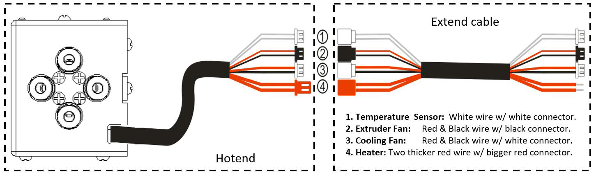
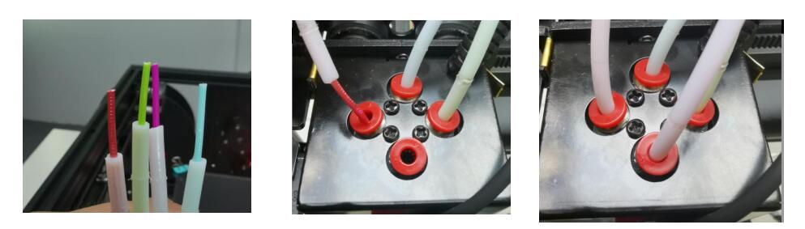

[PRUSA]: https://github.com/ZONESTAR3D/Slicing-Guide/tree/master/PrusaSlicer#6-slicing-muti-color-for-e4-hotend
[CURA]: https://github.com/ZONESTAR3D/Slicing-Guide/tree/master/cura
[S3D]: https://github.com/ZONESTAR3D/Slicing-Guide/tree/master/Simplify3D#slicing-video-toturial-for-z9v5-with-e4-hotend
[ENDGCODE]: https://github.com/ZONESTAR3D/Slicing-Guide/blob/master/PrusaSlicer/Custom_Gcode.md#end-g-code
[STARTGCODE]: https://github.com/ZONESTAR3D/Slicing-Guide/blob/master/PrusaSlicer/Custom_Gcode.md#start-gcode
[FIRMWARE]: https://github.com/ZONESTAR3D/Firmware

----
## <a id="choose-language">:globe_with_meridians: Choose language </a>

<!--  -->

----
## E4 ホットエンド ユーザー マニュアル
ZONESTAR 4-IN-1-OUT **非混合カラー** ホット エンド (**E4 ホット エンド**と呼ばれる) には 4 つの入力チャンネルと 1 つのノズルがあり、色を切り替える場合、前の色のフィラメントをアンロードする必要があります ( をホットエンドから引き出してから)、次の色のフィラメントをロードします。

### <a id="A1"> 1. 仕様 </a>
| アイテム | パラメータ | アイテム | パラメータ |
|:--------------------------:|:----------------------------:|:---------------:|:-------------------------:|
| 定格電圧 | DC24V/最大60W | ノズル径 | デフォルト 0.4mm1 |
| 入力チャンネル | 4 | ノズルモデル | E3D V6 |
| ノズル数 | 1 | フィラメント直径 | 1.75mm |
| ヒーター | 24V/60W ⌀6x25mm | 温度センサー | NTC サーミスタ 100K B3950 |
| 冷却ファン | 4010/5000RPM/24V 0.15A | 押出機ファン | 4010/5000RPM/24V 0.15A |
| サポートフィラメント | PLA/PLA+/PETG/ABS/ASA等 | 使用温度 | 最高260℃ |
| ワイヤーの長さ | 1メートル | 外形寸法 | 50x60x75mm |
| 正味重量 | 220g | 総重量 | 350g |

### <a id="A2"> 2. コンポーネント </a>
E4 ホットエンド アセンブリには、次の部品/アクセサリが含まれています。

>
     1. 冷却ファン 2. ハウジング 3. ベッドレベリングセンサー取り付け穴 4. 取り付けネジ
     5. エクストルーダーファン 6. ファンの「アヒル」プリント 7. 加熱ブロック 8. ヒートシンク
     9. ノズル 10. カートリッジヒーター 11. 温度センサー 12. スロート
     13. シリコンスリーブ 14. フィッティング(空気圧コネクタ) 15. ケーブル

### <a id="A3"> 3. 配線 </a>

### <a id="A4"> 4. 設置と配線 </a>
E4ホットエンドの取り付け位置は「ZONESTARホットエンド取り付け基準」に準拠しており、P802、M8、D805S、Z8、Z9、Z10などのシリーズ製品を含むほぼすべてのZONESTAR 3Dプリンターに取り付けることができます。
#### 4.1 インストール
ホットエンド アセンブリの後ろにある 3 本のネジを取り外し、E4 ホットエンド アセンブリをマシンの X キャリアに取り付けるだけです。

#### 4.2 配線
##### :loudspeaker: 注意してください
- **端子 3 と 4 の区別に注意してください**。端子の色は同じですが、ワイヤの色が異なります。
3 と 4 のワイヤが逆に接続されている場合、マシンの電源を入れた後、LCD 画面に表示されるノズル温度が室温よりもはるかに高くなることがわかります。
- 端子を差し込む際は、**金属端子をプラスチックケースから押し出さないよう注意してください**。
#####  :loudspeaker: 注意してください
- **冷却ファンをオンにする必要があります** (ホットエンドの温度が 60°C を超える場合)。そうしないと、ホットエンドがブロックされたり、損傷する可能性があります。
  - デフォルトでは、ホットエンドのファンとヒーターの **動作電圧**は **DC 24V** です。
#### ホットエンドを制御ボードに接続するには、端子の定義に従ってください。
- **延長ケーブルなし**   
   
- **延長ケーブル付き**   
   
#### 4.3 LCD メニューでホットエンド タイプを設定します: コントロール >> 設定 >> ホットエンド タイプ: 非混合
- :warning: プリンターに 4.3 インチ TFT-LCD 画面が搭載されていない場合は、この手順を無視してください。
- :warning: プリンターの LCD 画面にメニューが表示されない場合は、最新バージョンにアップグレードしてください。 [:link: **ファームウェアのダウンロード リンク**][FIRMWARE]
##### 

### <a id="A5"> 5. 動作原理 </a>
E4 (4-IN-1-OUT Non-Mix Color) ホットエンドは、ヒートシンク、ファンネルコレクター、加熱ブロック、ノズルなどで構成されます。印刷中、ホットエンドにロードできるフィラメントは 1 つだけです。 別の色のフィラメントに切り替える際、押出機は前の色のフィラメントを E4 ホットエンドから引き出し、別のフィラメントを E4 ホットエンドにロードします。 次の画像 (左から右) は、このプロセスを簡単に示しています。
##### 
#### E4 ホットエンドの動作原理をよく理解するには、アニメーションを参照することもできます。
。
##### :book: 「ワイプタワー」について
新しい色のフィラメントをロードした後もノズル内には前の色の溶けたフィラメントがまだ残っているため、新しい色のフィラメントの印刷を開始する前にノズルを「クリーニング」する必要があります。 それ以外の場合、印刷される最初の部分は前の色になりますが、期待どおりの新しい色ではなくなります。 解決策は、スライス ソフトウェアで新しいエクストルーダーに切り替えた後、**「ワイプ タワー」** を追加することです。
詳細については、[**:point_right: スライス**](#A9)を参照してください。
:bulb: ワイプタワーは、Cura Slicer では「Prime tower」、Simplify3d Slicer では「Prime Pillar」と呼ばれています。

### <a id="A6"> 6. 寸法 </a>

### <a id="A7"> 7. フィラメントの事前ロード </a>
#### 7.1 1色印刷の場合

#### 7.2 多色印刷の場合
     
印刷前に、押出機がフィラメントをホットエンドにスムーズに出し入れできるように、ホットエンドの適切な位置にフィラメントを事前にロードしてください。
- **ステップ 1:** 押出機からフィラメントをロードし、フィラメントを PTFE チューブから約 10mm 伸ばします。
- **ステップ 2:** PTFE チューブ (フィラメント付き) を HOTEND に差し込みます。
  - :pushpin: **ホットエンドにフィラメントがある場合は、加熱してノズルを当ててから、最初に引き抜きます。 これを行うには、[フィラメントのアンロード](#A8) を参照してください。**
  - :pushpin: フィラメントをロードする前に、フィラメントの前面を鋭利な形状に切断します。
  - :pushpin: 印刷中にエクストルーダーが使用されなかった場合、フィラメントをホットエンドにロードする必要はありません。
     
  - :pushpin: 印刷するスライス ソフトウェアの **「Start gcode」** ([:point_right: View][STARTGCODE]) に gcode を追加します。
     
  - :pushpin: ホットエンドから最後に印刷されたフィラメントを引き出すために、スライス ソフトウェアの **「End gcode」** ([:point_right: View][ENDGCODE]) にいくつかの gcode を追加します。

### <a id="A8"> 8. フィラメントをアンロードする </a>
フィラメントをホットエンドからアンロードするには、以下の手順に従ってください。
- **ステップ 1:** ノズルを加熱します (PLA の場合は 190 度、ABS の場合は 230 度)。
- **ステップ 2:** エクストルーダーのギアを回転させてフィラメントをアンロードします。
:star2: 一部の 3D プリンター (例: Z9V5Pro) には、LCD 画面に「フィラメント」メニューがあります。LCD 画面を操作し、***「準備>>フィラメント」*** のメニューを使用してノズルを予熱し、エクストルーダーを選択してアンロードしてください。 フィラメント。

### <a id="A9"> 9. スライス </a>
PrusaSlicer/Cura/Simplify3d スライシング ソフトウェアのユーザー ガイド (ビデオ チュートリアル)。
- **:+1: PrusaSlicer**、:point_right: [**ここ**][PRUSA]を参照してください。
- **Cura スライサー**については、:point_right: [**こちら**][CURA] を参照してください。
- **Simplify3d Slicer** については、:point_right: [**こちら**][S3D] を参照してください。

### <a id="A10"> 10. gcode のテスト </a>
いくつかのテスト ファイルを Github ページにアップロードしました。[**ここ**](../example/readme.md) からダウンロードできます。

### <a id="A11"> 11. トラブルシューティング </a>
E4 ホット エンドの使用中に問題が発生した場合は、まず [**トラブルシューティング ガイド**](../FAQ/readme.md) を参照して解決策を見つけてください。 それでも問題が解決できない場合は、電子メールで当社のテクニカル サポート エンジニアにご連絡ください::email: support@zonestar3d.com。

----
### 販売リンク
[:gift: **ZONESTAR Offical Store**](https://bit.ly/39qDtKp)     
[:gift: **Aliexpress**](https://www.aliexpress.com/item/1005002951777699.html)

----