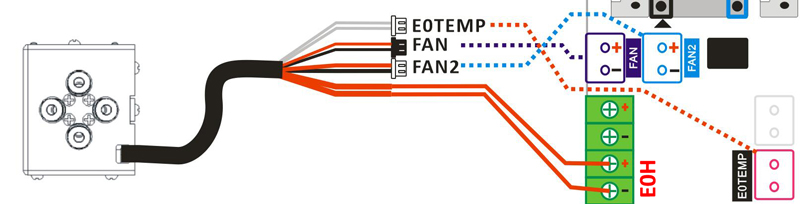

[PRUSA]: https://github.com/ZONESTAR3D/Slicing-Guide/tree/master/PrusaSlicer#6-slicing-muti-color-for-e4-hotend
[CURA]: https://github.com/ZONESTAR3D/Slicing-Guide/tree/master/cura
[S3D]: https://github.com/ZONESTAR3D/Slicing-Guide/tree/master/Simplify3D#slicing-video-toturial-for-z9v5-with-e4-hotend
[ENDGCODE]: https://github.com/ZONESTAR3D/Slicing-Guide/blob/master/PrusaSlicer/Custom_Gcode.md#end-g-code
[STARTGCODE]: https://github.com/ZONESTAR3D/Slicing-Guide/blob/master/PrusaSlicer/Custom_Gcode.md#start-gcode
[FIRMWARE]: https://github.com/ZONESTAR3D/Firmware

----
## <a id="choose-language">:globe_with_meridians: Choose language </a>

<!--  -->

----
## E4 핫엔드 사용자 매뉴얼
ZONESTAR 4-IN-1-OUT **비혼합 색상** 핫 엔드(**E4 핫 엔드**라고 함)에는 4개의 입력 채널과 1개의 노즐이 있으며, 색상을 전환할 때 이전 색상 필라멘트를 언로드해야 합니다( 뽑아낸) 핫 엔드에서 빼낸 다음 다음 색상 필라멘트를 로드합니다.

### <a id="A1"> 1. 사양 </a>
| 아이템 | 매개변수 | 아이템 | 매개변수 |
|:---------------:|:-------------:|:-------------:|:--------------------------:|
| 정격전압 | DC24V/60W 최대 | 노즐 직경 | 기본값 0.4mm1 |
| 입력 채널 | 4 | 노즐 모델 | E3D V6 |
| 노즐 번호 | 1 | 필라멘트 직경 | 1.75mm |
| 히터 | 24V/60W ⌀6x25mm | 온도 센서 | NTC 서미스터 100K B3950 |
| 냉각팬 | 4010/5000RPM/24V 0.15A | 압출기 팬 | 4010/5000RPM/24V 0.15A |
| 지원 필라멘트 | PLA/PLA+/PETG/ABS/ASA 등 | 작동 온도 | 260℃ 막시무스 |
| 와이어 길이 | 1미터 | 외부 치수 | 50x60x75mm |
| 순중량 | 220g | 총중량 | 350g |

### <a id="A2"> 2. 구성요소 </a>
E4 핫엔드 어셈블리에는 다음 부품/액세서리가 포함되어 있습니다.

>
     1. 냉각팬 2. 하우징 3. 베드 레벨링 센서 설치 구멍 4. 장착 나사
     5. 압출기 팬 6. 팬 "오리" 인쇄 7. 가열 블록 8. 방열판
     9. 노즐 10. 카트리지 히터 11. 온도 센서 12. 목구멍
     13. 실리콘 슬리브 14. 피팅(공압 커넥터) 15. 케이블

### <a id="A3"> 3. 전선 </a>

### <a id="A4"> 4. 설치 및 배선 </a>
E4 핫 엔드의 장착 위치는 P802, M8, D805S, Z8, Z9, Z10 등 시리즈 제품을 포함한 거의 모든 ZONESTAR 3d 프린터에 설치할 수 있는 "ZONESTAR 핫 엔드 장착 표준"을 준수합니다.
#### 4.1 설치
핫엔드 어셈블리 뒤에 있는 나사 3개를 제거하고 E4 핫엔드 어셈블리를 장비의 X 캐리어에 설치하기만 하면 됩니다.

#### 4.2 배선
##### :loudspeaker: 주의
- **3번 단자와 4번 단자**는 단자 색상은 동일하지만 배선 색상이 다르기 때문에 잘 구분하시기 바랍니다.
3번과 4번의 선을 반대로 연결하면, 전원을 켠 후 LCD 화면에 표시되는 노즐 온도가 실내 온도보다 훨씬 높아지는 것을 볼 수 있습니다.
- 단자 꽂을 때 **플라스틱 케이스에서 금속 단자를 밀어내지 않도록 주의하세요**.
##### :loudspeaker: 참고
- **냉각 팬을 켜야 합니다**(핫 엔드 온도가 60°C 이상일 때). 그렇지 않으면 핫 엔드가 막히거나 손상될 수 있습니다.
  - 기본적으로 핫엔드 팬과 히터의 **작동 전압**은 **DC 24V**입니다.
#### 핫엔드를 제어 보드에 연결하려면 터미널 정의를 따르십시오.
- **연장 케이블 미포함**    

- **연장 케이블 포함**   

#### 4.3 LCD 메뉴에서 핫엔드 유형 설정: 제어>>구성>>핫엔드 유형: 비혼합
- :warning: 프린터에 4.3" TFT-LCD 화면이 없으면 이 단계를 무시하세요.
- :주의: 프린터의 LCD 화면에 메뉴가 보이지 않을 경우, 최신 버전으로 업그레이드 하시기 바랍니다. [:link: **펌웨어 다운로드 링크**][FIRMWARE]
##### 

### <a id="A5"> 5. 작동 원리 </a>
E4(4-IN-1-OUT 비혼합 색상) 핫엔드는 방열판, 깔대기 수집기, 가열 블록, 노즐 등으로 구성됩니다. 인쇄 중에는 하나의 필라멘트만 핫엔드에 로드될 수 있습니다. 다른 색상 필라멘트로 전환하는 동안 압출기는 이전 색상 필라멘트를 E4 핫 엔드에서 끌어낸 다음 다른 필라멘트를 E4 핫 엔드에 로드합니다. 다음 이미지(왼쪽에서 오른쪽으로)는 이 프로세스를 간략하게 보여줍니다.
##### 
#### E4 핫엔드의 작동 원리를 잘 이해하려면 애니메이션을 참고할 수도 있습니다.
.
##### :book: "와이프 타워"에 대하여
새 색상 필라멘트를 로드한 후에도 노즐에는 이전 색상의 녹은 필라멘트가 여전히 남아 있으므로 새 색상 필라멘트를 인쇄하기 전에 노즐을 "청소"해야 합니다. 그렇지 않으면 인쇄된 초기 부분이 이전 색상이 되지만 우리가 기대하는 새 색상은 아닙니다. 해결책은 슬라이싱 소프트웨어에서 새 압출기로 전환한 후 **"와이프 타워"**를 추가하는 것입니다.
자세한 내용은 [**:point_right:슬라이싱**](#A9)을 참조하세요.
:bulb: Wipe 타워는 Cura Slicer에서는 "Prime tower"로, Simplify3d Slicer에서는 "Prime Pillar"로 불립니다.

### <a id="A6"> 6. 크기 </a>

### <a id="A7"> 7. 필라멘트 사전 장착 </a>
#### 7.1 단색 인쇄의 경우

#### 7.2 다중 색상 인쇄의 경우
     
프린팅하기 전에 필라멘트를 핫 엔드의 적절한 위치에 미리 로드하여 압출기가 핫 엔드 안팎으로 필라멘트를 원활하게 로드할 수 있도록 하십시오.
- **1단계:** 압출기에서 필라멘트를 로드하고 필라멘트가 PTFE 튜브 밖으로 약 10mm 확장되도록 합니다.
- **2단계:** PTFE 튜브(필라멘트 포함)를 HOTEND에 연결합니다.
  - :pushpin: **핫엔드에 필라멘트가 있을 경우 가열하고 누즐한 후 먼저 뽑아냅니다. [필라멘트 언로드](#A8)를 참조하여 수행하세요.**
  - :pushpin: 필라멘트를 장착하기 전에 필라멘트의 앞부분을 날카로운 모양으로 자르는 것입니다.
  - :pushpin: 출력 중에 압출기를 사용하지 않은 경우 필라멘트를 핫엔드에 로드할 필요가 없습니다.    
         
  - :pushpin: 인쇄할 슬라이싱 소프트웨어의 **"Start gcode"**([:point_right: View][STARTGCODE])에 일부 gcode를 추가합니다.   
        
  - :pushpin: 슬라이싱 소프트웨어의 **"End gcode"**([:point_right: View][ENDGCODE])에 일부 gcode를 추가하여 핫엔드에서 마지막으로 인쇄된 필라멘트를 꺼냅니다.

### <a id="A8"> 8. 필라멘트 언로드 </a>
핫엔드에서 필라멘트를 언로드하려면 아래 단계를 따르십시오.
- **1단계:** 노즐을 가열합니다(PLA의 경우 190도, ABS의 경우 230도).
- **2단계:** 압출기의 기어를 돌려 필라멘트를 꺼냅니다.
:star2: 일부 3D 프린터(예: Z9V5Pro)에는 LCD 화면에 "필라멘트" 메뉴가 있습니다. LCD 화면을 조작하고 ***"준비>>필라멘트"*** 메뉴를 사용하여 노즐을 예열하고 압출기를 선택한 후 언로드하세요. 필라멘트.

### <a id="A9"> 9. 자르기 </a>
PrusaSlicer/Cura/Simplify3d 슬라이싱 소프트웨어에 대한 사용자 가이드(비디오 튜토리얼)입니다.
- **:+1: PrusaSlicer**, :point_right: [**여기**][PRUSA]를 참조하세요.
- **Cura 슬라이서**는 :point_right: [**여기**][CURA]를 참조하세요.
- **Simplify3d 슬라이서**, :point_right: [**여기**][S3D]를 참조하세요.

### <a id="A10"> 10. gcode 테스트 </a>
일부 테스트 파일을 Github 페이지에 업로드했습니다. [**여기**](../example/readme.md)에서 다운로드할 수 있습니다.

### <a id="A11"> 11. 문제 해결 </a>
E4 핫엔드 사용 시 문제가 발생하는 경우 먼저 [**문제 해결 가이드**](../FAQ/readme.md)를 참조하여 해결 방법을 찾아보세요. 문제가 여전히 해결되지 않으면 기술 지원 엔지니어에게 이메일(:email: support@zonestar3d.com)로 문의하세요.

----
### 판매 링크
[:gift: **ZONESTAR Offical Store**](https://bit.ly/39qDtKp)     
[:gift: **Aliexpress**](https://www.aliexpress.com/item/1005002951777699.html)

----