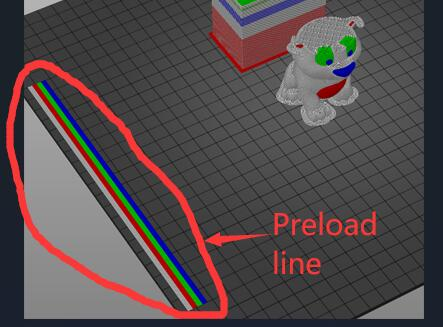

[PRUSA]: https://github.com/ZONESTAR3D/Slicing-Guide/tree/master/PrusaSlicer#6-slicing-muti-color-for-e4-hotend
[CURA]: https://github.com/ZONESTAR3D/Slicing-Guide/tree/master/cura
[S3D]: https://github.com/ZONESTAR3D/Slicing-Guide/tree/master/Simplify3D#slicing-video-toturial-for-z9v5-with-e4-hotend
[ENDGCODE]: https://github.com/ZONESTAR3D/Slicing-Guide/blob/master/PrusaSlicer/Custom_Gcode.md#end-g-code
[STARTGCODE]: https://github.com/ZONESTAR3D/Slicing-Guide/blob/master/PrusaSlicer/Custom_Gcode.md#start-gcode
[FIRMWARE]: https://github.com/ZONESTAR3D/Firmware

----
## <a id="choose-language">:globe_with_meridians: Choose language </a>

<!--  -->

----
## E4 Hotend User Manual
ZONESTAR 4-IN-1-OUT **Non mix color** hot end (referred to as **E4 Hot end**) has 4 input channels and 1 nozzle, when switching color, the previous color filament need to be unloaded (pulled out) from the hot end, and then load the next color filament.

### <a id="A1"> 1. Specifications </a>
|            Item            |      Parameters            |            Item            |      Parameters            |
|:--------------------------:|:--------------------------:|:--------------------------:|:--------------------------:|
|    Rated Voltage           |      DC24V/60W Max         |     Nozzle Diameter        | Default 0.4mm1  |
|    Input Channel           |      4                     |     Nozzle model           |      E3D V6                |
|    Nozzles Number          |      1                     |     Filament Diameter      |      1.75mm                |
|    Heater                  |      24V/60W ⌀6x25mm       |     Temperature Sensor     | NTC Thermistor 100K B3950  |
|    Cooling Fan             |   4010/5000RPM/24V 0.15A   |    Extruder Fan            | 4010/5000RPM/24V 0.15A     |
|    Support Filaments       | PLA/PLA+/PETG/ABS/ASA etc. |    Working Temperature     | 260℃ Maximus              |
|    Wire length             |      1 meter               |    Outer Dimensions        |      50x60x75mm            |
|    Net weight              |      220g                  |    Gross weight            |      350g                  |

### <a id="A2"> 2. Components </a>
The E4 hot end assembly includes the following parts/accessories:    

>
    1. Cooling Fan          2. Housing              3. Bed leveling sensor install hole     4. Mounted Screws                         
    5. Extruder Fan         6. fan "duck" prints    7. Heating block                        8. Heat sink                         
    9. Nozzle               10. Cartridge heater   11.Temperature sensor                    12. Throat        
    13. Silicone sleeve     14. Fittings(Pneumatic Connectors)                              15. Cable

### <a id="A3"> 3. Wire </a>
 

### <a id="A4"> 4. Installation & wiring </a>
The mounting position of E4 hot end conform to the "ZONESTAR hot end mounting standard" , which can be installed on almost all ZONESTAR 3d printers, including P802, M8, D805S, Z8, Z9, Z10 etc. series of products.   
#### 4.1 Installation
Simply remove the 3 screws behind the hot end assembly and install the E4 hotend assembly on the X carrier of the machine.
  
#### 4.2 Wiring
##### :loudspeaker: Attention
- **Please watch for to distinguish terminals 3 and 4**, because their terminals  color are the same, but the wires color are different.    
If the wires of 3 and 4 are connected reversely, you can see the nozzle temperature displayed on the LCD screen will be much higher than the room temperature after you powered on the machine.
- When pluging the terminal, **be careful not to push the metal terminal from the plastic case**.     
##### :loudspeaker: Note   
- **The cooling fan must be turned on** (when the temperature of the hot end is higher than 60°C), otherwise the hot end may be blocked or even damaged.  
 - By default, the **working voltage** of the fan and heater at the hot end is **DC 24V**. 
#### Please following the define of terminals to connect the hotend to your control board.
- **Without extend cable**     
  
- **With extend cable**     
  
#### 4.3 Set hot end type on LCD MENU: Control>>Configure>>Hotend Type: Non-Mixing
- :warning: If your printer hasn't a 4.3" TFT-LCD screen, ignore this step.   
- :warning: If you can't see the menu on the LCD screen of your printer, please upgrade to the newest version. [:link: **Firmware Download Link**][FIRMWARE]    
#####   

### <a id="A5"> 5. Working principle </a>
E4 (4-IN-1-OUT Non-Mix Color) hot end is composed of heat-sink, funnel collector, heating block, nozzle, etc.. During printing, only one filament is allowed to be loaded into the hot end. While switching to another color filament, the extruder pull the previous color filament out of the E4 hot end and then load another filament into the E4 hot end. The following image (from left to right) briefly demonstrates this process.
#####      
#### You can also refer to an animation to understand the working principle of the E4 hot end well.     
.   
##### :book: About "Wipe tower"  
Because there are still melted filaments of the previous color in the nozzle after a new color filament loaded, so we need to "clean" the nozzle before starting to print the new color filament. Otherwise, the printed initial part will be the previous color but not the new color as we expect. The solution is that to add **"wipe tower"** after switched to a new extruder in slicing software.    
About details, please refer to [**:point_right: Slicing**](#A9).    
:bulb: Wipe tower is called "Prime tower" in Cura Slicer and "Prime Pillar" in Simplify3d Slicer. 

### <a id="A6"> 6. Dimensions </a>
   

### <a id="A7"> 7. Pre-load filaments </a>
#### 7.1 For one color printing

#### 7.2 For multi colors printing
   
Before printing, please pre-load the filaments into the appropriate position of the hot end so that the extruder can load smoothly the filaments into and out of the hot end.
- **Step 1:** Load filaments from the extruder and let the filaments extend about 10mm out of PTFE tubes.
- **Step 2:** Plug the PTFE tubes (with filaments) into the HOTEND.  
    - :pushpin: **If there is a filament in the hot end, heating and noozle and then pull it out first. Refer to [Unload filaments](#A8) to do it.**    
    - :pushpin: Cutting the front of filaments into a sharp shape before loading filament.     
    - :pushpin: If the extruder was not used during printing, donot need to load the filament to the hot end.   
     
    - :pushpin: Add some gcodes in the **"Start gcode"** ([:point_right: View][STARTGCODE]) of slicing software to print. 
       
    - :pushpin: Add some gcodes in the **"End gcode"** ([:point_right: View][ENDGCODE]) of slicing software to pull out the last printed filament from the hotend.      

### <a id="A8"> 8. Unload filaments </a>
Please follow the steps below to unload the filament from the hotend:
- **Step 1:** Heating the nozzle (190 degree for PLA and 230 degree for ABS).
- **Step 2:** Rotate gear of the extruder to unload the filament.   
:star2: Some 3d printers (e.g. Z9V5Pro) has a “Filament” Menu on LCD screen, please operate the LCD screen and use menu of ***“Prepare>>Filament”***  to preheat the nozzle, choose extruder and unload filaments.

### <a id="A9"> 9. Slicing </a>
User guide (video tutorial) for PrusaSlicer/Cura/Simplify3d slicing software.   
- **:+1: PrusaSlicer**, please refer to :point_right: [**here**][PRUSA].
- **Cura slicer**, please refer to :point_right: [**here**][CURA].
- **Simplify3d Slicer**, please refer to :point_right: [**here**][S3D].

### <a id="A10"> 10. Testing gcode </a>
We have uploaded some test files to our Github page, you can download them from [**here**](../example/readme.md).

### <a id="A11"> 11. Troubleshootings </a>
If you encounter problems when using the E4 hot end, please refer to the [**troubleshootings guide**](../FAQ/readme.md) first to find a solutions. If the problem still can't be solved, please contact our technical support engineer by email: :email: support@zonestar3d.com.

----
### Sell link
[:gift: **ZONESTAR Offical Store**](https://bit.ly/39qDtKp)     
[:gift: **Aliexpress**](https://www.aliexpress.com/item/1005002951777699.html)

----