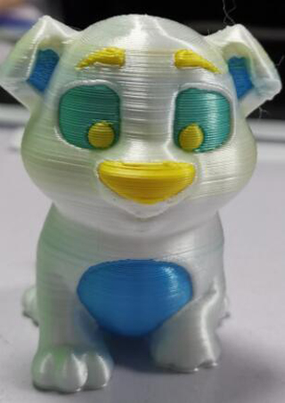
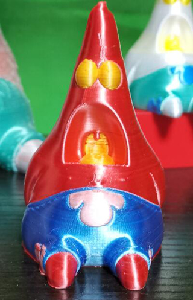
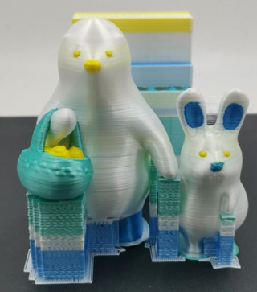
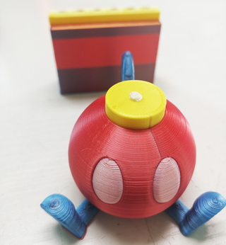

## Examples sliced by PrusaSlcier

#### Example 1. 4 Color test 
:arrow_down: [Download gcode files](Z9E4_4CTest.zip)  
  
#### Example 2. OWL
:arrow_down: [Download gcode files](Z9E4_OWL.zip)  

#### Example 3. Dog
:arrow_down: [Download gcode files](Z9E4_Dog.zip)  

#### Example 4. Patrick
:arrow_down: [Download gcode files](Z9E4_Patrick.zip)  

#### Example 5. KUMATY_Bear
:arrow_down: [Download gcode files](Z9E4_KUMATY_Bear.zip)  

#### Example 6. treefrog
:arrow_down: [Download gcode files](BDD/Z9E4_treefrog.zip)  

#### Example 7. Rabbit
:arrow_down: [Download gcode files](BDD/Z9E4_Rabbit_Pot.zip)  

#### Example 8.  Bobomb
:arrow_down: [Download gcode files](Z9E4_Bobomb.zip)  
  
#### Example 9. 3DBenchy
:arrow_down: [Download gcode files](Z9E4_3DBenchy.zip)  

#### Example 10. BDD
:arrow_down: [Download gcode files](BDD/Z9E4_BDD.zip)  

##### :movie_camera: [Video Tutorial](https://youtu.be/aets9JZ92iU)
##### :movie_camera: [Video Toutrial with painting](https://downgit.github.io/#/home?url=https://github.com/ZONESTAR3D/Upgrade-kit-guide/tree/main/HOTEND/E4%204-IN-1-OUT%20Non-Mixing%20Color%20Hotend/example/PrusaSlicer/BDD/BDD.mp4)

