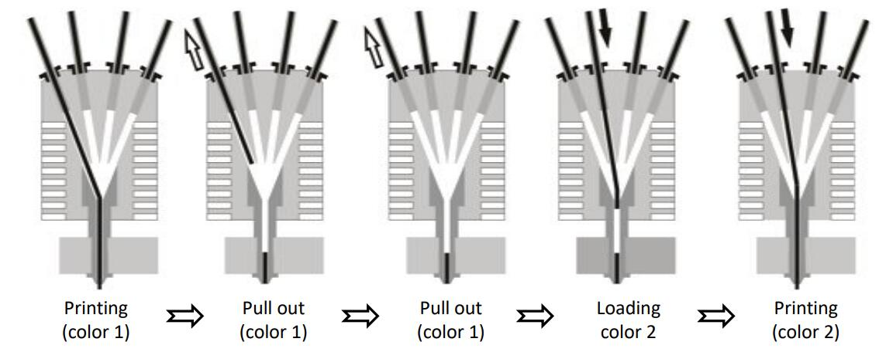

[E4GUIDE]: https://github.com/ZONESTAR3D/Upgrade-kit-guide/blob/main/HOTEND/E4/User_guide/readme.md
[PRELOAD]: https://github.com/ZONESTAR3D/Upgrade-kit-guide/tree/main/HOTEND/E4/User_guide#7-pre-load-filaments
[E4WORKINGPRINCIPLE]:https://github.com/ZONESTAR3D/Upgrade-kit-guide/blob/main/HOTEND/E4/User_guide/readme.md#5-working-principle

----
## <a id="choose-language">:globe_with_meridians: Choose language </a>

<!--  -->

----
## :warning: ATTENTION PLEASE :warning:
- **Read the [:book: E4 hot end user manual][E4GUIDE]to understand its working principle and precautions before using.**
- **Pay attention to [:book: pre-loading filament][PRELOAD] before printing, incorrect operation may block the hot end.**
- **Pay attention to the distance between the nozzle and the bed, too small distance may damaged the hot end and  the sticker.**
- **The retraction length in the slicing setting should not exceed 10mm for E4 hot end.**
- **Pay attention to distinguishing the wiring between the two fans if you reconnected the hot end cable.**
 
----
## 4-IN-1-OUT Non-Mix Color Hotend User Guide
### [Woking principle][E4WORKINGPRINCIPLE]
4-IN-1-OUT Non-Mix Color hot end is composed of heat-sink, funnel collector, heating block, nozzle, etc.. During printing, only one filament is  loaded into the E4 hot end. While switching to another color filament, the extruder should pull the previous color filament out of the E4 hot end and then load another filament into the E4 hot end. The following image (from left to right) briefly demonstrates this process, and you can also refer to [:clapper: this animation](./User_guide/E4_principle.gif) to understand the working principle of the E4 hot end.
   

### :book: User guide
- **[:book: User guide](./User_guide/readme.md)**    
- **[:green_book: User guide pdf file](./User_guide/E4_V2.jpg)**  

### :mortar_board: Test gcode file
- **[:beginner: Test gcode files](./example/readme.md)**    
- **[:surfer: More test gcode files](https://github.com/ZONESTAR3D/Slicing-Guide/tree/master/PrusaSlicer/test_gcode/E4)**

### [:hammer: Troubleshooting](./FAQ/readme.md)

----
## Appendix: Fan duct
### [:arrow_down: Fan duct stl file](./Fan_Duct/fan_duct_e4.zip)

----
