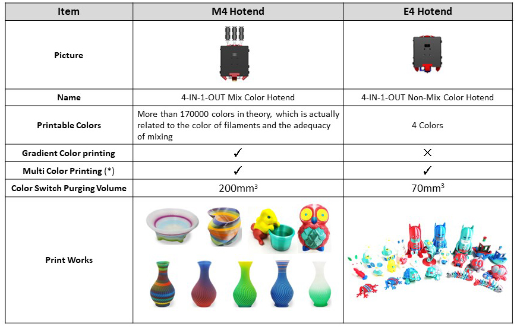
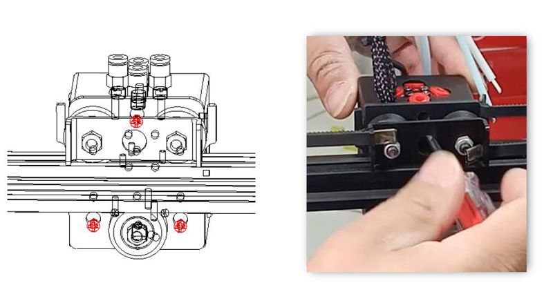
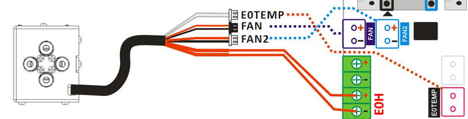
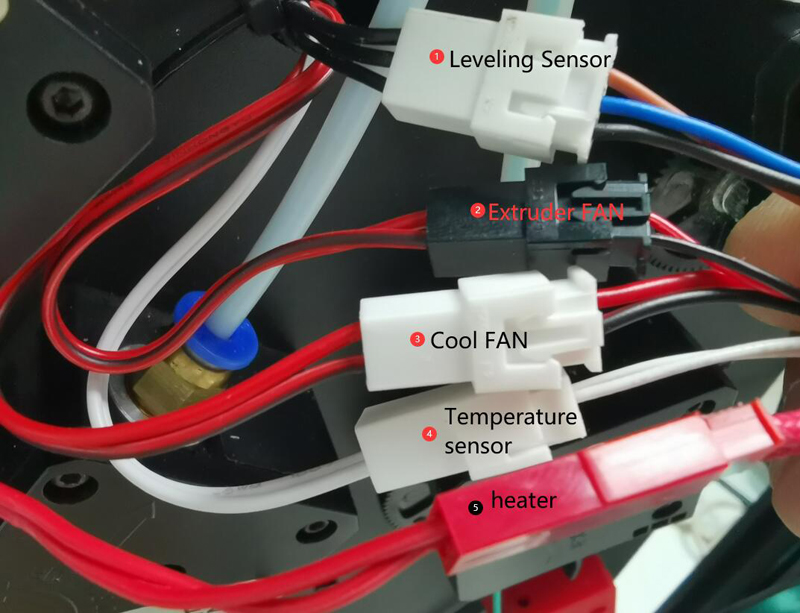
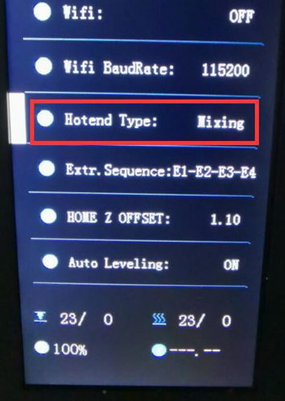
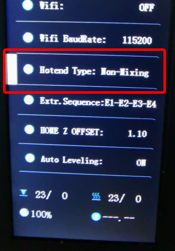
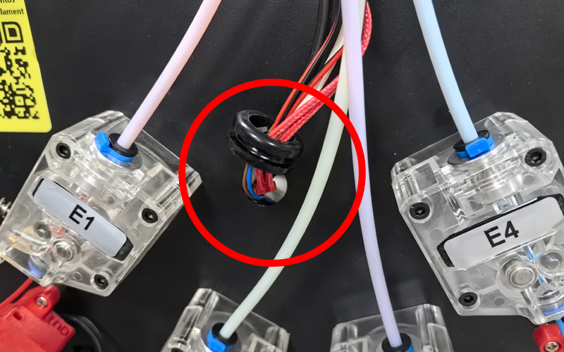

[E4_STARTGCODE]: https://github.com/ZONESTAR3D/Slicing-Guide/blob/master/PrusaSlicer/Custom_Gcode.md#start-g-code
[M4_MIXMULTICOLORPRINT]: https://github.com/ZONESTAR3D/Slicing-Guide/blob/master/PrusaSlicer/PrusaSlicerGuide_M4.md#how-to-print-more-than-4-colors-using-m4-hot-end
[E4_TOOLCHANGE]: https://github.com/ZONESTAR3D/Slicing-Guide/blob/master/PrusaSlicer/Custom_Gcode.md#tool-change-g-code
[FW_Z9V5]: https://github.com/ZONESTAR3D/Firmware/tree/master/Z9/Z9V5/bin
[FW_Z9M4]: https://github.com/ZONESTAR3D/Firmware/tree/master/Z9/Z9M4
[FW_Z8P]: https://github.com/ZONESTAR3D/Firmware/tree/master/Z8/Z8P

----
## <a id="choose-language">:globe_with_meridians: Choose language </a>

<!--  -->

----
# FAQ für E4- und M4-Hotend
- [**Was ist der Unterschied zwischen E4- und M4-Hotend?**](#A1)
- [**Welche Art von Hotend soll ich wählen?**](#A2)
- [**Wie lade ich Filamente richtig in das Hotend?**](#A3)
- [**Was ist der Unterschied in den Slicing-Einstellungen zwischen M4- und E4-Hotends**](#A4)
- [**Wie wechselt man zwischen M4- und E4-Hotend?**](#A5)

-----
## <a id="A1">Was ist der Unterschied zwischen E4- und M4-Hotend?</a>
- **M4 Hotend** kann verschiedenfarbige Filamente mischen, um neue farbige Filamente herzustellen. **E4 Hotend** verfügt nicht über diese Fähigkeit.
- **E4 Hotend** eignet sich gut zum Drucken von ein- oder mehrfarbigen 3D-Objekten (bis zu 4 Farben).
- **M4 Hotend** eignet sich gut zum Drucken von 3D-Objekten mit Farbverlauf, es kann auch 3D-Objekte mit mehr als 4 Farben drucken (durch Mischen der Filamente).
### Funktionsprinzip des E4-Hotends

### Funktionsprinzip des M4-Hotends

### Vorteile des E4-Hotends
1. Kleinerer „Extruder Switch Prime Tower“ beim Drucken mehrfarbiger 3D-Objekte.
2. Bessere Qualität beim Drucken von einfarbigen 3D-Objekten.
3. Unterstützung für das Drucken verschiedener Filamenttypen auf demselben 3D-Objekt.
### Vorteile des M4-Hotends
1. Unterstützen Sie das Mischen verschiedener Farbfilamente zu neuen Farben.
2. Unterstützt Farbverlaufsdruck.
3. Unterstützen Sie eine höhere Durchflussrate.

-----
## <a id="A2">Welches Hotend soll ich wählen, M4 oder E4?</a>
- Wenn Sie kein 3D-Modell mit Farbverlauf drucken müssen, empfehlen wir Ihnen, das **E4-Hotend** zu wählen, da es beim Drucken von einfarbigen und mehrfarbigen 3D-Drucken eine bessere Qualität erzielen kann.
- Wenn Sie ein 3D-Modell mit **Farbverlauf** drucken oder **unterschiedliche Farbfilamente zu einer anderen Farbe mischen möchten**, wählen Sie das M4-Hotend.

-----
## <a id="A3">So laden/entladen Sie Filamente richtig</a>
### Für M4 Hotend
#### Schritte zum Laden von Filamenten in das M4V6-Hotend:
##### 
Beim Laden der Filamente in das M4-Hotend müssen, unabhängig davon, wie viele Extruder Sie beim Drucken verwenden müssen, ***alle vier Filamente in das Hotend geladen werden***, und es ist wichtig, ***sicherzustellen, dass alle Filamente vorhanden sind in die Unterseite des Hotends*** geladen werden, bevor mit dem Drucken begonnen wird.
:warning: ***Egal, ob Sie monochrom oder mehrfarbig drucken, Sie müssen alle vier Filamente in das M4V6-Hotend passen.***
1. Schneiden Sie die Vorderseite des Filaments mit einer Diagonalzange ab, bevor Sie es in den Extruder und das Hotend laden.
2. Laden Sie nacheinander 4 Filamente in alle Extruder.
3. Drehen Sie das Zahnrad des Extruders, um das Filament einzeln zu laden. Drehen Sie jeden Extruder nicht mehr als zwei Umdrehungen auf einmal, bis alle Filamente in das innere PTFE-Rohr des Hotends gelangen. Extrudieren Sie weitere 4 bis 5 Umdrehungen für jeden Extruder und dann aufhören.
:warning: ***Führen Sie dem Hotend keine Filamente zu, wenn einer der Kanäle des Hotends leer ist.***
:warning: ***Stellen Sie sicher, dass die Filamente für jeden Kanal die Unterseite des Hotends erreichen, bevor Sie das Filament zuführen.***

#### Schritte zum Entladen des Filaments vom M4V6-Hotend:
1. Erhitzen der Düse (200℃ für PLA / 230℃ für PETG/ABS). ***Menu: Prepare>>Filament>>Preheat: 200/230***
2. Führen Sie Filamente mindestens 10 mm gleichzeitig auf allen 4 Kanälen zu. ***Menu: Prepare>>Filament>>Extruder: All; Prepare>>Filament>>Slowly Load***  
3. Entladen Sie die Filamente vom Hotend. ***Menu: Prepare>>Filament>>Slowly unload***    
  
### Für E4 Hotend
#### <a id = "PRELOAD_FILAMENT">Schritte zum Laden von Filamenten in das E4-Hotend:</a>
##### 
Wenn Sie das Funktionsprinzip des E4-Hotends verstehen, sollten Sie bereits wissen, dass das Gerät beim Mehrfarbendruck zunächst das zuvor geladene Filament aus dem Hotend entladen und dann das nächste Filament laden muss. Normalerweise ist das Gerät jedoch nicht in der Lage, den Abstand zwischen dem vorderen Ende des Filaments und der Düse zu erkennen, bevor es mit dem Drucken beginnt.*** Daher müssen wir einen Prozess namens <u>***„Filamente vorladen“***</u> einrichten, der es der Maschine ermöglichen soll, die feinen Fäden an eine geeignete Position zu bewegen, die der Maschine zuvor bekannt ist Drucken des Objekts.
:warning: ***Nur die Filamente am Extruder, die in der Gcode-Datei verwendet werden müssen, müssen in das E4-Hotend geladen werden.***

### Schritte zum Entladen des Filaments aus dem E4-Hotend:
1. Erhitzen der Düse (200℃ für PLA / 230℃ für PETG/ABS). ***Menu: Prepare>>Filament>>Preheat: 200/230***
2. Führen Sie dem verwendeten Extruder mindestens 10 mm Filament zu. ***Menu: Prepare>>Filament>>Extruder: 1/2/3/4; Prepare>>Filament>>Slowly Load***   
3. Entladen Sie das Filament vom Hotend. ***Menu: Prepare>>Filament>>Slowly unload***    

-----
## <a id = "A4">Was ist der Unterschied in den Slicing-Einstellungen zwischen M4- und E4-Hotend:</a>
:pushpin: Diese Einstellungen wurden in den Profilen der von uns bereitgestellten PrusaSlicer-Software festgelegt. Sie müssen nur die richtige **Druckervoreinstellung** entsprechend Ihrem Gerät und Hotend-Typ auswählen.
### Slice-Einstellungen für Mehrfarbendruck
Für den Mehrfarbendruck unterscheiden sich die Slicing-Einstellungen für das E4-Hotend und das M4-Hotend hauptsächlich wie folgt:
- **Gcode starten**
   - **Für das E4-Hotend** ist vor dem Drucken ein Vorladen der Filamente erforderlich ([**Know Why**](#PRELOAD_FILAMENT)), Einzelheiten finden Sie im [**Start-Gcode des E4 hotend**][E4_STARTGCODE].
   - **Für das M4-Hotend**: Wenn nicht mehr als 4 Farben gedruckt werden, müssen keine besonderen Änderungen am Start-Gcode vorgenommen werden. Aber **wenn Sie mehr als 4 Farben drucken müssen** (also verschiedenfarbige Filamente zu mehreren Farben mischen), können Sie das Farbmischungsverhältnis im Start-Gcode festlegen. Einzelheiten finden Sie unter [**So drucken Sie mehr als 4 Farben mit dem M4-Hot-End**][M4_MIXMULTICOLORPRINT].
- **Retraktionseinstellungen der Extruder**
   - **Für das E4-Hotend** beträgt die empfohlene **Rückzugslänge** 6 ~ 8 mm (muss weniger als 10 mm betragen).
   - **Für das M4-Hotend** beträgt die empfohlene **Rückzugslänge** 8 ~ 15 mm.
- **Wipe Tower (Prime Tower)**
:pushpin: Die Slicing-Software, die mehrere Extruderdrucker unterstützt, verfügt über die Option **Wipe Tower (Prime Tower)**. Denn wenn der Drucker von einem Extruder zum anderen wechselt, muss er oft zunächst die feinen Fäden der vorherigen Farbe im Hotend reinigen. Nach dem Einschalten der Löschturm-Option kann die Slicing-Software einen zusätzlichen Druck in der Gcode-Datei erzeugen, um alle verbleibenden Filamente im heißen Ende zu entfernen.
   - **Für das E4-Hotend** ist das erforderliche Volumen des Drahtturms relativ gering.
   - **Für das M4-Hotend** ist das benötigte Volumen des Drahtturms relativ groß.
- **Werkzeugwechsel-G-Code**
   - **Beim E4-Hotend** ist es beim Wechseln des Extruders erforderlich, das vorherige Farbfilament aus dem Hotend herauszuziehen und dann das nächste Farbfilament in das Hotend zu laden. Daher muss der Werkzeugwechsel-Gcode festgelegt werden, um diesen Vorgang auszuführen. Einzelheiten finden Sie unter [**Werkzeugwechsel-G-Code für E4-Hotend**][E4_TOOLCHANGE].
   - **Für das M4-Hotend** ist kein **Werkzeugwechsel-G-Code** erforderlich.

-----
## <a id="A5">So wechseln Sie zwischen M4-Hotend und E4-Hotend</a>
### 1. Lösen Sie die drei Schrauben am Hotend-Gehäuse und entfernen Sie das alte Hotend von der Maschine (x Riemenscheibe). Installieren Sie dann das neue Hotend an der Maschine (X-Riemenscheibe) und ziehen Sie die Schrauben fest.

### 2. Schließen Sie die Kabel des neuen Hotends an die Maschine an.
 
### 3. Stellen Sie den Hotend-Typ im LCD-Menü ein: *Steuerung>>Konfigurieren>>Hotend-Typ*

#### :pushpin: Die Anschlüsse des Z9V5-Druckkopfs sind im Inneren des Geräts versteckt. Sie müssen den Gummiring entfernen und die Anschlüsse herausziehen.

### :warning: HINWEIS 1: Wenn Sie das Menü „Hotend-Typ“ nicht auf dem LCD-Bildschirm finden können, laden Sie bitte die neueste Firmware auf Ihren Drucker hoch.
[**:point_right: Firmware für Z9V5**][FW_Z9V5] / [**:point_right: Firmware für Z8P**][FW_Z8P] / [**:point_right: Firmware für Z9M4**][FW_Z9M4]
### :warning: HINWEIS 2: Das Mischfarben-Hotend und das Nicht-Mischfarben-Hotend müssen unterschiedliche Slice-Einstellungen verwenden. Bitte achten Sie auf die Unterscheidung. Die Verwendung der falschen Slice-Einstellung kann das Hotend blockieren.

-----