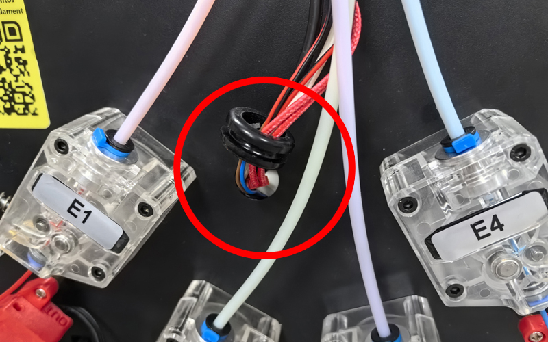

[E4_STARTGCODE]: https://github.com/ZONESTAR3D/Slicing-Guide/blob/master/PrusaSlicer/Custom_Gcode.md#start-g-code
[M4_MIXMULTICOLORPRINT]: https://github.com/ZONESTAR3D/Slicing-Guide/blob/master/PrusaSlicer/PrusaSlicerGuide_M4.md#how-to-print-more-than-4-colors-using-m4-hot-end
[E4_TOOLCHANGE]: https://github.com/ZONESTAR3D/Slicing-Guide/blob/master/PrusaSlicer/Custom_Gcode.md#tool-change-g-code
[FW_Z9V5]: https://github.com/ZONESTAR3D/Firmware/tree/master/Z9/Z9V5/bin
[FW_Z9M4]: https://github.com/ZONESTAR3D/Firmware/tree/master/Z9/Z9M4
[FW_Z8P]: https://github.com/ZONESTAR3D/Firmware/tree/master/Z8/Z8P

----
## <a id="choose-language">:globe_with_meridians: Choose language </a>

<!--  -->

----
# FAQ pour les hotend E4 et M4
- [**Quelle est la différence entre le hotend E4 et M4 ?**](#A1)
- [**Quel type de hotend dois-je choisir ?**](#A2)
- [**Comment charger correctement les filaments dans le hotend ?**](#A3)
- [**Quelle est la différence dans les paramètres de découpage entre les hotends M4 et E4**](#A4)
- [**Comment basculer entre le hotend M4 et E4 ?**](#A5)

-----
## <a id="A1">Quelle est la différence entre le hotend E4 et M4 ?</a>
- **M4 hotend** peut mélanger des filaments de différentes couleurs pour produire de nouveaux filaments colorés. **E4 hotend** n'a pas cette capacité.
- **E4 hotend** est efficace pour imprimer des objets 3D monochromes ou multicolores (jusqu'à 4 couleurs).
- **M4 hotend** est bon pour imprimer des objets 3D en dégradé de couleurs, il peut également imprimer plus de 4 objets 3D colos (en mélangeant les filaments).
### Principe de fonctionnement du hotend E4

### Principe de fonctionnement du hotend M4

### Avantages du hotend E4
1. Une « tour principale de commutateur d'extrudeuse » plus petite lors de l'impression d'un objet 3D multicolore.
2. Meilleure qualité lors de l’impression d’un objet 3D d’une seule couleur.
3. Prise en charge de l'impression de différents types de filaments sur le même objet 3D.
### Avantages du hotend M4
1. Prend en charge le mélange de filaments de différentes couleurs avec de nouvelles couleurs.
2. Prise en charge de l'impression de couleurs dégradées.
3. Supporte un débit plus élevé.

-----
## <a id="A2"> Quel hotend dois-je choisir, M4 ou E4 ?</a>
- Si vous **n'avez pas besoin** d'imprimer un modèle 3D en dégradé de couleurs, nous vous suggérons de choisir **E4 hotend**, il peut obtenir une meilleure qualité d'impression d'impressions 3D monochromes et multicolores.
- Si vous souhaitez imprimer un modèle 3D **dégradé de couleur**, ou si vous souhaitez **mélanger des filaments de différentes couleurs avec une autre couleur**, choisissez le hotend M4.

-----
## <a id="A3"> Comment charger/décharger correctement les filaments</a>
### Pour M4 Hotend
#### Étapes pour charger les filaments dans le hotend M4V6 :
##### 
Lors du chargement des filaments dans le hotend M4, quel que soit le nombre d'extrudeuses que vous devez utiliser pendant l'impression, ***les quatre filaments doivent être chargés dans le hotend***, et il est important de ***s'assurer que tous les filaments sont chargé au bas du hotend*** avant de commencer l'impression.
:warning: ***Que vous imprimiez en monochrome ou en multicolore, vous devez insérer les quatre filaments dans le hotend M4V6.***
1. Coupez l'avant du filament avec une pince diagonale avant de le charger dans l'extrudeuse et la hotend.
2. Chargez 4 filaments dans toutes les extrudeuses, un par un.
3. Faites tourner l'engrenage des extrudeuses pour charger les filaments un par un, ne faites pas tourner chaque extrudeuse plus de 2 tours à la fois, jusqu'à ce que tous les filaments entrent dans le tube PTFE intérieur de la hotend, extrayez plus de 4 à 5 tours pour chaque extrudeuse. puis arrête.
:warning: ***N'alimentez pas le hotend en filaments lorsque l'un des canaux du hotend est vide.***
:warning: ***Assurez-vous que les filaments de chaque canal atteignent le bas de la hotend avant d'alimenter le filament.***

#### Étapes pour décharger le filament du hotend M4V6 :
1. Chauffer la buse (200℃ pour PLA / 230℃ pour PETG/ABS). ***Menu: Préparer>>Filament>>Préchauffer : 200/230***
2. Alimentez les filaments sur au moins 10 mm sur les 4 canaux simultanément. ***Menu: Préparer>>Filament>>Extruseur: Tous ; Préparer>>Filament>>Charger lentement***
3. Déchargez les filaments de la hotend. ***Menu : Préparer>>Filament>>Décharger lentement***
  
### Pour E4 Hotend
#### <a id = "PRELOAD_FILAMENT">Étapes pour charger les filaments dans la hotend E4:</a>
##### 
Si vous comprenez le principe de fonctionnement du hotend E4, sachez déjà que lors d'une impression multicolore, la machine doit d'abord décharger le filament précédemment chargé du hotend, puis charger le filament suivant. Cependant, généralement ***la machine n'a pas la capacité de reconnaître la distance entre l'extrémité avant du filament et la buse avant de commencer l'impression***. Il faut donc mettre en place un procédé appelé <u>***"précharge filaments"***</u>, qui a pour but de permettre à la machine de déplacer les fils fins vers une position adaptée connue de la machine avant imprimer l'objet.
:warning: ***Seuls les filaments de l'extrudeuse qui doivent être utilisés dans le fichier gcode doivent être chargés dans le hotend E4.***

### Étapes pour décharger le filament du hotend E4:
1. Chauffer la buse (200℃ pour PLA / 230℃ pour PETG/ABS). ***Menu: Préparer>>Filament>>Préchauffer: 200/230***
2. Alimentez le filament sur au moins 10 mm sur l'extrudeuse utilisée. ***Menu: Préparer>>Filament>>Extruseur: 1/2/3/4 ; Préparer>>Filament>>Charger lentement***
3. Déchargez le filament de la hotend. ***Menu: Préparer>>Filament>>Décharger lentement***

-----
## <a id = "A4">Quelle est la différence dans les paramètres de découpage entre les hotend M4 et E4:</a>
:pushpin: Ces paramètres ont été définis dans les profils du logiciel PrusaSlicer que nous fournissons. Il vous suffit de choisir le bon **préréglage d'imprimante** en fonction de votre machine et du type de hotend.
### Paramètres de tranche pour l'impression multicolore
Pour l'impression multicolore, les paramètres de découpage pour le hotend E4 et le hotend M4 diffèrent principalement comme suit:
- **démarrer gcode**
   - **Pour le hotend E4**, il faut "précharger les filaments" avant de commencer l'impression ([**Know Why**](#PRELOAD_FILAMENT)), pour plus de détails, veuillez vous référer au [**start gcode de l'E4 hotend**][E4_STARTGCODE].
   - **Pour le hotend M4**, lors de l'impression de 4 couleurs maximum, il n'est pas nécessaire d'apporter des modifications particulières au gcode de démarrage. Mais **si vous devez imprimer plus de 4 couleurs** (en mélangeant des filaments de différentes couleurs en plusieurs couleurs), vous pouvez définir le rapport de mélange des couleurs dans le gcode de démarrage. Pour plus de détails, veuillez vous référer à [**Comment imprimer plus de 4 couleurs à l'aide du hot end M4**][M4_MIXMULTICOLORPRINT].
- **Paramètres de rétraction des extrudeuses**
   - **Pour le hotend E4**, la **longueur de rétraction** recommandée est de 6 à 8 mm (doit être inférieure à 10 mm).
   - **Pour le hotend M4**, la **longueur de rétraction** recommandée est de 8 à 15 mm.
- **Tour d'essuyage (Tour Prime)**
:pushpin: Le logiciel de découpage qui prend en charge plusieurs imprimantes extrudeuses dispose d'une option **"Wipe Tower (Prime Tower)"**. Car lorsque l’imprimante passe d’une extrudeuse à une autre, elle doit souvent d’abord nettoyer les fils fins de la couleur précédente dans la partie chaude. Après avoir activé l'option d'effacement de la tour, le logiciel de découpage peut générer une impression « supplémentaire » dans le fichier gcode pour nettoyer les filaments restants dans l'extrémité chaude.
   - **Pour le hotend E4**, le volume requis de la tour filaire est relativement faible.
   - **Pour le hotend M4**, le volume requis de la tour filaire est relativement important.
- **Changement d'outil G-code**
   - **Pour le hotend E4**, lors du changement d'extrudeuse, il est nécessaire de retirer le filament de couleur précédent du hotend puis de charger le filament de couleur suivant dans le hotend. Par conséquent, Tool Change Gcode doit être défini pour réaliser cette opération. Pour plus de détails, veuillez vous référer à [**Tool change G-code for E4 hotend**][E4_TOOLCHANGE].
   - **Pour le hotend M4**, il n'a pas besoin de **outil de changement de G-code**.

-----
## <a id="A5"> Comment basculer entre le hotend M4 et le hotend E4</a>
### 1. Desserrez les trois vis du boîtier du hotend et retirez l'ancien hotend de la machine (x poulie). Installez ensuite le nouveau hotend sur la machine (x poulie) et verrouillez les vis.

### 2. Connectez les fils du nouveau hotend à la machine.
 
### 3. Définissez le type de hotend sur le menu LCD : *Contrôle>>Configurer>>Type de hotend*

#### :pushpin: Les connecteurs de la tête d'impression Z9V5 sont cachés à l'intérieur de la machine, vous devez retirer l'anneau en caoutchouc et retirer les connecteurs.

### :warning: REMARQUE 1: Si vous ne trouvez pas le menu « type de hotend » sur l'écran LCD, veuillez télécharger le micrologiciel le plus récent sur votre imprimante.
[**:point_right: Firmware pour Z9V5**][FW_Z9V5] / [**:point_right: Firmware pour Z8P**][FW_Z8P] / [**:point_right: Firmware pour Z9M4**][FW_Z9M4]
### :warning: REMARQUE 2: le Hotend de couleurs mélangées et le hotend de couleurs non mélangées doivent utiliser des paramètres de tranche différents, veuillez faire attention à la distinction. L’utilisation d’un mauvais réglage de tranche peut bloquer le hotend.

-----
