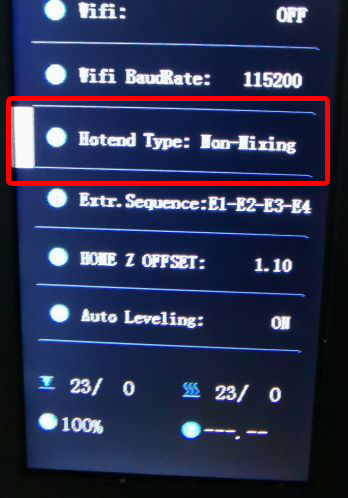

[E4_STARTGCODE]: https://github.com/ZONESTAR3D/Slicing-Guide/blob/master/PrusaSlicer/Custom_Gcode.md#start-g-code
[M4_MIXMULTICOLORPRINT]: https://github.com/ZONESTAR3D/Slicing-Guide/blob/master/PrusaSlicer/PrusaSlicerGuide_M4.md#how-to-print-more-than-4-colors-using-m4-hot-end
[E4_TOOLCHANGE]: https://github.com/ZONESTAR3D/Slicing-Guide/blob/master/PrusaSlicer/Custom_Gcode.md#tool-change-g-code
[FW_Z9V5]: https://github.com/ZONESTAR3D/Firmware/tree/master/Z9/Z9V5/bin
[FW_Z9M4]: https://github.com/ZONESTAR3D/Firmware/tree/master/Z9/Z9M4
[FW_Z8P]: https://github.com/ZONESTAR3D/Firmware/tree/master/Z8/Z8P

----
## <a id="choose-language">:globe_with_meridians: Choose language </a>

<!--  -->

----
# FAQ per hotend E4 e M4
- [**Qual è la differenza tra l'hotend E4 e M4?**](#A1)
- [**Che tipo di hotend dovrei scegliere?**](#A2)
- [**Come caricare correttamente i filamenti nell'hotend?**](#A3)
- [**Qual è la differenza nelle impostazioni di slicing tra gli hotend M4 ed E4**](#A4)
- [**Come passare dall'hotend M4 all'hotend E4?**](#A5)

-----
## <a id="A1">Cosa c'è di diverso tra l'hotend E4 e M4?</a>
   
- **Hotend M4** può mescolare diversi filamenti colorati per produrre nuovi filamenti colorati. **Hotend E4** non ha questa capacità.
- **Hotend E4** è ottimo per stampare oggetti 3D monocolore o multicolori (fino a 4 colori).
- **M4 hotend** è ottimo per stampare oggetti 3D a colori sfumati, può anche stampare più di 4 oggetti 3D a colori (mescolando i filamenti).
### Principio di funzionamento dell'hotend E4

### Principio di funzionamento dell'hotend M4

### Vantaggi dell'hotend E4
1. "Torre principale dell'interruttore estrusore" più piccola durante la stampa di oggetti 3D multicolori.
2. Migliore qualità durante la stampa di oggetti 3D a un colore.
3. Supporto per stampare diversi tipi di filamento sullo stesso oggetto 3D.
### Vantaggi dell'hotend M4
1. Supporta la miscelazione di filamenti di colore diverso con nuovi colori.
2. Supporta la stampa a colori sfumati.
3. Supporta una portata più elevata.

-----
## <a id="A2"> Quale hotend dovrei scegliere, M4 o E4?</a>
- Se **non hai bisogno** di stampare un modello 3D a colori sfumati, ti consigliamo di scegliere **hotend E4**, può ottenere una qualità migliore nella stampa di stampe 3D monocolore e multicolori.
- Se desideri stampare un modello 3D di **colore sfumato** o vuoi **mescolare filamenti di colore diverso in un altro colore**, scegli l'hotend M4.

-----
## <a id="A3"> Come caricare/scaricare correttamente i filamenti</a>
L'hotend M4 e l'hotend E4 hanno requisiti diversi per il caricamento del filamento.
- **Requisiti di quantità per caricare i filamenti:**
   - L'hot end M4 richiede il caricamento di quattro filamenti contemporaneamente, indipendentemente dal fatto che si stampi monocolore o multicolore;
   - L'hot end E4 può scegliere il numero di filamenti da caricare in base ai colori stampati.
- **Requisiti di posizione per il caricamento dei filamenti:**
   - L'hot end M4 richiede che il filamento sia installato nella parte inferiore dell'hot end;
   - L'hot end E4 richiede che il filamento sia installato sopra la bocca dell'imbuto dell'hot end (estendendo il tubo PTFE di circa 20 mm).
### Per l'hotend M4
#### Passaggi per caricare i filamenti nell'hotend M4:
##### 
Quando si caricano i filamenti nell'hotend M4, indipendentemente dal numero di estrusori necessari durante la stampa, ***tutti e quattro i filamenti devono essere caricati nell'hotend*** ed è importante ***assicurarsi che tutti i filamenti siano caricato nella parte inferiore dell'hotend*** prima di iniziare la stampa.
:warning: ***Che si stampi in monocolore o multicolore, è necessario caricare tutti e quattro i filamenti nell'hotend M4V6.***
1. Taglia la parte anteriore del filamento con una pinza diagonale prima di caricarlo nell'estrusore e nell'hotend.
2. Caricare 4 filamenti su tutti gli estrusori uno per uno, quindi ruotare l'ingranaggio degli estrusori finché il filamento non entra nel tubo interno in PTFE dell'hotend, ruotare di altri 4 ~ 5 giri e poi fermarsi.

#### Passaggi per scaricare il filamento dall'hotend M4:
1. Riscaldare l'ugello (200℃ per PLA / 230℃ per PETG/ABS) e attendere che venga raggiunta la temperatura. ***Menu: Prepare>>Filament>>Preheat: 200/230***
2. Alimentare i filamenti per almeno 10 mm su tutti e 4 i canali contemporaneamente ***Menu: Prepare>>Filament>>Extruder: All; Prepare>>Filament>>Slowly Load***
3. Scaricare i filamenti dall'hotend ***Menu: Prepare>>Filament>>Slowly unload***.
  
### Per l'hotend E4
#### <a id = "PRELOAD_FILAMENT">Passaggi per caricare i filamenti nell'hotend E4:</a>
##### 
Se comprendi il principio di funzionamento dell'hotend E4, dovresti già sapere che quando si stampa multicolore, la macchina deve prima scaricare il filamento precedentemente caricato dall'hotend e poi caricare il filamento successivo. Tuttavia, solitamente ***la macchina non ha la capacità di riconoscere la distanza tra l'estremità anteriore del filamento e l'ugello prima di iniziare la stampa***. Pertanto, dobbiamo impostare un processo chiamato <u>***"precarica filamenti"***</u>, che mira a consentire alla macchina di spostare i fili sottili in una posizione adatta nota alla macchina prima stampare l'oggetto.
:warning: ***Solo i filamenti sull'estrusore che devono essere utilizzati nel file gcode devono essere caricati nell'hotend E4.***

### Passaggi per scaricare il filamento dall'hotend E4:
1. Riscaldamento dell'ugello (200℃ per PLA/230℃ per PETG/ABS) e attendere che venga raggiunta la temperatura. ***Menu: Prepare>>Filament>>Preheat: 200/230***
2. Alimentare il filamento per almeno 10 mm sull'estrusore usato. ***Menu: Prepare>>Filament>>Extruder: 1/2/3/4; Prepare>>Filament>>Slowly Load***
3. Scarica il filamento dall'hotend. ***Menu: Prepare>>Filament>>Slowly unload***

-----
## <a id = "A4">Qual è la differenza nelle impostazioni di slicing tra l'hotend M4 e E4:</a>
:pushpin: Queste impostazioni sono state configurate nei profili del software PrusaSlicer che forniamo. Devi solo scegliere la **preimpostazione della stampante** corretta in base alla tua macchina e al tipo di hotend.
### Impostazioni delle sezioni per la stampa multicolore
Per la stampa multicolore, le impostazioni di suddivisione per l'hotend E4 e l'hotend M4 differiscono principalmente come segue:
- **avvia gcode**
   - **Per l'hotend E4**, è necessario "precaricare i filamenti" prima di iniziare la stampa([**Know Why**](#PRELOAD_FILAMENT)), per i dettagli, fare riferimento a [**start gcode dell'E4 hotend**][E4_STARTGCODE].
   - **Per l'hotend M4**, quando si stampa non più di 4 colori, non è necessario apportare modifiche speciali al gcode iniziale. Ma **se devi stampare più di 4 colori** (mescolando filamenti colorati diversi in più colori), puoi impostare il rapporto di miscelazione dei colori nel gcode iniziale. Per i dettagli, fare riferimento a [**Come stampare più di 4 colori utilizzando l'hot end M4**][M4_MIXMULTICOLORPRINT].
- **Impostazioni di retrazione degli estrusori**
   - **Per l'hotend E4**, la **Lunghezza di retrazione** consigliata è 6 ~ 8 mm (deve essere inferiore a 10 mm).
   - **Per l'hotend M4**, la **Lunghezza di retrazione** consigliata è 8 ~ 15 mm.
- **Torre di pulizia (Torre Prime)**
:pushpin: Il software di slicing che supporta più stampanti con estrusore ha un'opzione **"Wipe Tower(Prime Tower)"**. Perché quando la stampante passa da un estrusore all'altro, spesso ha bisogno prima di pulire i fili sottili del colore precedente nell'hot end. Dopo aver attivato l'opzione di cancellazione della torre, il software di slicing può generare una stampa "aggiuntiva" nel file gcode per ripulire eventuali filamenti rimanenti nell'hot end.
   - **Per l'hotend E4**, il volume richiesto della torre di cablaggio è relativamente piccolo.
   - **Per l'hotend M4**, il volume richiesto della torre di cablaggio è relativamente grande.
- **Codice G cambio utensile**
   - **Per l'hotend E4**, quando si cambia l'estrusore, è necessario estrarre il filamento di colore precedente dall'hotend e quindi caricare il filamento di colore successivo nell'hotend. Pertanto, per eseguire questa operazione è necessario impostare il Gcode cambio utensile. Per i dettagli, fare riferimento a [**Codice G cambio utensile per hotend E4**][E4_TOOLCHANGE].
   - **Per l'hotend M4**, non è necessario il **codice G per il cambio utensile**.

-----
## <a id="A5"> Come passare dall'hotend M4 all'hotend E4</a>
### 1. Allenta le tre viti sull'alloggiamento dell'hotend e rimuovi il vecchio hotend dalla macchina (x puleggia). Quindi installare il nuovo hotend sulla macchina (x puleggia) e bloccare le viti.

### 2. Collega i cavi del nuovo hotend alla macchina.
 
### 3. Imposta il tipo di hotend sul menu LCD: *Controllo>>Configura>>Tipo di hotend*

#### :pushpin: I connettori della testina di stampa Z9V5 sono nascosti all'interno della macchina, è necessario rimuovere l'anello di gomma ed estrarre i connettori.

### :warning: NOTA 1: Se non riesci a trovare il menu "tipo hotend" sullo schermo LCD, carica il firmware più recente sulla tua stampante.
[**:point_right: firmware per Z9V5**][FW_Z9V5] / [**:point_right: firmware per Z8P**][FW_Z8P] / [**:point_right: firmware per Z9M4**][FW_Z9M4]
### :warning: NOTA 2: L'hotend a colori misti e l'hotend a colori non misti devono utilizzare impostazioni di sezione diverse, prestare attenzione a distinguere. L'utilizzo dell'impostazione errata della sezione potrebbe bloccare l'hotend.

-----