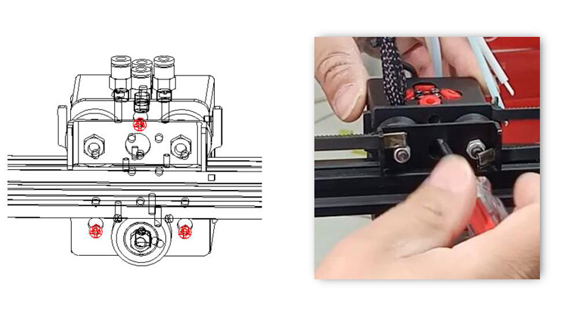

[E4_STARTGCODE]: https://github.com/ZONESTAR3D/Slicing-Guide/blob/master/PrusaSlicer/Custom_Gcode.md#start-g-code
[M4_MIXMULTICOLORPRINT]: https://github.com/ZONESTAR3D/Slicing-Guide/blob/master/PrusaSlicer/PrusaSlicerGuide_M4.md#how-to-print-more-than-4-colors-using-m4-hot-end
[E4_TOOLCHANGE]: https://github.com/ZONESTAR3D/Slicing-Guide/blob/master/PrusaSlicer/Custom_Gcode.md#tool-change-g-code
[FW_Z9V5]: https://github.com/ZONESTAR3D/Firmware/tree/master/Z9/Z9V5/bin
[FW_Z9M4]: https://github.com/ZONESTAR3D/Firmware/tree/master/Z9/Z9M4
[FW_Z8P]: https://github.com/ZONESTAR3D/Firmware/tree/master/Z8/Z8P

----
## <a id="choose-language">:globe_with_meridians: Choose language </a>

<!--  -->

----
# FAQ para hotend E4 e M4
- [**Qual é a diferença entre hotend E4 e M4?**](#A1)
- [**Que tipo de hotend devo escolher?**](#A2)
- [**Como carregar filamentos no hotend corretamente?**](#A3)
- [**Qual é a diferença nas configurações de fatiamento entre hotends M4 e E4**](#A4)
- [**Como alternar entre hotend M4 e E4?**](#A5)

-----
## <a id="A1">Qual é a diferença entre os hotends E4 e M4?</a>
   
- **M4 hotend** pode misturar filamentos de cores diferentes para produzir novos filamentos coloridos. **hotend E4** não tem essa capacidade.
- **E4 hotend** é bom para imprimir objetos 3D de uma ou várias cores (até 4 cores).
- **M4 hotend** é bom para imprimir objetos 3D em cores gradientes, ele também pode imprimir mais de 4 cores de objetos 3D (misturando os filamentos).
### Princípio de funcionamento do hotend E4

### Princípio de funcionamento do hotend M4

### Vantagens do hotend E4
1. "Torre principal do interruptor da extrusora" menor durante a impressão de objetos 3D multicoloridos.
2. Melhor qualidade ao imprimir um objeto 3D colorido.
3. Suporte para imprimir diferentes tipos de filamento no mesmo objeto 3D.
### Vantagens do hotend M4
1. Suporte para misturar filamentos de cores diferentes com novas cores.
2. Suporte para impressão em cores gradientes.
3. Suporta maior taxa de fluxo.

-----
## <a id="A2"> Qual hotend devo escolher, M4 ou E4?</a>
- Se você **não precisa** imprimir o modelo 3D em cores gradientes, sugerimos que você escolha **E4 hotend**, ele pode obter melhor qualidade na impressão de impressões 3D em cores únicas e multicoloridas.
- Se você deseja imprimir modelo 3D de **cor gradiente** ou deseja **misturar filamentos de cores diferentes com outra cor**, escolha hotend M4.

-----
## <a id="A3"> Como carregar/descarregar filamentos corretamente</a>
### Para Hotend M4
#### Etapas para carregar filamentos no hotend M4V6:
##### 
Ao carregar os filamentos no hotend M4, independentemente de quantas extrusoras você precisa usar durante a impressão, ***todos os quatro filamentos devem ser carregados no hotend***, e é importante ***garantir que todos os filamentos estejam carregado na parte inferior do hotend*** antes de iniciar a impressão.
:warning: ***Seja imprimindo monocromático ou multicolorido, você precisa encaixar todos os quatro filamentos no hotend M4V6.***
1. Corte a frente do filamento com um alicate diagonal antes de carregá-lo na extrusora e no hotend.
2. Carregue 4 filamentos em todas as extrusoras, um por um.
3. Gire a engrenagem das extrusoras para carregar o filamento um por um, não gire cada extrusora mais de 2 voltas por vez, até que todos os filamentos entrem no tubo interno de PTFE do hotend, extrude mais 4 ~ 5 voltas para cada extrusora e então pare.
:warning: ***Não alimente filamentos no hotend quando qualquer canal do hotend estiver vazio.***
:warning: ***Certifique-se de que os filamentos de cada canal cheguem à parte inferior do hotend antes de alimentar o filamento.***

#### Etapas para descarregar o filamento do hotend M4V6:
1. Aquecimento do bico (200°C para PLA / 230°C para PETG/ABS). ***Menu: Preparar>>Filamento>>Pré-aquecer: 200/230***
2. Alimente os filamentos pelo menos 10 mm em todos os 4 canais simultaneamente. ***Menu: Preparar>>Filamento>>Extrusora: Todos; Preparar>>Filamento>>Carregar Lentamente***
3. Descarregue os filamentos do hotend. ***Menu: Preparar>>Filamento>>Descarregar lentamente***
  
### Para Hotend E4
#### <a id = "PRELOAD_FILAMENT">Etapas para carregar filamentos no hotend E4:</a>
##### 
Se você entende o princípio de funcionamento do hotend E4, já deve saber que ao imprimir multicolorido, a máquina primeiro precisa descarregar o filamento previamente carregado do hotend e depois carregar o próximo filamento. Porém, normalmente ***a máquina não tem a capacidade de reconhecer a distância entre a extremidade frontal do filamento e o bocal antes de iniciar a impressão***. Portanto, precisamos montar um processo chamado <u>***"pre-load filaments"***</u>, que visa permitir que a máquina mova os fios finos para uma posição adequada conhecida pela máquina antes imprimindo o objeto.
:warning: ***Apenas os filamentos da extrusora que precisam ser usados no arquivo gcode precisam ser carregados no hotend E4.***

### Passos para descarregar o filamento do hotend E4:
1. Aquecimento do bico (200°C para PLA / 230°C para PETG/ABS). ***Menu: Preparar>>Filamento>>Pré-aquecer: 200/230***
2. Alimente o filamento pelo menos 10 mm na extrusora usada. ***Menu: Preparar>>Filamento>>Extrusora: 1/2/3/4; Preparar>>Filamento>>Carregar Lentamente***
3. Descarregue o filamento do hotend. ***Menu: Preparar>>Filamento>>Descarregar lentamente***

-----
## <a id = "A4">Qual é a diferença nas configurações de fatiamento entre o hotend M4 e E4:</a>
:pushpin: Essas configurações foram definidas nos perfis do software PrusaSlicer que fornecemos. Você só precisa escolher a **predefinição de impressora** correta de acordo com sua máquina e tipo de hotend.
### Configurações de fatia para impressão multicolorida
Para impressão multicolorida, as configurações de fatiamento para o hotend E4 e o hotend M4 diferem principalmente da seguinte forma:
- **iniciar gcode**
   - **Para o hotend E4**, requer "filamentos de pré-carregamento" antes de iniciar a impressão([**Saiba por que**](#PRELOAD_FILAMENT)), para obter detalhes, consulte [**start gcode do E4 hotend**][E4_STARTGCODE].
   - **Para o hotend M4**, ao imprimir no máximo 4 cores, não há necessidade de fazer alterações especiais no gcode inicial. Mas **se você precisar imprimir mais de 4 cores** (misturando filamentos de cores diferentes em várias cores), você pode definir a proporção de mistura de cores no gcode inicial. Para obter detalhes, consulte [**Como imprimir mais de 4 cores usando hot end M4**][M4_MIXMULTICOLORPRINT].
- **Configurações de retração das Extrusoras**
   - **Para o hotend E4**, o **comprimento de retração** recomendado é de 6 ~ 8 mm (deve ser inferior a 10 mm).
   - **Para o hotend M4**, o **comprimento de retração** recomendado é de 8 ~ 15 mm.
- **Torre Wipe (Torre Principal)**
:pushpin: O software de fatiamento que suporta múltiplas impressoras extrusoras tem uma opção **"Wipe Tower (Prime Tower)"**. Porque quando a impressora muda de uma extrusora para outra, muitas vezes é necessário primeiro limpar os fios finos da cor anterior no hot end. Depois de ativar a opção de apagar torre, o software de fatiamento pode gerar uma impressão “adicional” no arquivo gcode para limpar quaisquer filamentos restantes no hot end.
   - **Para o hotend E4**, o volume necessário da torre de arame é relativamente pequeno.
   - **Para o hotend M4**, o volume necessário da torre de arame é relativamente grande.
- **Código G de mudança de ferramenta**
   - **Para o hotend E4**, ao trocar a extrusora, é necessário retirar o filamento de cor anterior do hotend e depois carregar o próximo filamento de cor no hotend. Portanto, o Gcode de mudança de ferramenta precisa ser definido para realizar esta operação. Para deltails, consulte [**Código G de troca de ferramenta para hotend E4**][E4_TOOLCHANGE].
   - **Para o hotend M4**, não é necessário **Código G de troca de ferramenta**.

-----
## <a id="A5"> Como alternar entre hotend M4 e hotend E4</a>
### 1. Afrouxe os três parafusos da carcaça do hotend e remova o hotend antigo da máquina (x polia). Em seguida instale o novo hotend na máquina (x polia) e fixe os parafusos.

### 2. Conecte os fios do novo hotend à máquina.
 
### 3. Defina o tipo de hotend no menu LCD: *Control>>Configure>>Hotend Type*

#### :pushpin: Os conectores da cabeça de impressão Z9V5 estão escondidos dentro da máquina, você precisa remover o anel de borracha e retirar os conectores.

### :warning: NOTA 1: Se você não conseguir encontrar o menu "tipo hotend" na tela LCD, carregue o firmware mais recente para sua impressora.
[**:point_right: Firmware para Z9V5**][FW_Z9V5] / [**:point_right: Firmware para Z8P**][FW_Z8P] / [**:point_right: Firmware para Z9M4**][FW_Z9M4]
### :warning: NOTA 2: O hotend de cores misturadas e o hotend de cores não misturadas devem usar configurações de fatia diferentes, preste atenção para distinguir. Usar a configuração de fatia errada pode bloquear o hotend.

-----