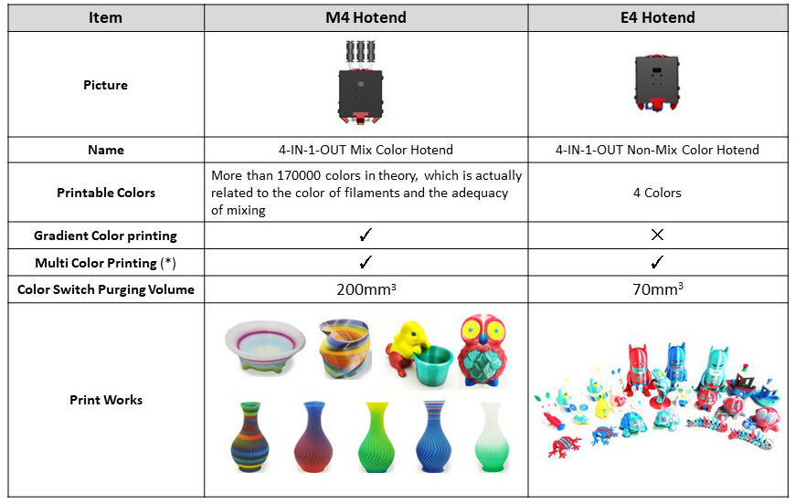

[E4_STARTGCODE]: https://github.com/ZONESTAR3D/Slicing-Guide/blob/master/PrusaSlicer/Custom_Gcode.md#start-g-code
[M4_MIXMULTICOLORPRINT]: https://github.com/ZONESTAR3D/Slicing-Guide/blob/master/PrusaSlicer/PrusaSlicerGuide_M4.md#how-to-print-more-than-4-colors-using-m4-hot-end
[E4_TOOLCHANGE]: https://github.com/ZONESTAR3D/Slicing-Guide/blob/master/PrusaSlicer/Custom_Gcode.md#tool-change-g-code
[FW_Z9V5]: https://github.com/ZONESTAR3D/Firmware/tree/master/Z9/Z9V5/bin
[FW_Z9M4]: https://github.com/ZONESTAR3D/Firmware/tree/master/Z9/Z9M4
[FW_Z8P]: https://github.com/ZONESTAR3D/Firmware/tree/master/Z8/Z8P

----
## <a id="choose-language">:globe_with_meridians: Choose language </a>

<!--  -->

----
# Часто задаваемые вопросы по хотэндам E4 и M4
- [**В чем разница между хотендом E4 и M4?**](#A1)
- [**Какой тип хотэнда мне выбрать?**](#A2)
- [**Как правильно загружать нити в хотэнд?**](#A3)
- [**В чем разница в настройках нарезки между хотэндами M4 и E4**](#A4)
- [**Как переключаться между хотендом M4 и E4?**](#A5)

-----
## <a id="A1">Чем отличается хотэнд E4 от M4?</a>
- **M4 hotend** может смешивать нити разного цвета для получения нитей нового цвета. **Хотэнд E4** не имеет такой возможности.
- **E4 hotend** хорошо подходит для печати одноцветных или многоцветных 3D-объектов (до 4 цветов).
- **M4 Hotend** хорошо печатает 3D-объекты градиентного цвета, а также может печатать более 4-х цветных 3D-объектов (путем смешивания нитей).
### Принцип работы хотенда E4

### Принцип работы хотенда M4

### Преимущества хотенда E4
1. Меньшая «башня переключателя экструдера» при печати многоцветного 3D-объекта.
2. Лучшее качество при печати одноцветного 3D-объекта.
3. Поддержка печати различных типов нитей на одном и том же 3D-объекте.
### Преимущества хотенда M4
1. Поддержка смешивания нитей разных цветов с новыми цветами.
2. Поддержка градиентной цветной печати.
3. Поддержка более высокой скорости потока.

-----
## <a id="A2"> Какой хотэнд выбрать, M4 или E4?</a>
- Если вам **не нужно** печатать 3D-модель градиентного цвета, мы предлагаем вам выбрать **E4 hotend**, он может обеспечить лучшее качество при печати одноцветных и многоцветных 3D-отпечатков.
- Если вы хотите напечатать 3D-модель **градиентного цвета** или хотите **смешать нити разных цветов с другим цветом**, выберите хотэнд M4.

-----
## <a id="A3"> Как правильно загружать/выгружать нити</a>
### Для Хотенда M4
#### Шаги по загрузке нитей в хотэнд M4V6:
##### 
При загрузке нитей в хотэнд M4, независимо от того, сколько экструдеров вам нужно использовать во время печати, ***все четыре нити должны быть загружены в хотэнд***, и важно ***убедиться, что все нити загружен в нижнюю часть хотэнда*** перед началом печати.
:warning: ***При монохромной или многоцветной печати вам необходимо вставить все четыре нити в хотэнд M4V6.***
1. Отрежьте переднюю часть нити диагональными плоскогубцами перед загрузкой ее в экструдер и хотенд.
2. Загрузите по одному 4 нити во все экструдеры.
3. Поворачивайте шестерни экструдеров, чтобы загружать нить одну за другой, не поворачивайте каждый экструдер более чем на 2 оборота за раз, пока все нити не войдут во внутреннюю трубку из ПТФЭ хотэнда, выдавливайте более 4–5 оборотов для каждого экструдера. а потом остановись.
:warning: ***Не подавайте нить накала в хотэнд, если какой-либо канал хотэнда пуст.***
:warning: ***Прежде чем подавать нить накаливания, убедитесь, что нити каждого канала достигают нижней части хотэнда.***

#### Действия по выгрузке нити из хотэнда M4V6:
1. Нагрев сопла (200 ℃ для PLA/230 ℃ для PETG/ABS). ***Меню: Подготовка>>Нить>>Предварительный нагрев: 200/230***
2. Подайте нити толщиной не менее 10 мм во все 4 канала одновременно. ***Меню: Подготовка>>Нить>>Экструер: Все; Подготовка>>Нить>>Медленная загрузка***
3. Выгрузите нити из хотэнда. ***Меню: Подготовка>>Нить>>Медленная выгрузка***
  
### Для Хотенда E4
#### <a id = "PRELOAD_FILAMENT">Шаги по загрузке нитей в хотэнд E4:</a>
##### 
Если вы понимаете принцип работы хотэнда E4, вы уже должны знать, что при многоцветной печати машине сначала необходимо выгрузить ранее загруженную нить из хотэнда, а затем загрузить следующую нить. Однако обычно ***машина не имеет возможности распознавать расстояние между передним концом нити и соплом перед началом печати***. Поэтому нам необходимо настроить процесс под названием <u>***"предварительная загрузка нитей"***</u>, целью которого является позволить машине переместить тонкие нити в подходящее положение, известное машине заранее. печать объекта.
:warning: ***В хотэнд E4 необходимо загружать только те нити экструдера, которые необходимо использовать в файле gcode.***

### Действия по выгрузке нити из хотэнда E4:
1. Нагрев сопла (200 ℃ для PLA/230 ℃ для PETG/ABS). ***Меню: Подготовка>>Нить>>Предварительный нагрев: 200/230***
2. Подайте нить на расстояние не менее 10 мм в использованный экструдер. ***Меню: Подготовка >> Нить >> Экструдер: 1/2/3/4; Подготовка>>Нить>>Медленная загрузка***
3. Выгрузите нить из хотэнда. ***Меню: Подготовка>>Нить>>Медленная выгрузка***

-----
## <a id = "A4">В чем разница в настройках нарезки между хотэндом M4 и E4:</a>
:pushpin: Эти настройки установлены в профилях предоставляемого нами программного обеспечения PrusaSlicer. Вам нужно только выбрать правильную **предустановку принтера** в соответствии с типом вашего устройства и хотэнда.
### Настройки среза для многоцветной печати
При многоцветной печати параметры нарезки для хотэндов E4 и M4 в основном различаются следующим образом:
- **запуск gcode**
   - **Для хотэнда E4** перед началом печати требуется «предварительная загрузка нитей» ([**Знайте почему**](#PRELOAD_FILAMENT)), подробности см. в [**start gcode E4 hotend**][E4_STARTGCODE].
   - **Для хотэнда M4**. При печати не более 4 цветов нет необходимости вносить специальные изменения в стартовый gcode. Но **если вам нужно напечатать более 4 цветов** (смешивая нити разного цвета в несколько цветов), вы можете установить соотношение смешивания цветов в начальном gcode. Подробную информацию см. в разделе [**Как печатать более 4 цветов с помощью горячего конца M4**][M4_MIXMULTICOLORPRINT].
- **Настройки втягивания экструдеров**
   - **Для хотэнда E4** рекомендуемая **длина втягивания** составляет 6–8 мм (должно быть менее 10 мм).
   - **Для хотэнда M4** рекомендуемая **длина втягивания** составляет 8–15 мм.
- **Башня стирания (Прайм-Башня)**
:pushpin: Программное обеспечение для нарезки, поддерживающее несколько экструдерных принтеров, имеет опцию **"Wipe Tower (Prime Tower)"**. Потому что когда принтер переключается с одного экструдера на другой, ему часто приходится сначала чистить тонкие нити предыдущего цвета в хотэнде. После включения опции стирания башни программа нарезки может сгенерировать «дополнительную» печать в файле gcode, чтобы очистить все оставшиеся нити в горячем конце.
   - **Для хотэнда E4** требуемый объем проволочной башни относительно невелик.
   - **Для хотэнда M4** требуемый объем проволочной башни относительно велик.
- **G-код смены инструмента**
   - **Для хотэнда E4** при переключении экструдера необходимо вытащить из хотэнда нить предыдущего цвета, а затем загрузить в хотэнд нить следующего цвета. Поэтому для выполнения этой операции необходимо установить Gcode смены инструмента. Подробную информацию см. в [**G-коде замены инструмента для хотэнда E4**][E4_TOOLCHANGE].
   - **Для хотэнда M4** не требуется **G-код замены инструмента**.

-----
## <a id="A5"> Как переключиться между хотендом M4 и хотэндом E4</a>
### 1. Ослабьте три винта на корпусе хотэнда и снимите старый хотэнд с машины (шкив x). Затем установите новый хотенд на машину (шкив x) и зафиксируйте винты.

### 2. Подключите провода нового хотэнда к машине.
 
### 3. Установите тип хотэнда в меню ЖК-дисплея: *Управление>>Настроить>>Тип хотэнда*

#### :pushpin: Разъемы печатающей головки Z9V5 спрятаны внутри аппарата, нужно снять резиновое кольцо и вытащить разъемы.

### :warning: ПРИМЕЧАНИЕ 1. Если вы не можете найти меню «Тип Hotend» на ЖК-экране, загрузите на принтер новейшую прошивку.
[**:point_right: Прошивка для Z9V5**][FW_Z9V5] / [**:point_right: Прошивка для Z8P**][FW_Z8P] / [**:point_right: Прошивка для Z9M4**][FW_Z9M4]
### :warning: ПРИМЕЧАНИЕ 2. Hotend смешанного цвета и Hotend смешанного цвета должны использовать разные настройки среза, обратите внимание, чтобы различать их. Использование неправильной настройки слайса может привести к блокировке хотэнда.

-----