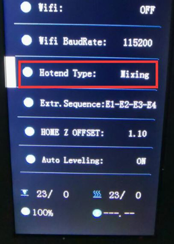

### :globe_with_meridians: Choose Language (Translated by google)

-----
## FAQ for E4 and M4 hot end
- [**What's different between E4 and M4 hotend?**](#whats-different-between-e4-and-m4-hotend)
- [**Which type of hot end should I choose?**](#which-hot-end-should-i-choose-m4-or-e4)
- [**How to switch between M4 and E4 Hotend?**](#how-to-switch-between-m4-hotend-and-e4-hotend)

-----
### What's different between E4 and M4 hotend?
- **M4 hotend** has a mix color room, it can mix different color filament to another color. **E4 hotend** hasn't mix color room, Its printing color depends on the color of filament.  
- **E4 hotend** is good at printing one color or multi color 3d object (up to 4 color).
- **M4 hotend** is good at printing gradient color 3d object, it can print more than 4 colos 3d object too (by mixing the filaments).
#### Advantages of E4 hotend
1. Smaller "extruder switch prime tower" while printing multi color 3d object.
2. Better quality when printing one color 3d object.
3. Support to print different type of filament on the same 3d object.
#### Advantages of M4 hotend
1. Support mixing different color filaments to new colors.
2. Support gradient color printing.
3. Support higher flow rate.

-----
### Which hot end should I choose, M4 or E4?
- If you **do not need** to print gradient color 3d model, we suggest you choose **E4 hotend**, it can get better quality on printing single color and multi colors 3d prints.
- If you want to print **gradient color** 3d model, or you want to **mix different color filaments to another color**, choose M4 hotend.

-----
### How to switch between M4 Hotend and E4 Hotend
#### 1. Loosen the three screws on the hot end housing and remove the old hot end from the machine (x pulley). Then install the new hot end on the machine (x pulley) and lock the screws.

#### 2. Connect the wires of the new hot end to the machine.
 
#### 3. Set the hot end type on the LCD menu: *Control>>Configure>>Hotend Type*

##### :pushpin: The hot end wiring terminals of the Z9V5 are hidden in the upper box of the machine. You can remove the rubber ring and then wiring the hot end.

#### :warning: NOTE 1: If you can't find the "hotend type" menu on LCD screen, please upload the newest firmware to your printer. 
:point_right: Firmware for [**[Z9V5]**](https://github.com/ZONESTAR3D/Firmware/tree/master/Z9/Z9V5/bin)  [**[Z8P]**](https://github.com/ZONESTAR3D/Firmware/tree/master/Z8/Z8P)  [**[Z9M4]**](https://github.com/ZONESTAR3D/Firmware/tree/master/Z9/Z9M4)
#### :warning: NOTE 2: The mix color Hotend and non-mix color hotend must use different slice settings, please pay attention to distinguish. Using the wrong slice setting may block the hotend.

