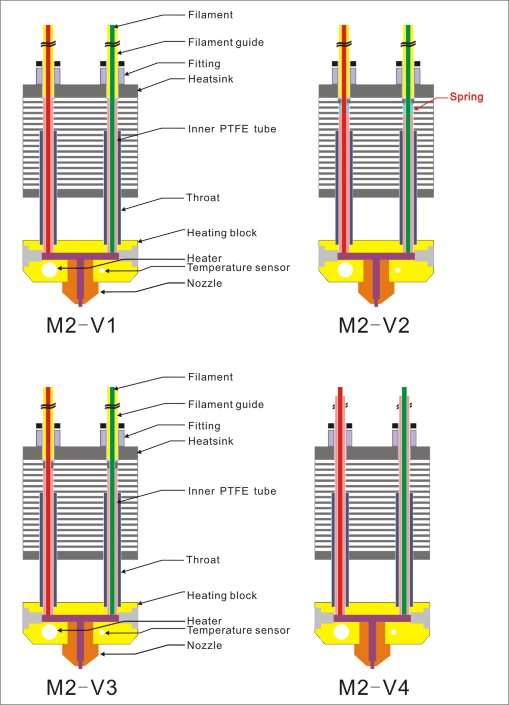

## M2 V1/V2/V3/V4
### Structure diagram

---
### What's different with M2 V1~V4  
- The V2 version adds a feed inlet hole in the heat sink.
- The V3 version changed throat to MK10 throat.
- The V4 version changed the fitting, fialment guide can throght the fitting and touched the heating block directly.  
**NOTE**  
**1. Please make sure that the guide tube is inserted deep enough and reaches the bottom of the hot end.**     
**2. When cutting to the material tube, try to ensure that the front of the material tube is flat.**     
