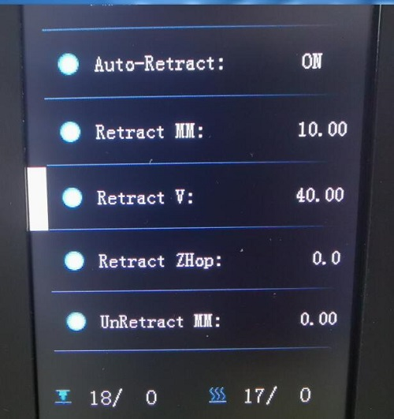
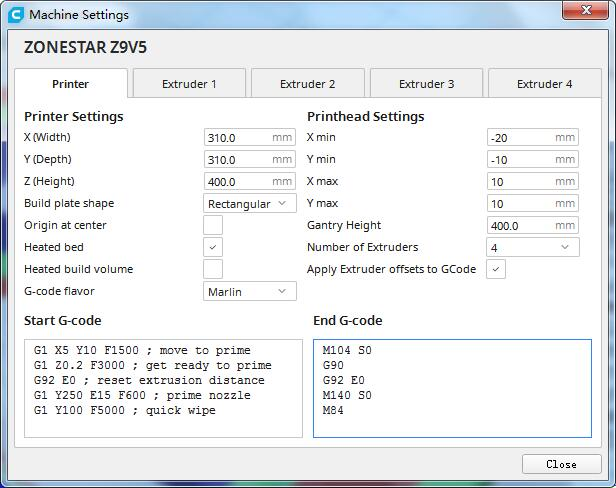
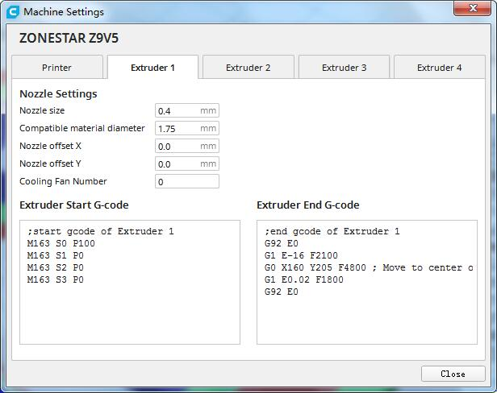
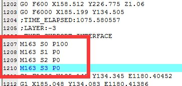
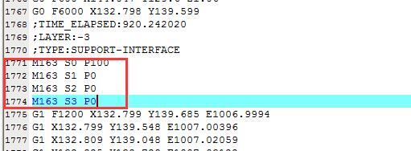
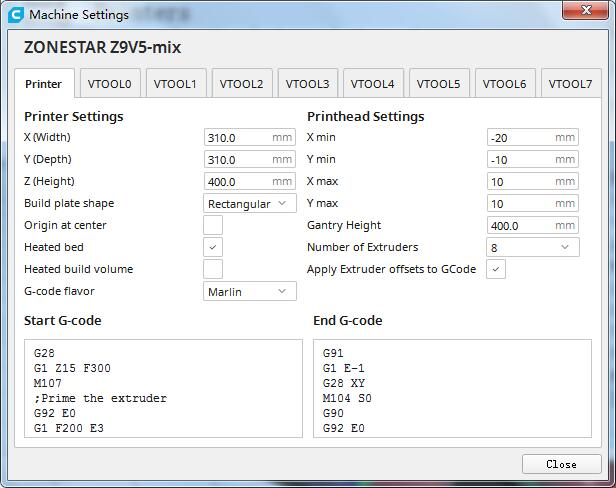
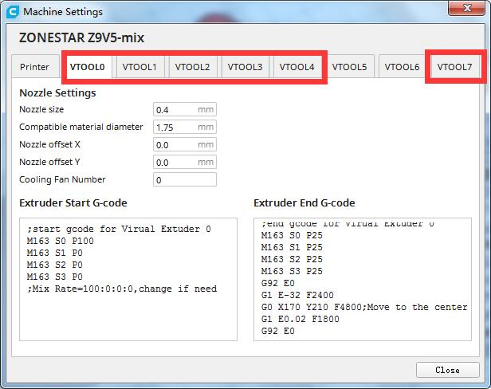
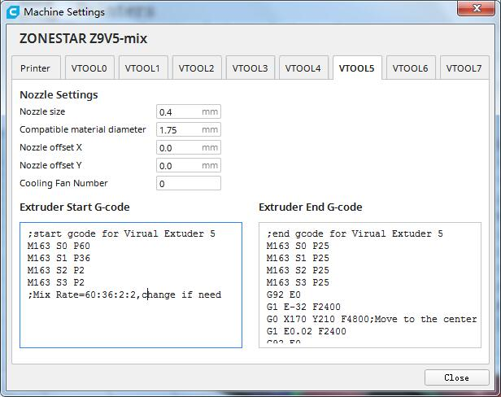

## Retraction test (string issue test)
- **3D printer:** Z9V5pro
- **Hotend:** the 3rd M4 hotend, upgraded [**small store room nozzle**](https://www.aliexpress.com/item/1005001447928770.html) and [**FAN duck**](). FAN duck stl file please find in here **./stl/fan\_duck\_m4_v3.stl**.     
- **Slicing software:** Cura, silcing parameter please refer to  "M4\_Retraction_Test.3mf"    
- **Filament:**
	- **Extruder 1:** Green PLA+  
	- **Extruder 2:** NA  
	- **Extruder 3:** NA  
	- **Extruder 3:** NA 

### Use auto retraction function to improve stings issue
There are two methods to turn on the "auto retraction function":
1. Add command on machine start G-code within slicing software.
2. Turn on the function on LCD screen.
#### Add command on machine start G-code within slicing software.
1. Add M207/M208/M209 commands on start G-code  

    M207 S10 F2400   
    M208 S0 F2400   
    M209 S1

    ;Description of M207/M208/M209 commands

    	;M207: Set firmware retraction values
    	;   S[+units]retract_length  
        ;   W[+units]swap_retract_length (multi-extruder)  
        ;   F[units/min] retract_feedrate_mm_s  
        ;   Z[units] retract_zraise  

		;M208: Set firmware un-retraction values
 		;   S[+units]    retract_recover_extra (in addition to M207 S*)
		;   W[+units]    swap_retract_recover_extra (multi-extruder)
		;   F[units/min] retract_recover_feedrate_mm_s
 		;   R[units/min] swap_retract_recover_feedrate_mm_s  

		;M209: Enable automatic retract (M209 S1)
 		;   S[bool]    =1 Enable automatic retract    
2.  Set the "Retraction length to 8mm" (This value must be less than 10[^1]).    
  
About detail, please refer "M4_Retraction_TestPLA_AutoRetraction.3mf".
#### Turn on the function on LCD screen.
1. Set the "Retraction length to 8mm" when slicing (This value must be less than 10[^1]).
2. Turn on the "AutoRetract" Feature on LCD screen  
  	>
    **Control >> configre >> AutoRetraction**   or  
    **Tune >>  configre >> AutoRetraction**  

[^1]: We have changed the firmware to allow this value is less than 20, please read the firmware release note. For example ***Z9V5Pro V1.3.2***. [**Upgrade firmware**](https://github.com/ZONESTAR3D/firmare).    

## 4 Color test
- **3D printer:** Z9V5pro
- **Hotend:** M4 hotend 
- **Slicing software:** Cura, silcing parameter please refer to "M4_4C_Dog.3mf"  
- **Filament:**
	- **Extruder 1:** white PLA  
	- **Extruder 2:** Red PLA  
	- **Extruder 3:** Green PLA  
	- **Extruder 3:** Blue PLA   

        
### Start G-code
   
 
    G28
    G1 Z15 F300
    M107
    ;Prime the extruder
    T4
    G92 E0
    G1 F200 E3
    G92 E0
    G1 X5 Y10 F1500 ; move to prime
    G1 Z0.2 F3000 ; get ready to prime
    G92 E0 ; reset extrusion distance
    G1 Y250 E15 F600 ; prime nozzle
    G1 Y100 F5000 ; quick wipe
### End G-code
    G91
    G28 XY
    M104 S0
    G90
    G92 E0
    M140 S0
    M84

### Extruder gcode
Add the "extruder start gcode" and "extruder stop gcode" to all of extruders.  
   
#### Extrduer 1 start G-code
    ;start gcode of Extruder 1 
    M163 S0 P100
    M163 S1 P0
    M163 S2 P0
    M163 S3 P0
#### Extrduer 2 start G-code
    ;start gcode of Extruder 2 
    M163 S0 P0
    M163 S1 P100
    M163 S2 P0
    M163 S3 P0
#### Extrduer 3 start G-code
    ;start gcode of Extruder 3 
    M163 S0 P0
    M163 S1 P0
    M163 S2 P100
    M163 S3 P0
#### Extrduer 4 start G-code
    ;start gcode of Extruder 3 
    M163 S0 P0
    M163 S1 P0
    M163 S2 P100
    M163 S3 P0
#### Extrduer 1(2/3/4) End G-code
    ;end gcode of Extruder 1(2/3/4) 
    G92 E0 
    G1 E-16 F1800	   ; Modify the retraction speed if need 
    G0 X160 Y205 F4800 ; Move to center of prime tower
    G1 E0.02 F1200	   ; Modify the retraction speed if need
    G92 E0
### Issue
Because we add T4 command in "start G-code", to ensure all of the extrder can work well before printing that "target STL file", so the "raft" will be printed with mixing color (White:Red:Green:Blue = 25:25:25:25) by all extruders. 
**Therefore, we manually added the following code to the M4\_4C\_Test.gcode file  to switch the extruder to E1. You can ignore this issue because it only cause a very small issue on the final prints.**    

---
## 4 Color Dog  

### 
- **3D printer:** Z9V5pro
- **Hotend:** M4 (4-IN-1-OUT Mixing color hotend)
- **Slicing software:** Cura, silcing parameter please refer to the 3mf file  
- **Filament:**
	- **Extruder 1:** white PLA
	- **Extruder 2:** Red PLA
	- **Extruder 3:** Green PLA
	- **Extruder 3:** Blue PLA    
### Issue
Because we add T4 command in "start G-code", to ensure all of the extrder can work well before printing that "target STL file", so the "raft" will be printed with mixing color (White:Red:Green:Blue = 25:25:25:25) by all extruders. 
**Therefore, we manually added the following code to the M4\_4C\_dog.gcode file  to switch the extruder to E1. You can ignore this issue because it only cause a very small issue on the final prints.**    

---
## 4 Color Owl
Settings are the same with 4 Color dog
- **3D printer:** Z9V5pro  
- **Hotend:** M4(4-IN-1-OUT Mixing color) hotend  
- **Slicing software:** Cura, silcing parameter please refer to the 3mf file  
- **Filament:**  
	- **Extruder 1:** white PLA  
	- **Extruder 2:** Red PLA  
	- **Extruder 3:** Green PLA  
	- **Extruder 3:** Blue PLA      
  
### Issue
Because we add T4 command in "start G-code", to ensure all of the extrder can work well before printing that "target STL file", so the "raft" will be printed with mixing color (White:Red:Green:Blue = 25:25:25:25) by all extruders. 
**Therefore, we manually added the following code to the M4\_4C\_owl.gcode file  to switch the extruder to E1. You can ignore this issue because it only cause a very small issue on the final prints.**    

---
## 6 Color Patrick
Settings are the same with 4 Color dog
- **3D printer:** Z9V5pro  
- **Hotend:** M4(4-IN-1-OUT Mixing color) hotend  
- **Slicing software:** Cura, silcing parameter please refer to the 3mf file  
- **Filament:**  
	- **Extruder 1:** white PLA  
	- **Extruder 2:** Red PLA  
	- **Extruder 3:** Green PLA  
	- **Extruder 3:** Blue PLA   
- **VTOOL:**
	-  **VTOOL 0:** E1:E2:E3:E4 = 100:  0:  0:  0, white color  
	-  **VTOOL 1:** E1:E2:E3:E4 =   0:100:  0:  0, Red color  
	-  **VTOOL 2:** E1:E2:E3:E4 =   0:  0:100:  0, Green color  
	-  **VTOOL 3:** E1:E2:E3:E4 =   0:  0:  0:100, Blue color  
	-  **VTOOL 4:** E1:E2:E3:E4 =  25: 25: 25: 25, *Unused*    
	-  **VTOOL 5:** E1:E2:E3:E4 =  60: 36:  2:  2, Pink  
	-  **VTOOL 6:** E1:E2:E3:E4 =  50: 25: 25:  0, Yellow    
	-  **VTOOL 7:** E1:E2:E3:E4 =  50:  0:  0: 50, *Unused*     
  

### Start G-code
   

    G28
    G1 Z15 F300
    M107
    ;Prime the extruder
	T4
    G92 E0
    G1 F200 E3
    G92 E0
    G1 X5 Y10 F1500 ; move to prime
    G1 Z0.2 F3000 ; get ready to prime
    G92 E0 ; reset extrusion distance
    G1 Y250 E15 F600 ; prime nozzle
    G1 Y100 F5000 ; quick wipe
### End G-code

    G91
    G1 E-1
    G28 XY
    M104 S0
    G90
    G92 E0
    M140 S0
    M84

#### Extruder start G-code
 

   
#### VTOOL0 start G-code
    ;start gcode for Virual Extuder 0
    M163 S0 P100
    M163 S1 P0
    M163 S2 P0
    M163 S3 P0
    ;Mix Rate=100:0:0:0,change if need

#### VTOOL1 start G-code
    ;start gcode for Virual Extuder 1
    M163 S0 P0
    M163 S1 P100
    M163 S2 P0
    M163 S3 P0
    ;Mix Rate=0:100:0:0,change if need

#### VTOOL2 start G-code
    ;start gcode for Virual Extuder 2
    M163 S0 P0
    M163 S1 P0
    M163 S2 P100
    M163 S3 P0
    ;Mix Rate=0:0:100:0,change if need

#### VTOOL3 start G-code
    ;start gcode for Virual Extuder 3
    M163 S0 P0
    M163 S1 P0
    M163 S2 P0
    M163 S3 P100
    ;Mix Rate=0:0:0:100,change if need

#### VTOOL4 start G-code
    ;start gcode for Virual Extuder 4
    M163 S0 P25
    M163 S1 P25
    M163 S2 P25
    M163 S3 P25
    ;Mix Rate=25:25:25:25,change if need

#### VTOOL5 start G-code
    ;start gcode for Virual Extuder 5
    M163 S0 P60
    M163 S1 P36
    M163 S2 P2
    M163 S3 P2
    ;Mix Rate=60:36:2:2,change if need

#### VTOOL6 start G-code
    ;start gcode for Virual Extuder 6
    M163 S0 P50
    M163 S1 P25
    M163 S2 P25
    M163 S3 P0
    ;Mix Rate=50:25:25:0,change if need

#### VTOOL7 start G-code
    ;start gcode for Virual Extuder 6
    M163 S0 P50
    M163 S1 P0
    M163 S2 P0
    M163 S3 P50
    ;Mix Rate=50:0:0:50,change if need

#### Extruder end G-code
The extruder end G-code are the same for all VTOOLs.    

    M163 S0 P25
    M163 S1 P25
    M163 S2 P25
    M163 S3 P25
    G92 E0
    G1 E-32 F2400
    G0 X170 Y210 F4800	;Move to the center of prime tower
    G1 E0.02 F1800
    G92 E0

