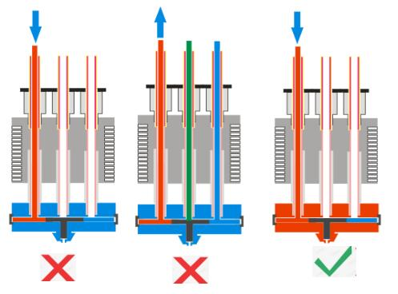
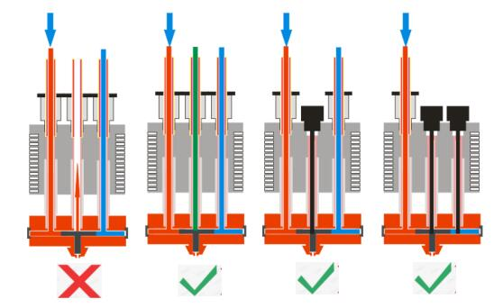

## :warning:ATTENTION
+ DONOT load / unload filament when the nozzle temperature is less than 150℃.

+ DONOT feed-in filament over 10mm if any of the channels is empty, otherwise may cause it be clogged, the correct way is
	+ Load filament to all channels at the same time.  
	+ Use a hotend clean tool to close empty channels.  

## User guide of M4-V3(V4) hotend
Please refer to [**here**](userguide.md)

## FAQ
Please refer to [**here**](FAQ.md)

## How to assemble/unaddemble M4-V3(V4) hotend
Please refer to [**here**](assemble.md)
