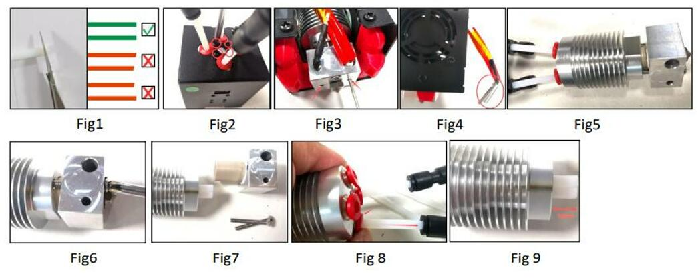

## User guide [PDF file](./M4V6_the_6th_Version_4-IN-1-OUT_Mix_Color_HOTEND_User_Guide_V1.pdf)
### About Components of M4V6 hotend
 
### Structure and Working principl

### Load and unload filament
- **Load filament:**
  - :warning: MUST load filaments to all 4 channels, DONOT leave any channel empty before printing.
  - While loading filaments, make sure the filaments has been inserted to the bottom of the hot end.
  - Before operating one of the channels, rotate all extrduer motors to feed in filament at the same time, until that filament flowed out from the nozzle.
:arrow_down:[Load Filament Video Tutorial](./M4V6_load_filament.zip)
- **Unload filament:**
  - Heating the nozzle before unload filament (200℃ for PLA / 230℃ for PETG).
  - Operature on the LCD menu or rotate the extruder gear to upload filament.
----

#### How to Replace of the inner PTFE guide
- Prepare 4 piece PTFE tube (ID=2mm/OD=4mm), length is about 100mm (Fig 1). To cut the PTFE pipe by a knife (paper cutter) and try to keep the front end flat.
- Remove the screws which to fix the hot end on the top of the hot end housing (Fig 2).
- Loosen the screws which to fix the heater and temperature sensor (Fig 3).
- Remove the heater and temperature sensor from the hot end (Fig 4).
- Remove the hot end from the housing (Fig 5).
- Remove the 2 screws to fix the heating block (Fig 6).
- Pull out the heating block (Fig 7).
- Press the “RED ring” of the fitting and pull out the PTFE tube (Fig 8).
- Insert the new PTFE tube and install the heating block back in reverse order.
- Push the PTFE guide to the bottom after installed the heating block.

