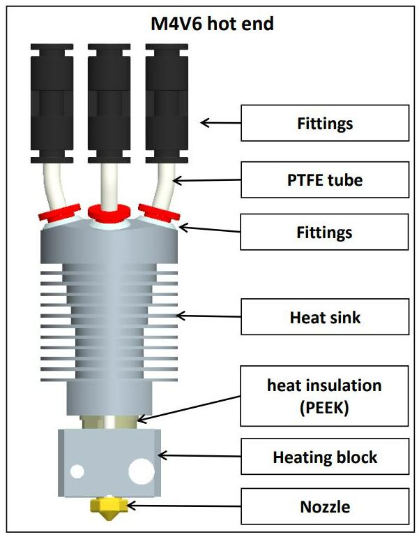
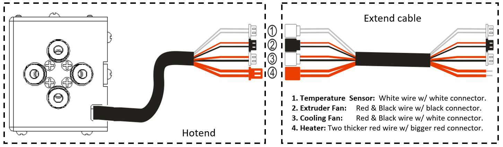
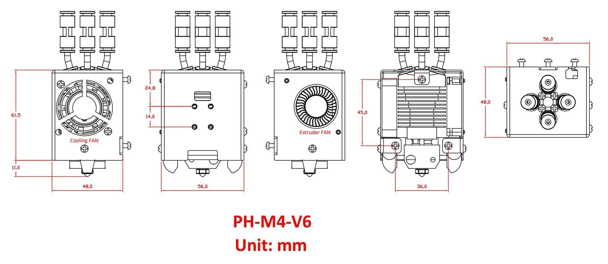
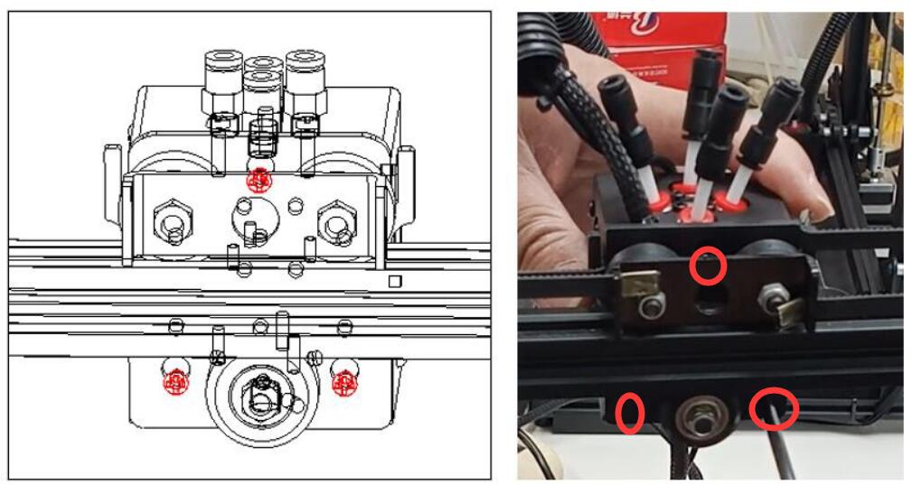
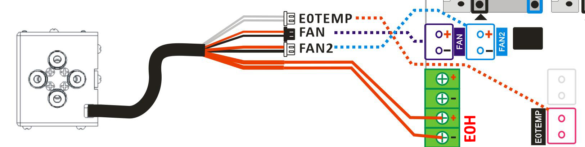

<!-- ### :globe_with_meridians: Choose Language (Translated by google)

 -->

-----
## :book: M4V6 hot end use manual
ZONESTAR 4-IN-1-OUT **mix color** hot end (referred to as **M4 Hot end**) has 4 input channels and 1 nozzle, four filaments are mixed in the hot end and then extruded through a nozzle.Therefore, the M4 hot end not only allows the printer to print the original color of the filaments, but also allows for printing more colors by adjusting the filament mixing ratio.

-----
## :warning:ATTENTION PLEASE:warning:
### :loudspeaker: You need to load all the 4 filaments to the hotend whether printing one or multi color 3d prints, incorrect operationa may block the mix color hotend. If the hot end blockage caused by incorrect operation, it is not covered by the warranty. For how to load filaments, please refer to [this guide](#7-how-to-load-and-unload-filaments).
### :loudspeaker: DONOT pull out the "inner PTFE tubes" (the 4 white tubes with black fittings) from the M4V6 hot end.

-----
### 1.Specifications
|            Item            |      Parameters            |            Item            |      Parameters            |
|:--------------------------:|:--------------------------:|:--------------------------:|:--------------------------:|
|    Rated Voltage           |      DC24V/60W Max         |     Nozzle Diameter        | Default 0.4mm1  |
|    Input Channel           |      4                     |     Nozzle model           |      E3D V6                |
|    Nozzles Number          |      1                     |     Filament Diameter      |      1.75mm                |
|    Heater                  |      24V/60W ⌀6x25mm       |     Temperature Sensor     | NTC Thermistor 100K B3950  |
|    Cooling Fan             |   4010/5000RPM/24V 0.15A   |    Extruder Fan            | 4010/5000RPM/24V 0.15A     |
|    Support Filaments       | PLA/PLA+/PETG/ABS/ASA etc. |    Working Temperature     | 260℃ Maximus              |
|    Wire length             |      1 meter               |    Outer Dimensions        |      50x60x75mm            |
|    Net weight              |      220g                  |    Gross weight            |      350g                  |

-----
### 2.Components
 

-----
### 3.Wire and Terminals

-----
### 4.Structure

-----
### 5.Dimensions

-----
### 6.Installation & wiring
The mounting position of M4 hot end conform to the "ZONESTAR hot end mounting standard", which can be installed on almost all ZONESTAR 3d printers, including P802, M8, D805S, Z8, Z9, Z10 etc. series of products.   
#### 6.1 Installation
Simply remove the 3 screws behind the hot end assembly and install the M4 hotend assembly on the X carrier of the machine.
  
#### 6.2 Wiring
##### :loudspeaker: **Attention** 
- **Please watch for to distinguish terminals 3 and 4**, because their terminals  color are the same, but the wires color are different.    
If the wires of 3 and 4 are connected reversely, you can see the nozzle temperature displayed on the LCD screen will be much higher than the room temperature after you powered on the machine.
- When pluging the terminal, **be careful not to push the metal terminal from the plastic case**.     
#### :loudspeaker: **Please note**    
- **The cooling fan must be turned on** (when the temperature of the hot end is higher than 60°C), otherwise the hot end may be blocked or even damaged.  
 - By default, the **working voltage** of the fan and heater at the hot end is **DC 24V**. 
#### Please following the define of terminals to connect the hotend to your control board.  
- **Without extend cable**     
  
- **With extend cable**     
  
#### 6.3 Set hot end type on LCD MENU: Control>>Configure>>Hotend Type: Mixing
:warning: If your printer hasn't a 4.3" TFT-LCD screen, ignore this step.   
:warning: If you can't see the menu on the LCD screen of your printer, please upgrade to the newest version. [:link: **Firmware Download Link**](https://github.com/ZONESTAR3D/Firmware)    
  

-----
### 7. How to load and unload filaments
### :warning: ATTENTION PLEASE
For M4V6 hotend, you need to load 4 filament to the hotend even you print one color 3d model, DONOT leave any channel empty before printing.
- **Load filament to the hotend:**     
[:clapper:video tutorial](https://youtu.be/-47yB95uIxI).
  - Cut the front of the filament with diagonal pliers before loading it to the extruder and hot end.
  - Load 4 filaments to all extruders one by one.
  - Rotate the gear of extruders to load filament one by one, do not rotate each extruder more than 2 turns at a time, until all the filaments enter to the inner PTFE tube of hot end, extrdue more 4 ~ 5 turn for each extruder and then stop.      
  :warning:It is recommened to use the ***Prepare>>Filament>>Extruer: All*** and ***Prepare>>Filament>>Load quickly*** menu to load filamets if your printer has a "filament" Menu.     
  :warning: Don't extrude filament when any one of the channel is empty.     
- **Unload filament from the hotend:**
  - Heating the nozzle (200℃ for PLA / 230℃ for PETG/ABS).
  - Operature on the LCD menu or rotate the extruder gear to unload filaments.

-----
### 8. Steps to use M4V6 hotend
#### Print one color 3D model by M4V6 ho tend
- **Prepare gcode file**. Slicing the 3d modle by using one color 3d printer settings, please refer to [**here**](https://github.com/ZONESTAR3D/Slicing-Guide/tree/master/PrusaSlicer#4-slicing-one-color).   
**Here is a test gcode file for your reference: [:arrow_down: download xyz_cube zip file](./xyz_cube.zip)** and unzip it on PC, and then copy the **xyz_cube.gcode** to SD card. Plug the SD card to the SD socket of machine.
- **Load filaments**. Refer to [:point_up: **"How to load and unload filament"**](#load-and-unload-filament) to load all 4 color filaments to the extruders and hotend.     
- **Print from SD card**. Move item to **Print** item on LCD screen and click the knob and choose the gcode file, click knob to start print.
- **Fine tune nozzle height**. Wait the nozzle and hotbed heating, and when the printer starting to print the first layer, double click the knob of LCD screen to fine tune the distance from the nozzle to the bed, and then wait it to finish.
#### Print multi color 3D model
- **Prepare gcode file**. Slicing the 3d modle by using M4 multi color 3d printer settings, please refer to [**here**](https://github.com/ZONESTAR3D/Slicing-Guide/blob/master/PrusaSlicer/PrusaSlicerGuide_M4.md).   
**Here is a test gcode file for your reference: [:arrow_down: **download M4_4CTest zip file](./M4_4CTest.zip)** and unzip it on PC, and then copy the **M4_4CTest.gcode** to SD card. Plug the SD card to the SD socket of machine.
- **Load filaments**. Refer to [:point_up: **"How to load and unload filament"**](#load-and-unload-filament) to load all 4 color filaments to the extruders and hotend.
- **Print from SD card**. Move item to **Print** item on LCD screen and click the knob and choose the gcode file, click knob to start print.
- **Fine tune nozzle height**. Wait the nozzle and hotbed heating, and when the printer starting to print the first layer, double click the knob of LCD screen to fine tune the distance from the nozzle to the bed, and then wait it to finish.

-----
### 9. Slicing
- **[Install Prusaslicer software](https://github.com/ZONESTAR3D/Slicing-Guide/tree/master/PrusaSlicer)**
- **[Multi Color Slicing](https://github.com/ZONESTAR3D/Slicing-Guide/blob/master/PrusaSlicer/PrusaSlicerGuide_M4.md)**

-----
### :page_with_curl: Appendix I: Achieve high-speed printing by using M4V6 hot end
[:book: Use M4V6 to achieve high-speed printing](./HighFlow/readme.md)

-----
### :page_with_curl: Appendix II: How to clean the blocked M4V6 hotend
**[:clapper:Video tutorial](https://github.com/ZONESTAR3D/Z8P/assets/29502731/72312727-5ce5-4a35-8f2a-49f9145557ac).**
#### Step 1: Heating the nozzle to 260 degree. 
- ***Prepare>>Filament>>Preheat nozzle: 260***, wait the nozzle reached 260 degree.
#### Step 2: Load all 4 filaments to the hot end (Watch the PTFE tubes in hot end and ensure the filaments has already entered the hot end).
#### Step 3: Extruder all filaments at the same time, until you can see the filament is flowed out from the nozzle.
- ***Prepare>>Filament>>extruder: all***
- ***Prepare>>Filament>>slowly load***, you may need to do a few times, until all 4 filaments have flowed out from the nozzle.
#### Step 4: Extrude 4 filaments one by one
- ***Prepare>>Filament>>extruder: 1***
- ***Prepare>>Filament>>extruder: slowly load***, until you see the filament of extruder #1 is flowing out from the nozzle.
- ***Prepare>>Filament>>extruder: 2***
- ***Prepare>>Filament>>extruder: slowly load***, until you see the filament of extruder #2 is flowing out from the nozzle.
- ***Prepare>>Filament>>extruder: 3***
- ***Prepare>>Filament>>extruder: slowly load***, until you see the filament of extruder #3 is flowing out from the nozzle.
- ***Prepare>>Filament>>extruder: 4***
- ***Prepare>>Filament>>extruder: slowly load***, until you see the filament of extruder #3 is flowing out from the nozzle.

#### If the hot end cannot be cleaned by doing the above steps, or the hot end is still easily clogged after cleaning, you need to replace the nozzle or replace the "inner PTFE tubes"， please refer to [:point_down:Appendix III](#📃-appendix-iii-how-to-replace-of-the-inner-ptfe-tubes).

#### :pushpin: Common causes and solutions for hot end blockage
**:bug:Reason:** The filaments are not loaded properly, e.g. one of the channels is empty**, the molten filaments will go back into the empty channels and block the empty channel.      
**:pill:Solution:** Refer to [:point_up: How to clean the blocked M4V6 hotend](#📃-appendix-ii-how-to-clean-the-blocked-m4v6-hotend) to clean the hot end.     

**:bug:Reason:** The *inner PTFE tubes* are not inserted enough deep into the hot end, the molten filaments will got into the *isolation block* and block the hot end.     
**:pill:Solution:** Refer to[:point_down:Appendix III](#📃-appendix-iii-how-to-replace-of-the-inner-ptfe-tubes) to disassemble the hot end, and then clean the *isolation block* first, and then assemble the hotend again.

-----
### :page_with_curl: Appendix III: How to replace of the inner PTFE tubes
-**[:clapper:Video tutorial](https://youtu.be/S-vUdI5z-nM)**
- Prepare 4 piece PTFE tube (ID=2mm/OD=4mm), length is about 100mm (Fig 1). To cut the PTFE pipe by a knife (paper cutter) and try to keep the front end flat.
- Remove the screws which to fix the hot end on the top of the hot end housing (Fig 2).
- Loosen the screws which to fix the heater and temperature sensor (Fig 3).
- Remove the heater and temperature sensor from the hot end (Fig 4).
- Remove the hot end from the housing (Fig 5).
- Remove the 2 screws to fix the heating block (Fig 6).
- Pull out the heating block (Fig 7).
- Press the “RED ring” of the fitting and pull out the PTFE tube (Fig 8).
- Insert the new PTFE tube and install the heating block back in reverse order.
- Push the PTFE guide to the bottom after installed the heating block.

-----
### [:book: How to switch hotend between E4 hotend and M4 hotend](https://github.com/ZONESTAR3D/Upgrade-kit-guide/blob/main/HOTEND/FAQ_M4E4.md#how-to-switch-between-m4-hotend-and-e4-hotend)
