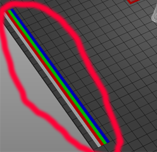

### :globe_with_meridians: Choose Language (Translated by google)

-----
### About Components of M4V6 hotend
 
### Structure and Working principl

### How to load and unload filament
- **Load filament to the hotend:**
  - :warning: MUST load filaments to all 4 channels, DONOT leave any channel empty before printing.
  - The front end of the used filament may become thicker, please cut it with diagonal pliers before loading to the hotend.
  - While loading filaments, make sure the filaments has been inserted to the bottom of the hot end. You can use the "Filament" menu to load all filaments at the same time, for details, please download and watch the below video tutorial.   
:arrow_down:[Load Filament Video Tutorial](./M4V6_load_filament.zip)
- **Unload filament from the hotend:**
  - Heating the nozzle (200℃ for PLA / 230℃ for PETG/ABS).
  - Operature on the LCD menu or rotate the extruder gear to unload filament.

-----
### Steps to use M4V6 hotend
#### Print a one color 3D model
- **Prepare gcode file**. Slicing the 3d modle by using one color 3d printer settings, please refer to [**here**](https://github.com/ZONESTAR3D/Slicing-Guide/tree/master/PrusaSlicer#4-slicing-one-color).   
**Here is a test gcode file for your reference: [:arrow_down: download xyz_cube zip file](./xyz_cube.zip)** and unzip it on PC, and then copy the **xyz_cube.gcode** to SD card. Plug the SD card to the SD socket of machine.
- **Load filaments**. Refer to [:point_up: **"How to load and unload filament"**](#load-and-unload-filament) to load all 4 color filaments to the extruders and hotend.     
***:warning: For M4V6 hotend, you need to load 4 filament to the hotend even you print one color 3d model.*** 
- **Print from SD card**. Move item to **Print** item on LCD screen and click the knob and choose the gcode file, click knob to start print.
- **Fine tune nozzle height**. Wait the nozzle and hotbed heating, and when the printer starting to print the first layer, double click the knob of LCD screen to fine tune the distance from the nozzle to the bed, and then wait it to finish.

#### Print a 4 color 3D model
- **Prepare gcode file**. Slicing the 3d modle by using M4 multi color 3d printer settings, please refer to [**here**](https://github.com/ZONESTAR3D/Slicing-Guide/blob/master/PrusaSlicer/PrusaSlicerGuide_M4.md).   
**Here is a test gcode file for your reference: [:arrow_down: **download M4_4CTest zip file](./M4_4CTest.zip)** and unzip it on PC, and then copy the **M4_4CTest.gcode** to SD card. Plug the SD card to the SD socket of machine.
- **Load filaments**. Refer to [:point_up: **"How to load and unload filament"**](#load-and-unload-filament) to load all 4 color filaments to the extruders and hotend.
- **Print from SD card**. Move item to **Print** item on LCD screen and click the knob and choose the gcode file, click knob to start print.
- **Check Preload**. Wait the nozzle and hotbed heating, and check if the printer can print out 4 colors lines on the side of the hotbed.   

- **Fine tune nozzle height**. When the hotend moved to the center of the hotbed, double to click the knob of LCD screen to fine tune the distance from the nozzle to the bed. Wait until the printing is finished.

-----
### [:book: Use M4V6 to achieve high-speed printing](./HighFlow/readme.md)

-----
### How to replace of the inner PTFE guide
- Prepare 4 piece PTFE tube (ID=2mm/OD=4mm), length is about 100mm (Fig 1). To cut the PTFE pipe by a knife (paper cutter) and try to keep the front end flat.
- Remove the screws which to fix the hot end on the top of the hot end housing (Fig 2).
- Loosen the screws which to fix the heater and temperature sensor (Fig 3).
- Remove the heater and temperature sensor from the hot end (Fig 4).
- Remove the hot end from the housing (Fig 5).
- Remove the 2 screws to fix the heating block (Fig 6).
- Pull out the heating block (Fig 7).
- Press the “RED ring” of the fitting and pull out the PTFE tube (Fig 8).
- Insert the new PTFE tube and install the heating block back in reverse order.
- Push the PTFE guide to the bottom after installed the heating block.

