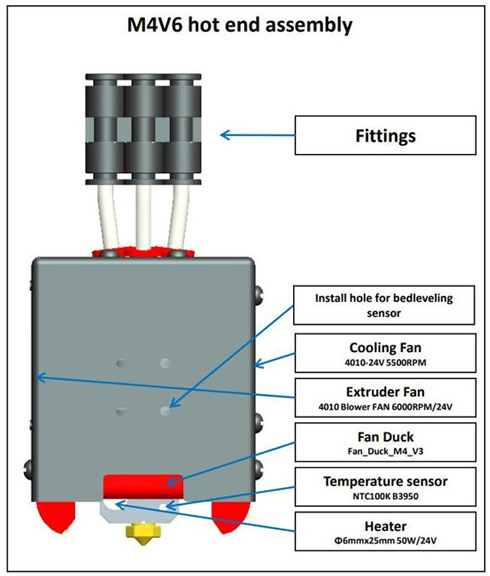
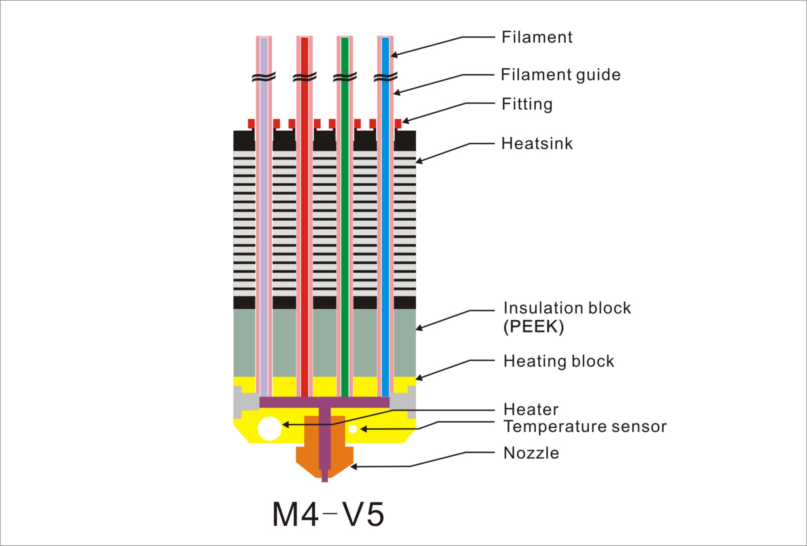
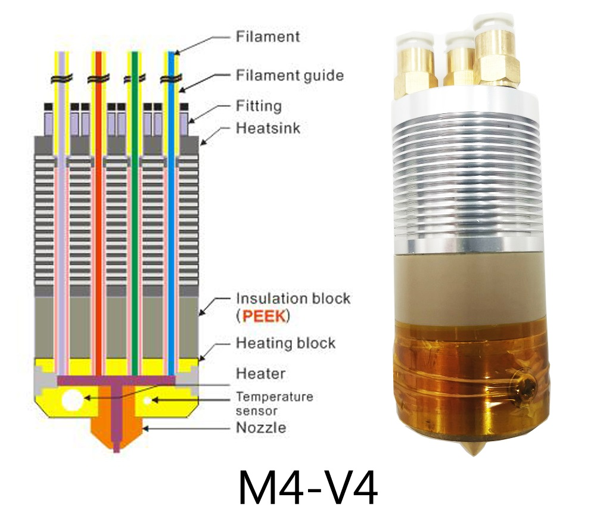
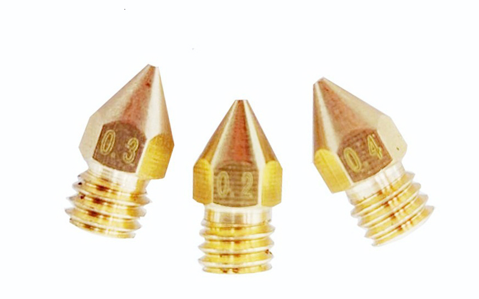
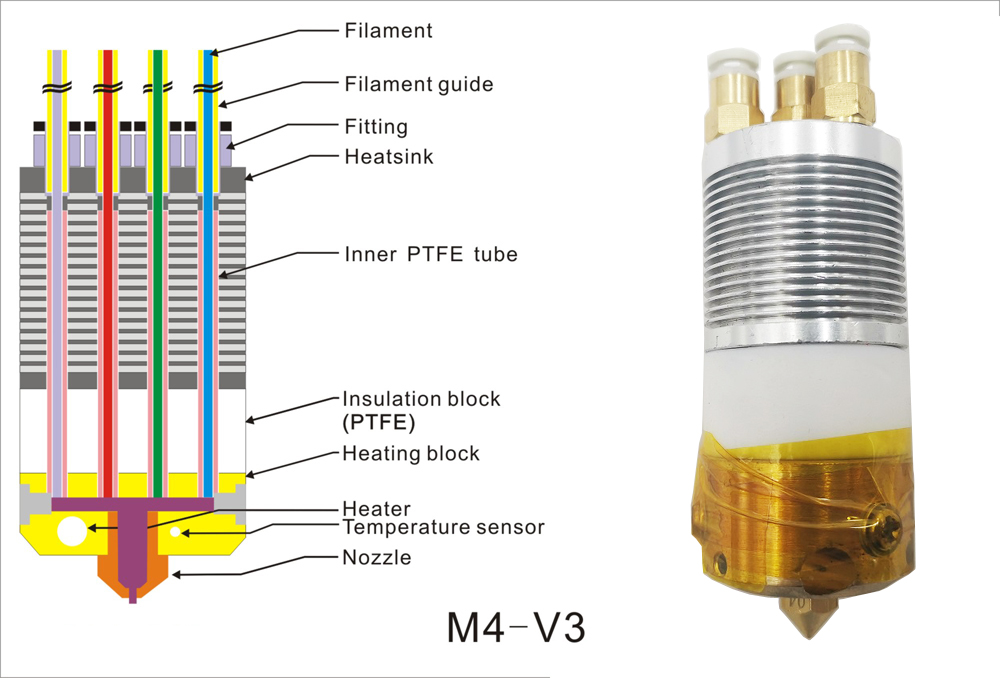
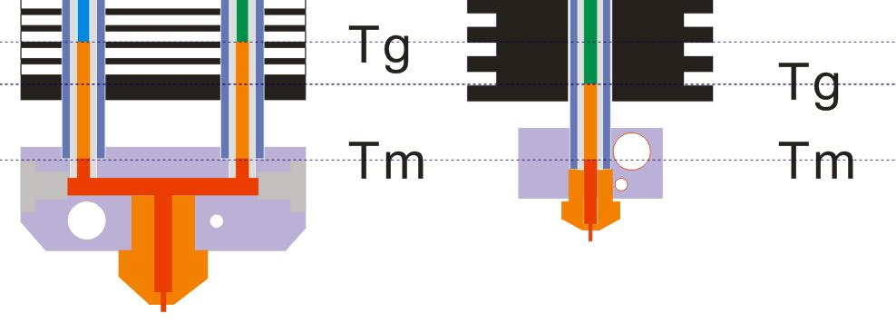
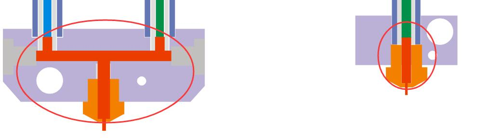
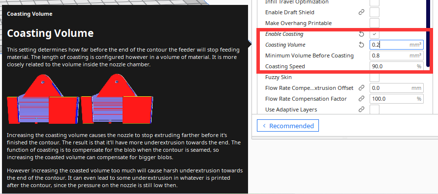
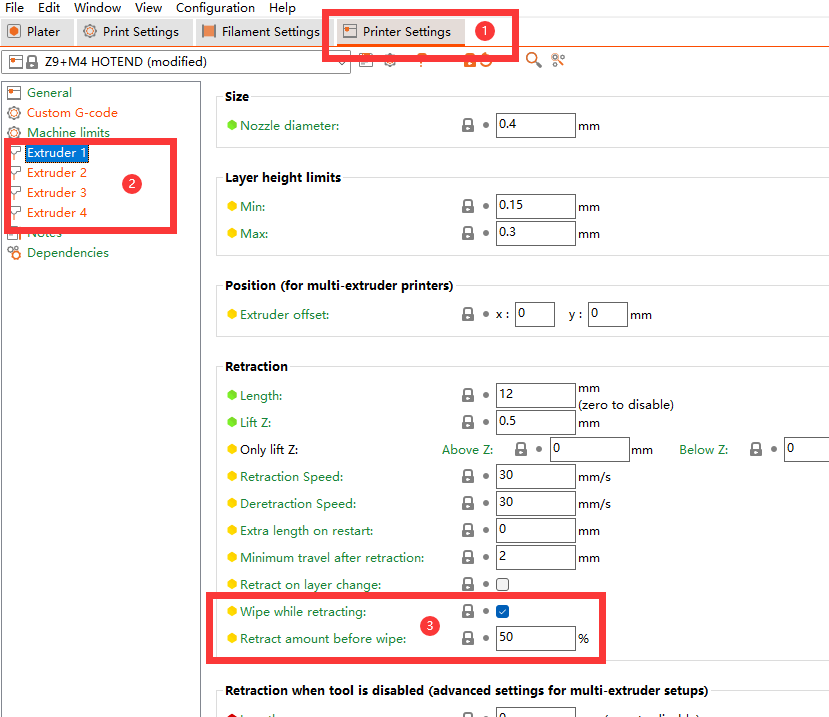

### :globe_with_meridians: Choose Language (Translated by google)

-----
## ZONESTAR M4 (4-IN-1-OUT Mixing Color) Hotend
-  [**M4V6**](#m4v6): The 6th version 4-IN-1-OUT mix color hotend.
-  [**M4V5**](#m4v5): The 5th version 4-IN-1-OUT mix color hotend.
-  [**M4V4**](#m4v4): The 4th version 4-IN-1-OUT mix color hotend.
-  [**M4V3**](#m4v3): The 3rd version 4-IN-1-OUT mix color hotend.

### Differences between different versions M4 hotend ([M4V3](#m4v3)/[M4V4](#m4v4)/[M4V5](#m4v5)/[M4V6](#m4v6))
|           Parameter and Specification             |    M4V3       |    M4V4       |      M4V5     |      M4V6     |
|:----------------------------------------------:   |:--------------|:--------------|:--------------|:--------------|
|Maximum operating temperature                      |  240℃        |  260℃        |  260℃         |  260℃        |
|Unused Channel Closable*1               |  Yes          |  Yes          |  No           |  No           |
|Volume of Mixing Chamber (mm3)          |  40 ~ 50      |  40 ~ 50      |  40 ~ 50      |  30 ~ 40      |
|Anti Strings *2                         |  Poor         |   Poor        |  Poor         |  Good         |
|Maximum Flow Rate (mm3/s)*3  |  8            |   8           |  10           |  30           |
|Maximum mix color print speed (mm/s)*3  |  60           |   60          |  75           |  150          |
|Maximum multi color print speed (mm/s)*3|  50           |   50          |  60           |  100          |

[*1]: Whether unused channels can be closed, so that filaments do not need to be loaded in unused channels when printing.   
[*2]: It can be improved obviously after using the small storage room nozzle.     
[*3]: Test condition is PLA filament @ 205℃ nozzle temperature. Recommended to use 60~80% of the maximum print speed when slicing.     

-----
## M4V6
[:book: Introduction of the 6th M4 hotend](./M4_V6/readme.md)  
[:gift: **Buy M4V6 Hotend**](https://bit.ly/3QhWJtf)  
[:gift: **Buy M4V6 Hotend**](https://www.aliexpress.com/item/1005004547646195.html)   

### Structure diagram

### What's improved
The M4V6 has reformed the structure of the hot end, which is completely different from the previous version. It uses an inclined feed channel and canceled the flow channel inside the heater. Advantages compared with the previous version M4 hot ends:
1. Solved the leakage issue completely.
2. Reduced the volume of mixing room, the drawing/stings issue is greatly improved.

## M4V5
[:book: Introduction of the 5th version M4 hotend](./M4_V5/readme.md)   
[:gift: **Buy M4V5 Hotend**](https://www.aliexpress.com/item/1005001581641783.html) 

### Structure diagram

### The different between **M4V5** with **M4V4**:  
1. Removed the inner PTEF pipes, Reduce the probability of clogged because the internal PTEF pipe be damaged.   
2. Upgraded the fittings, easier to load filament and replace the filament guide. 
### :warning: ATTETION PLEASE
Because M4V5 used different fittings which to fix the PTFE filament guides, its size is bigger than M4V3 and M4V4, so M4V5 can't be installed to the older housing.   

## M4V4
[:book: Introduction of the 4th M4 hotend](./M4_V3_V4/readme.md)      
[:gift: **Buy M4V4 Hotend**](https://www.aliexpress.com/item/1005002124027691.html)  
[:gift: **Buy M4V4 Hotend assembly**](https://www.aliexpress.com/item/1005001581641783.html)   

### Structure diagram

### The different between  **M4V4** with **M4V3**:  
1. Upgraded the insulation block material from **PETF** to **PEEK**, so M4-V4 can work at maxius temperature to 260℃.  
2. Upgraded the nozzle to a **Small store room nozzle** to improve the strings issue.     

      
#### Parts for upgrading from M4V3 to M4V4
- [:gift: **PEEK_Insulation_block**](https://www.aliexpress.com/item/1005002124027691.html)  
- [:gift: **Small store room nozzle**](https://www.aliexpress.com/item/1005001447928770.html)

## M4V3
[:book: Introduction of the 3rd M4 hotend](./M4_V3_V4/readme.md)
### Structure diagram

-----
## Slicing guide for M4 hotend
### [Slicing by PrusaSlicer](https://github.com/ZONESTAR3D/Slicing-Guide/tree/master/PrusaSlicer)
### [Slicing by Cura](https://github.com/ZONESTAR3D/Slicing-Guide/tree/master/cura)
### [Test gcode files](https://github.com/ZONESTAR3D/Slicing-Guide/tree/master/PrusaSlicer/test_gcode/M4)

-----
## :bug: Issues of the mix color hot end and improvde solution.
### :warning: These issue has been completely solved in M4V6.

### 1. Clogged issue
#### :question: Reasons
1. The length of the extrusion channel is longer than that of the single color.   
       
2. Since the channels at the hot end of the color mixing are interconnected, the filaments in the feed channels are also under the action of the reverse extrusion force of the other channels at the same time.  
    
3. The longer of the filament between Tg(Glass Transition Temperature) and Tm(Melting Temperature), the greater its adhesion to the feed tube (refer to [***Hot End Design Theory***](https://reprap.org/wiki/Hot_End_Design_Theory)), and the final result will be that the extrusion feeder can't push the filament.  
   
4. Other reasons: Due to weight, processing and installation restrictions, the distance between the extruder feeder and the hot end needs to be longer, it also increases the resistance of the extruder.  
#### :pill: Solutions 
1. Increase extruder force, for exmple upgrade to [**Dual gear extruder**](https://www.aliexpress.com/item/1005003473360998.html) or [**Titan extruder**](https://www.aliexpress.com/item/1005001678239017.html) .  
2. Choose harder filaments, for example **PLA+** > **PLA** > **silk-PLA**.  
3. Reduce the heat transfer rate of **Insulation block** and keep the "Heat sink" cool, to short the filament distance between Tg and Tm.  
4. Minimize the length of the mixing chamber channels.   
5. Improve retraction settings.  
6. Do not leave the channel unused for a long time, filament in Tg state for a long time will be more firmly attached to the filament guide.
 
### 2. Strings issue
#### :question: Reasons
Because there is a mixing color chamber, so the stored filaments in the mixing color hotend is bigger than single color hotend, it will reduce the effect of retraction.  
   
#### :pill: Solutions  
##### 1. Reduce the size of mixing color chamber, for example, upgrade to [**small store room nozzle**](https://www.aliexpress.com/item/1005001447928770.html).  
##### 2. Add "wipe" on silcing settings.
###### Cura Slicer (Coasting)

###### PrusaSlicer (Wipe while retracting)

##### 3. Turn on auto synchronous retraction feature. For detail, please refer to [**here**](https://github.com/ZONESTAR3D/Upgrade-kit-guide/tree/main/HOTEND/M4%20%204-IN-1-OUT%20Mixing%20Color%20Hotend/Example#turn-on-the-function-on-lcd-screen)
##### 4. If you are very concerned about strings issue, it is recommended that you buy a single color or 4-IN-1-OUT Non-mix color Hotend.
- :book: [**4-IN-1-OUT Non-Mix Color Hotend**](../E4%204-IN-1-OUT%20Non-Mixing%20Color%20Hotend/example/readme.md)
- :gift: [**4-IN-1-OUT Non-Mix Color Hotend**](https://www.aliexpress.com/item/1005002951777699.html)
