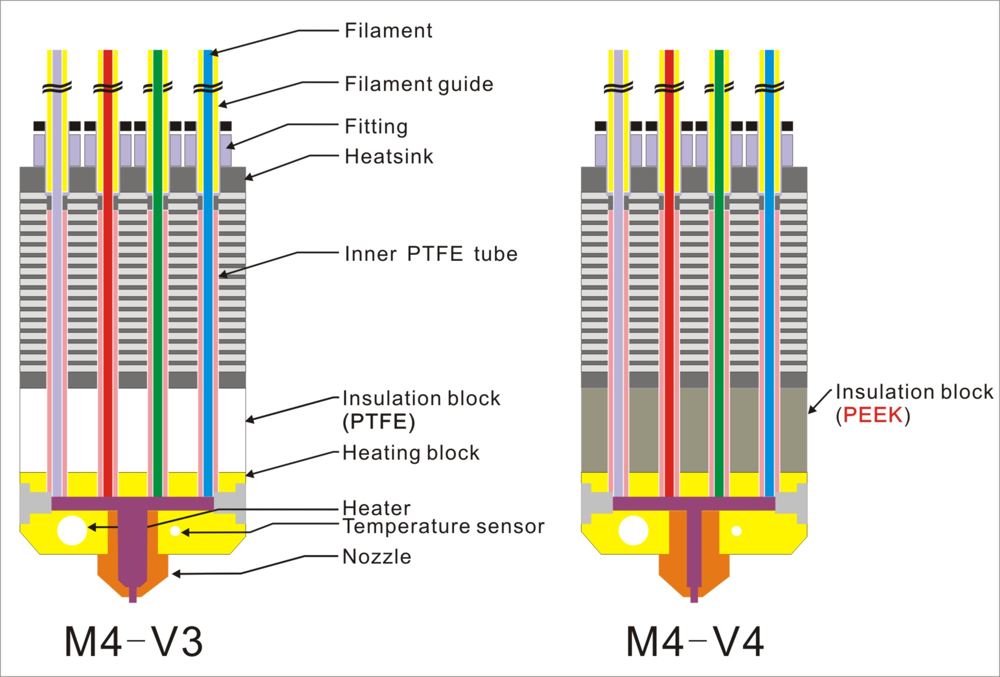

## ZONESTAR M4 (4-IN-1-OUT Mixing Color) Hotend
[**Buy a M4 Hotend**](https://www.aliexpress.com/item/1005002124027691.html)  
[**Buy a M4 Hotend assembly**](https://www.aliexpress.com/item/1005001581641783.html) 

### M4V3(V4) - The 3th version and 4th version 4-IN-1-OUT hotend
Introduction of the 3th and 4th version M4 hotend.      
#### Structure diagram

#### The different between  **M4V4** with **M4V3**:  
1. Upgraded the insulation block material from **PETF** to **PEEK**, so M4-V4 can work at maxius temperature to 260℃.  

2. Upgraded the nozzle to a "Small store room nozzle" to improve the strings issue.
  

#### Get the upgrade parts
[**PEEK_Insulation_block**](https://www.aliexpress.com/item/1005002124027691.html)  
[**Small store room nozzle**](https://www.aliexpress.com/item/1005001447928770.html)

### M4V5 - The 3th version 4-IN-1-OUT hotend
Introduction of the 5th version M4 hotend
####  Structure diagram

#### The different between  **M4V5** with **M4V4**:  
1. Removed the inner PTEF tube, reduce clogged issue because of the damage of internal PTEF tube.   
2. Upgraded the fittings, easier to load filament and replace the filament guide. 

### stl
Stl files of the fan duck

### Example
Examples to use M4 hotend to print
   