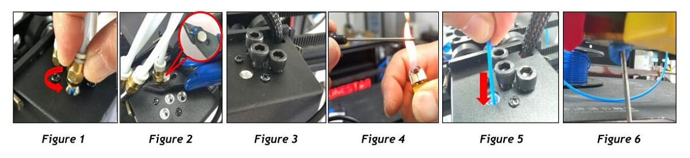

## FAQ for mixing color hotend
### :question: Hotend is clogged/blocked 
If you encounter the problem of hot end clogged / blocked, please check according to the following items:  
#### Check Slicing settings.   
:red_circle: **Disable “Extruder/Nozzle switching retraction”.**
For example, set “Nozzle Switch Retraction Distance” to 0 in Cura.   
:red_circle: **Set the print speed low than 50mm/s.**  
#### Check filament    
:red_circle: **Don't mix different type of filament.**   
:bulb: Mixing ABS and PLA / PLA + is usually no problem, but PETG or silk PLA, wood-pla, transparent PLA and other materials mixed with many additives are usually easy to cause blockage.  
:bulb: When loading the filament to the hotend, please make sure that the filament enter the heating block of the hot end, it is about 45mm deep into the hot end.
#### Check nozzle
:red_circle: There may be impurities in the filament that cannot melt, resulting in nozzle blockage.   
:key: Refer to the "How to clean the cloged mixing color hotend" to clean the hotend and replace a new nozzle.  
:red_circle: When printing, the first layer is too close, resulting in the nozzle scraping on the glass, or the front end of the nozzle may be damaged and blocked.  
:key: Refer to the "How to clean the cloged mixing color hotend" to replace a new nozzle.   
#### Check distance from nozzle to bed  
:red_circle:If the distance from nozzle to bed is too closed, it will cause the filament can't flow out from the nozzle.   
:key: Double click the knob to fine tune the distance from the nozzle to the Printing platform.   
:bulb: When slicing, use the "shaft" base, and set the distance of the first layer to more than 0.5mm as far as possible, which can effectively reduce the trouble of adjusting the z-axis distance each time.  
#### Check temperature of hot end 
:red_circle: Hot end cooling fan must work when the nozzle temperature is over 50 degree, otherwise it will cause clogged because the inner PTFE tube overheat.  
#### Check extruder motor 
:key: Check whether the extruder is installed properly.    
  
:key: Properly adjust the extruder pressure.

### :question: Filament leaked from the hotend
:white_medium_small_square: TODO: wait to add.
 
### :question: There are mottled colors (when printing multi-color)
:white_medium_small_square: TODO: wait to add.

### How to clean the cloged mixing color hotend
+ **Step 1:** Heat the hot end (nozzle) to 200 degrees and wait for the temperature to be reached
+ **Step 2:** Remove the fitting and pull out the filament (Figure 1).  
:sunny: **Tips1:** If it is difficult to pull out the filaments, you can use the cutting pliers to clamp the filaments and pull out (Figure 2).  
:sunny:**Tips2:** If the filaments cannot be pulled out at all, you can use cutting pliers to cut the filaments.  
+ **Step 3:** Remove the nozzle from the hot end.  
:memo: **Note:** Please pay attention to prevent burns, it is recommended to wear heat-resistant gloves for operation.  
+ **Step 4:** Install the hotend-clean-tool on the hot-end (Figure 3), close the channels that are not blocked, and leave only the blocked
channel.  
:sunny: **Tips:** If the hot end is blocked by filaments and cannot be inserted into the hotend-clean-tool, you can use a lighter to heat the thin rod of the hotend-clean-tool, and then insert it to the hotend(Figure 4).  
+ **Step 5:** Manually feed in at least 50cm filaments slowly from the hotend (Figure 5).  
+ **Step 6:** Clean the filaments in front of the hotend (Figure 6). If necessary (there are other channels are blocked), you can close the cleaned channel with a “hotend cleaning tool” before cleaning the next channel.  
+ **Step 7:** Install the nozzle back.  

