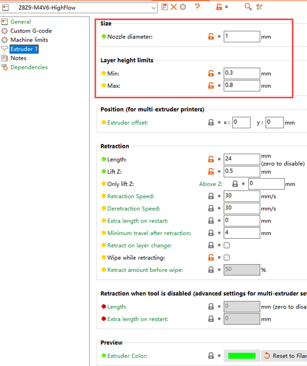
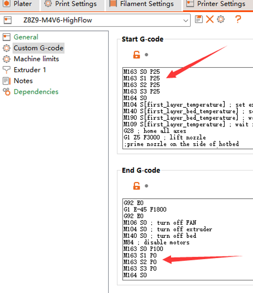
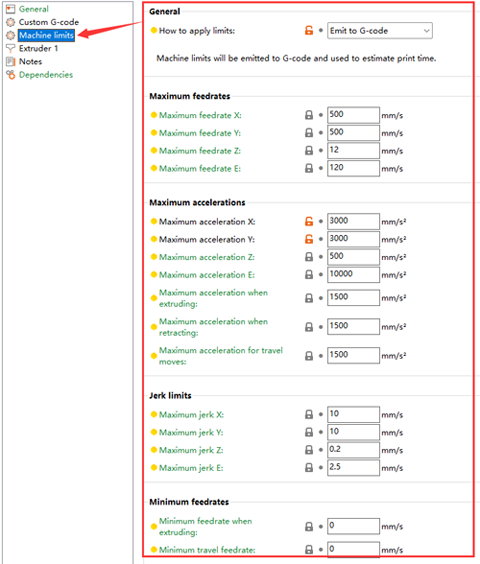
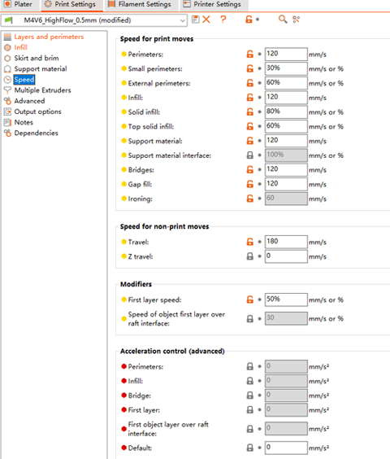

## High speed printing with M4V6
The M4V6 has a large mixing chamber, which enables it to achieve high flow printing. Therefore, you can use M4V6 to achieve high-speed printing.
Our test shows that after replacing the 1.0mm nozzle, it can achieve a printing speed of 150mm/s and layer thick = 0.6mm (Flow rate is about 28mm3/s) on the Z9V5 3d printer.

### To achieve high-speed printing, you need to do the following steps:
#### 1. Replace a larger diameter nozzle ([:gift: Buy a big nozzle](https://www.aliexpress.com/item/1005003930065577.html)) and modify the nozzle size setting according to the nozzle size. 

#### 2. Modify the "Start Gcode" and "End Gcode" of the slicing software, and set T0 to an extruder with a mixing ratio of 1:1:1:1.
- Add the following commands to the Start Gcode file of the slice software:
~~~
  M163 S0 P25
  M163 S1 P25
  M163 S2 P25
  M163 S3 P25
  M164 S0
~~~
- In order to restore the color mixing ratio setting of T0, we suggest you to add the following commands to the End Gcode of the slice software:
~~~
  M163 S0 P100
  M163 S1 P0
  M163 S2 P0
  M163 S3 P0
  M164 S0
~~~

#### 3. Modify the settings of printing speed，the machine limits， etc.
 
#### 4. Load 4 same color filaments to the extruders before printing.
Note: you can also ues the different colors filaments, but they will be mixed to another color.
#### 5. Slicing (one color) and print it out from SD card.

-----
### We have already made a config.ini file for PrusaSlicer, you can download and import it to PrusaSlicer. and we have made a test gcode file, you can download it and print it in your printer.
- **[:arrow_down: Download PrusaSlicer config.ini file](./M4V6HighFlow_1mmNozzle.zip).**
- **[:movie_camera: Video tutorial for importing config.ini ](./Import_settings.gif).**
- **[:arrow_down: download test gcode file](./Z9_M4V6_HF_Vase.zip).**  
