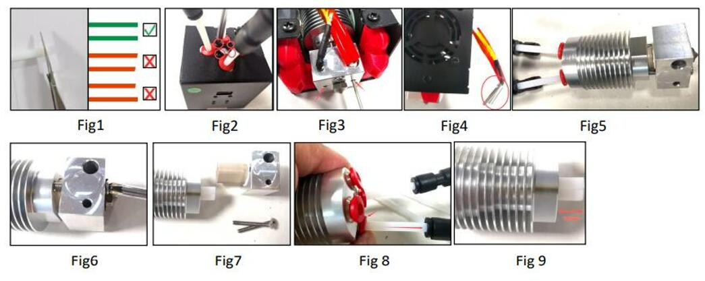

## <a id="choose-language">:globe_with_meridians: Choose language </a>

----
## <a id="en">How to replace the inner PTFE tubes of the M4V6 hotend</a>
### Steps
1. Prepare 4 piece PTFE tube (ID=2mm / OD=4mm), length is about 100mm (***Fig1***). To cut the PTFE pipe by a knife (paper cutter) and try to keep the front end flat.
2. Remove the screws which to fix the hot end on the top of the hot end housing (***Fig2***).
3. Loosen the screws which to fix the heater and temperature sensor (***Fig3***).
4. Remove the heater and temperature sensor from the hot end (***Fig4***).
5. Remove the hot end from the housing (***Fig5***).
6. Remove the 2 screws to fix the heating block (***Fig6***).
7. Pull out the heating block (***Fig7***).
8. Press the “RED ring” of the fittings and pull out the PTFE tubes (***Fig8***).
9. Insert the new PTFE tubes and install the heating block back in reverse order.
10. Push the PTFE tubes to the bottom after installed the heating block.

### Video tutorial

----
## <a id="es">Cómo reemplazar los tubos de PTFE internos del hotend M4V6</a>
### Pasos
1. Prepare 4 piezas de tubo de PTFE (DI=2 mm / DE=4 mm), la longitud es de aproximadamente 100 mm (***Fig1***). Corte el tubo de PTFE con un cuchillo (cortador de papel) e intente mantener el extremo frontal plano.
2. Retire los tornillos que fijan el hotend en la parte superior de la carcasa del hotend (***Fig2***).
3. Afloje los tornillos que fijan el calentador y el sensor de temperatura (***Fig3***).
4. Retire el calentador y el sensor de temperatura del hotend (***Fig4***).
5. Retire el hotend de la carcasa (***Fig5***).
6. Retire los 2 tornillos para fijar el bloque de calentamiento (***Fig6***).
7. Extraiga el bloque de calentamiento (***Fig7***).
8. Presione el “anillo ROJO” de los accesorios y extraiga los tubos de PTFE (***Fig. 8***).
9. Inserte los nuevos tubos de PTFE e instale el bloque calefactor nuevamente en orden inverso.
10. Empuje los tubos de PTFE hasta el fondo después de instalar el bloque calefactor.

### Video tutorial

----
## <a id="pt">Como substituir os tubos internos de PTFE do hotend M4V6</a>
### Passos
1.º Prepare um tubo de PTFE de 4 peças (ID=2mm / OD=4mm), o comprimento é de cerca de 100mm (***Fig1***). Corte o tubo de PTFE com uma faca (cortador de papel) e tente manter a extremidade frontal plana.
2.º Retire os parafusos que fixam o hot end na parte superior do alojamento do hot end (***Fig2***).
3.º Desaperte os parafusos que fixam o aquecedor e o sensor de temperatura (***Fig3***).
4.º Retire o aquecedor e o sensor de temperatura da extremidade quente (***Fig4***).
5.º Retire a extremidade quente da caixa (***Fig5***).
6.º Retire os 2 parafusos de fixação do bloco de aquecimento (***Fig6***).
7.º Retire o bloco de aquecimento (***Fig7***).
8.º Pressione o “anel VERMELHO” das ligações e retire os tubos de PTFE (***Fig8***).
9.º Insira os novos tubos de PTFE e volte a instalar o bloco de aquecimento pela ordem inversa.
10.º Empurre os tubos de PTFE para o fundo depois de instalar o bloco de aquecimento.

### Tutorial em vídeo

----
## <a id="fr">Comment remplacer les tubes intérieurs en PTFE de la tête chauffante M4V6</a>
### Étapes
1. Préparez un tube en PTFE de 4 pièces (ID = 2 mm / OD = 4 mm), la longueur est d'environ 100 mm (***Fig1***). Coupez le tube en PTFE avec un couteau (coupe-papier) et essayez de garder l'extrémité avant plate.
2. Retirez les vis qui fixent la tête chauffante sur le dessus du boîtier de la tête chauffante (***Fig2***).
3. Desserrez les vis qui fixent le chauffage et le capteur de température (***Fig3***).
4. Retirez le chauffage et le capteur de température de la tête chauffante (***Fig4***).
5. Retirez la tête chauffante du boîtier (***Fig5***).
6. Retirez les 2 vis pour fixer le bloc chauffant (***Fig6***).
7. Retirez le bloc chauffant (***Fig7***).
8. Appuyez sur la « bague ROUGE » des raccords et retirez les tubes PTFE (***Fig8***).
9. Insérez les nouveaux tubes PTFE et réinstallez le bloc chauffant dans l'ordre inverse.
10. Poussez les tubes PTFE vers le bas après avoir installé le bloc chauffant.

### Tutoriel vidéo

----
## <a id="de">So ersetzen Sie die inneren PTFE-Schläuche des M4V6-Hotends</a>
### Schritte
1. Bereiten Sie 4 PTFE-Schläuche (Innendurchmesser = 2 mm / Außendurchmesser = 4 mm) vor, die Länge beträgt etwa 100 mm (***Abb. 1***). Schneiden Sie das PTFE-Rohr mit einem Messer (Papierschneider) ab und versuchen Sie, das vordere Ende flach zu halten.
2. Entfernen Sie die Schrauben, mit denen das Hotend oben am Hotend-Gehäuse befestigt ist (***Abb. 2***).
3. Lösen Sie die Schrauben, mit denen die Heizung und der Temperatursensor befestigt sind (***Abb. 3***).
4. Entfernen Sie die Heizung und den Temperatursensor vom Hotend (***Abb. 4***).
5. Entfernen Sie das Hotend vom Gehäuse (***Abb. 5***).
6. Entfernen Sie die 2 Schrauben, mit denen der Heizblock befestigt ist (***Abb. 6***).
7. Ziehen Sie den Heizblock heraus (***Abb. 7***).
8. Drücken Sie auf den „ROTEN Ring“ der Anschlüsse und ziehen Sie die PTFE-Schläuche heraus (***Abb. 8***). 9. Setzen Sie die neuen PTFE-Schläuche ein und installieren Sie den Heizblock in umgekehrter Reihenfolge wieder.
10. Schieben Sie die PTFE-Schläuche nach der Installation des Heizblocks nach unten.

### Video-Tutorial

----
## <a id="it">Come sostituire i tubi interni in PTFE dell'hotend M4V6</a>
### Passaggi
1. Preparare 4 pezzi di tubo in PTFE (ID=2mm / OD=4mm), lunghezza circa 100mm (***Fig1***). Tagliare il tubo in PTFE con un coltello (taglierino) e cercare di mantenere la parte anteriore piatta.
2. Rimuovere le viti che fissano l'hot end sulla parte superiore dell'alloggiamento dell'hot end (***Fig2***).
3. Allentare le viti che fissano il riscaldatore e il sensore di temperatura (***Fig3***).
4. Rimuovere il riscaldatore e il sensore di temperatura dall'hot end (***Fig4***).
5. Rimuovere l'hot end dall'alloggiamento (***Fig5***).
6. Rimuovere le 2 viti per fissare il blocco riscaldante (***Fig6***).
7. Estrarre il blocco riscaldante (***Fig7***).
8. Premere l'"anello ROSSO" dei raccordi ed estrarre i tubi in PTFE (***Fig8***).
9. Inserire i nuovi tubi in PTFE e reinstallare il blocco riscaldante in ordine inverso.
10. Spingere i tubi in PTFE verso il basso dopo aver installato il blocco riscaldante.

### Video tutorial

----
## <a id="ru">Как заменить внутренние трубки ПТФЭ горячего конца M4V6</a>
### Шаги
1. Подготовьте 4 трубки ПТФЭ (внутренний диаметр = 2 мм / внешний диаметр = 4 мм), длина около 100 мм (***Рис.1***). Отрежьте трубку ПТФЭ ножом (резаком для бумаги) и постарайтесь сохранить передний конец плоским.
2. Открутите винты, которые крепят горячий конец на верхней части корпуса горячего конца (***Рис.2***).
3. Ослабьте винты, которые крепят нагреватель и датчик температуры (***Рис.3***).
4. Снимите нагреватель и датчик температуры с горячего конца (***Рис.4***).
5. Снимите горячий конец с корпуса (***Рис.5***).
6. Открутите 2 винта, чтобы закрепить нагревательный блок (***Рис.6***).
7. Вытащите нагревательный блок (***Рис.7***).
8. Нажмите на «КРАСНОЕ кольцо» фитингов и вытащите трубки ПТФЭ (***Рис.8***).
9. Вставьте новые трубки ПТФЭ и установите нагревательный блок в обратном порядке.
10. Протолкните трубки ПТФЭ вниз после установки нагревательного блока.

### Видеоруководство

----
## <a id="jp">M4V6 ホットエンドの内部 PTFE チューブの交換方法</a>
### 手順
1. 長さ約 100mm の PTFE チューブ (ID=2mm / OD=4mm) を 4 本用意します (***図 1***)。PTFE パイプをナイフ (ペーパー カッター) で切断し、先端が平らになるようにします。
2. ホットエンドをホットエンド ハウジングの上部に固定しているネジを取り外します (***図 2***)。
3. ヒーターと温度センサーを固定しているネジを緩めます (***図 3***)。
4. ヒーターと温度センサーをホットエンドから取り外します (***図 4***)。
5. ホットエンドをハウジングから取り外します (***図 5***)。
6. 加熱ブロックを固定している 2 本のネジを取り外します (***図 6***)。
7. 加熱ブロックを引き出します (***図 7***)。
8. フィッティングの「赤いリング」を押して、PTFE チューブを引き出します (***図 8***)。
9. 新しい PTFE チューブを挿入し、逆の順序で加熱ブロックを取り付けます。
10. 加熱ブロックを取り付けた後、PTFE チューブを一番下まで押し込みます。

### ビデオ チュートリアル

----
## <a id="kr">M4V6 핫엔드의 내부 PTFE 튜브를 교체하는 방법</a>
### 단계
1. 4개의 PTFE 튜브(ID=2mm / OD=4mm)를 준비합니다. 길이는 약 100mm입니다(***그림1***). 칼(종이 커터)로 PTFE 파이프를 자르고 전면을 평평하게 유지하려고 합니다.
2. 핫엔드를 핫엔드 하우징 상단에 고정하는 나사를 제거합니다(***그림2***).
3. 히터와 온도 센서를 고정하는 나사를 풉니다(***그림3***).
4. 핫엔드에서 히터와 온도 센서를 제거합니다(***그림4***).
5. 하우징에서 핫엔드를 제거합니다(***그림5***).
6. 가열 블록을 고정하는 나사 2개를 제거합니다(***그림6***).
7. 가열 블록을 꺼냅니다(***그림7***).
8. 피팅의 "RED 링"을 누르고 PTFE 튜브를 빼냅니다(***그림8***).
9. 새로운 PTFE 튜브를 삽입하고 가열 블록을 역순으로 다시 설치합니다.
10. 가열 블록을 설치한 후 PTFE 튜브를 바닥으로 밀어 넣습니다.

### 비디오 튜토리얼

----
## <a id="ar">كيفية استبدال أنابيب PTFE الداخلية للطرف الساخن M4V6</a>
### الخطوات
1. قم بإعداد أنبوب PTFE مكون من 4 قطع (القطر الداخلي = 2 مم / القطر الخارجي = 4 مم)، ويبلغ طوله حوالي 100 مم (***الشكل 1***). قم بقطع أنبوب PTFE بسكين (قاطع ورق) وحاول الحفاظ على الطرف الأمامي مسطحًا.
2. قم بإزالة البراغي التي تستخدم لتثبيت الطرف الساخن في الجزء العلوي من غلاف الطرف الساخن (***الشكل 2***).
3. قم بفك البراغي التي تستخدم لتثبيت السخان ومستشعر درجة الحرارة (***الشكل 3***).
4. قم بإزالة السخان ومستشعر درجة الحرارة من الطرف الساخن (***الشكل 4***).
5. قم بإزالة الطرف الساخن من الغلاف (***الشكل 5***).
6. قم بإزالة البراغيين لتثبيت كتلة التسخين (***الشكل 6***).
7. اسحب كتلة التسخين (***الشكل 7***).
8. اضغط على "الحلقة الحمراء" للتجهيزات واسحب أنابيب PTFE للخارج (***الشكل 8***).
9. أدخل أنابيب PTFE الجديدة وقم بتثبيت كتلة التسخين مرة أخرى بترتيب عكسي.
10. ادفع أنابيب PTFE إلى الأسفل بعد تثبيت كتلة التسخين.

### فيديو تعليمي
