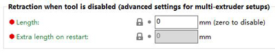

[loadfilament]: https://github.com/ZONESTAR3D/Z8P/blob/main/Z8P-MK2/2-Operation_Guide/readme.md#load-filaments

----
## <a id="choose-language">:globe_with_meridians: Choose language </a>

----
## <a id="en">How to clean the clogged M4V6 hot end</a>
- **Step 1: Heating the nozzle to 260 degree.**       
  *Prepare>>Filament>>Preheat nozzle: 260*, wait the nozzle reached 260 degree.
- **Step 2: Load all 4 filaments to the hot end.**    
- **Step 3: Extruder 4 filaments simultaneously, until you can see the filament is flowed out from the nozzle.**     
    *Prepare>>Filament>>extruder: all*      
    *Prepare>>Filament>>slowly load*, you may need to do a few times, until all 4 filaments have flowed out from the nozzle.
- **Step 4: Extrude 4 filaments one by one**     
    *Prepare>>Filament>>extruder: 1*     
    *Prepare>>Filament>>extruder: slowly load*, until you see the filament of extruder #1 is flowing out from the nozzle.     
    *Prepare>>Filament>>extruder: 2*    
    *Prepare>>Filament>>extruder: slowly load*, until you see the filament of extruder #2 is flowing out from the nozzle.    
    *Prepare>>Filament>>extruder: 3*    
    *Prepare>>Filament>>extruder: slowly load*, until you see the filament of extruder #3 is flowing out from the nozzle.    
    *Prepare>>Filament>>extruder: 4*     
    *Prepare>>Filament>>extruder: slowly load*, until you see the filament of extruder #3 is flowing out from the nozzle.     
#### 
[Video tutorial](https://github.com/ZONESTAR3D/Z8P/assets/29502731/72312727-5ce5-4a35-8f2a-49f9145557ac)
#### :pushpin: If the hot end cannot be cleaned by doing the above steps, or the hot end is still easily clogged after cleaning, please do remove the nozzle and do once above steps to clean the hotend again, and then install a new nozzle. About how to replace a nozzle, please watch this **[:clapper: video tutorial](https://youtu.be/L5VRyEbsJvM).**
#### :pushpin: If the filaments cannot be inserted into the "inner PTFE tubes" at the M4V6 hot end, please refer to this guide ([:book: How to replace the inner PTFE tubes](./ReplaceM4V6InnerPTFE.md)) to replace the blocked inner PTFE tubes.

### Why is the hotend clogged?
There are some reasons that may cause the hotend to be blocked, please check the list one by one to ensure that you have noticed these matters.
#### Incorrect steps/methods for loading filament
:pushpin: When loading the filament to the hotend, please ensure that the filaments enter the bottom of the hot end.    
:pushpin: You need to load all the 4 filaments to the hot end whether printing one or multi color 3d prints.    
For how to load filaments, please refer to [:book: this guide](#loadfilament) or the [:clapper: video tutorial](https://youtu.be/-47yB95uIxI).
#### Nozzle is defective
The nozzle may also be partially clogged. If you find the filament flowed out from the nozzle is thinner than normal, the nozzle may be partially clogged, please replace a new nozzle directly.  
#### The nozzle is too close to the print platform
If the nozzle is too close to the hot bed when printing the first layer, the filament may not be ejected. If this is maintained for a long time, it may cause the filament in the hot end to be over-compressed and cause blockage (often blocked at the entrance of hotend). When printing the first layer, pay attention to the distance between the nozzle and the hot bed. If necessary, open the "BabyStep" menu to adjust the nozzle height.
#### Incorrect "switch retraction distance" setting in the slice settings
For 4-IN-1-OUT mix color hotend, the **"Extruder switching retraction length"** MUST be set to 0. For example, set **“Nozzle Switch Retraction Distance”** to 0 in Cura Slicer and set **"Retraction when tool is disable"** in PrusaSlicer.  
 

### :envelope: If you can't find a solution to solve your problem after readed the FAQ , please contact our technical support team by [:e-mail:](support@zonestar3d.com) .

----
## <a id="es">Cómo limpiar el hot end M4V6 obstruido</a>  [:arrow_heading_up:](#choose-language)
- **Paso 1: Calienta la boquilla a 260 grados.**
*Preparar>>Filamento>>Precalentar la boquilla: 260*, esperar a que la boquilla alcance los 260 grados.
- **Paso 2: Carga los 4 filamentos en el hot end.**
- **Paso 3: Extruye los 4 filamentos simultáneamente, hasta que puedas ver que el filamento sale por la boquilla.**
*Preparar>>Filamento>>extrusor: todo*
*Preparar>>Filamento>>cargar lentamente*, es posible que tengas que hacerlo varias veces, hasta que los 4 filamentos hayan salido por la boquilla.
- **Paso 4: Extruye 4 filamentos uno por uno**    
*Preparar >> Filamento >> extrusor: 1*    
*Preparar >> Filamento >> extrusor: carga lentamente*, hasta que veas que el filamento del extrusor n.° 1 sale por la boquilla.    
*Preparar >> Filamento >> extrusor: 2*    
*Preparar >> Filamento >> extrusor: carga lentamente*, hasta que veas que el filamento del extrusor n.° 2 sale por la boquilla.    
*Preparar >> Filamento >> extrusor: 3*    
*Preparar >> Filamento >> extrusor: carga lentamente*, hasta que veas que el filamento del extrusor n.° 3 sale por la boquilla.    
*Preparar >> Filamento >> Extrusor: 4*    
*Preparar >> Filamento >> Extrusor: cargar lentamente*, hasta que vea que el filamento del extrusor n.° 3 sale por la boquilla.    
####
[Tutorial en video](https://github.com/ZONESTAR3D/Z8P/assets/29502731/72312727-5ce5-4a35-8f2a-49f9145557ac)
#### :pushpin: Si no se puede limpiar el extremo caliente siguiendo los pasos anteriores, o si el extremo caliente sigue obstruyéndose fácilmente después de la limpieza, retire la boquilla y vuelva a realizar los pasos anteriores para limpiar el extremo caliente y, luego, instale una boquilla nueva. Para saber cómo reemplazar una boquilla, mira este **[:clapper: video tutorial](https://youtu.be/L5VRyEbsJvM).**
#### :pushpin: Si los filamentos no se pueden insertar en los "tubos de PTFE internos" en el hotend M4V6, consulta esta guía ([:book: Cómo reemplazar los tubos de PTFE internos](./ReplaceM4V6InnerPTFE.md)) para reemplazar los tubos de PTFE internos bloqueados.

### ¿Por qué está obstruido el hotend?
Hay algunas razones que pueden hacer que el hotend se bloquee, revisa la lista una por una para asegurarte de haber notado estos problemas.
#### Pasos/métodos incorrectos para cargar filamento
:pushpin: Al cargar el filamento en el hotend, asegúrate de que los filamentos ingresen por la parte inferior del hotend.
:pushpin: Debes cargar los 4 filamentos en el hot end, ya sea que imprimas impresiones 3D de un solo color o de varios colores.
Para saber cómo cargar filamentos, consulta [:book: esta guía](#loadfilament) o el [:clapper: video tutorial](https://youtu.be/-47yB95uIxI).
#### La boquilla está defectuosa
La boquilla también puede estar parcialmente obstruida. Si ves que el filamento que sale de la boquilla es más fino de lo normal, es posible que la boquilla esté parcialmente obstruida. Reemplaza la boquilla directamente por una nueva.
#### La boquilla está demasiado cerca de la plataforma de impresión
Si la boquilla está demasiado cerca de la cama caliente al imprimir la primera capa, es posible que no se expulse el filamento. Si esto se mantiene durante mucho tiempo, puede provocar que el filamento en el hot end se comprima demasiado y provoque un bloqueo (a menudo, se bloquea en la entrada del hot end). Al imprimir la primera capa, presta atención a la distancia entre la boquilla y la cama caliente. Si es necesario, abra el menú "BabyStep" para ajustar la altura de la boquilla.
#### Configuración incorrecta de la "distancia de retracción del interruptor" en la configuración de corte
Para el hotend de mezcla de colores 4-IN-1-OUT, la **"Longitud de retracción del interruptor del extrusor"** DEBE estar configurada en 0. Por ejemplo, configure **“Distancia de retracción del interruptor de la boquilla”** en 0 en Cura Slicer y configure **“Retracción cuando la herramienta está deshabilitada”** en PrusaSlicer.
 

### :envelope: Si no puede encontrar una solución para resolver su problema después de leer las preguntas frecuentes, comuníquese con nuestro equipo de soporte técnico por [:e-mail:](support@zonestar3d.com) .

----
## <a id="pt">Como limpar o hot end M4V6 entupido</a>
- **Passo 1: Aquecer o bico a 260 graus.**
 *Prepare>>Filament>>Pré-aqueça o bico: 260*, aguarde que o bico atinja os 260 graus.
- **Passo 2: Carregue todos os 4 filamentos na extremidade quente.**
- **Passo 3: Extrusora 4 filamentos em simultâneo, até que se consiga ver que o filamento flui para fora do bico.**
 *Preparar>>Filamento>>extrusora: tudo*    
 *Preparar>>Filament>>carregar lentamente*, pode ser necessário fazê-lo algumas vezes, até que todos os 4 filamentos tenham saído do bocal.
- **Etapa 4: Extrusão de 4 filamentos um a um**    
 *Preparar>>Filamento>>extrusora: 1*    
 *Prepare>>Filamento>>extrusora: carregue lentamente*, até ver que o filamento da extrusora nº 1 está a fluir para fora do bocal.    
 *Preparar>>Filamento>>extrusora: 2*    
 *Prepare>>Filamento>>extrusora: carregue lentamente*, até ver que o filamento da extrusora nº 2 está a fluir para fora do bocal.    
 *Preparar>>Filamento>>extrusora: 3*    
 *Prepare>>Filamento>>extrusora: carregue lentamente*, até ver que o filamento da extrusora nº 3 está a fluir para fora do bocal.    
 *Preparar>>Filamento>>extrusora: 4*    
 *Prepare>>Filamento>>extrusora: carregue lentamente*, até ver que o filamento da extrusora nº 3 está a fluir para fora do bocal.    
####
[Tutorial em vídeo](https://github.com/ZONESTAR3D/Z8P/assets/29502731/72312727-5ce5-4a35-8f2a-49f9145557ac)
#### :pushpin: Se a extremidade quente não puder ser limpa seguindo os passos acima, ou se a extremidade quente ainda estiver facilmente entupida após a limpeza, retire o bocal e siga os passos acima para limpar novamente a extremidade quente e, em seguida, instale um novo bocal. Sobre como substituir um bico, veja este **[:clapper: vídeo tutorial](https://youtu.be/L5VRyEbsJvM).**
#### :pushpin: Se os filamentos não puderem ser inseridos nos "tubos internos de PTFE" na extremidade quente M4V6, consulte este guia ([:book: Como substituir os tubos internos de PTFE](./ReplaceM4V6InnerPTFE.md )) para substituir os tubos internos de PTFE bloqueados.

### Porque é que o hotend está entupido?
Existem alguns motivos que podem fazer com que o hotend seja bloqueado.
#### Passos/métodos incorretos para carregar o filamento
:pin: Ao carregar o filamento no hotend, certifique-se de que os filamentos entram na parte inferior do hotend.
:pushpin: É necessário carregar todos os 4 filamentos no hot end, seja a imprimir impressões 3D de uma ou várias cores.
Para saber como carregar filamentos, consulte [:book: este guia](#loadfilament) ou o [:clapper: vídeo tutorial](https://youtu.be/-47yB95uIxI).
#### Bocal está com defeito
O bocal também pode estar parcialmente entupido. Se achar que o filamento que sai do bico é mais fino do que o normal, o bico pode estar parcialmente entupido, substitua diretamente um novo bico.
#### O bocal está demasiado próximo da plataforma de impressão
Se o bocal estiver demasiado próximo da cama quente ao imprimir a primeira camada, o filamento poderá não ser ejetado. Se isto for mantido durante um longo período, pode fazer com que o filamento no hotend fique sobrecomprimido e cause bloqueio (geralmente bloqueado na entrada do hotend). Ao imprimir a primeira camada, tenha em atenção a distância entre o bico e a cama quente. Se necessário, abra o menu “BabyStep” para ajustar a altura do bico.
#### Configuração incorreta de "alterar distância de retração" nas definições de corte
Para o hotend de cores misturadas 4-IN-1-OUT, o **"Extrusor switching retraction length"** DEVE ser definido como 0. Por exemplo, defina **“Nozzle Switch Retraction Distance”** para 0 no Cura Slicer e defina **"Retração quando a ferramenta está desativada"** no PrusaSlicer.
 

### :envelope: Se não encontrar uma solução para resolver o seu problema após ler as FAQ, por favor contacte a nossa equipa de suporte técnico através de [:e-mail:](support@zonestar3d.com).

----
## <a id="fr">Comment nettoyer la tête chauffante M4V6 obstruée</a>
- **Étape 1 : Chauffer la buse à 260 degrés.**
*Préparer>>Filament>>Préchauffer la buse : 260*, attendre que la buse atteigne 260 degrés.
- **Étape 2 : Charger les 4 filaments dans la tête chauffante.**
- **Étape 3 : Extruder 4 filaments simultanément, jusqu'à ce que vous puissiez voir le filament sortir de la buse.**
*Préparer>>Filament>>extrudeuse : tous*
*Préparer>>Filament>>charger lentement*, vous devrez peut-être le faire plusieurs fois, jusqu'à ce que les 4 filaments sortent de la buse.
- **Étape 4 : extrudez 4 filaments un par un**
*Préparez>>Extrudeuse de filament : 1*    
*Préparez>>Extrudeuse de filament : chargez lentement*, jusqu'à ce que vous voyiez le filament de l'extrudeuse n°1 sortir de la buse.    
*Préparez>>Extrudeuse de filament : 2*    
*Préparez>>Extrudeuse de filament : chargez lentement*, jusqu'à ce que vous voyiez le filament de l'extrudeuse n°2 sortir de la buse.    
*Préparez>>Extrudeuse de filament : 3*    
*Préparez>>Extrudeuse de filament : chargez lentement*, jusqu'à ce que vous voyiez le filament de l'extrudeuse n°3 sortir de la buse.    
*Préparez >>Filament>>extrudeuse : 4*    
*Préparez >>Filament>>extrudeuse : chargez lentement*, jusqu'à ce que vous voyiez le filament de l'extrudeuse n° 3 sortir de la buse.    
####
[Tutoriel vidéo](https://github.com/ZONESTAR3D/Z8P/assets/29502731/72312727-5ce5-4a35-8f2a-49f9145557ac)
#### :pushpin: Si l'extrémité chaude ne peut pas être nettoyée en suivant les étapes ci-dessus, ou si l'extrémité chaude est toujours facilement obstruée après le nettoyage, veuillez retirer la buse et effectuer une fois les étapes ci-dessus pour nettoyer à nouveau l'extrémité chaude, puis installer une nouvelle buse. Pour savoir comment remplacer une buse, veuillez regarder ce **[:clapper: tutoriel vidéo](https://youtu.be/L5VRyEbsJvM).**
#### :pushpin: Si les filaments ne peuvent pas être insérés dans les « tubes PTFE internes » de l'extrémité chaude M4V6, veuillez vous référer à ce guide ([:book: Comment remplacer les tubes PTFE internes](./ReplaceM4V6InnerPTFE.md)) pour remplacer les tubes PTFE internes bloqués.

### Pourquoi l'extrémité chaude est-elle bouchée ?
Certaines raisons peuvent entraîner le blocage de l'extrémité chaude, veuillez vérifier la liste une par une pour vous assurer que vous avez remarqué ces problèmes.
#### Étapes/méthodes incorrectes pour le chargement du filament
:pushpin: Lors du chargement du filament dans l'extrémité chaude, veuillez vous assurer que les filaments pénètrent par le bas de l'extrémité chaude.
:pushpin: Vous devez charger les 4 filaments dans l'extrémité chaude, que vous imprimiez des impressions 3D monochromes ou multicolores.
Pour savoir comment charger les filaments, veuillez vous référer à [:book: ce guide](#loadfilament) ou au [:clapper: tutoriel vidéo](https://youtu.be/-47yB95uIxI).
#### La buse est défectueuse
La buse peut également être partiellement obstruée. Si vous constatez que le filament qui s'écoule de la buse est plus fin que la normale, la buse peut être partiellement obstruée, veuillez remplacer directement une nouvelle buse.
#### La buse est trop proche de la plate-forme d'impression
Si la buse est trop proche du lit chaud lors de l'impression de la première couche, le filament peut ne pas être éjecté. Si cela se maintient pendant une longue période, cela peut entraîner une surcompression du filament dans l'extrémité chaude et provoquer un blocage (souvent bloqué à l'entrée de l'extrémité chaude). Lors de l'impression de la première couche, faites attention à la distance entre la buse et le lit chaud. Si nécessaire, ouvrez le menu « BabyStep » pour régler la hauteur de la buse.
#### Paramètre incorrect de « distance de rétraction du commutateur » dans les paramètres de coupe
Pour le hotend de couleur mixte 4-IN-1-OUT, la **« Longueur de rétraction de commutation de l'extrudeuse »** DOIT être réglée sur 0. Par exemple, définissez **« Distance de rétraction du commutateur de buse »** sur 0 dans Cura Slicer et définissez **« Rétraction lorsque l'outil est désactivé »** dans PrusaSlicer.
 

### :envelope: Si vous ne trouvez pas de solution pour résoudre votre problème après avoir lu la FAQ, veuillez contacter notre équipe d'assistance technique par [:e-mail:](support@zonestar3d.com) .

----
## <a id="de">So reinigen Sie das verstopfte M4V6-Hot-End</a>
- **Schritt 1: Erhitzen Sie die Düse auf 260 Grad.**
*Vorbereiten>>Filament>>Düse vorheizen: 260*, warten Sie, bis die Düse 260 Grad erreicht hat.
- **Schritt 2: Laden Sie alle 4 Filamente in das Hot-End.**
- **Schritt 3: Extrudieren Sie 4 Filamente gleichzeitig, bis Sie sehen, dass das Filament aus der Düse fließt.**
*Vorbereiten>>Filament>>Extruder: alle*
*Vorbereiten>>Filament>>langsam laden*, Sie müssen dies möglicherweise einige Male tun, bis alle 4 Filamente aus der Düse geflossen sind.
- **Schritt 4: 4 Filamente nacheinander extrudieren**
*Vorbereiten>>Filament>>Extruder: 1*    
*Vorbereiten>>Filament>>Extruder: langsam laden*, bis Sie sehen, dass das Filament von Extruder Nr. 1 aus der Düse fließt.    
*Vorbereiten>>Filament>>Extruder: 2*    
*Vorbereiten>>Filament>>Extruder: langsam laden*, bis Sie sehen, dass das Filament von Extruder Nr. 2 aus der Düse fließt.    
*Vorbereiten>>Filament>>Extruder: 3*    
*Vorbereiten>>Filament>>Extruder: langsam laden*, bis Sie sehen, dass das Filament von Extruder Nr. 3 aus der Düse fließt.    
*Vorbereiten>>Filament>>Extruder: 4*    
*Vorbereiten>>Filament>>Extruder: langsam laden*, bis Sie sehen, dass das Filament von Extruder Nr. 3 aus der Düse fließt.    
####
[Video-Tutorial](https://github.com/ZONESTAR3D/Z8P/assets/29502731/72312727-5ce5-4a35-8f2a-49f9145557ac)
#### :pushpin: Wenn das Hotend mit den oben genannten Schritten nicht gereinigt werden kann oder das Hotend nach der Reinigung immer noch leicht verstopft, entfernen Sie bitte die Düse und führen Sie die oben genannten Schritte erneut aus, um das Hotend zu reinigen, und installieren Sie dann eine neue Düse. Informationen zum Ersetzen einer Düse finden Sie in diesem **[:clapper: Video-Tutorial](https://youtu.be/L5VRyEbsJvM).**
#### :pushpin: Wenn die Filamente nicht in die „inneren PTFE-Röhrchen“ am M4V6-Hot-End eingesetzt werden können, lesen Sie bitte diese Anleitung ([:book: So ersetzen Sie die inneren PTFE-Röhrchen](./ReplaceM4V6InnerPTFE.md)), um die verstopften inneren PTFE-Röhrchen zu ersetzen.

### Warum ist das Hotend verstopft?
Es gibt einige Gründe, die dazu führen können, dass das Hotend verstopft ist. Bitte überprüfen Sie die Liste nacheinander, um sicherzustellen, dass Sie diese Probleme bemerkt haben.
#### Falsche Schritte/Methoden zum Laden des Filaments
:pushpin: Achten Sie beim Laden des Filaments in das Hotend darauf, dass die Filamente in die Unterseite des Hotends gelangen.
:pushpin: Sie müssen alle 4 Filamente in das Hotend laden, unabhängig davon, ob Sie ein- oder mehrfarbige 3D-Drucke drucken.
Informationen zum Laden von Filamenten finden Sie in [:book: dieser Anleitung](#loadfilament) oder im [:clapper: Video-Tutorial](https://youtu.be/-47yB95uIxI).
#### Düse ist defekt
Die Düse ist möglicherweise auch teilweise verstopft. Wenn Sie feststellen, dass das aus der Düse austretende Filament dünner als normal ist, ist die Düse möglicherweise teilweise verstopft. Bitte ersetzen Sie sie direkt durch eine neue Düse.
#### Die Düse ist zu nahe an der Druckplattform
Wenn die Düse beim Drucken der ersten Schicht zu nahe am Heizbett ist, wird das Filament möglicherweise nicht ausgeworfen. Wenn dies über einen längeren Zeitraum anhält, kann dies dazu führen, dass das Filament im Hotend überkomprimiert wird und eine Verstopfung verursacht (häufig am Eingang des Hotends verstopft). Achten Sie beim Drucken der ersten Schicht auf den Abstand zwischen der Düse und dem Heizbett. Öffnen Sie bei Bedarf das Menü „BabyStep“, um die Düsenhöhe anzupassen.
#### Falsche Einstellung für „Schalterrückzugsabstand“ in den Slice-Einstellungen
Für 4-IN-1-OUT-Mischfarb-Hotends MUSS die **„Extruder-Schalterrückzugslänge“** auf 0 eingestellt werden. Stellen Sie beispielsweise **„Düsenschalter-Rückzugsabstand“** in Cura Slicer auf 0 und **„Rückzug bei deaktiviertem Werkzeug“** in PrusaSlicer ein.
 

### :envelope: Wenn Sie nach dem Lesen der FAQ keine Lösung für Ihr Problem finden, wenden Sie sich bitte per [:e-mail:](support@zonestar3d.com) an unser technisches Supportteam.

----
## <a id="it">Come pulire l'hot end M4V6 intasato</a>
- **Passaggio 1: Riscaldare l'ugello a 260 gradi.**
*Preparare>>Filamento>>Preriscaldare l'ugello: 260*, attendere che l'ugello raggiunga i 260 gradi.
- **Passaggio 2: Caricare tutti e 4 i filamenti nell'hot end.**
- **Passaggio 3: Estrudere 4 filamenti contemporaneamente, finché non si vede il filamento uscire dall'ugello.**
*Preparare>>Filamento>>estrusore: tutto*
*Preparare>>Filamento>>caricare lentamente*, potrebbe essere necessario ripetere l'operazione più volte, finché tutti e 4 i filamenti non saranno usciti dall'ugello. - **Passaggio 4: estrudere 4 filamenti uno alla volta**
*Prepara>>Filamento>>estrusore: 1*    
*Prepara>>Filamento>>estrusore: caricare lentamente*, finché non vedi il filamento dell'estrusore n. 1 uscire dall'ugello.    
*Prepara>>Filamento>>estrusore: 2*    
*Prepara>>Filamento>>estrusore: caricare lentamente*, finché non vedi il filamento dell'estrusore n. 2 uscire dall'ugello.    
*Prepara>>Filamento>>estrusore: 3*    
*Prepara>>Filamento>>estrusore: caricare lentamente*, finché non vedi il filamento dell'estrusore n. 3 uscire dall'ugello.    
*Prepara>>Filamento>>estrusore: 4*    
*Prepara>>Filamento>>estrusore: carica lentamente*, finché non vedi il filamento dell'estrusore n. 3 uscire dall'ugello.    
####
[Video tutorial](https://github.com/ZONESTAR3D/Z8P/assets/29502731/72312727-5ce5-4a35-8f2a-49f9145557ac)
#### :pushpin: Se l'hot end non può essere pulito eseguendo i passaggi precedenti, o l'hot end si ostruisce ancora facilmente dopo la pulizia, rimuovi l'ugello e ripeti i passaggi precedenti per pulire nuovamente l'hotend, quindi installa un nuovo ugello. Per informazioni su come sostituire un ugello, guarda questo **[:clapper: video tutorial](https://youtu.be/L5VRyEbsJvM).**
#### :pushpin: Se i filamenti non possono essere inseriti nei "tubi interni in PTFE" dell'hot end M4V6, fai riferimento a questa guida ([:book: Come sostituire i tubi interni in PTFE](./ReplaceM4V6InnerPTFE.md)) per sostituire i tubi interni in PTFE bloccati.

### Perché l'hotend è intasato?
Ci sono alcuni motivi che possono causare il blocco dell'hotend, controlla l'elenco uno per uno per assicurarti di aver notato questi problemi.
#### Passaggi/metodi errati per caricare il filamento
:pushpin: Quando carichi il filamento nell'hotend, assicurati che i filamenti entrino nella parte inferiore dell'hotend. :pushpin: Devi caricare tutti e 4 i filamenti nell'hot end, sia che tu stia stampando stampe 3D monocolore o multicolore.
Per sapere come caricare i filamenti, fai riferimento a [:book: questa guida](#loadfilament) o al [:clapper: video tutorial](https://youtu.be/-47yB95uIxI).
#### L'ugello è difettoso
L'ugello potrebbe anche essere parzialmente ostruito. Se noti che il filamento che esce dall'ugello è più sottile del normale, l'ugello potrebbe essere parzialmente ostruito, sostituisci direttamente un nuovo ugello.
#### L'ugello è troppo vicino alla piattaforma di stampa
Se l'ugello è troppo vicino al letto caldo durante la stampa del primo strato, il filamento potrebbe non essere espulso. Se questa situazione persiste per molto tempo, potrebbe causare una compressione eccessiva del filamento nell'hot end e causare un blocco (spesso bloccato all'ingresso dell'hotend). Quando stampi il primo strato, fai attenzione alla distanza tra l'ugello e il letto caldo. Se necessario, apri il menu "BabyStep" per regolare l'altezza dell'ugello.
#### Impostazione errata "distanza di retrazione dell'interruttore" nelle impostazioni di slice
Per l'hotend a colori misti 4-IN-1-OUT, **"Lunghezza di retrazione dell'interruttore dell'estrusore"** DEVE essere impostata su 0. Ad esempio, imposta **"Distanza di retrazione dell'interruttore dell'ugello"** su 0 in Cura Slicer e imposta **"Retrazione quando l'utensile è disabilitato"** in PrusaSlicer.
 

### :envelope: Se non riesci a trovare una soluzione per risolvere il tuo problema dopo aver letto le FAQ, contatta il nostro team di supporto tecnico tramite [:e-mail:](support@zonestar3d.com).

----
## <a id="ru">Как очистить засоренный горячий конец M4V6</a>
- **Шаг 1: Нагрев сопла до 260 градусов.**
*Подготовка>>Нить>>Предварительный нагрев сопла: 260*, подождите, пока сопло достигнет 260 градусов.
- **Шаг 2: Загрузите все 4 нити в горячий конец.**
- **Шаг 3: Экструдер с 4 нитями одновременно, пока не увидите, что нить вытекает из сопла.**
*Подготовка>>Нить>>Экструдер: все*
*Подготовка>>Нить>>медленно загружайте*, вам может потребоваться сделать это несколько раз, пока все 4 нити не вытекут из сопла.
- **Шаг 4: Выдавите 4 нити одну за другой**
*Подготовка>>Нить>>Экструдер: 1*    
*Подготовка>>Нить>>Экструдер: медленно загружайте*, пока не увидите, что нить экструдера № 1 вытекает из сопла.    
*Подготовка>>Нить>>Экструдер: 2*    
*Подготовка>>Нить>>Экструдер: медленно загружайте*, пока не увидите, что нить экструдера № 2 вытекает из сопла.    
*Подготовка>>Нить>>Экструдер: 3*    
*Подготовка>>Нить>>Экструдер: медленно загружайте*, пока не увидите, что нить экструдера № 3 вытекает из сопла.    
*Подготовка>>Нить>>экструдера: 4*    
*Подготовка>>Нить>>экструдера: медленно загружайте*, пока не увидите, что нить экструдера № 3 вытекает из сопла.    
####
[Видеоурок](https://github.com/ZONESTAR3D/Z8P/assets/29502731/72312727-5ce5-4a35-8f2a-49f9145557ac)
#### :pushpin: Если горячий конец не удается очистить, выполнив указанные выше действия, или горячий конец по-прежнему легко засоряется после очистки, снимите сопло и выполните указанные выше действия еще раз, чтобы очистить горячий конец, а затем установите новое сопло. О том, как заменить сопло, посмотрите это **[:clapper: видеоруководство](https://youtu.be/L5VRyEbsJvM).**
#### :pushpin: Если нити не могут быть вставлены во «внутренние трубки PTFE» на хотэнде M4V6, обратитесь к этому руководству ([:book: Как заменить внутренние трубки PTFE](./ReplaceM4V6InnerPTFE.md)), чтобы заменить заблокированные внутренние трубки PTFE.

### Почему засоряется хотэнд?
Существует несколько причин, которые могут привести к блокировке хотэнда, пожалуйста, проверьте список одну за другой, чтобы убедиться, что вы заметили эти проблемы.
#### Неправильные шаги/методы загрузки нити
:pushpin: При загрузке нити в хотэнд убедитесь, что нити входят в нижнюю часть хотэнда.
:pushpin: Вам необходимо загрузить все 4 нити в хотэнд, независимо от того, печатаете ли вы одноцветные или многоцветные 3D-отпечатки.
О том, как загрузить нити, см. [:book: это руководство](#loadfilament) или [:clapper: видеоурок](https://youtu.be/-47yB95uIxI).
#### Сопло неисправно
Сопло также может быть частично засорено. Если вы обнаружите, что нить, выходящая из сопла, тоньше обычного, сопло может быть частично засорено, пожалуйста, замените сопло на новое.
#### Сопло расположено слишком близко к печатной платформе
Если сопло расположено слишком близко к горячему столу при печати первого слоя, нить может не выталкиваться. Если это будет продолжаться в течение длительного времени, это может привести к чрезмерному сжатию нити в хотэнде и вызвать закупорку (часто блокируется на входе в хотэнд). При печати первого слоя обратите внимание на расстояние между соплом и горячей платформой. При необходимости откройте меню «BabyStep», чтобы отрегулировать высоту сопла.
#### Неправильная настройка «расстояние отвода переключения» в настройках среза
Для 4-IN-1-OUT смешанного цветного горячего конца **«Длина отвода переключения экструдера»** ДОЛЖНА быть установлена ​​на 0. Например, установите **«Расстояние отвода переключения сопла»** на 0 в Cura Slicer и установите **«Отвод при отключении инструмента»** в PrusaSlicer.
 

### :envelope: Если вы не можете найти решение для своей проблемы после прочтения FAQ, свяжитесь с нашей службой технической поддержки по [:e-mail:](support@zonestar3d.com) .

----
## <a id="jp">詰まった M4V6 ホットエンドのクリーニング方法</a>
- **ステップ 1: ノズルを 260 度に加熱します。**
*準備>>フィラメント>>ノズルを予熱: 260*、ノズルが 260 度に達するまで待ちます。
- **ステップ 2: 4 つのフィラメントすべてをホットエンドにロードします。**
- **ステップ 3: フィラメントがノズルから流れ出るのがわかるまで、4 つのフィラメントを同時に押し出します。**
*準備>>フィラメント>>押し出し: すべて*
*準備>>フィラメント>>ゆっくりロード*、4 つのフィラメントすべてがノズルから流れ出るまで、数回実行する必要がある場合があります。
- **ステップ 4: 4 本のフィラメントを 1 本ずつ押し出します**
*準備>>フィラメント>>押出機: 1*    
*準備>>フィラメント>>押出機: ゆっくりロード*、押出機 #1 のフィラメントがノズルから流れ出るのを確認するまで。    
*準備>>フィラメント>>押出機: 2*    
*準備>>フィラメント>>押出機: ゆっくりロード*、押出機 #2 のフィラメントがノズルから流れ出るのを確認するまで。    
*準備>>フィラメント>>押出機: 3*    
*準備>>フィラメント>>押出機: ゆっくりロード*、押出機 #3 のフィラメントがノズルから流れ出るのを確認するまで。    
*準備>>フィラメント>>押出機: 4*    
*準備>>フィラメント>>押出機: ゆっくりとロード*、押出機 #3 のフィラメントがノズルから流れ出るのを確認するまで。    
####
[ビデオチュートリアル](https://github.com/ZONESTAR3D/Z8P/assets/29502731/72312727-5ce5-4a35-8f2a-49f9145557ac)
#### :pushpin: 上記の手順を実行してもホットエンドをクリーニングできない場合、またはクリーニング後もホットエンドが詰まりやすい場合は、ノズルを取り外して上記の手順を 1 回実行し、ホットエンドを再度クリーニングしてから、新しいノズルを取り付けてください。ノズルの交換方法については、この**[:clapper: ビデオチュートリアル](https://youtu.be/L5VRyEbsJvM)をご覧ください。**
#### :pushpin: M4V6ホットエンドの「内側のPTFEチューブ」にフィラメントを挿入できない場合は、このガイド([:book: 内側のPTFEチューブの交換方法](./ReplaceM4V6InnerPTFE.md))を参照して、詰まった内側のPTFEチューブを交換してください。

### ホットエンドが詰まるのはなぜですか?
ホットエンドが詰まる原因はいくつかあります。リストを1つずつ確認して、これらの点に気付いていることを確認してください。
#### フィラメントをロードするための手順/方法が間違っている
:pushpin: フィラメントをホットエンドにロードするときは、フィラメントがホットエンドの底部に入るようにしてください。
:pushpin: 1 色または多色の 3D プリントを印刷する場合でも、4 つのフィラメントすべてをホット エンドにロードする必要があります。
フィラメントのロード方法については、[:book: このガイド](#loadfilament) または [:clapper: ビデオ チュートリアル](https://youtu.be/-47yB95uIxI) を参照してください。
#### ノズルに欠陥があります
ノズルが部分的に詰まっている可能性もあります。ノズルから流れ出たフィラメントが通常よりも細い場合は、ノズルが部分的に詰まっている可能性があります。新しいノズルを直接交換してください。
#### ノズルが印刷プラットフォームに近すぎます
最初のレイヤーを印刷するときにノズルがホット ベッドに近すぎると、フィラメントが排出されない場合があります。この状態が長時間続くと、ホット エンドのフィラメントが過度に圧縮され、詰まりが発生する可能性があります (多くの場合、ホットエンドの入口で詰まります)。最初のレイヤーを印刷するときは、ノズルとホットベッドの間の距離に注意してください。必要に応じて、「BabyStep」メニューを開いてノズルの高さを調整してください。
#### スライス設定の「スイッチ後退距離」設定が正しくありません
4-IN-1-OUT ミックスカラーホットエンドの場合、**「エクストルーダー切り替え後退長さ」** を 0 に設定する必要があります。たとえば、Cura Slicer で **「ノズルスイッチ後退距離」** を 0 に設定し、PrusaSlicer で **「ツールが無効のときの後退」** を設定します。
 

### :envelope: FAQ を読んでも問題の解決策が見つからない場合は、[:e-mail:](support@zonestar3d.com) でテクニカルサポートチームにお問い合わせください。

----
## <a id="kr">막힌 M4V6 핫엔드 청소 방법</a>
- **1단계: 노즐을 260도로 가열합니다.**
*준비>>필라멘트>>노즐 예열: 260*, 노즐이 260도에 도달할 때까지 기다립니다.
- **2단계: 모든 4개 필라멘트를 핫엔드에 로드합니다.**
- **3단계: 필라멘트가 노즐에서 흘러나오는 것을 볼 수 있을 때까지 4개 필라멘트를 동시에 압출합니다.**
*준비>>필라멘트>>압출기: 모두*
*준비>>필라멘트>>천천히 로드*, 4개 필라멘트가 모두 노즐에서 흘러나올 때까지 몇 번 해야 할 수도 있습니다.
- **4단계: 4개의 필라멘트를 하나씩 압출**
*준비>>필라멘트>>압출기: 1*    
*준비>>필라멘트>>압출기: 천천히 로드*하여 압출기 #1의 필라멘트가 노즐에서 흘러나오는 것을 볼 때까지.    
*준비>>필라멘트>>압출기: 2*    
*준비>>필라멘트>>압출기: 천천히 로드*하여 압출기 #2의 필라멘트가 노즐에서 흘러나오는 것을 볼 때까지.    
*준비>>필라멘트>>압출기: 3*    
*준비>>필라멘트>>압출기: 천천히 로드*하여 압출기 #3의 필라멘트가 노즐에서 흘러나오는 것을 볼 때까지.    
*준비>>필라멘트>>압출기: 4*    
*준비>>필라멘트>>압출기: 천천히 로드*하여 압출기 #3의 필라멘트가 노즐에서 흘러나오는 것을 볼 때까지.    
####
[비디오 튜토리얼](https://github.com/ZONESTAR3D/Z8P/assets/29502731/72312727-5ce5-4a35-8f2a-49f9145557ac)
#### :pushpin: 위의 단계를 수행해도 핫엔드를 청소할 수 없거나 청소 후에도 핫엔드가 쉽게 막히는 경우 노즐을 제거하고 위의 단계를 한 번 수행하여 핫엔드를 다시 청소한 다음 새 노즐을 설치하세요. 노즐을 교체하는 방법에 대해서는 이 **[:clapper: 비디오 튜토리얼](https://youtu.be/L5VRyEbsJvM)**을 시청하세요.
#### :pushpin: 필라멘트를 M4V6 핫엔드의 "내부 PTFE 튜브"에 삽입할 수 없는 경우 이 가이드([:book: 내부 PTFE 튜브를 교체하는 방법](./ReplaceM4V6InnerPTFE.md))를 참조하여 막힌 내부 PTFE 튜브를 교체하세요.

### 핫엔드가 막힌 이유는 무엇인가요?
핫엔드가 막힐 수 있는 몇 가지 이유가 있습니다. 목록을 하나씩 확인하여 이러한 문제를 알아차렸는지 확인하세요.
#### 필라멘트를 로드하는 잘못된 단계/방법
:pushpin: 필라멘트를 핫엔드에 로드할 때 필라멘트가 핫엔드 바닥으로 들어가는지 확인하세요.
:pushpin: 1색 또는 다색 3D 프린트를 인쇄하든 4개의 필라멘트를 모두 핫엔드에 로드해야 합니다.
필라멘트를 로드하는 방법은 [:book: 이 가이드](#loadfilament) 또는 [:clapper: 비디오 튜토리얼](https://youtu.be/-47yB95uIxI)을 참조하세요.
#### 노즐에 결함이 있습니다.
노즐이 부분적으로 막혔을 수도 있습니다. 노즐에서 흘러나온 필라멘트가 정상보다 얇다면 노즐이 부분적으로 막혔을 수 있으므로 새 노즐을 직접 교체하세요.
#### 노즐이 인쇄 플랫폼에 너무 가깝습니다.
첫 번째 레이어를 인쇄할 때 노즐이 핫베드에 너무 가깝다면 필라멘트가 배출되지 않을 수 있습니다. 이것이 오랫동안 유지되면 핫엔드의 필라멘트가 과도하게 압축되어 막힘(종종 핫엔드 입구에서 막힘)이 발생할 수 있습니다. 첫 번째 레이어를 인쇄할 때는 노즐과 핫베드 사이의 거리에 주의하세요. 필요한 경우 "BabyStep" 메뉴를 열어 노즐 높이를 조정합니다.
#### 슬라이스 설정에서 잘못된 "스위치 수축 거리" 설정
4-IN-1-OUT 혼합 색상 핫엔드의 경우 **"압출기 스위칭 수축 길이"**를 0으로 설정해야 합니다. 예를 들어, Cura Slicer에서 **"노즐 스위치 수축 거리"**를 0으로 설정하고 PrusaSlicer에서 **"도구가 비활성화될 때 수축"**을 설정합니다.
 

### :envelope: FAQ를 읽은 후에도 문제를 해결할 수 있는 해결책을 찾을 수 없는 경우 [:e-mail:](support@zonestar3d.com)로 기술 지원 팀에 문의하세요.

----
## <a id="ar">كيفية تنظيف الطرف الساخن المسدود لـ M4V6</a>
- **الخطوة 1: تسخين الفوهة إلى 260 درجة.**
*التحضير>>الخيوط>>قم بتسخين الفوهة مسبقًا: 260 درجة*، انتظر حتى تصل الفوهة إلى 260 درجة.
- **الخطوة 2: قم بتحميل جميع الخيوط الأربعة إلى الطرف الساخن.**
- **الخطوة 3: قم بإخراج 4 خيوط في نفس الوقت، حتى تتمكن من رؤية تدفق الخيوط من الفوهة.**
*التحضير>>الخيوط>>الطارد: الكل*
*التحضير>>الخيوط>>قم بالتحميل ببطء*، قد تحتاج إلى القيام بذلك عدة مرات، حتى تتدفق جميع الخيوط الأربعة من الفوهة.
- **الخطوة 4: استخرج 4 خيوط واحدة تلو الأخرى**
*التحضير>>الخيوط>>الطارد: 1*    
*التحضير>>الخيوط>>الطارد: قم بالتحميل ببطء*، حتى ترى خيوط الطارد رقم 1 تتدفق من الفوهة.    
*التحضير>>الخيوط>>الطارد: 2*    
*التحضير>>الخيوط>>الطارد: قم بالتحميل ببطء*، حتى ترى خيوط الطارد رقم 2 تتدفق من الفوهة.    
*التحضير>>الخيوط>>الطارد: 3*    
*التحضير>>الخيوط>>الطارد: قم بالتحميل ببطء*، حتى ترى خيوط الطارد رقم 3 تتدفق من الفوهة.    
*إعداد>>الخيوط>>الطارد: 4*    
*إعداد>>الخيوط>>الطارد: قم بالتحميل ببطء*، حتى ترى خيوط الطارد رقم 3 تتدفق من الفوهة.    
####
[فيديو تعليمي](https://github.com/ZONESTAR3D/Z8P/assets/29502731/72312727-5ce5-4a35-8f2a-49f9145557ac)
#### :pushpin: إذا لم تتمكن من تنظيف الطرف الساخن باتباع الخطوات المذكورة أعلاه، أو إذا كان الطرف الساخن لا يزال مسدودًا بسهولة بعد التنظيف، فيرجى إزالة الفوهة واتباع الخطوات المذكورة أعلاه مرة واحدة لتنظيف الطرف الساخن مرة أخرى، ثم قم بتثبيت فوهة جديدة. لمعرفة كيفية استبدال الفوهة، يرجى مشاهدة هذا **[:clapper: video tutorial](https://youtu.be/L5VRyEbsJvM).**
#### :pushpin: إذا تعذر إدخال الخيوط في "أنابيب PTFE الداخلية" في الطرف الساخن M4V6، يرجى الرجوع إلى هذا الدليل ([:book: كيفية استبدال أنابيب PTFE الداخلية](./ReplaceM4V6InnerPTFE.md)) لاستبدال أنابيب PTFE الداخلية المسدودة.

### لماذا الطرف الساخن مسدود؟
هناك بعض الأسباب التي قد تؤدي إلى انسداد الطرف الساخن، يرجى مراجعة القائمة واحدة تلو الأخرى للتأكد من أنك لاحظت هذه الأمور.
#### خطوات/طرق غير صحيحة لتحميل الخيوط
:pushpin: عند تحميل الخيوط في الطرف الساخن، يرجى التأكد من دخول الخيوط إلى الجزء السفلي من الطرف الساخن.
:pushpin: تحتاج إلى تحميل جميع الخيوط الأربعة إلى الطرف الساخن سواء كنت تطبع مطبوعات ثلاثية الأبعاد بلون واحد أو متعدد الألوان.
لمعرفة كيفية تحميل الخيوط، يرجى الرجوع إلى [:book: هذا الدليل](#loadfilament) أو [:clapper: فيديو تعليمي](https://youtu.be/-47yB95uIxI).
#### الفوهة معيبة
قد تكون الفوهة مسدودة جزئيًا أيضًا. إذا وجدت أن الخيوط المتدفقة من الفوهة أرق من المعتاد، فقد تكون الفوهة مسدودة جزئيًا، فيرجى استبدال فوهة جديدة مباشرةً.
#### الفوهة قريبة جدًا من منصة الطباعة
إذا كانت الفوهة قريبة جدًا من السرير الساخن عند طباعة الطبقة الأولى، فقد لا يتم إخراج الخيوط. إذا تم الحفاظ على هذا لفترة طويلة، فقد يتسبب ذلك في زيادة ضغط الخيوط في الطرف الساخن ويسبب انسدادًا (غالبًا ما يكون مسدودًا عند مدخل الطرف الساخن). عند طباعة الطبقة الأولى، انتبه إلى المسافة بين الفوهة والسرير الساخن. إذا لزم الأمر، افتح قائمة "BabyStep" لضبط ارتفاع الفوهة.
#### إعداد "مسافة سحب التبديل" غير صحيح في إعدادات الشريحة
بالنسبة لطرف التسخين 4-IN-1-OUT، يجب ضبط **"طول سحب تبديل الطارد"** على 0. على سبيل المثال، اضبط **"مسافة سحب مفتاح الفوهة"** على 0 في Cura Slicer واضبط **"السحب عند تعطيل الأداة"** في PrusaSlicer.
 

### :envelope: إذا لم تتمكن من إيجاد حل لمشكلتك بعد قراءة الأسئلة الشائعة، يرجى الاتصال بفريق الدعم الفني لدينا عبر [:e-mail:](support@zonestar3d.com) .

