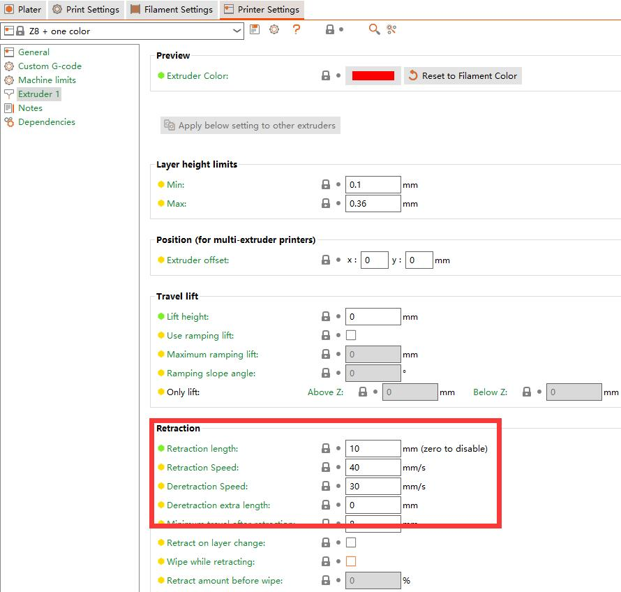
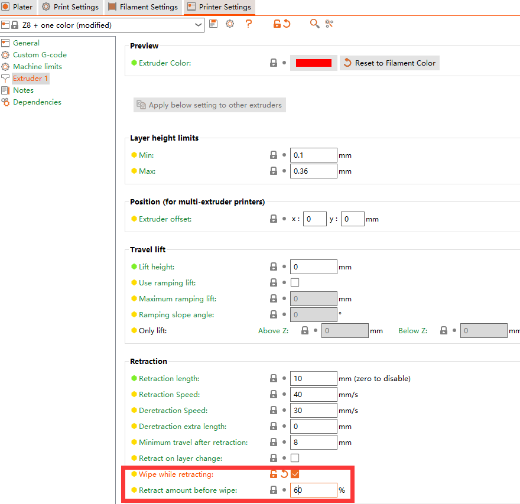

## How to solve the stringing issue of M4V6
**Stringing issue**(:link:[wiki page](https://www.matterhackers.com/articles/3d-printer-troubleshooting-guide#Issue9)) is a common issue , especially for a FDM 3D printers that use **bowden type extruder** ([:link:wiki page](https://en.wikipedia.org/wiki/3D_printer_extruder)).     
**Retraction** is an effective way to improve the string issues of FDM 3D printers. **Retraction** refers to when the printer move from one position to another position without extrusion, the extruder pulls the filament back, which can form a negative pressure inside the hot end, suck the filament inside the hot end to reduce the filament outflow from the nozzle.     
Due to the presence of a **mixing room**, the mixing color hot end is theoretically more prone to producing string issues than a one color hot end. By optimizing the design of thermal fracture, the M4V6 hot end effectively reduces the thermal creep effect of the filament to ensure the effectiveness of retraction. This makes M4V6 very effective in solving the common problem of string issues in mixing color hot end. Our tests have shown that, with reasonable settings of retraction length and speed, the M4V6 can achieve almost the same printing quality as a one color hot end.

----
### Imporve slicing settings
  - **Adjusting nozzle temperature.**     
  Try adjusting the temperature of the nozzle, usually testing every 5 degrees with a range of +-15 degrees. For example, if you are using PLA filament (usually standard temperature at 195 degrees), you can print a test model using temperatures of 180, 185, 190, 195, 200, 205, and 210 respectively, and then see at which temperature you can get the best printing quality.      
  :pushpin: Usually, modifying the nozzle temperature can not produce an effect immediately, so it is recommended to print a complete testing model with one of the temperatures each time. After completion, compare the quality of the printed models at different temperatures and make a choice.
  - **Check the retraction settings on slicing software.**
  Recommand retraction settings:
    - **Retraction length:** 8 ~ 12 mm
    - **Retraction speed:** 30 ~ 40 mm/s 
    - **Deretraction speed:** 25 ~ 30 mm/s 
    - **Deretraction length:** -0.2 ~ 0 mm 
  
  - **Enable nozzle wipe feature in slicing software.**      
    

----
### Hardware issue
Some hardware reasons may also cause string issues, please refer to the instructions below to check.
- **:beetle: Reason: The inner PTFE tubes are not inserted deep enough.**  
- **:wrench: Solution:** 
  - Step 1: Heating the hot end.  ***MENU: Prepare>>Temperature>>Nozzle temp.: 200***
  - Step 2: Manually push the ***inner PTFE tubes*** into the bottom of the hot end.
  ----
- **:beetle: Reason: Impurities that cannot be melted have entered the hot end.**       
  If impurities enter the hot end, it may cause slight block the hot end, which can also lead to a strings issue. It usually manifests as the filament flowing out of the nozzle not flowing vertically downwards, but curling upwards after flowing out of the nozzle.     
       
- **:wrench: Solution:** Clean the hot end and replace a new nozzle. 
  - Step 1: Heating the hot end. ***menu: Prepare>>Filament>>Preheat Nozzle: 230***
  - Step 2: Remove the nozzle.
  - Step 3: Extrude some filament. (***Prepare>>Filament>>Extruder: All, Prepare>>Filament>>Slowly length: 100, Prepare>>Filament>>Slowly Load***), 
  - Step 4: Replace a new nozzle.
  ----
- **:beetle: Reason: Inner PTFE tubes is deteriorated.**     
  If there is a clogged problem in the inner PTFE tube (such as inner diameter be thinner), it will reduce the retration effectiveness, which can also lead to string issue. 
- **:wrench: Solution: replace the deteriorated inner PTFE tube.**     
  Firstly, try to use another channel of the hot end to print the test file and check if the problem can be fixed / improved. If yes, please replace the PTFE tube (refer to [this guide](./ReplaceM4V6InnerPTFE.md)).

