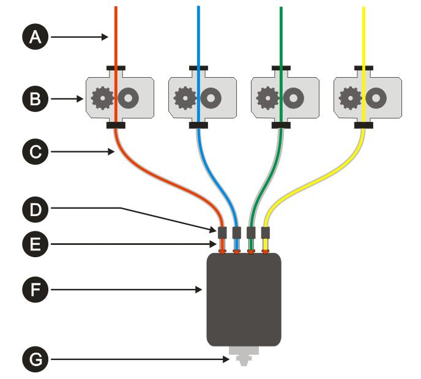
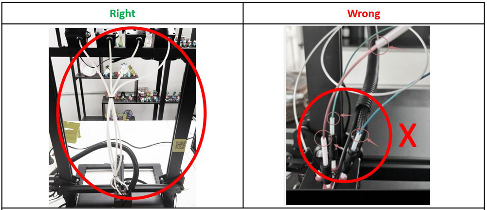
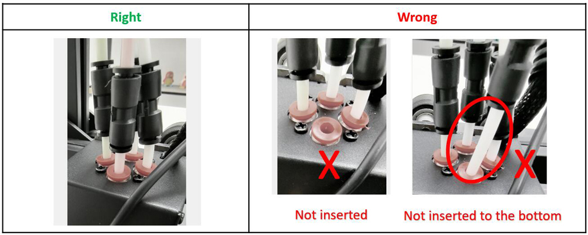
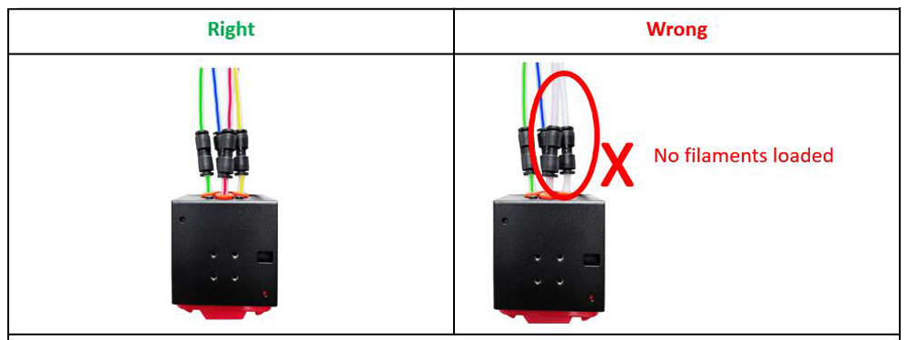

## Choose language

-----
###### English
# Precautions for using M4V6 [:arrow_heading_up:](#choose-language)
## Cautions :bangbang: 
The M4V6 belongs to a ***Bowden extruder***. ***Bowden extruder*** refers to an extruder structure that separates **extruder** (filament feeder device) and the **"hot end"** (filament melting device). This structure can effectively reduce the weight of the print head, which is commonly used in multi-color 3D printers.  
     

    A. Filament           B. Extruder (filament feeder)       C. Feeding pipe   D. PTFE tube connector
    E. Inner PTFE tube    F. M4V6 Hotend                      G. Nozzle

### :warning: Must connect the extruders with M4V6 hotend by using a pipes.
Must use pipes to connect the extruder to the connectors on the M4V6 hot end, so that the filaments can be pushed into the hot end.
The pipes require the use of harder materials and the interior should be very smooth. Currently, **PTFE tube** are commonly used. Don't use rubber or PVC tubes.

### :warning: DON'T pull the "inner PTFE tubes" out of the M4V6 hotend.
The M4V6 hot end uses four white PTFE tubes inserted into the heating block of the hot end, which are called **"inner PTFE tubes"**, so that the filaments can be guided into the heating block for melting.
1. Do not pull **"inner PTFE tubes"** out of the M4V6 hotend , otherwise fine threads will enter the hot isolator and block the hot end.
2. Ensure that the **"inner PTFE tubes"** have been inserted into the bottom of the hot end, otherwise it may cause **hot end blocked issue** (much filament entering the heat insulation will block the hot end) or **"strings issue"** (a few filament melted in the heat insulation will reduce the effectiveness of the retraction).
3. It is not recommended to use colored PTFE pipes as **"inner PTFE tube"** because their temperature resistance performance is poor.    
##### :pushpin: If you would like to have a better understanding of the M4V6 hotend, please refer to the following image:
- [:art: Structure of M4V6 Hotend assembly](2.jpg)  
- [:art: Structure of M4V6 Hotend](1.jpg)

### :warning: Must load 4 filaments onto the M4V6 hotend simultaneously.

-----
###### Spanish
# Precauciones para usar M4V6 [:arrow_heading_up:](#choose-language)
## Precauciones :bangbang: 
El hot end M4V6 pertenece a una ***extrusora Bowden***. ***Extrusora Bowden*** se refiere a una estructura de extrusora que separa la **extrusora** (dispositivo alimentador de filamentos) y el **"extremo caliente"** (dispositivo de fusión de filamentos). Esta estructura puede reducir efectivamente el peso del cabezal de impresión, que se usa comúnmente en impresoras 3D multicolores.
     

    A. Filamento                B. Extrusor (alimentador de filamento)  C. Tubo de alimentación     D. Conector del tubo de PTFE
    E. Tubo interior de PTFE    F. Hotend M4V6                          G. Boquilla

### :warning: Debe conectar los extrusores con el hotend M4V6 mediante tuberías.
Debe utilizar tuberías para conectar el extrusor a los conectores del extremo caliente M4V6, de modo que los filamentos puedan introducirse en el extremo caliente.
Las tuberías requieren el uso de materiales más duros y el interior debe ser muy liso. Actualmente, se utilizan comúnmente **tubos de PTFE**. No utilice tubos de goma o PVC.

### :warning: NO saque los "tubos internos de PTFE" del hotend M4V6.
El hot end M4V6 utiliza 4 tubos de PTFE blancos insertados en el bloque calefactor del hot end, que se denominan **"tubos internos de PTFE"**, para que los filamentos puedan guiarse hacia el bloque calefactor para fundirse.
1. No extraiga **"tubos internos de PTFE"** del hotend M4V6, de lo contrario, hilos finos entrarán en el aislador caliente y bloquearán el extremo caliente.
2. Asegúrese de que los **"tubos internos de PTFE"** se hayan insertado en la parte inferior del extremo caliente; de lo contrario, puede causar un **problema de bloqueo del extremo caliente** (mucho filamento que ingresa al aislamiento térmico bloqueará el extremo caliente). o **"problema de cuerdas"** (unos pocos filamentos derretidos en el aislamiento térmico reducirán la eficacia de la retracción).
3. No se recomienda utilizar tuberías de PTFE de colores como **"tubo interior de PTFE"** porque su rendimiento de resistencia a la temperatura es deficiente.
##### :pushpin: Si desea comprender mejor el hotend M4V6, consulte la siguiente imagen:
- [:art: Estructura del conjunto Hotend M4V6](2.jpg)  
- [:art: Estructura del hotend M4V6](1.jpg)

### :warning: Debe cargar 4 filamentos en el hotend M4V6 simultáneamente.

-----
###### Portuguese
# Precauções para usar M4V6 [:arrow_heading_up:](#choose-language)
## Cuidados :bangbang: 
A M4V6 pertence a uma ***extrusora Bowden***. ***Extrusora Bowden*** refere-se a uma estrutura de extrusora que separa a **extrusora** (dispositivo alimentador de filamento) e a **"extremidade quente"** (dispositivo de fusão de filamento). Essa estrutura pode efetivamente reduzir o peso da cabeça de impressão, que é comumente usada em impressoras 3D multicoloridas.
     

        A. Filamento            B. Extrusora (alimentador de filamento) C. Tubo de alimentação D. Conector do tubo PTFE
        E. Tubo interno de PTFE F. M4V6 Hotend                          G. Bico

### :warning: Deve-se conectar as extrusoras ao hotend M4V6 usando tubos.
Deve-se usar tubos para conectar a extrusora aos conectores no hot end M4V6, para que os filamentos possam ser empurrados para dentro do hot end.
Os tubos requerem a utilização de materiais mais duros e o interior deve ser muito liso. Atualmente, **tubos de PTFE** são comumente usados. Não use tubos de borracha ou PVC.

### :warning: NÃO puxe os “tubos internos de PTFE” do hotend M4V6.
O hot end M4V6 usa quatro tubos de PTFE brancos inseridos no bloco de aquecimento do hot end, que são chamados de **"tubos internos de PTFE"**, para que os filamentos possam ser guiados para dentro do bloco de aquecimento para fusão.
1. Não puxe **"tubos internos de PTFE"** para fora do hotend M4V6, caso contrário, fios finos entrarão no isolador quente e bloquearão o hotend.
2. Certifique-se de que os **"tubos internos de PTFE"** foram inseridos na parte inferior da extremidade quente, caso contrário, isso pode causar **problema de bloqueio da extremidade quente** (muito filamento entrando no isolamento térmico bloqueará a extremidade quente) ou **"problema de cordas"** (alguns filamentos derretidos no isolamento térmico reduzirão a eficácia da retração).
3. Não é recomendado usar tubos de PTFE coloridos como **"tubo de PTFE interno"** porque seu desempenho de resistência à temperatura é baixo.  
##### :pushpin: Se você quiser entender melhor o hotend M4V6, consulte a imagem a seguir:
- [:art: Estrutura da montagem do Hotend M4V6](2.jpg)  
- [:art: Estrutura do Hotend M4V6](1.jpg)

### :warning: Deve carregar 4 filamentos no hotend M4V6 simultaneamente.

-----
###### French
# Précautions d'utilisation de M4V6 [:arrow_heading_up:](#choose-language)
## Précautions :bangbang: 
Le M4V6 appartient à une ***extrudeuse Bowden***. ***L'extrudeuse Bowden*** fait référence à une structure d'extrudeuse qui sépare l'**extrudeuse** (dispositif d'alimentation en filament) et la **« extrémité chaude »** (dispositif de fusion de filament). Cette structure peut réduire efficacement le poids de la tête d'impression, couramment utilisée dans les imprimantes 3D multicolores.
     

     A. Filament    B. Extrudeuse (alimentateur de filament)    C. Tuyau d'alimentation     D. Connecteur de tube PTFE
     E. Tube intérieur en PTFE F. M4V6 Hotend   G. Buse

### :warning: Doit connecter les extrudeuses au hotend M4V6 à l'aide de tuyaux.
Il faut utiliser des tuyaux pour connecter l'extrudeuse aux connecteurs de l'extrémité chaude du M4V6, afin que les filaments puissent être poussés dans l'extrémité chaude.
Les tuyaux nécessitent l’utilisation de matériaux plus durs et l’intérieur doit être très lisse. Actuellement, les **tubes PTFE** sont couramment utilisés. N'utilisez pas de tubes en caoutchouc ou en PVC.

### :warning: NE retirez PAS les "tubes internes en PTFE" du hotend M4V6.
Le hot end M4V6 utilise quatre tubes PTFE blancs insérés dans le bloc chauffant du hot end, appelés **"tubes PTFE internes"**, afin que les filaments puissent être guidés dans le bloc chauffant pour fondre.
1. Ne retirez pas les **"tubes internes en PTFE"** du hotend M4V6, sinon des fils fins entreront dans l'isolateur chaud et bloqueront l'extrémité chaude.
2. Assurez-vous que les **"tubes internes en PTFE"** ont été insérés dans le bas de l'extrémité chaude, sinon cela pourrait provoquer un **problème de blocage de l'extrémité chaude** (une grande partie du filament entrant dans l'isolation thermique bloquera l'extrémité chaude). ou **"problème de cordes"** (quelques filaments fondus dans l'isolation thermique réduiront l'efficacité de la rétraction).
3. Il n'est pas recommandé d'utiliser des tuyaux en PTFE colorés comme ** « tube intérieur en PTFE » ** car leurs performances de résistance à la température sont médiocres. 
##### :pushpin: Si vous souhaitez mieux comprendre le hotend M4V6, veuillez vous référer à l'image suivante :
- [:art: Structure de l'assemblage M4V6 Hotend](2.jpg)  
- [:art: Structure du M4V6 Hotend](1.jpg)

### :warning: Doit charger 4 filaments simultanément sur le hotend M4V6.

-----
###### German
# Vorsichtsmaßnahmen für die Verwendung von M4V6 [:arrow_heading_up:](#choose-language)
## Vorsichtsmaßnahmen :bangbang:
Der M4V6 gehört zu einem ***Bowden-Extruder***. ***Bowden-Extruder*** bezieht sich auf eine Extruderstruktur, die den **Extruder** (Filamentzuführgerät) und das **„heiße Ende“** (Filamentschmelzgerät) trennt. Durch diese Struktur kann das Gewicht des Druckkopfs, der häufig in Mehrfarben-3D-Druckern verwendet wird, effektiv reduziert werden.
     

    A. Filament              B. Extruder (Filamentzuführung)    C. Zufuhrrohr   D. PTFE-Schlauchverbinder
    E. Innerer PTFE-Schlauch F. M4V6 Hotend                     G. Düse

### :warning: Die Extruder müssen über Rohre mit dem M4V6-Hotend verbunden werden.
Es müssen Rohre verwendet werden, um den Extruder mit den Anschlüssen am M4V6-Hot-End zu verbinden, damit die Filamente in das Hot-End gedrückt werden können.
Die Rohre erfordern den Einsatz härterer Materialien und die Innenseite sollte sehr glatt sein. Derzeit werden häufig **PTFE-Schläuche** verwendet. Verwenden Sie keine Gummi- oder PVC-Schläuche.

### :warning: Ziehen Sie NICHT die „inneren PTFE-Schläuche“ aus dem M4V6-Hotend heraus.
Das M4V6-Hot-End verwendet vier weiße PTFE-Röhren, die in den Heizblock des Hot-Ends eingeführt werden und als „innere PTFE-Röhren“ bezeichnet werden, damit die Filamente zum Schmelzen in den Heizblock geführt werden können.
1. Ziehen Sie die **„inneren PTFE-Schläuche“** nicht aus dem M4V6-Hotend heraus, da sonst feine Gewinde in den heißen Isolator gelangen und das heiße Ende blockieren.
2. Stellen Sie sicher, dass die **„inneren PTFE-Schläuche“** in die Unterseite des heißen Endes eingeführt wurden, andernfalls kann es zu einem **Problem mit blockiertem heißen Ende** kommen (viel Filament, das in die Wärmeisolierung eindringt, blockiert das heiße Ende). oder **„Problem mit den Saiten“** (einige in der Wärmeisolierung geschmolzene Filamente verringern die Wirksamkeit des Rückzugs).
3. Es wird nicht empfohlen, farbige PTFE-Rohre als **„inneres PTFE-Rohr“** zu verwenden, da ihre Temperaturbeständigkeit schlecht ist. 
##### :pushpin: Wenn Sie das M4V6-Hotend besser verstehen möchten, sehen Sie sich bitte das folgende Bild an:
- [:art: Struktur der M4V6 Hotend-Baugruppe](2.jpg)  
- [:art: Struktur des M4V6 Hotends](1.jpg)

### :warning: Es müssen 4 Filamente gleichzeitig auf das M4V6-Hotend geladen werden.

-----
###### Italian
# Precauzioni per l'utilizzo di M4V6 [:arrow_heading_up:](#choose-language)
## Avvertenze :bangbang:
L'M4V6 appartiene ad un ***estrusore Bowden***. ***Estrusore Bowden*** si riferisce a una struttura dell'estrusore che separa l'**estrusore** (dispositivo di alimentazione del filamento) e l'**"hot end"** (dispositivo di fusione del filamento). Questa struttura può ridurre efficacemente il peso della testina di stampa, comunemente utilizzata nelle stampanti 3D multicolori.    
     

        A. Filamento    B. Estrusore (alimentatore di filamento)    C. Tubo di alimentazione    D. Connettore del tubo in PTFE
        E. Tubo interno in PTFE     F. Hotend M4V6  G. Ugello

### :warning: È necessario collegare gli estrusori all'hotend M4V6 utilizzando un tubo.
È necessario utilizzare tubi per collegare l'estrusore ai connettori sull'hot end M4V6, in modo che i filamenti possano essere spinti nell'hot end.
I tubi richiedono l'uso di materiali più duri e l'interno deve essere molto liscio. Attualmente vengono comunemente utilizzati i **tubi in PTFE**. Non utilizzare tubi in gomma o PVC.      

### :warning: NON estrarre i "tubi interni in PTFE" dall'hotend M4V6.
L'hotend M4V6 utilizza quattro tubi in PTFE bianchi inseriti nel blocco riscaldante dell'hotend, chiamati **"tubi interni in PTFE"**, in modo che i filamenti possano essere guidati nel blocco riscaldante per la fusione.
1. Non estrarre i **"tubi interni in PTFE"** dall'hotend M4V6, altrimenti fili sottili entreranno nell'isolatore caldo e bloccheranno l'hotend.
2. Assicurarsi che i **"tubi interni in PTFE"** siano stati inseriti nella parte inferiore dell'hot end, altrimenti potrebbe verificarsi un **problema di blocco dell'hot end** (molto filamento che entra nell'isolamento termico bloccherà l'hot end) o **"problema delle corde"** (alcuni filamenti fusi nell'isolamento termico ridurranno l'efficacia della retrazione).
3. Non è consigliabile utilizzare tubi in PTFE colorati come **"tubo interno in PTFE"** perché le loro prestazioni di resistenza alla temperatura sono scarse.     
##### :pushpin: Se desideri comprendere meglio l'hotend M4V6, fai riferimento alla seguente immagine:
- [:art: Struttura dell'assemblaggio Hotend M4V6](2.jpg)  
- [:art: Struttura dell'hotend M4V6](1.jpg)

### :warning: È necessario caricare 4 filamenti sull'hotend M4V6 contemporaneamente.

-----
###### Japanese
# M4V6使用上の注意 [:arrow_heading_up:](#choose-language)
## 注意事項 :bangbang:
M4V6 は ***Bowden 押出機*** に属します。 ***ボーデン押出機*** は、**押出機** (フィラメント供給装置) と **「ホットエンド」** (フィラメント溶融装置) を分離する押出機の構造を指します。 この構造により、多色 3D プリンタで一般的に使用されるプリントヘッドの重量を効果的に軽減できます。    
     

        A. フィラメント             B. エクストルーダー (フィラメントフィーダー)    C. 供給パイプ      D. PTFE チューブコネクター
        E. インナー PTFE チューブ   F. M4V6 ホットエンド                         G. ノズル

### :warning: パイプを使用して押出機と M4V6 ホットエンドを接続する必要があります。
フィラメントをホットエンドに押し込めるように、パイプを使用して押出機を M4V6 ホットエンドのコネクタに接続する必要があります。
パイプにはより硬い材料を使用する必要があり、内部は非常に滑らかでなければなりません。 現在、**PTFE チューブ** が一般的に使用されています。 ゴムチューブやPVCチューブは使用しないでください。     

### :warning: M4V6 ホットエンドから「内側 PTFE チューブ」を引き抜かないでください。
M4V6 ホットエンドは、**「インナー PTFE チューブ」** と呼ばれる、ホットエンドの加熱ブロックに挿入された 4 本の白色 PTFE チューブを使用しており、フィラメントを加熱ブロックに誘導して溶融させることができます。
1. **「内側 PTFE チューブ」** を M4V6 ホットエンドから引き抜かないでください。そうしないと、細い糸がホットアイソレーターに入り、ホットエンドをブロックします。
2. **「内側 PTFE チューブ」** がホットエンドの底部に挿入されていることを確認してください。挿入されていないと、**ホットエンドのブロック問題** が発生する可能性があります (断熱材に多くのフィラメントが入り込むとホットエンドがブロックされます)。 または **「ストリングの問題」** (断熱材内で溶けたフィラメントが数本あると、収縮効果が低下します)。
3. カラー PTFE パイプを **「インナー PTFE チューブ」** として使用することは、耐熱性能が劣るため推奨されません。
##### :pushpin: M4V6 ホットエンドについてさらに詳しく知りたい場合は、次の画像を参照してください。
- [:art: M4V6ホットエンドアセンブリの構造](2.jpg)  
- [:art: M4V6ホットエンドの構造](1.jpg)

### :warning: 4 つのフィラメントを M4V6 ホットエンドに同時にロードする必要があります。

-----
###### Korea
# M4V6 사용 시 주의사항 [:arrow_heading_up:](#choose-language)
## 주의사항 :bangbang:
M4V6은 ***Bowden 압출기***에 속합니다. ***보우덴 압출기***는 **압출기**(필라멘트 공급 장치)와 **"핫 엔드"**(필라멘트 용해 장치)를 분리한 압출기 구조를 말합니다. 이러한 구조는 멀티 컬러 3D 프린터에 일반적으로 사용되는 프린트 헤드의 무게를 효과적으로 줄일 수 있습니다.
     

        A. 필라멘트         B. 압출기(필라멘트 공급 장치)    C. 공급 파이프     D. PTFE 튜브 커넥터
        E. 내부 PTFE 튜브   F. M4V6 핫엔드                  G. 노즐

### :warning: 파이프를 사용하여 압출기를 M4V6 핫엔드와 연결해야 합니다.
필라멘트를 핫 엔드로 밀어 넣을 수 있도록 파이프를 사용하여 압출기를 M4V6 핫 엔드의 커넥터에 연결해야 합니다.
파이프는 더 단단한 재료를 사용해야 하며 내부는 매우 매끄러워야 합니다. 현재는 **PTFE 튜브**가 많이 사용됩니다. 고무나 PVC 튜브를 사용하지 마세요.

### :warning: M4V6 핫엔드에서 "내부 PTFE 튜브"를 당기지 마십시오.
M4V6 핫 엔드는 핫 엔드의 가열 블록에 삽입된 4개의 흰색 PTFE 튜브(**"내부 PTFE 튜브"**라고 함)를 사용하여 필라멘트가 용융을 위해 가열 블록으로 안내될 수 있습니다.
1. M4V6 핫엔드에서 **"내부 PTFE 튜브"**를 당기지 마십시오. 그렇지 않으면 미세한 나사산이 핫 아이솔레이터로 들어가 핫 엔드를 차단합니다.
2. **"내부 PTFE 튜브"**가 핫 엔드 바닥에 삽입되었는지 확인하십시오. 그렇지 않으면 **핫 엔드 막힘 문제**가 발생할 수 있습니다(단열재에 들어가는 많은 필라멘트가 핫 엔드를 차단함). 또는 **"끈 문제"**(단열재에 몇 개의 필라멘트가 녹아 수축 효과가 감소합니다).
3. 유색 PTFE 파이프를 **"내부 PTFE 튜브"**로 사용하는 것은 온도 저항 성능이 낮기 때문에 권장하지 않습니다. 
##### :pushpin: M4V6 핫엔드에 대해 더 잘 이해하고 싶다면 다음 이미지를 참조하세요.
- [:art: M4V6 핫엔드 어셈블리의 구조](2.jpg)  
- [:art: M4V6 핫엔드의 구조](1.jpg)

### :warning: M4V6 핫엔드에 4개의 필라멘트를 동시에 로드해야 합니다.

-----
###### Russian
# Меры предосторожности при использовании M4V6 [:arrow_heading_up:](#choose-language)
## Предостережения :bangbang:
M4V6 принадлежит ***экструдеру Боудена***. ***Экструдером Боудена*** называется конструкция экструдера, в которой разделены **экструдер** (устройство подачи нити) и **"горячий конец"** (устройство плавления нити). Эта структура может эффективно снизить вес печатающей головки, которая обычно используется в многоцветных 3D-принтерах.
     

        A. Нить                        B. Экструдер (податчик нити) C. Подающая труба D. Соединитель трубки из ПТФЭ
        E. Внутренняя трубка из ПТФЭ   F. M4V6 Hotend               G. Сопло

### :warning: Необходимо соединить экструдеры с хотэндом M4V6 с помощью труб.
Необходимо использовать трубы для подключения экструдера к разъемам на хотэнде M4V6, чтобы нити можно было протолкнуть в хотэнд.
Трубы требуют использования более твердых материалов, а внутренняя поверхность должна быть очень гладкой. В настоящее время широко используются **трубки из ПТФЭ**. Не используйте резиновые или ПВХ трубки.

### :warning: НЕ вытягивайте «внутренние трубки из ПТФЭ» из хотэнда M4V6.
В хотэнде M4V6 используются четыре белые трубки из ПТФЭ, вставленные в нагревательный блок горячего конца, которые называются **"внутренними трубками из ПТФЭ"**, так что нити можно направить в нагревательный блок для плавления.
1. Не вытягивайте **"внутренние трубки из ПТФЭ"** из горячего конца M4V6, иначе тонкая резьба попадет в горячий изолятор и заблокирует горячий конец.
2. Убедитесь, что **"внутренние трубки из ПТФЭ"** вставлены в нижнюю часть горячего конца, в противном случае это может вызвать **проблему с блокировкой горячего конца** (большая часть нити, попадающая в теплоизоляцию, заблокирует горячий конец) или **"проблема со струнами"** (несколько нитей, расплавившихся в теплоизоляции, снизят эффективность втягивания).
3. Не рекомендуется использовать цветные трубы из ПТФЭ в качестве **"внутренней трубки из ПТФЭ"**, поскольку их термостойкость низкая.  
##### :pushpin: Если вы хотите лучше понять хотэнд M4V6, обратитесь к следующему изображению:
- [:art: Структура узла Hotend M4V6](2.jpg)  
- [:art: Структура хотенда M4V6](1.jpg)

### :warning: Необходимо одновременно загрузить 4 нити на хотэнд M4V6.

-----
###### Arabic
# احتياطات استخدام M4V6 [:arrow_heading_up:](#choose-language)
## يحذر :bangbang:
ينتمي M4V6 إلى ***Bowden extruder***. ***يشير جهاز بثق Bowden*** إلى بنية الطارد التي تفصل **الطارد** (جهاز تغذية الفتيل) و**"الطرف الساخن"** (جهاز ذوبان الفتيل). هذا الهيكل يمكن أن يقلل بشكل فعال من وزن رأس الطباعة، والذي يستخدم بشكل شائع في الطابعات ثلاثية الأبعاد متعددة الألوان. 
     

        A- خيوط    
        B- الطارد (مغذي الخيوط)
        C- أنبوب التغذية
        D- موصل أنبوب PTFE
        E- أنبوب PTFE الداخلي
        F- M4V6 هوتيند
        G- فوهة

### :warning: يجب توصيل الطاردات مع M4V6 hotend باستخدام الأنابيب.
يجب استخدام الأنابيب لتوصيل الطارد بالموصلات الموجودة على الطرف الساخن M4V6، بحيث يمكن دفع الخيوط إلى الطرف الساخن.
تتطلب الأنابيب استخدام مواد أكثر صلابة ويجب أن يكون الجزء الداخلي سلسًا للغاية. حاليًا، **أنبوب PTFE** شائع الاستخدام. لا تستخدم الأنابيب المطاطية أو البلاستيكية.

### :warning: لا تسحب "أنابيب PTFE الداخلية" من نقطة التوصيل الساخنة M4V6.
يستخدم الطرف الساخن M4V6 أربعة أنابيب PTFE بيضاء يتم إدخالها في كتلة التسخين للطرف الساخن، والتي تسمى **"أنابيب PTFE الداخلية"**، بحيث يمكن توجيه الشعيرات إلى كتلة التسخين من أجل الذوبان.
1. لا تسحب **"أنابيب PTFE الداخلية"** من الطرف الساخن M4V6، وإلا ستدخل الخيوط الدقيقة إلى العازل الساخن وتسد الطرف الساخن.
2. تأكد من إدخال **"أنابيب PTFE الداخلية"** في الجزء السفلي من الطرف الساخن، وإلا فقد يتسبب ذلك في **مشكلة انسداد الطرف الساخن** (سيؤدي دخول الكثير من الفتيل إلى العزل الحراري إلى سد الطرف الساخن) أو **"مشكلة في الخيوط"** (القليل من الخيوط المنصهرة في العزل الحراري ستقلل من فعالية التراجع).
3. لا ينصح باستخدام أنابيب PTFE الملونة مثل **"أنبوب PTFE الداخلي"** لأن أداء مقاومتها للحرارة ضعيف.  
##### :pushpin: إذا كنت ترغب في الحصول على فهم أفضل لـ M4V6 hotend، فيرجى الرجوع إلى الصورة التالية:
- [:art: هيكل مجموعة M4V6 Hotend](2.jpg)  
- [:art: هيكل M4V6 Hotend](1.jpg)

### :warning: يجب تحميل 4 خيوط على M4V6 hotend في وقت واحد.

