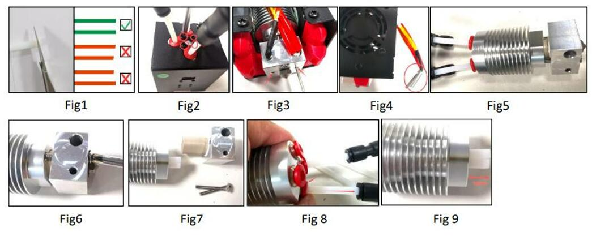

## How to replace the inner PTFE tubes of the M4V6 hotend
#### **[:clapper:Video tutorial](https://youtu.be/4DvrlT7PzZo)**
#### Operation steps
- Prepare 4 piece PTFE tube (ID=2mm/OD=4mm), length is about 100mm (Fig 1). To cut the PTFE pipe by a knife (paper cutter) and try to keep the front end flat.
- Remove the screws which to fix the hot end on the top of the hot end housing (Fig 2).
- Loosen the screws which to fix the heater and temperature sensor (Fig 3).
- Remove the heater and temperature sensor from the hot end (Fig 4).
- Remove the hot end from the housing (Fig 5).
- Remove the 2 screws to fix the heating block (Fig 6).
- Pull out the heating block (Fig 7).
- Press the “RED ring” of the fitting and pull out the PTFE tube (Fig 8).
- Insert the new PTFE tube and install the heating block back in reverse order.
- Push the PTFE guide to the bottom after installed the heating block.
