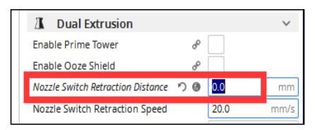
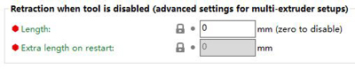

## How to clean the clogged M4V6 hot end
#### **[:clapper: Video tutorial](https://github.com/ZONESTAR3D/Z8P/assets/29502731/72312727-5ce5-4a35-8f2a-49f9145557ac).**
- **Step 1: Heating the nozzle to 260 degree.**       
  *Prepare>>Filament>>Preheat nozzle: 260*, wait the nozzle reached 260 degree.
- **Step 2: Load all 4 filaments to the hot end.**    
- **Step 3: Extruder 4 filaments simultaneously, until you can see the filament is flowed out from the nozzle.**     
    *Prepare>>Filament>>extruder: all*      
    *Prepare>>Filament>>slowly load*, you may need to do a few times, until all 4 filaments have flowed out from the nozzle.
- **Step 4: Extrude 4 filaments one by one**     
    *Prepare>>Filament>>extruder: 1*     
    *Prepare>>Filament>>extruder: slowly load*, until you see the filament of extruder #1 is flowing out from the nozzle.     
    *Prepare>>Filament>>extruder: 2*    
    *Prepare>>Filament>>extruder: slowly load*, until you see the filament of extruder #2 is flowing out from the nozzle.    
    *Prepare>>Filament>>extruder: 3*    
    *Prepare>>Filament>>extruder: slowly load*, until you see the filament of extruder #3 is flowing out from the nozzle.    
    *Prepare>>Filament>>extruder: 4*     
    *Prepare>>Filament>>extruder: slowly load*, until you see the filament of extruder #3 is flowing out from the nozzle.     
#### :pushpin: If the hot end cannot be cleaned by doing the above steps, or the hot end is still easily clogged after cleaning, please do remove the nozzle and do once above steps to clean the hotend again, and then install a new nozzle. About how to replace a nozzle, please watch this **[:clapper: video tutorial](https://youtu.be/L5VRyEbsJvM).**
#### :pushpin: If the filaments cannot be inserted into the "inner PTFE tubes" at the M4V6 hot end, please refer to this guide ([:book: How to replace the inner PTFE tubes](./ReplaceM4V6InnerPTFE.md)) to replace the blocked inner PTFE tubes.

-----
### Why the hotend is clogged?
There are some reasons that may cause the hotend to be blocked, please check the list one by one to ensure that you have noticed these matters.
#### Failure to load fillments as required before printing
:pushpin: When loading the filament to the hotend, please ensure that the filaments enter the bottom of the hot end.    
:pushpin: You need to load all the 4 filaments to the hot end whether printing one or multi color 3d prints.    
For how to load filaments, please refer to [:book: this guide](https://github.com/ZONESTAR3D/Z8P/blob/main/Z8P-MK2/2-Operation_Guide/readme.md#load-filaments) or the [:clapper: video tutorial](https://youtu.be/-47yB95uIxI).
#### Nozzle is defective
The nozzle may also be partially clogged. If you find the filament flowed out from the nozzle is thinner than normal, the nozzle may be partially clogged, please replace a new nozzle directly.  
#### The nozzle are too close to the print platform when printing the first layer.
If the nozzle is too close to the hot bed when printing the first layer, the filament may not be ejected. If this is maintained for a long time, it may cause the filament in the hot end to be over-compressed and cause blockage (often blocked at the entrance of hotend). When printing the first layer, pay attention to the distance between the nozzle and the hot bed. If necessary, open the "BabyStep" menu to adjust the nozzle height.
#### Incorrect "Switch Retraction Distance" settings when slicing
For 4-IN-1-OUT mix color hotend, the **"Extruder switching retraction length"** MUST be set to 0. For example, set **“Nozzle Switch Retraction Distance”** to 0 in Cura Slicer and set **"Retraction when tool is disable"** in PrusaSlicer.  
 

-----
### :e-mail: If you can't find a solution to solve your problem after readed the FAQ , please contact our technical support team : support@zonestar3d.com .
