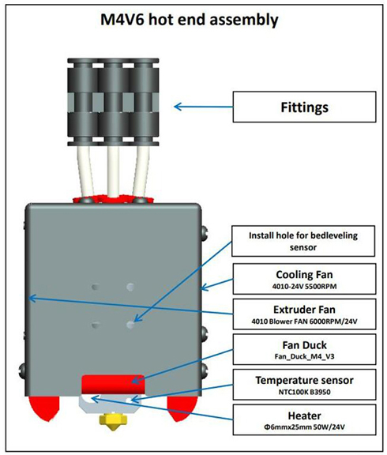
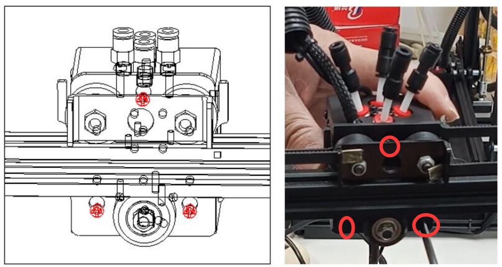

[M4V6_CAUTION]: https://github.com/ZONESTAR3D/Upgrade-kit-guide/blob/main/HOTEND/M4/M4_V6/M4V6_Precaution.md
[MIXING_COLOE]: https://github.com/ZONESTAR3D/Document-and-User-Guide/tree/master/Mixing_Color
[SLICING_0]: https://github.com/ZONESTAR3D/Slicing-Guide
[SLICING_1]: https://github.com/ZONESTAR3D/Slicing-Guide/tree/master/PrusaSlicer
[SLICING_2]: https://github.com/ZONESTAR3D/Slicing-Guide/tree/master/PrusaSlicer#4-slicing-one-color
[SLICING_M4]: https://github.com/ZONESTAR3D/Slicing-Guide/blob/master/PrusaSlicer/PrusaSlicerGuide_M4.md
[FAQ_M4E4]: https://github.com/ZONESTAR3D/Upgrade-kit-guide/blob/main/HOTEND/FAQ_M4E4.md

----
## <a id="choose-language">:globe_with_meridians: Choose language </a>

<!--  -->

----
## :book: Guide de l'utilisateur du M4V6 Hotend
L'extrémité chaude de couleur mélangée ZONESTAR 4-IN-1-OUT a 4 canaux d'entrée et 1 buse, quatre filaments sont mélangés dans l'extrémité chaude puis extrudés à travers une buse, de sorte qu'il permet non seulement à l'imprimante d'imprimer la couleur originale des filaments, mais aussi permet également d'imprimer plus de couleurs en ajustant le rapport de mélange des filaments.

### Contenu
- **[Attention](#A0)**
- **[Principe de fonctionnement](#A1)**
- **[Spécifications](#A2)**
- **[Composants de M4V6](#A3)**
- **[Câblage](#A4)**
- **[Structure](#A5)**
- **[Dimensions](#A6)**
- **[Installation et câblage](#A7)**
- **[Charger/décharger les filaments](#A8)**
- **[Étapes pour imprimer à l'aide du hotend M4V6](#A9)**
- **[Guide de découpage](#A10)**
- **[Dépannage](#A11)**
- **[Annexe](#A12)**

## <a id="A0">:warning: ATTENTION S'IL VOUS PLAÎT</a>
### :loudspeaker: Avant d'utiliser le hot end M4V6, veuillez lire attentivement [:book: Précautions d'utilisation du M4V6][M4V6_CAUTION].
### :loudspeaker: Il faut charger 4 filaments simultanément sur le hotend M4V6, un fonctionnement incorrect peut bloquer le hotend de mélange de couleurs. Si le blocage de l'extrémité chaude est dû à un fonctionnement incorrect, il n'est pas couvert par la garantie.
### :loudspeaker: NE retirez PAS les "tubes internes en PTFE" de la hotend M4V6.
### :loudspeaker: Une fois que les filaments sont déjà entrés dans le hotend M4V6, N'utilisez PAS le menu "Quickly Load" pour charger les filaments.

### <a id="A1">Principe de fonctionnement</a>
**:warning: avant d'utiliser le M4V6, veuillez lire [:book: Introduction de l'extrudeuse de mélange de couleurs][MIXING_COLOE] pour comprendre les principes de fonctionnement de l'extrudeuse de mélange de couleurs.**
######

### <a id="A2">Spécifications</a>
| Article | Paramètres | Article | Paramètres |
|:-------------------------:|:---------------------------:|:--------------------------:|:------------------------------:|
| Tension nominale | DC24 V/60 W maximum | Diamètre de la buse | Par défaut 0,4 mm1 |
| Canal d'entrée | 4 | Modèle de buse | E3D V6 |
| Numéro de buses | 1 | Diamètre du filament | 1,75 mm |
| Chauffage | 24V/60W ⌀6x25mm | Capteur de température | Thermistance CTN 100K B3950 |
| Ventilateur de refroidissement | 4010/5000RPM/24V 0,15A | Ventilateur d'extrudeuse | 4010/5000RPM/24V 0,15A |
| Filaments de soutien | PLA/PLA+/PETG/ABS/ASA etc. Température de travail | 260 ℃ Maxime |
| Longueur du fil | 1 mètre | Dimensions extérieures | 50x60x75mm |
| Poids net | 220g | Poids brut | 350g |

### <a id="A3">Composants</a>
 

### <a id="A4">Borne de câblage</a>

:pushpin: L'extension du câble est facultative.

### <a id="A5">Structure</a>

### <a id="A6">Dimensions</a>

### <a id="A7">Installation et câblage</a>
La position de montage de l'extrémité chaude M4 est conforme à la « norme de montage de l'extrémité chaude ZONESTAR », qui peut être installée sur presque toutes les imprimantes 3D ZONESTAR, y compris les séries de produits P802, M8, D805S, Z8, Z9, Z10, etc.
####Installation
Retirez simplement les 3 vis derrière l'ensemble hotend et installez l'ensemble hotend M4 sur le support X de la machine.      

#### Câblage
##### :loudspeaker: ATTENTION
- **Veuillez faire attention à distinguer les bornes 3 et 4**, car la couleur de leurs bornes est la même, mais la couleur des fils est différente.
Si les fils 3 et 4 sont connectés à l'envers, vous pouvez voir que la température de la buse affichée sur l'écran LCD sera beaucoup plus élevée que la température ambiante après la mise sous tension de la machine.
- Lors du branchement du terminal, **veillez à ne pas pousser le terminal métallique hors du boîtier en plastique**.
##### :loudspeaker: **Veuillez noter**
- **Le ventilateur de refroidissement doit être allumé** (lorsque la température de la partie chaude est supérieure à 60°C), sinon la partie chaude pourrait être bloquée voire endommagée.
  - Par défaut, la **tension de fonctionnement** du ventilateur et du chauffage à l'extrémité chaude est de **DC 24 V**.
#### Veuillez suivre la définition des terminaux pour connecter le hotend à votre carte de contrôle.
- **Sans câble d'extension**

- **Avec câble d'extension**

#### Définir le type de hotend sur le MENU LCD: Contrôle>>Configurer>>Type de hotend: Mélange

### <a id="A8">Charger/Décharger les filaments</a>
#### :warning: ATTENTION S'IL VOUS PLAÎT ! Vous devez charger 4 filaments jusqu'à l'extrémité chaude même si vous imprimez un modèle 3D d'une seule couleur, NE laissez aucun canal vide avant l'impression.
#### :warning: ATTENTION S'IL VOUS PLAÎT ! Le menu « Chargement rapide » ne peut être utilisé que lors du chargement du filament de l'extrudeuse à l'extrémité chaude. Une fois le filament entré dans l'extrémité chaude, utilisez le menu « Chargement lent » mais pas « Chargement rapide ».
- **Charger le filament sur le hotend :**
###### 
   - Coupez l'avant du filament avec une pince diagonale avant de le charger dans l'extrudeur et le hot end.
   - Chargez 4 filaments sur toutes les extrudeuses un par un.
   - Faites tourner l'engrenage des extrudeuses pour charger les filaments un par un, ne faites pas tourner chaque extrudeuse plus de 2 tours à la fois, jusqu'à ce que tous les filaments entrent dans le tube PTFE intérieur de l'extrémité chaude, extrudez plus de 4 à 5 tours pour chaque extrudeuse et puis arrête.    
   :warning: n'alimentez pas de filaments vers la hotend lorsque l'un des canaux de la hotend est vide.    
   :warning: assurez-vous que les filaments de chaque canal atteignent le bas de l'extrémité chaude avant d'alimenter le filament.    
- **Décharger le filament du hotend :**
   - Chauffage de la buse (200℃ pour PLA / 230℃ pour PETG/ABS).
   - Alimentez simultanément le filament sur au moins 10 mm sur les 4 canaux.
   - Opérez sur le menu LCD ou faites tourner l'engrenage de l'extrudeuse pour décharger les filaments.

### <a id="A9">Étapes pour imprimer à l'aide du hotend M4V6</a>
#### Imprimer un modèle 3D en une seule couleur
- **Préparer le fichier gcode**. Pour découper le modèle 3D en utilisant les paramètres de l'imprimante 3D une couleur, veuillez vous référer à [**ici**][SLICING_2].
- **Charger les filaments**. Chargez **les 4 filaments** dans les extrudeuses, puis introduisez les filaments dans le bas de l'extrémité chaude du M4V6.
- **Imprimer depuis la carte SD**. Déplacez l'élément vers l'élément **Imprimer** sur l'écran LCD, cliquez sur le bouton et choisissez le fichier Gcode, cliquez sur le bouton pour lancer l'impression.
- **Régler finement la hauteur de la buse**. Attendez que la buse et le lit chauffant chauffent, et lorsque l'imprimante commence à imprimer la première couche, double-cliquez sur le bouton de l'écran LCD pour affiner la distance entre la buse et le lit, puis attendez la fin.
#### Imprimer un modèle 3D multicolore
- **Préparer le fichier gcode**. Pour découper le modèle 3D à l'aide des paramètres de l'imprimante 3D multicolore M4, veuillez vous référer à [**ici**][SLICING_M4].
- **Charger les filaments**. Chargez **les 4 filaments** dans les extrudeuses, puis introduisez les filaments dans le bas de l'extrémité chaude du M4V6.
- **Imprimer depuis la carte SD**. Déplacez l'élément vers l'élément **Imprimer** sur l'écran LCD, cliquez sur le bouton et choisissez le fichier Gcode, cliquez sur le bouton pour lancer l'impression.
- **Régler finement la hauteur de la buse**. Attendez que la buse et le lit chauffant chauffent, et lorsque l'imprimante commence à imprimer la première couche, double-cliquez sur le bouton de l'écran LCD pour affiner la distance entre la buse et le lit, puis attendez la fin.

### <a id="A10">Tranchage</a>
Nous vous recommandons d'utiliser PrusaSlicer pour trancher. Pour les didacticiels d'installation et d'utilisation, veuillez vous référer au lien suivant:
- **[Installer le logiciel Prusaslicer][SLICING_1]**
- **[Guide de découpage pour hotend M4][SLICING_M4]**
Pour plus de didacticiels sur l'utilisation d'autres logiciels de découpage, veuillez vous référer à [:book: this guide][SLICING_0].

### <a id="A11">Dépannage</a>
Si vous rencontrez des problèmes lors de l'utilisation du hot end M4V6, veuillez vous référer à [**:book: ce manuel de dépannage**](./M4V6_FAQ/readme.md) pour trouver d'abord une solution.

### <a id="A12">:paperclip : Annexe</a>
#### :book: Annexe I: [Obtenir une impression rapide à l'aide du hot end M4V6](./HighFlow/readme.md)
Lors de l'impression d'un modèle 3D monochrome, le M4V6 peut prendre en charge des débits plus élevés. Pour plus de détails, veuillez vous référer à [:book: this guide](./HighFlow/readme.md).

#### :book: Annexe II: [Comment basculer entre le hotend E4 et le hotend M4][FAQ_M4E4]
