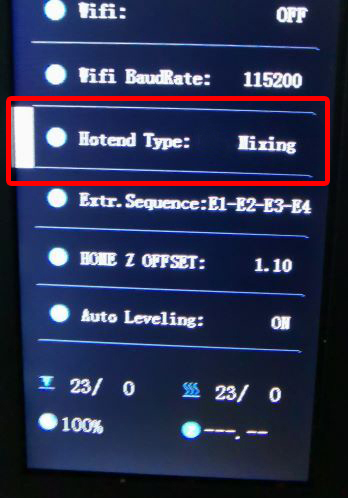

[M4V6_CAUTION]: https://github.com/ZONESTAR3D/Upgrade-kit-guide/blob/main/HOTEND/M4/M4_V6/M4V6_Precaution.md
[MIXING_COLOE]: https://github.com/ZONESTAR3D/Document-and-User-Guide/tree/master/Mixing_Color
[SLICING_0]: https://github.com/ZONESTAR3D/Slicing-Guide
[SLICING_1]: https://github.com/ZONESTAR3D/Slicing-Guide/tree/master/PrusaSlicer
[SLICING_2]: https://github.com/ZONESTAR3D/Slicing-Guide/tree/master/PrusaSlicer#4-slicing-one-color
[SLICING_M4]: https://github.com/ZONESTAR3D/Slicing-Guide/blob/master/PrusaSlicer/PrusaSlicerGuide_M4.md
[FAQ_M4E4]: https://github.com/ZONESTAR3D/Upgrade-kit-guide/blob/main/HOTEND/FAQ_M4E4.md

----
## <a id="choose-language">:globe_with_meridians: Choose language </a>

<!--  -->

----
## :book: Guida per l'utente dell'hotend M4V6
L'hot end a colori mix ZONESTAR 4-IN-1-OUT ha 4 canali di ingresso e 1 ugello, quattro filamenti vengono miscelati nell'hot end e quindi estrusi attraverso un ugello, quindi non solo consente alla stampante di stampare il colore originale dei filamenti, ma consente inoltre di stampare più colori regolando il rapporto di miscelazione del filamento.

### Contenuti
- **[Attenzione](#A0)**
- **[Principio di funzionamento](#A1)**
- **[Specifiche](#A2)**
- **[Componenti di M4V6](#A3)**
- **[Cablaggio](#A4)**
- **[Struttura](#A5)**
- **[Dimensioni](#A6)**
- **[Installazione e cablaggio](#A7)**
- **[Carica/scarica filamenti](#A8)**
- **[Procedura per stampare utilizzando l'hotend M4V6](#A9)**
- **[Guida al taglio](#A10)**
- **[Risoluzione dei problemi](#A11)**
- **[Appendice](#A12)**

## <a id="A0">:warning: ATTENZIONE PER FAVORE</a>
### :loudspeaker: Prima di utilizzare l'hot end M4V6, leggere attentamente [:book:Precauzioni per l'utilizzo di M4V6][M4V6_CAUTION].
### :loudspeaker: È necessario caricare contemporaneamente 4 filamenti sull'hotend M4V6, un funzionamento errato potrebbe bloccare l'hotend del colore misto. Se il blocco dell'hotend è causato da un funzionamento errato, non è coperto dalla garanzia.
### :loudspeaker: NON estrarre i "tubi interni in PTFE" dall'hotend M4V6.
### :loudspeaker: Una volta che i filamenti sono già entrati nell'hotend M4V6, NON utilizzare il menu "Caricamento rapido" per caricare i filamenti.

### <a id="A1">Principio di funzionamento</a>
**:warning: prima di utilizzare M4V6, leggere [:book: Introduzione all'estrusore per la miscelazione dei colori][MIXING_COLOE] per comprendere i principi di funzionamento dell'estrusore per la miscelazione dei colori.**
######

### <a id="A2">Specifiche</a>
| Articolo | Parametri | Articolo | Parametri |
|:--------------------:|:---------------------------:|:--------------------:|:--------------------------:|
| Tensione nominale | DC24V/60W massimo | Diametro ugello | Predefinito 0,4 mm1 |
| Canale di ingresso | 4| Modello ugello | E3D V6 |
| Numero ugelli | 1| Diametro del filamento | 1,75 mm|
| Riscaldatore | 24V/60W ⌀6x25mm | Sensore di temperatura | Termistore NTC 100K B3950 |
| Ventola di raffreddamento | 4010/5000 giri/min/24 V 0,15 A | Ventola dell'estrusore | 4010/5000 giri/min/24 V 0,15 A |
| Filamenti di supporto | PLA/PLA+/PETG/ABS/ASA ecc. | Temperatura di lavoro | 260℃ Massimo |
| Lunghezza filo | 1 metro | Dimensioni esterne | 50x60x75mm |
| Peso netto | 220g| Peso lordo | 350 g|

### <a id="A3">Componenti</a>
 

### <a id="A4">Terminale di cablaggio</a>

:pushpin: Il cavo di estensione è opzionale.

### <a id="A5">Struttura</a>

### <a id="A6">Dimensioni</a>

### <a id="A7">Installazione e cablaggio</a>
La posizione di montaggio dell'hot end M4 è conforme allo "standard di montaggio dell'hot end ZONESTAR", che può essere installato su quasi tutte le stampanti 3D ZONESTAR, incluse le serie di prodotti P802, M8, D805S, Z8, Z9, Z10 ecc. ecc.
#### Installazione
È sufficiente rimuovere le 3 viti dietro il gruppo hotend e installare il gruppo hotend M4 sul supporto X della macchina.

#### Cablaggio
##### :loudspeaker: ATTENZIONE
- **Fare attenzione a distinguere i terminali 3 e 4**, perché il colore dei terminali è lo stesso, ma il colore dei fili è diverso.
Se i fili 3 e 4 sono collegati in modo inverso, è possibile vedere che la temperatura dell'ugello visualizzata sullo schermo LCD sarà molto più alta della temperatura ambiente dopo aver acceso la macchina.
- Quando si collega il terminale, **fare attenzione a non spingere il terminale metallico fuori dalla custodia in plastica**.
##### :loudspeaker: Nota
- **La ventola di raffreddamento deve essere accesa** (quando la temperatura dell'hot end è superiore a 60°C), altrimenti l'hot end potrebbe bloccarsi o addirittura danneggiarsi.
  - Per impostazione predefinita, la **tensione di funzionamento** della ventola e del riscaldatore sull'hot-end è **24 V CC**.
#### Seguire la definizione dei terminali per collegare l'hotend alla scheda di controllo.
- **Senza cavo di prolunga**

- **Con cavo di estensione**

#### Imposta il tipo di hotend sul MENU LCD: Controllo >> Configura >> Tipo di hotend: Miscelazione

### <a id="A8">Carica/Scarica filamenti</a>
#### :warning: ATTENZIONE PER FAVORE! È necessario caricare 4 filamenti nell'hot-end anche se si stampa un modello 3D a un colore, NON lasciare alcun canale vuoto prima della stampa.
#### :warning: ATTENZIONE PER FAVORE! Il menu "Caricamento rapido" può essere utilizzato solo quando si carica il filamento dall'estrusore all'hotend, una volta che il filamento è entrato nell'hotend, utilizzare il menu "Caricamento lento" ma non "Caricamento rapido".
- **Carica il filamento nell'hotend:**
###### 
   - Taglia la parte anteriore del filamento con una pinza diagonale prima di caricarlo nell'estrusore e nell'hot end.
   - Caricare 4 filamenti su tutti gli estrusori uno per uno.
   - Ruotare l'ingranaggio degli estrusori per caricare i filamenti uno per uno, non ruotare ciascun estrusore più di 2 giri alla volta, finché tutti i filamenti non entrano nel tubo interno in PTFE dell'hot end, estrudere altri 4 ~ 5 giri per ciascun estrusore e poi fermati.    
   :warning: non alimentare i filamenti all'hotend quando qualsiasi canale dell'hotend è vuoto.   
   :warning: assicurarsi che i filamenti per ciascun canale raggiungano il fondo dell'hot end prima di alimentare il filamento.    
- **Scarica il filamento dall'hotend:**
   - Riscaldamento dell'ugello (200℃ per PLA / 230℃ per PETG/ABS).
   - Alimentare contemporaneamente il filamento per almeno 10 mm su tutti e 4 i canali.
   - Operare sul menu LCD o ruotare l'ingranaggio dell'estrusore per scaricare i filamenti.

### <a id="A9">Passaggi per stampare utilizzando l'hotend M4V6</a>
#### Stampa un modello 3D a un colore
- **Prepara il file gcode**. Per affettare il modello 3D utilizzando le impostazioni della stampante 3D a un colore, fare riferimento a [**qui**][SLICING_2].
- **Caricare i filamenti**. Carica **tutti e 4 i filamenti** negli estrusori, quindi inserisci i filamenti nella parte inferiore dell'hot end M4V6.
- **Stampa da scheda SD**. Sposta l'elemento sulla voce **Stampa** sullo schermo LCD, fai clic sulla manopola e scegli il file gcode, fai clic sulla manopola per avviare la stampa.
- **Regolazione fine dell'altezza dell'ugello**. Attendere il riscaldamento dell'ugello e del piano caldo e, quando la stampante inizia a stampare il primo strato, fare doppio clic sulla manopola dello schermo LCD per regolare con precisione la distanza dall'ugello al piano, quindi attendere che finisca.
#### Stampa modello 3D multicolore
- **Prepara il file gcode**. Affettare il modello 3D utilizzando le impostazioni della stampante 3D multicolore M4, fare riferimento a [**qui**][SLICING_M4].
- **Caricare i filamenti**. Carica **tutti e 4 i filamenti** negli estrusori, quindi inserisci i filamenti nella parte inferiore dell'hot end M4V6.
- **Stampa da scheda SD**. Sposta l'elemento sulla voce **Stampa** sullo schermo LCD, fai clic sulla manopola e scegli il file gcode, fai clic sulla manopola per avviare la stampa.
- **Regolazione fine dell'altezza dell'ugello**. Attendere il riscaldamento dell'ugello e del piano caldo e, quando la stampante inizia a stampare il primo strato, fare doppio clic sulla manopola dello schermo LCD per regolare con precisione la distanza dall'ugello al piano, quindi attendere che finisca.

### <a id="A10">Affettare</a>
Ti consigliamo di utilizzare PrusaSlicer per affettare. Per tutorial di installazione e utilizzo, fare riferimento al seguente collegamento:
- **[Installa il software Prusaslicer][SLICING_1]**
- **[Guida allo slicing per hotend M4][SLICING_M4]**
Per ulteriori tutorial sull'utilizzo di altri software di slicing, fare riferimento a [:book:questa guida][SLICING_0].

### <a id="A11">Risoluzione dei problemi</a>
Se si verificano problemi durante l'utilizzo dell'hot end M4V6, fare riferimento a [**:book: questo manuale di risoluzione dei problemi**](./M4V6_FAQ/readme.md) per trovare prima una soluzione.

### <a id="A12">:paperclip: Appendice</a>
#### :book: Appendice I: [Ottieni una stampa rapida utilizzando l'hot end M4V6](./HighFlow/readme.md)
Quando si stampa un modello 3D a colore singolo, M4V6 può supportare portate più elevate. Per i dettagli, fare riferimento a [:book: questa guida](./HighFlow/readme.md).

#### :book: Appendice II: [Come passare dall'hotend E4 all'hotend M4][FAQ_M4E4]
