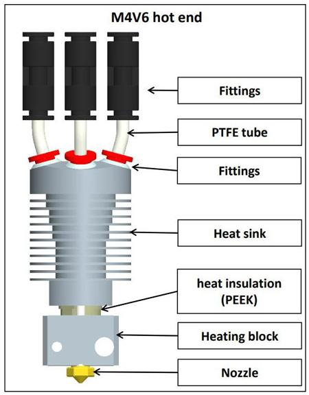
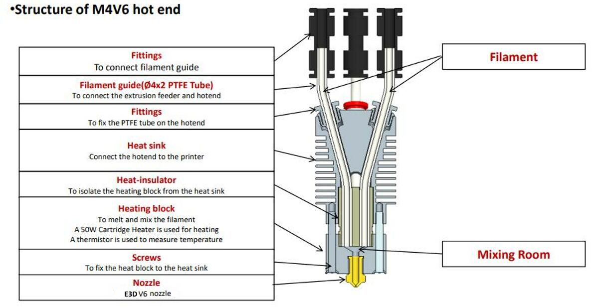
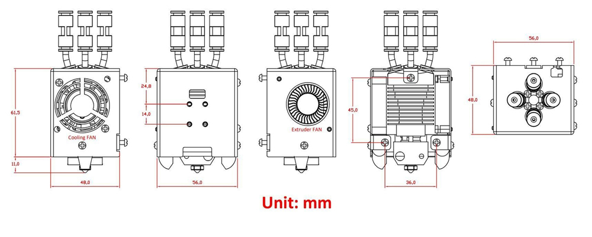

[M4V6_CAUTION]: https://github.com/ZONESTAR3D/Upgrade-kit-guide/blob/main/HOTEND/M4/M4_V6/M4V6_Precaution.md
[MIXING_COLOE]: https://github.com/ZONESTAR3D/Document-and-User-Guide/tree/master/Mixing_Color
[SLICING_0]: https://github.com/ZONESTAR3D/Slicing-Guide
[SLICING_1]: https://github.com/ZONESTAR3D/Slicing-Guide/tree/master/PrusaSlicer
[SLICING_2]: https://github.com/ZONESTAR3D/Slicing-Guide/tree/master/PrusaSlicer#4-slicing-one-color
[SLICING_M4]: https://github.com/ZONESTAR3D/Slicing-Guide/blob/master/PrusaSlicer/PrusaSlicerGuide_M4.md
[FAQ_M4E4]: https://github.com/ZONESTAR3D/Upgrade-kit-guide/blob/main/HOTEND/FAQ_M4E4.md

----
## <a id="choose-language">:globe_with_meridians: Choose language </a>

<!--  -->

----
## :book: M4V6 핫엔드 사용자 가이드
ZONESTAR 4-IN-1-OUT 혼합 색상 핫 엔드는 4개의 입력 채널과 1개의 노즐이 있으며, 4개의 필라멘트가 핫 엔드에서 혼합된 후 하나의 노즐을 통해 압출되므로 프린터가 필라멘트 원래 색상을 인쇄할 수 있을 뿐만 아니라 또한 필라멘트 혼합 비율을 조정하여 더 많은 색상을 인쇄할 수 있습니다.

### 내용물
- **[주의](#A0)**
- **[작동원리](#A1)**
- **[사양](#A2)**
- **[M4V6의 구성요소](#A3)**
- **[배선](#A4)**
- **[구조](#A5)**
- **[치수](#A6)**
- **[설치 및 배선](#A7)**
- **[필라멘트 로드/언로드](#A8)**
- **[M4V6 핫엔드를 사용하여 인쇄하는 단계](#A9)**
- **[슬라이스 가이드](#A10)**
- **[문제 해결](#A11)**
- **[부록](#A12)**

## <a id="A0">:warning: 주의하세요</a>
### :loudspeaker: M4V6 핫엔드를 사용하기 전에 [:book:M4V6 사용 시 주의사항][M4V6_CAUTION]을 주의 깊게 읽어보세요.
### :loudspeaker: M4V6 핫엔드에 4개의 필라멘트를 동시에 로드해야 합니다. 잘못된 작동으로 인해 혼합 색상 핫엔드가 차단될 수 있습니다. 잘못된 작동으로 인해 핫엔드가 막힌 경우에는 보증이 적용되지 않습니다.
### :loudspeaker: M4V6 핫엔드에서 "내부 PTFE 튜브"를 잡아당기지 마세요.
### :loudspeaker: 필라멘트가 이미 M4V6 핫엔드에 들어간 후에는 "빠른 로드" 메뉴를 사용하여 필라멘트를 로드하지 마십시오.

### <a id="A1">작동 원리</a>
**:warning: M4V6을 사용하기 전에 [:book: 색상 혼합 압출기 소개][MIXING_COLOE]를 읽고 혼합 색상 압출기의 작동 원리를 이해하세요.**
######

### <a id="A2">사양</a>
| 아이템 | 매개변수 | 아이템 | 매개변수 |
|:---------------:|:-------------:|:-------------:|:--------------------------:|
| 정격전압 | DC24V/60W 최대 | 노즐 직경 | 기본값 0.4mm1 |
| 입력 채널 | 4 | 노즐 모델 | E3D V6 |
| 노즐 수 | 1 | 필라멘트 직경 | 1.75mm |
| 히터 | 24V/60W ⌀6x25mm | 온도 센서 | NTC 서미스터 100K B3950 |
| 냉각팬 | 4010/5000RPM/24V 0.15A | 압출기 팬 | 4010/5000RPM/24V 0.15A |
| 지원 필라멘트 | PLA/PLA+/PETG/ABS/ASA 등 | 작동 온도 | 260℃ 막시무스 |
| 와이어 길이 | 1미터 | 외부 치수 | 50x60x75mm |
| 순중량 | 220g | 총중량 | 350g |

### <a id="A3">구성요소</a>
 

### <a id="A4">배선 터미널</a>
   
:pushpin: 연장 케이블은 선택 사항입니다.

### <a id="A5">구조</a>

### <a id="A6">크기</a>

### <a id="A7">설치 및 배선</a>
M4 핫 엔드의 장착 위치는 P802, M8, D805S, Z8, Z9, Z10 등 일련의 제품을 포함한 거의 모든 ZONESTAR 3d 프린터에 설치할 수 있는 "ZONESTAR 핫 엔드 장착 표준"을 준수합니다.
#### 설치
핫엔드 어셈블리 뒤에 있는 나사 3개를 제거하고 M4 핫엔드 어셈블리를 기계의 X 캐리어에 설치하기만 하면 됩니다.   

#### 배선
##### :loudspeaker: 주의
- **3번 단자와 4번 단자**는 단자 색상은 동일하지만 배선 색상이 다르기 때문에 잘 구분하시기 바랍니다.
3번과 4번의 선을 반대로 연결하면, 전원을 켠 후 LCD 화면에 표시되는 노즐 온도가 실내 온도보다 훨씬 높아지는 것을 볼 수 있습니다.
- 단자를 꽂을 때 **플라스틱 케이스에서 금속 단자를 밀어내지 않도록 주의하세요**.
##### :loudspeaker: 참고하세요
- **냉각팬을 켜야 합니다**(핫엔드 온도가 60°C 이상일 때). 그렇지 않으면 핫엔드가 막히거나 손상될 수 있습니다.
  - 기본적으로 핫엔드 팬과 히터의 **작동 전압**은 **DC 24V**입니다.
#### 핫엔드를 제어 보드에 연결하려면 터미널 정의를 따르십시오.
- **연장 케이블 미포함**   

- **연장 케이블 포함**   

#### LCD 메뉴에서 핫엔드 유형 설정: 제어>>구성>>핫엔드 유형: 혼합

### <a id="A8">필라멘트 로드/언로드</a>
#### :warning: 주의하세요! 한 가지 색상의 3D 모델을 인쇄하더라도 핫엔드에 4개의 필라멘트를 로드해야 합니다. 인쇄하기 전에 채널을 비워 두지 마십시오.
#### :warning: 주의하세요! "빠른 로드" 메뉴는 압출기에서 핫 엔드로 필라멘트를 로드할 때만 사용할 수 있습니다. 필라멘트가 핫 엔드에 들어가면 "느린 로드" 메뉴를 사용하고 "빠른 로드"는 사용할 수 없습니다.
- **필라멘트를 핫엔드에 로드합니다:**
###### 
   - 필라멘트의 앞부분을 대각선 펜치로 잘라서 Extruder와 Hot End에 장착합니다.
   - 4개의 필라멘트를 모든 Extruder에 하나씩 Load 합니다.
   - 압출기의 기어를 돌려 필라멘트를 하나씩 로드하고, 모든 필라멘트가 핫 엔드의 내부 PTFE 튜브에 들어갈 때까지 각 압출기를 한 번에 2바퀴 이상 회전하지 마십시오. 각 압출기마다 4~5바퀴 더 압출하고 그럼 그만둬.   
   :warning: 핫엔드의 채널이 비어 있으면 핫엔드에 필라멘트를 공급하지 마세요.   
   :warning: 필라멘트를 공급하기 전에 각 채널의 필라멘트가 핫 엔드 하단에 도달했는지 확인하세요.   
- **핫엔드에서 필라멘트 언로드:**
   - 노즐을 가열합니다(PLA는 200℃ / PETG/ABS는 230℃).
   - 4채널 모두 최소 10mm 이상의 필라멘트를 동시에 공급합니다.
   - LCD 메뉴를 조작하거나 익스트루더 기어를 돌려 필라멘트를 언로드합니다.

### <a id="A9">M4V6 핫엔드를 사용하여 인쇄하는 단계</a>
#### 단색 3D 모델 인쇄
- **gcode 파일을 준비하세요**. 단색 3D 프린터 설정을 사용하여 3D 모델을 슬라이스하는 방법은 [**여기**][SLICING_2]를 참조하세요.
- **필라멘트를 로드합니다**. **필라멘트 4개**를 모두 압출기에 로드한 다음 필라멘트를 M4V6 핫엔드 바닥에 공급합니다.
- **SD 카드에서 인쇄**. LCD 화면의 **Print** 항목으로 항목을 이동한 후 손잡이를 클릭하고 gcode 파일을 선택한 후 손잡이를 클릭하여 인쇄를 시작합니다.
- **노즐 높이를 미세 조정하세요**. 노즐과 온상 가열을 기다린 후 프린터가 첫 번째 레이어 인쇄를 시작하면 LCD 화면의 손잡이를 두 번 클릭하여 노즐에서 베드까지의 거리를 미세 조정한 다음 완료될 때까지 기다립니다.
#### 멀티 컬러 3D 모델 인쇄
- **gcode 파일을 준비하세요**. M4 멀티 컬러 3D 프린터 설정을 사용하여 3D 모델을 슬라이스하는 방법은 [**여기**][SLICING_M4]를 참조하세요.
- **필라멘트를 로드합니다**. **필라멘트 4개**를 모두 압출기에 로드한 다음 필라멘트를 M4V6 핫엔드 바닥에 공급합니다.
- **SD 카드에서 인쇄**. LCD 화면의 **Print** 항목으로 항목을 이동한 후 손잡이를 클릭하고 gcode 파일을 선택한 후 손잡이를 클릭하여 인쇄를 시작합니다.
- **노즐 높이를 미세 조정하세요**. 노즐과 온상 가열을 기다린 후 프린터가 첫 번째 레이어 인쇄를 시작하면 LCD 화면의 손잡이를 두 번 클릭하여 노즐에서 베드까지의 거리를 미세 조정한 다음 완료될 때까지 기다립니다.

### <a id="A10">슬라이싱</a>
슬라이싱에는 PrusaSlicer를 사용하는 것이 좋습니다. 설치 및 사용 튜토리얼은 다음 링크를 참조하세요.
- **[Prusaslicer 소프트웨어 설치][SLICING_1]**
- **[M4 핫엔드 슬라이싱 가이드][SLICING_M4]**
다른 슬라이싱 소프트웨어 사용에 대한 자세한 튜토리얼은 [:book: 이 가이드][SLICING_0]를 참조하세요.

### <a id="A11">문제해결</a>
M4V6 핫엔드 사용 중 문제가 발생할 경우, 먼저 [**:book: 이 문제 해결 매뉴얼**](./M4V6_FAQ/readme.md)을 참조하여 해결 방법을 찾아보시기 바랍니다.

### <a id="A12">:paperclip: 부록</a>
#### :book: 부록 I: [M4V6 핫엔드를 사용하여 빠른 인쇄 달성](./HighFlow/readme.md)
단색 3D 모델을 인쇄할 때 M4V6은 더 높은 유속을 지원할 수 있습니다. 자세한 내용은 [:book: 이 가이드](./HighFlow/readme.md)를 참조하세요.

#### :book: 부록 II: [E4 핫엔드와 M4 핫엔드 간 전환 방법][FAQ_M4E4]